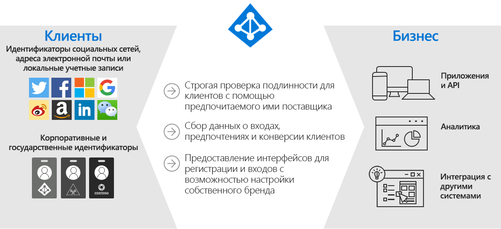
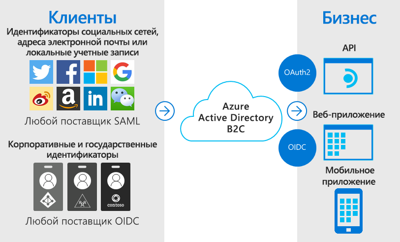
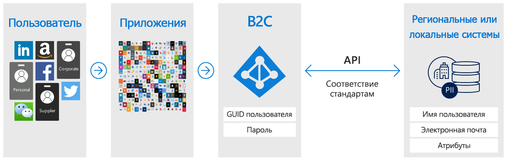
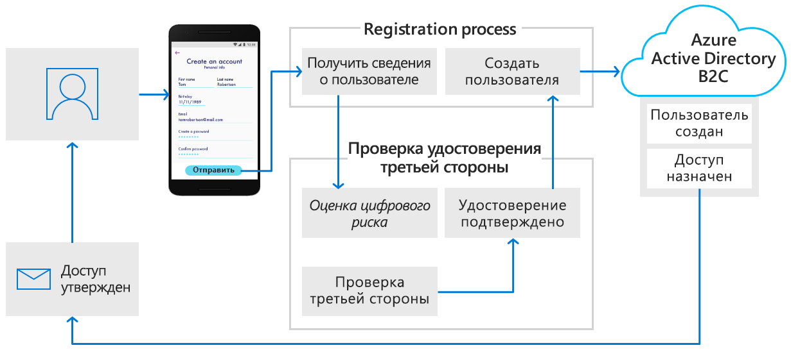
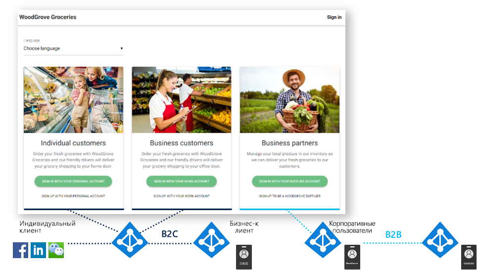

# Что такое Azure Active Directory B2C

Azure Active Directory B2C предоставляет службу корпоративного управления удостоверениями для клиентов. Ваши клиенты получат возможность единого входа в ваши приложения и API, используя выбранные удостоверения социальных сетей, предприятий или локальных учетных записей.

Azure Active Directory B2C — это решение для управления удостоверениям и доступом клиентов (CIAM), способное обслуживать миллионы пользователей и миллиарды проверок подлинности ежедневно. Это решение отвечает за масштабирование и безопасность платформы проверки подлинности, мониторинг и автоматическую обработку разных угроз, таких как отказ в обслуживании, распыление паролей или атаки методом подбора.

## Решение для идентификации с пользовательским оформлением

Azure AD B2C предоставляет небрендированное решение для проверки подлинности. Вы можете изменить весь пользовательский интерфейс под оформление своей торговой марки, чтобы он хорошо смотрелся в мобильных и веб-приложениях.

Настройте каждую страницу, которую Azure AD B2C отображает при регистрации пользователей, входе в систему и изменении профилей. Настройте HTML, CSS и JavaScript в путях взаимодействия пользователя, чтобы интерфейс Azure AD B2C не отличался от основного приложения.

## Единый вход с использованием удостоверений, предоставленных пользователем

Azure AD B2C использует протоколы проверки подлинности на основе стандартов, включая OpenID Connect, OAuth 2.0 и SAML. Это решение интегрируется с большинством современных приложений и коммерческих версий программного обеспечения.

Azure AD B2C выполняет роль центра проверки подлинности для веб-приложений, мобильных приложений и интерфейсов API, позволяя создать для них общее решение единого входа. Создайте централизованную коллекцию профилей пользователей и сведений о предпочтениях, собирайте данные о поведении при входе и преобразовании в регистрации для подробного анализа.

## Интеграция с внешними хранилищами пользователей

Azure AD B2C предоставляет каталог, который может содержать 100 настраиваемых атрибутов для каждого пользователя. Но поддерживается и интеграция с внешними системами. Например, вы можете использовать Azure AD B2C для проверки подлинности, а источником данных о пользователях назначить внешнюю систему CRM или базу данных лояльности клиентов.

Внешнее хранилище пользователей можно также применять для хранения профилей пользователей или персональных данных, оставив обработку проверки подлинности в Azure AD B2C. Например, это будет полезно при наличии требований к местонахождению, таких как региональные или локальные политики хранения данных.

Azure AD B2C может помогать в сборе данных о пользователе во время регистрации или изменения профиля, а затем передавать эти данные во внешнюю систему. Затем, при проверках подлинности, Azure AD B2C будет получать эти данные из внешней системы и при необходимости включать их в маркер проверки подлинности, который отправляется в приложение в качестве ответа.

## Прогрессивное профилирование

Следующий вариант пути взаимодействия пользователя включает прогрессивное профилирование. Прогрессивное профилирование позволяет клиентам быстро завершить первую транзакцию, при которой собирается минимальный объем информации. Затем дополнительные данные для профиля собираются от клиента при последующих входах.

## Проверка личности и подтверждение у сторонних поставщиков

Azure AD B2C поможет упростить проверку личности и подтверждение, собирая данные пользователей и передавая их в систему стороннего поставщика для проверки, оценки доверия и утверждения создаваемой учетной записи пользователя.

Это лишь часть действий, которые можно выполнить, используя Azure AD B2C в качестве платформы идентификации категории "бизнес — клиент". В следующих разделах этой обзорной статьи описывается демонстрационное приложение, в котором используется Azure AD B2C. Вы также можете сразу перейти к более подробному [техническому обзору Azure AD B2C](technical-overview.md).

## Пример: WoodGrove Groceries

[WoodGrove Groceries][woodgrove] создано и опубликовано корпорацией Майкрософт как веб-приложение для демонстрации нескольких функций Azure AD B2C. В следующих нескольких разделах рассматриваются некоторые варианты проверки подлинности, предоставляемые Azure AD B2C на веб-сайте WoodGrove.

### Обзор бизнеса

WoodGrove — это Интернет-магазин, который продает бакалейные товары отдельным потребителям и бизнес-клиентам. Бизнес-клиенты приобретают товары от имени компании, в которой они работают или которой управляют.

### Параметры входа

WoodGrove Groceries предлагает несколько вариантов для входа в зависимости от отношений клиента с магазином.

* **Индивидуальные клиенты** выполняют регистрацию и вход с личными учетными записями, существующими в социальных сетях либо у локального поставщика удостоверений или же по адресу электронной почты и паролю.
* **Бизнес-клиенты** могут зарегистрироваться или войти в систему, используя корпоративные учетные данные.
* **Партнеры и поставщики** — это пользователи, которые предоставляют магазину продукты для продажи. Удостоверения партнеров предоставляются из [Azure Active Directory B2B](../active-directory/b2b/what-is-b2b.md).

### Проверка подлинности для индивидуальных клиентов

Когда клиент выбирает **вход с личной учетной записью** он перенаправляется на настроенную страницу входа в Azure AD B2C. На следующем рисунке можно заметить, что мы настроили пользовательский интерфейс и внешний вид так же, как на веб-сайте WoodGrove Groceries. Клиенты WoodGrove не должны замечать, что процесс проверки подлинности размещается и защищается в Azure AD B2C.

WoodGrove позволяет своим клиентам регистрироваться и входить в систему с учетными записями, поставщиком удостоверений для которых является Google, Facebook или Майкрософт. Также они могут зарегистрироваться, указав личный адрес электронной почты и пароль для создания *локальной учетной записи*.

Когда клиент выбирает **вход с личной учетной записью**, а затем ссылку **Зарегистрироваться**, ему предоставляется пользовательская страница регистрации.

Когда клиент вводит адрес электронной почты и выбирает **отправку проверочного кода**, Azure AD B2C отправляет ему этот код. Клиент вводит код и нажимает кнопку **Проверить код**, а затем вводит другие сведения в форме и подтверждает согласие с условиями предоставления услуг.

Когда пользователь нажмет кнопку **Создать**, Azure AD B2C перенаправит его обратно на веб-сайт WoodGrove Groceries. При этом перенаправлении Azure AD B2C передает маркер проверки подлинности OpenID Connect в веб-приложение WoodGrove. Теперь пользователь считается вошедшим в систему и может начинать работу, а его имя отображается в правом верхнем углу как признак успешного входа.

### Проверка подлинности для бизнес-клиентов

Когда клиент выбирает любой из вариантов в разделе **Бизнес-клиенты**, веб-сайт WoodGrove Groceries вызывает другую политику Azure AD B2C, которая отличается от политики для индивидуальных клиентов.

Эта политика позволяет ввести корпоративные учетные данные для регистрации и входа. В примере WoodGrove пользователям предлагается выполнить вход с любой учетной записью Office 365 или Azure AD. Эта политика использует [мультитенантное приложение Azure AD](../active-directory/develop/howto-convert-app-to-be-multi-tenant.md) и конечную точку `/common` Azure AD для федерации Azure AD B2C с любым клиентом Office 365.

### Проверка подлинности для партнеров

С ссылкой для **входа с учетной записью поставщика** используется функция совместной работы из Azure Active Directory B2B. Azure AD B2B — это семейство компонентов Azure Active Directory для управления удостоверениями партнеров. Для этих удостоверений можно настроить федерацию из Azure Active Directory для доступа к приложениям, защищенным с помощью Azure AD B2C.

Дополнительные сведения см. в статье [Что представляет собой гостевой доступ в службе совместной работы Azure Active Directory B2B](../active-directory/b2b/what-is-b2b.md).

<!-- UNCOMMENT WHEN REPO IS UPDATED WITH LATEST DEMO CODE
### Sample code

If you'd like to jump right into the code to see how the WoodGrove Groceries application is built, you can find the repository on GitHub:

[Azure-Samples/active-directory-external-identities-woodgrove-demo][woodgrove-repo] (GitHub)
-->

## Дополнительная информация

Теперь, когда у вас есть представление о том, что такое Azure AD B2C и в каких ситуациях есть смысл использовать это решение, переходите к изучению технических возможностей и компонентов системы.

> [!div class="nextstepaction"]
> [Технический обзор Azure AD B2C](technical-overview.md)

<!-- LINKS - External -->
[woodgrove]: https://aka.ms/ciamdemo
[woodgrove-repo]: https://github.com/Azure-Samples/active-directory-external-identities-woodgrove-demo
