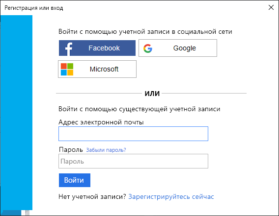

# <a name="quickstart-set-up-sign-in-for-a-desktop-app-using-azure-active-directory-b2c"></a>Краткое руководство. Настройка входа в классическое приложение с помощью Azure Active Directory B2C 

Azure Active Directory (Azure AD) B2C обеспечивает управление идентификаторами облака для защиты приложения, бизнеса и клиентов. Azure AD B2C позволяет приложениям аутентифицироваться в учетных записях социальных сетей и корпоративных учетных записях с помощью протоколов на базе открытых стандартов. В этом кратком руководстве мы будем использовать классическое приложение Windows Presentation Foundation (WPF) для входа с помощью поставщика удостоверений в социальных сетях и вызова защищенного веб-API Azure AD B2C.

[!INCLUDE [quickstarts-free-trial-note](../../includes/quickstarts-free-trial-note.md)]

## <a name="prerequisites"></a>Предварительные требования

- [Visual Studio 2017](https://www.visualstudio.com/downloads/) с рабочей нагрузкой **ASP.NET и веб-разработка**. 
- Учетная запись социальных сетей Facebook, Google, Microsoft или Twitter.
- [Загрузите ZIP-файл](https://github.com/Azure-Samples/active-directory-b2c-dotnet-desktop/archive/master.zip) или клонируйте пример приложения с GitHub.

    ```
    git clone https://github.com/Azure-Samples/active-directory-b2c-dotnet-desktop.git
    ```

## <a name="run-the-application-in-visual-studio"></a>Запуск приложения в Visual Studio

1. В папке с проектом приложения откройте решение **active-directory-b2c-wpf.sln** в Visual Studio.
2. Нажмите клавишу **F5** для запуска отладки приложения.

## <a name="sign-in-using-your-account"></a>Вход с помощью учетной записи

1. Щелкните **Вход**, чтобы запустить рабочий процесс **регистрации или входа**.

    

    Образец поддерживает несколько вариантов регистрации, в том числе с использованием поставщика удостоверений в социальных сетях, а также создание локальной учетной записи путем использования адреса электронной почты. В рамках этого краткого руководства используется учетная запись поставщика удостоверений в социальных сетях (Facebook, Google, Microsoft или Twitter). 


2. В Azure AD B2C в качестве образца веб-приложения представляется пользовательская страница входа для вымышленной торговой марки Wingtip Toys. Чтобы зарегистрироваться с помощью поставщика удостоверений в социальных сетях, нажмите кнопку поставщика удостоверений, которого нужно использовать. 

    

    Выполните проверку подлинности (вход) с помощью данных учетной записи социальных сетей и авторизацию приложения для чтения информации из учетной записи социальных сетей. Предоставляя доступ, приложение может получить сведения о профиле из учетной записи социальных сетей (например, имя и город). 

2. Завершите процесс входа для поставщика удостоверений.

    Сведения о профиле новой учетной записи будут заполнены информацией из учетной записи социальных сетей.

## <a name="edit-your-profile"></a>Изменение профиля

Azure AD B2C позволяет пользователям изменять их профили. Образец веб-приложения использует для рабочего процесса поток пользователя по изменению профиля Azure AD B2C. 

1. В приложении в строке меню выберите **Edit profile** (Изменить профиль), чтобы изменить созданный профиль.

    

2. Выберите поставщик удостоверений, связанный с созданной учетной записью. Например, если при создании учетной записи в качестве поставщика удостоверений использовался Twitter, выберите Twitter, чтобы изменить сведения связанного профиля.

3. Измените значение **Display name** (Отображаемое имя) или **City** (Город) и щелкните **Continue** (Продолжить).

    Новый маркер доступа появится в текстовом поле *Token info* (Сведения о маркере). Если вы хотите проверить изменения для профиля, скопируйте и вставьте маркер доступа в декодер маркеров https://jwt.ms.

## <a name="access-a-protected-api-resource"></a>Получение доступа к защищенному ресурсу API

Щелкните **Call API** (Вызвать API), чтобы отправить запрос к защищенному ресурсу. 

    

    The application includes the Azure AD access token in the request to the protected web API resource. The web API sends back the display name contained in the access token.

Вы успешно применили свою учетную запись пользователя Azure AD B2C, чтобы выполнить авторизованный вызов защищенного веб-API Azure AD B2C.

## <a name="clean-up-resources"></a>Очистка ресурсов

Вы можете использовать свой клиент Azure AD B2C при работе с другими руководствами или краткими пособиями по Azure AD B2C. [Удалите клиент Azure AD B2C](active-directory-b2c-faqs.md#how-do-i-delete-my-azure-ad-b2c-tenant), если он больше не нужен.

## <a name="next-steps"></a>Дополнительная информация

В этом кратком руководстве мы использовали пример классического приложения. Мы вошли в него через пользовательскую страницу входа, используя поставщик удостоверений в социальных сетях. Кроме того, мы создали учетную запись Azure AD B2C и вызвали веб-API, защищенный службой Azure AD B2C. 

Попробуйте создать собственный клиент Azure AD B2C. 

> [!div class="nextstepaction"]
> [Создание клиента Azure Active Directory B2C на портале Azure](tutorial-create-tenant.md)
