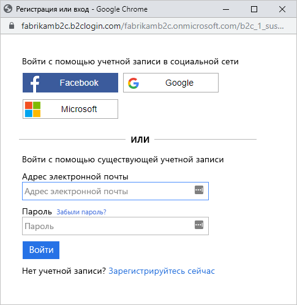

# <a name="quickstart-set-up-sign-in-for-a-single-page-app-using-azure-active-directory-b2c"></a>Краткое руководство. Настройка входа в одностраничное приложение с помощью Azure Active Directory B2C

Azure Active Directory (Azure AD) B2C обеспечивает управление идентификаторами облака для защиты приложения, бизнеса и клиентов. Azure AD B2C позволяет приложениям аутентифицироваться в учетных записях социальных сетей и корпоративных учетных записях с помощью протоколов на базе открытых стандартов. В этом кратком руководстве мы будем использовать одностраничное приложение для входа с помощью поставщика удостоверений в социальных сетях и вызова защищенного веб-API Azure AD B2C.

[!INCLUDE [quickstarts-free-trial-note](../../includes/quickstarts-free-trial-note.md)]

## <a name="prerequisites"></a>Предварительные требования

- [Visual Studio 2017](https://www.visualstudio.com/downloads/) с рабочей нагрузкой **ASP.NET и веб-разработка**.
- Установите [Node.js](https://nodejs.org/en/download/)
- Учетная запись социальных сетей Facebook, Google, Microsoft или Twitter.
- [Загрузите ZIP-файл](https://github.com/Azure-Samples/active-directory-b2c-javascript-msal-singlepageapp/archive/master.zip) или клонируйте пример приложения с GitHub.

    ```
    git clone https://github.com/Azure-Samples/active-directory-b2c-javascript-msal-singlepageapp.git
    ```

## <a name="run-the-application"></a>Выполнение приложения

1. Запустите сервер, выполнив в командной строке Node.js следующие команды: 

    ```
    cd active-directory-b2c-javascript-msal-singlepageapp
    npm install && npm update
    node server.js
    ```

    Server.js выводит номер порта, от которого на localhost ожидается передача данных.

    ```
    Listening on port 6420...
    ```

2. Перейдите по URL-адресу приложения. Например, `http://localhost:6420`.

## <a name="sign-in-using-your-account"></a>Вход с помощью учетной записи

1. Нажмите кнопку **Login** (Вход), чтобы запустить рабочий процесс.

    

    Образец поддерживает несколько вариантов регистрации, в том числе с использованием поставщика удостоверений в социальных сетях, а также создание локальной учетной записи путем использования адреса электронной почты. В рамках этого краткого руководства используется учетная запись поставщика удостоверений в социальных сетях (Facebook, Google, Microsoft или Twitter). 

2. В Azure AD B2C в качестве образца веб-приложения представляется пользовательская страница входа для вымышленной торговой марки Wingtip Toys. Чтобы зарегистрироваться с помощью поставщика удостоверений в социальных сетях, нажмите кнопку поставщика удостоверений, которого нужно использовать.

    

    Выполните проверку подлинности (вход) с помощью данных учетной записи социальных сетей и авторизацию приложения для чтения информации из учетной записи социальных сетей. Предоставляя доступ, приложение может получить сведения о профиле из учетной записи социальных сетей (например, имя и город). 

3. Завершите процесс входа для поставщика удостоверений.

## <a name="access-a-protected-api-resource"></a>Получение доступа к защищенному ресурсу API

Нажмите кнопку **Call Web API** (Вызов веб-API), чтобы вызов веб-API возвратил ваше отображаемое имя в качестве объекта JSON. 


Наше одностраничное приложение включает маркер доступа в запрос к защищенному ресурсу веб-API.

## <a name="clean-up-resources"></a>Очистка ресурсов

Вы можете использовать свой клиент Azure AD B2C при работе с другими руководствами или краткими пособиями по Azure AD B2C. [Удалите клиент Azure AD B2C](active-directory-b2c-faqs.md#how-do-i-delete-my-azure-ad-b2c-tenant), если он больше не нужен.

## <a name="next-steps"></a>Дополнительная информация

В этом кратком руководстве мы использовали пример одностраничного приложения. Мы вошли в него через пользовательскую страницу входа, используя поставщик удостоверений в социальных сетях. Кроме того, мы создали учетную запись Azure AD B2C и вызвали веб-API, защищенный службой Azure AD B2C. 

Попробуйте создать собственный клиент Azure AD B2C.

> [!div class="nextstepaction"]
> [Создание клиента Azure Active Directory B2C на портале Azure](tutorial-create-tenant.md)
