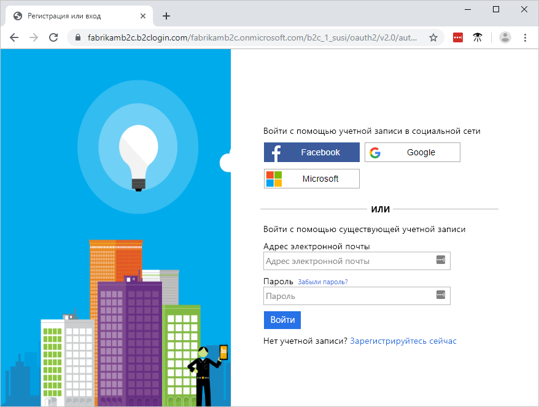

# <a name="quickstart-set-up-sign-in-for-an-aspnet-application-using-azure-active-directory-b2c"></a>Краткое руководство. Настройка входа в приложение ASP.NET с помощью Azure Active Directory B2C

Azure Active Directory (Azure AD) B2C обеспечивает управление идентификаторами облака для защиты приложения, бизнеса и клиентов. Azure AD B2C позволяет приложениям аутентифицироваться в учетных записях социальных сетей и корпоративных учетных записях с помощью протоколов на базе открытых стандартов. В этом кратком руководстве используется приложение ASP.NET для выполнения входа с помощью поставщика удостоверений в социальных сетях, а также для вызова защищенного веб-API Azure AD B2C.

[!INCLUDE [quickstarts-free-trial-note](../../includes/quickstarts-free-trial-note.md)]

## <a name="prerequisites"></a>Предварительные требования

- [Visual Studio 2019](https://www.visualstudio.com/downloads/) с рабочей нагрузкой **ASP.NET и веб-разработка**.
- Учетная запись социальных сетей Facebook, Google или Майкрософт.
- [Загрузите ZIP-файл](https://github.com/Azure-Samples/active-directory-b2c-dotnet-webapp-and-webapi/archive/master.zip) или клонируйте пример веб-приложения с GitHub.

    ```
    git clone https://github.com/Azure-Samples/active-directory-b2c-dotnet-webapp-and-webapi.git
    ```

    Пример решения состоит из двух проектов:

    - **TaskWebApp.** Веб-приложение, позволяющее создавать и изменять список задач. Веб-приложение использует сценарий **регистрации или входа** пользователя для регистрации пользователей или их входа в систему.
    - **TaskService.** Веб-API, поддерживающий функции создания, чтения, обновления и удаления списка задач. Веб-API защищен с помощью Azure AD B2C и вызывается веб-приложением.

## <a name="run-the-application-in-visual-studio"></a>Запуск приложения в Visual Studio

1. В папке проекта образца приложения откройте решение **B2C-WebAPI-DotNet.sln** в Visual Studio.
2. В рамках этого краткого руководства одновременно выполняются проекты **TaskWebApp** и **TaskService**. Щелкните правой кнопкой мыши решение **B2C-WebAPI-DotNet** в обозревателе решений, а затем выберите **Set StartUp Projects** (Назначить запускаемые проекты).
3. Щелкните **Несколько запускаемых проектов** и в разделе **Действие** для обоих проектов выберите **Запустить**.
4. Последовательно выберите **ОК**.
5. Нажмите клавишу **F5** для отладки обоих приложений. Каждое приложение открывается в отдельной вкладке браузера.

    - `https://localhost:44316/` — веб-приложение ASP.NET. В этом кратком руководстве вы работаете непосредственно с этим приложением.
    - `https://localhost:44332/` — веб-API, который вызывается веб-приложением ASP.NET.

## <a name="sign-in-using-your-account"></a>Вход с помощью учетной записи

1. Щелкните **Sign up / Sign in** (Вход/Регистрация) в веб-приложении ASP.NET, чтобы запустить рабочий процесс.

    

    Образец поддерживает несколько вариантов регистрации, в том числе с использованием поставщика удостоверений в социальных сетях, а также создание локальной учетной записи путем использования адреса электронной почты. В рамках этого краткого руководства используется учетная запись поставщика удостоверений в социальных сетях (Facebook, Google или Майкрософт).

2. В Azure AD B2C в качестве примера веб-приложения предоставляется пользовательская страница входа для вымышленной компании Fabrikam. Чтобы зарегистрироваться с помощью поставщика удостоверений в социальных сетях, нажмите кнопку поставщика удостоверений, которого нужно использовать.

    

    Выполните проверку подлинности (вход) с помощью данных учетной записи социальных сетей и авторизацию приложения для чтения информации из учетной записи социальных сетей. Предоставляя доступ, приложение может получить сведения о профиле из учетной записи социальных сетей (например, имя и город).

3. Завершите процесс входа для поставщика удостоверений.

## <a name="edit-your-profile"></a>Изменение профиля

Azure Active Directory B2C предоставляет функциональные возможности, обеспечивающие пользователям возможность обновления профилей. Образец веб-приложения использует для рабочего процесса поток пользователя по изменению профиля Azure AD B2C.

1. В строке меню приложения щелкните имя профиля и выберите **Изменить профиль**, чтобы изменить созданный профиль.

    

2. Измените **отображаемое имя** или название **города**, а затем щелкните **Продолжить**, чтобы обновить профиль.

    В правой верхней части домашней страницы веб-приложения отобразятся внесенные изменения.

## <a name="access-a-protected-api-resource"></a>Получение доступа к защищенному ресурсу API

1. Щелкните **To-Do List** (Список дел), чтобы ввести и изменить элементы списка дел.

2. Введите текст в текстовое поле **New Item** (Создать элемент). Щелкните **Add** (Добавить), чтобы вызвать защищенный веб-API Azure AD B2C, добавляющий элемент списка дел.

    

    Веб-приложение ASP.NET включает в себя маркер доступа в запросе к защищенному ресурсу веб-API для выполнения операций с элементами списка дел пользователя.

Вы успешно применили свою учетную запись пользователя Azure AD B2C, чтобы выполнить авторизованный вызов защищенного веб-API Azure AD B2C.

## <a name="clean-up-resources"></a>Очистка ресурсов

Вы можете использовать свой клиент Azure AD B2C при работе с другими руководствами или краткими пособиями по Azure AD B2C. [Удалите клиент Azure AD B2C](active-directory-b2c-faqs.md#how-do-i-delete-my-azure-ad-b2c-tenant), если он больше не нужен.

## <a name="next-steps"></a>Дополнительная информация

В этом кратком руководстве используется пример приложения ASP.NET для выполнения следующих задач:

* вход в систему с пользовательской страницы входа;
* вход с помощью поставщика удостоверений социальных сетей;
* создание учетной записи Azure AD B2C;
* вызов веб-API, защищенного Azure AD B2C.

Попробуйте создать собственный клиент Azure AD B2C.

> [!div class="nextstepaction"]
> [Создание клиента Azure Active Directory B2C на портале Azure](tutorial-create-tenant.md)
