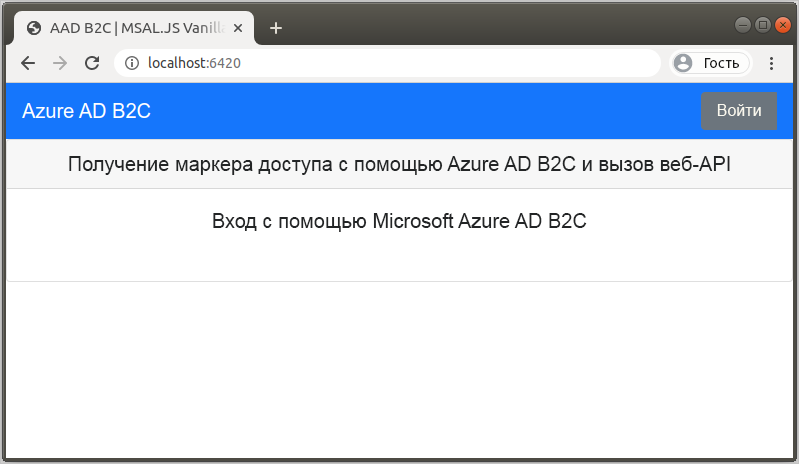
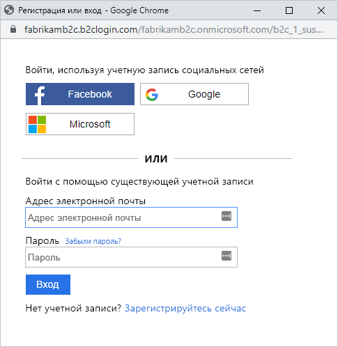
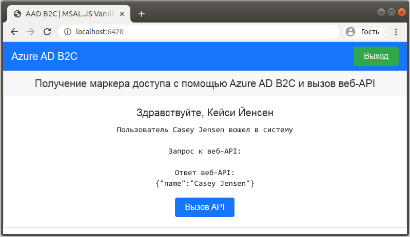

# <a name="quickstart-set-up-sign-in-for-a-single-page-app-using-azure-active-directory-b2c"></a>Краткое руководство. Настройка входа в одностраничное приложение с помощью Azure Active Directory B2C

Azure Active Directory (Azure AD) B2C обеспечивает управление идентификаторами облака для защиты приложения, бизнеса и клиентов. Azure AD B2C позволяет приложениям аутентифицироваться в учетных записях социальных сетей и корпоративных учетных записях с помощью протоколов на базе открытых стандартов. В этом кратком руководстве мы будем использовать одностраничное приложение для входа с помощью поставщика удостоверений в социальных сетях и вызова защищенного веб-API Azure AD B2C.

[!INCLUDE [quickstarts-free-trial-note](../../includes/quickstarts-free-trial-note.md)]

## <a name="prerequisites"></a>Предварительные требования

- [Visual Studio Code](https://code.visualstudio.com/)
- [Node.js](https://nodejs.org/en/download/)
- Учетная запись социальных сетей Facebook, Google или Майкрософт
- Пример кода из GitHub: [active-directory-b2c-javascript-msal-singlepageapp](https://github.com/Azure-Samples/active-directory-b2c-javascript-msal-singlepageapp)

    Вы можете [скачать ZIP-архив](https://github.com/Azure-Samples/active-directory-b2c-javascript-msal-singlepageapp/archive/master.zip) или клонировать репозиторий:

    ```console
    git clone https://github.com/Azure-Samples/active-directory-b2c-javascript-msal-singlepageapp.git
    ```

## <a name="run-the-application"></a>Выполнение приложения

1. Запустите сервер, выполнив в командной строке Node.js следующие команды:

    ```console
    cd active-directory-b2c-javascript-msal-singlepageapp
    npm install && npm update
    npm start
    ```

    Для сервера, запущенного с помощью *server.js*, отображается порт, который он прослушивает:

    ```console
    Listening on port 6420...
    ```

1. Перейдите по URL-адресу приложения. Например, `http://localhost:6420`.

    

## <a name="sign-in-using-your-account"></a>Вход с помощью учетной записи

1. Выберите **Вход**, чтобы начать путь взаимодействия пользователя.
1. В Azure AD B2C в качестве примера веб-приложения предоставляется пользовательская страница входа для вымышленной компании Fabrikam. Чтобы зарегистрироваться с помощью поставщика удостоверений в социальных сетях, нажмите кнопку поставщика удостоверений, которого нужно использовать.

    

    Выполните проверку подлинности (вход) с помощью данных учетной записи социальных сетей и авторизацию приложения для чтения информации из учетной записи социальных сетей. Предоставляя доступ, приложение может получить сведения о профиле из учетной записи социальных сетей (например, имя и город).

1. Завершите процесс входа для поставщика удостоверений.

## <a name="access-a-protected-api-resource"></a>Получение доступа к защищенному ресурсу API

Нажмите кнопку **Call API** (Вызвать API), чтобы веб-API возвратил ваше отображаемое имя в качестве объекта JSON.



Наше одностраничное приложение включает маркер доступа в запрос к защищенному ресурсу веб-API.

## <a name="clean-up-resources"></a>Очистка ресурсов

Вы можете использовать свой клиент Azure AD B2C при работе с другими руководствами или краткими пособиями по Azure AD B2C. [Удалите клиент Azure AD B2C](faq.md#how-do-i-delete-my-azure-ad-b2c-tenant), если он больше не нужен.

## <a name="next-steps"></a>Дальнейшие действия

В этом кратком руководстве используется пример одностраничного приложения для выполнения следующих задач:

- вход с помощью поставщика удостоверений социальных сетей;
- создание учетной записи пользователя Azure AD B2C (создается автоматически при входе в систему);
- вызов веб-API, защищенного Azure AD B2C.

Попробуйте создать собственный клиент Azure AD B2C.

> [!div class="nextstepaction"]
> [Создание клиента Azure Active Directory B2C на портале Azure](tutorial-create-tenant.md)
