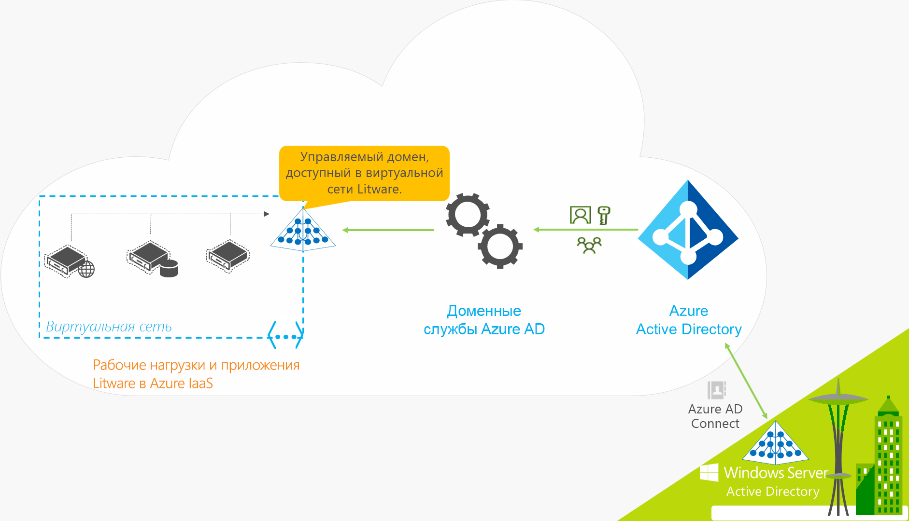
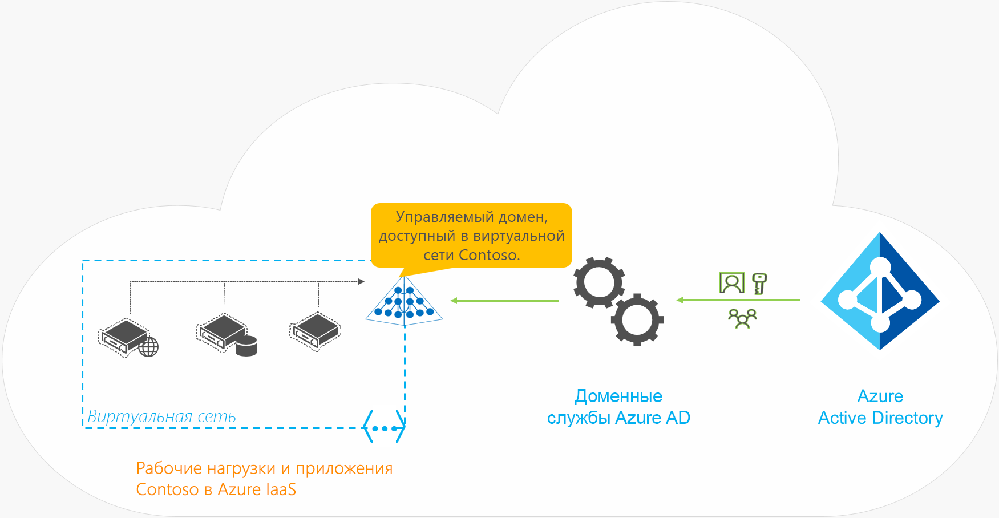

# Что такое "Доменные службы Azure Active Directory"?

Доменные службы Azure Active Directory (Azure AD DS) предоставляют управляемые доменные службы, отвечающие за присоединение к домену, применение групповой политики, использование протокола LDAP (упрощённый протокол доступа к каталогам), выполнение аутентификации Kerberos или NTLM, которые полностью совместимы с Windows Server Active Directory. Вы можете использовать эти доменные службы без необходимости развертывать и исправлять контроллеры домена в облаке, или управлять ими. Azure AD DS интегрируются с существующим клиентом Azure AD, что позволяет пользователям входить в систему с использованием существующих учетных данных. Вы также можете использовать существующие группы и учетные записи пользователей для защиты доступа к ресурсам, что позволит более плавно переместить локальных ресурсы в Azure.

Azure AD DS реплицирует сведения об удостоверениях из AAD, а значит нормально работает с полностью облачными клиентами AAD или синхронизируемыми с локальной средой доменных служб Active Directory. Набор функций Azure AD DS в обоих средах идентичен.

* Если у вас уже есть локальная среда AD DS, вы можете синхронизировать данные об учетных записях пользователей для достижения единообразия.
* Для полностью облачных сред можно применить централизованные службы идентификации Azure AD DS без традиционной локальной среды AD DS.

В следующем видео представлен обзор интеграции Azure AD DS с приложениями и рабочими нагрузками для создания облачных служб идентификации.

 

>[!VIDEO https://www.youtube.com/embed/T1Nd9APNceQ]

## Распространенные способы предоставления облачных решений для идентификации

При переносе существующих рабочих нагрузок в облако вы можете настроить LDAP для приложений, которые поддерживают доступ к каталогу, чтобы они выполняли чтение и запись в локальный каталог AD DS. Приложения, выполняемые в среде Windows Server, обычно развертываются на виртуальных машинах, присоединенных к домену. Это позволяет безопасно управлять ими с помощью групповой политики. Для аутентификации пользователей приложения могут также использовать функцию встроенной проверки подлинности Windows (например, Kerberos или NTLM).

Чтобы предоставить службу идентификации для приложений, работающих в Azure, ИТ-администраторы часто применяют одно из следующих решений:

* VPN-подключение типа "сеть — сеть" между рабочей нагрузкой в Azure и локальной средой AD DS;
* создание реплик контроллеров домена на виртуальных машинах Azure для расширения домена или леса AD DS;
* развертывание автономной среды AD DS в Azure на основе контроллеров домена, работающих на виртуальных машинах Azure.

В таких сценариях зависимость от VPN-подключений к локальному каталогу повышает уязвимость приложений к временным сбоям или отключениям сети. Если вы развернете контроллеры домена на виртуальных машинах в Azure, ИТ-специалистам придется управлять ими, защищать, устанавливать исправления, отслеживать, архивировать и устранять неполадки.

Azure AD DS предлагает альтернативные решения, устраняющие необходимость создавать VPN-подключения к локальной среде AD DS или запускать и администрировать виртуальные машины Azure для предоставления служб идентификации. Управляемая служба Azure AD DS снижает сложность интегрированного решения идентификации как в гибридных, так и в полностью облачных средах.

## Возможности и преимущества Azure AD DS

Чтобы предоставить службы идентификации для приложений и виртуальных машин в облаке, Azure AD DS поддерживает полную совместимость с традиционной средой AD DS для таких операций, как присоединение к домену, использование защищенного протокола LDAP (LDAPS), управление групповой политикой и DNS, а также привязка и чтение LDAP. Поддержка записи LDAP доступна для объектов, созданных в управляемом домене Azure AD DS, но не для ресурсов, синхронизируемых с Azure AD. Следующие функции Azure AD DS упрощают операции развертывания и управления.

* **Простой процесс развертывания**. Azure AD DS можно включить для клиента Azure AD, запустив один мастер на портале Azure.
* **Интеграция с Azure AD**. Учетные записи и учетные данные пользователей, а также сведения о членстве в группах автоматически извлекаются из клиента AAD. Новые пользователи, группы и изменения атрибутов в клиенте Azure AD или в локальной среде AD DS автоматически синхронизируются в Azure AD DS.
    * Учетные записи во внешних каталогах, связанных с Azure AD, недоступны в Azure AD DS. Учетные данные недоступны для этих внешних каталогов, поэтому их нельзя синхронизировать с управляемым доменом Azure AD DS.
* **Использование корпоративных учетных данных и паролей**. Пароли для пользователей клиента Azure AD такие же, как и для Azure AD DS. Пользователи могут использовать корпоративные учетные данные для присоединения компьютеров к домену, входа в систему в интерактивном режиме или через удаленный рабочий стол, а также для аутентификации в управляемом домене Azure AD DS.
* **Аутентификация NTLM и Kerberos**. Благодаря поддержке аутентификации NTLM и Kerberos вы можете развернуть приложения, использующие встроенную аутентификацию Windows.
* **Высокий уровень доступности**. Доменные службы Azure AD содержат большое количество контроллеров домена, обеспечивая высокий уровень доступности для управляемого домена. Высокий уровень доступности гарантирует непрерывность работы и отказоустойчивость службы.
    * В регионах, поддерживающих [Зоны доступности Azure][availability-zones], эти контроллеры домена также распределяются между зонами для обеспечения дополнительной отказоустойчивости. 

Ниже приведены некоторые ключевые аспекты управляемого домена Azure AD DS.

* Управляемый домен Azure AD DS представляет собой отдельный домен. Он не является расширением локального домена.
* Для управляемого домена Azure AD DS ИТ-специалистам не нужно управлять контролерами домена, исправлять их или отслеживать.

В гибридных средах, использующих локальную службу AD DS, вам не нужно управлять репликацией AD в управляемый домен Azure AD DS. Расположенные в локальном каталоге учетные записи и учетные данные пользователей, а также сведения о членстве в группах, синхронизируются в Azure AD через [Azure AD Connect][azure-ad-connect]. Эти учетные записи и учетные данные пользователей, а также сведения о членстве в группах автоматически становятся доступными в управляемом домене Azure AD DS.

## Как работает Azure AD DS?

Чтобы предоставить службы идентификации, Azure создает экземпляр AD DS, в выбранной вами виртуальной сети. Незаметно для пользователей обеспечивается его избыточность с помощью пары контроллеров домена Windows Server, которые не нужно администрировать, защищать или обновлять.

Управляемый домен Azure AD DS настроен для выполнения односторонней синхронизации из Azure AD, чтобы предоставить доступ к централизованному хранилищу данных о пользователях, группах и учетных данных. Вы можете создавать ресурсы непосредственно в управляемом домене Azure AD DS, но они не будут синхронизироваться в Azure AD. Приложения, службы и виртуальные машины, которые размещены в Azure и подключаются к этой виртуальной сети, смогут использовать стандартные функции AD DS, такие как присоединение к домену, групповая политика, LDAP и проверка подлинности Kerberos/NTLM.

В гибридной среде с локальной средой AD DS применяется [Azure AD Connect][azure-ad-connect] для синхронизации сведений об удостоверениях в Azure AD.

Давайте рассмотрим несколько примеров работы Azure AD DS.

* [Azure AD DS для гибридных организаций](#azure-ad-ds-for-hybrid-organizations)
* [Azure AD DS для облачных организаций](#azure-ad-ds-for-cloud-only-organizations)

### Azure AD DS для гибридных организаций

Многие организации используют гибридную инфраструктуру, в которую входят облачные и локальные рабочие нагрузки приложений. Устаревшие приложения, которые постепенно переносятся в Azure, могут использовать традиционные подключения LDAP для предоставления сведений об идентификации. Сведения об удостоверениях можно синхронизировать из локальной среды доменных служб Active Directory в клиент Azure AD, чтобы поддерживать гибридную инфраструктуру. После этого Azure AD DS будет предоставлять перенесенным в Azure старым приложениям источник данных об идентификации без дополнительной настройки подключений к локальным службам каталогов и управления ими.

Рассмотрим пример гибридной организации Litware Corporation, которая использует одновременно локальные ресурсы и облако Azure.

* Приложения и серверные рабочие нагрузки, которым требуются службы доменов, развертываются в виртуальной сети Azure.
    * Сюда относятся и старые приложения, перенесенные в Azure согласно стратегии lift-and-shift.
* Чтобы синхронизировать сведения об удостоверениях из локального каталога в клиент Azure AD, корпорация Litware развернула [Azure AD Connect][azure-ad-connect].
    * Среди прочего синхронизируются учетные записи пользователей и сведения о членстве в группах.
* ИТ-группа Litware включает Azure AD DS для клиента Azure AD в той же виртуальной сети или в другой, подключенной к ней через пиринг.
* Приложения и виртуальные машины, развернутые в виртуальной сети Azure, могут использовать такие функции, как присоединение к домену, чтение LDAP, привязка LDAP, проверка подлинности NTLM и Kerberos, а также использование групповой политики.

> [!IMPORTANT]
> Azure AD Connect следует устанавливать и настраивать только для синхронизации с локальными средами AD DS. Установка Azure AD Connect в управляемом домене Azure AD DS для синхронизации объектов обратно в Azure AD не поддерживается.

### Azure AD DS для полностью облачных организаций

В облачном клиенте Azure AD не используется локальный источник удостоверений. Например, учетные записи пользователей и членства в группах создаются и управляются прямо в Azure AD.

Давайте рассмотрим пример облачной организации Contoso, которая использует для идентификации только Azure AD. Все удостоверения пользователей, а также их учетные данные и сведения о членстве в группах создаются и управляются в Azure AD. В этом сценарии не требуется дополнительных действий, чтобы синхронизировать сведения об удостоверениях из локального каталога.

* Приложения и серверные рабочие нагрузки, для которых требуются службы доменов, развертываются в виртуальной сети Azure.
* ИТ-группа Contoso включает Azure AD DS для клиента Azure AD в той же виртуальной сети или в другой, подключенной к ней через пиринг.
* Приложения и виртуальные машины, развернутые в виртуальной сети Azure, могут использовать такие функции, как присоединение к домену, чтение LDAP, привязка LDAP, проверка подлинности NTLM и Kerberos, а также использование групповой политики.

## Дополнительная информация

Дополнительные сведения о сравнении Azure AD DS с другими решениями для идентификации и о том, как работает синхронизация, см. в следующих статьях:

* [Compare self-managed Active Directory Domain Services, Azure Active Directory, and managed Azure Active Directory Domain Services][compare] (Сравнение самостоятельно управляемой службы Microsoft Azure Active Directory, Azure Active Directory и управляемых доменных служб Active Directory)
* [Синхронизация в управляемом домене доменных служб Azure AD][synchronization]

Для начала работы [создайте управляемый домен Azure AD DS на портале Azure][tutorial-create].

<!-- INTERNAL LINKS -->
[compare]: compare-identity-solutions.md
[synchronization]: synchronization.md
[tutorial-create]: tutorial-create-instance.md
[azure-ad-connect]: ../active-directory/hybrid/whatis-azure-ad-connect.md
[password-hash-sync]: ../active-directory/hybrid/how-to-connect-password-hash-synchronization.md
[availability-zones]: ../availability-zones/az-overview.md
