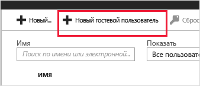
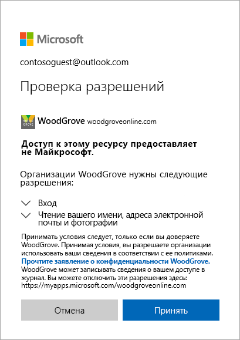

# Краткое руководство. Добавление гостевых пользователей в каталог на портале Azure

Вы можете пригласить кого-либо для совместной работы в вашей организации, добавив его каталог в качестве гостевого пользователя. После этого можно отправить по электронной почте приглашение со ссылкой для активации или отправить прямую ссылку для приложения, доступ к которому вы хотите предоставить. Гостевые пользователи могут выполнять вход с использованием собственных рабочих, учебных учетных данных либо учетных данных из социальных сетей.

В этом кратком руководстве рассматривается добавление нового гостевого пользователя в Azure AD, отправка приглашения и демонстрируется процесс активации приглашения для гостевых пользователей.

Если у вас еще нет подписки Azure, [создайте бесплатную учетную запись Azure](https://azure.microsoft.com/free/?WT.mc_id=A261C142F), прежде чем начинать работу.

## Предварительные требования

Для выполнения сценария в этом руководстве вам понадобится следующее.

 - Роль, которая позволяет создавать пользователей в каталоге клиента, например роль глобального администратора или любая из ролей администратора каталога с ограниченными правами.
 - Учетная запись электронной почты, которую можно добавить в свой каталог клиента и использовать для получения тестового сообщения с приглашением.

## Добавление нового гостевого пользователя в Azure AD

1. Войдите на [портал Azure](https://portal.azure.com/) с учетной записью администратора Azure AD.
2. В области слева выберите **Azure Active Directory**.
3.  В разделе **Управление** выберите **Пользователи**.

    

4.  Затем выберите **Новый гостевой пользователь**.

    

5.  В колонке **Имя пользователя** введите адрес электронной почты внешнего пользователя. В разделе **Include a personal message with the invitation** (Добавить личное сообщение в приглашение) введите приветственное сообщение. 

    

6. Чтобы автоматически отправить приглашение гостевому пользователю, нажмите кнопку **Пригласить**. В правом верхнем углу сообщения отобразится сообщение **Пользователь успешно приглашен**. 
7.  После отправки приглашения учетная запись пользователя автоматически добавляется в каталог в качестве гостя.

## Назначение приложения гостевому пользователю
Добавление приложения Salesforce для вашего тестового клиента и назначение тестового гостевого пользователя приложению.
1.  Войдите на портал Azure с использованием учетной записи администратора Azure AD.
2.  В области слева выберите **Корпоративные приложения**.
3.  Выберите **Новое приложение**.
4. В разделе **Добавить из коллекции** найдите **Salesforce** и выберите его.

    
5. Выберите **Добавить**.
6. В разделе **Управление** выберите **Единый вход** и в разделе **Режим единого входа** выберите **Вход по паролю** и нажмите кнопку **Сохранить**.
7. В разделе **Управление** выберите **Пользователи и группы** > **Добавить пользователя** > **Пользователи и группы**.
8. В поле поиска найдите тестового пользователя (при необходимости) и выберите этого тестового пользователя в списке. Затем щелкните **Выбрать**.
9. Выберите **Назначить**. 

## Принятие приглашения
Теперь войдите в качестве гостевого пользователя, чтобы просмотреть приглашение.
1.  Войдите в учетную запись электронной почты тестового гостевого пользователя.
2.  В папке "Входящие" найдите сообщение электронной почты с приглашением.

    

3.  В тексте сообщения электронной почты выберите **Get Started** (Приступить к работе). В браузере откроется страница **Проверить разрешения**. 

    

4. Нажмите кнопку **Принять**. Откроется "Панель доступа", на которой показаны все приложения, к которым гостевой пользователь может получить доступ.

## Очистка ресурсов
Если тестовый гостевой пользователь и тестовое приложение больше не нужны, удалите их.
1.  Войдите на портал Azure с использованием учетной записи администратора Azure AD.
2.  В области слева выберите **Azure Active Directory**.
3.  В разделе **Управление** выберите **Корпоративные приложения**.
4.  Откройте приложение **Salesforce**, а затем выберите команду **Удалить**.
5.  В области слева выберите **Azure Active Directory**.
6.  В разделе **Управление** выберите **Пользователи**.
7.  Выберите тестового пользователя, а затем — команду **Удалить пользователя**.

## Дополнительная информация
В этом руководстве был создан гостевой пользователь на портале Azure и отправлено приглашение для совместного использования приложения. Затем показан процесс активации с точки зрения гостевого пользователя и выполнена проверка правильного отображения приложения на панели доступа гостевого пользователя. Дополнительные сведения о добавлении гостевых пользователей для совместной работы см. в статье [Добавление пользователей службы совместной работы B2B на портале Azure](add-users-administrator.md).
