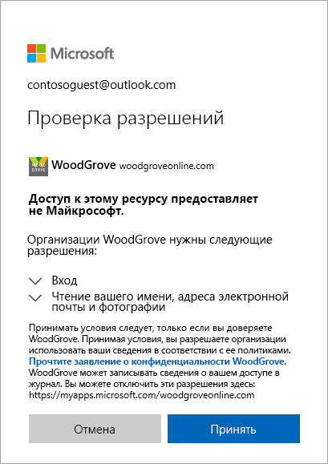

# Что представляет собой гостевой доступ в службе совместной работы Azure Active Directory B2B?

Служба совместной работы Azure AD B2B позволяет обеспечить безопасность общего доступа к приложениям и службам вашей компании для гостевых пользователей из любой организации, контролируя при этом собственные корпоративные данные. Безопасно работайте с внешними партнерскими компаниями, большими или небольшими, даже если у них нет инфраструктуры Azure AD или ИТ-отдела. Простой процесс приглашения и активации позволяет партнерам использовать собственные учетные данные для доступа к ресурсам вашей компании. Разработчики могут использовать интерфейсы API Azure AD B2B, чтобы настроить процесс приглашения или написать такие приложения, как порталы для самостоятельной регистрации.

Просмотрите видео, чтобы узнать, как обеспечить безопасную совместную работу с гостевыми пользователями, приглашая их для входа в приложения и службы вашей компании с использованием собственных удостоверений.

Следующие видеоматериалы содержат полезные сведения.

>[!VIDEO https://www.youtube.com/embed/AhwrweCBdsc]

## Совместная работа с любым партнером с помощью его удостоверений
Служба Azure AD B2B дает партнеру возможность использовать собственное решение по управлению удостоверениями, и ваша организация не понесет издержек на администрирование внешних пользователей. 
- Партнер использует собственные удостоверения и учетные данные, ему не нужно внедрять Azure AD. 
- А вам не нужно управлять внешними учетными записями или паролями. 
- Вам не нужно синхронизировать учетные записи или управлять их жизненным циклом.  

## Приглашение гостевых пользователей с помощью простого процесса приглашения и активации
Гостевые пользователи могут выполнять вход в ваши приложения и службы с использованием собственных рабочих, учебных учетных данных либо учетных данных из социальных сетей. Если у гостевого пользователя нет учетной записи Майкрософт или Azure AD, она создается при активации приглашения. 
- Пригласите гостевых пользователей, используя идентификаторы электронной почты на их выбор.
- Отправьте прямую ссылку на приложение или отправьте приглашение для собственной панели доступа гостевого пользователя. 
- Гостевые пользователи выполняют несколько простых шагов активации для входа.

## Использование политик для безопасного совместного использования приложений и служб
Для защиты корпоративного содержимого можно использовать политики авторизации. Вы можете применить политики условного доступа, например многофакторную проверку подлинности на следующих уровнях:
- на уровне клиента;
- на уровне приложения;
- или для конкретных гостевых пользователей, чтобы защитить корпоративные приложения и данные.

## Простое добавление гостевых пользователей на портале Azure AD

Администратор может легко добавить гостевых пользователей в организацию на портале Azure.
- Создайте гостевого пользователя в Azure AD точно так же, как вы добавляете нового пользователя.
- Гостевой пользователь сразу же получит настраиваемое приглашение, которое позволит ему войти на его панель доступа.
- Гостевых пользователей в каталоге можно назначить приложениям или группам.  

## Разрешение владельцам приложений и групп управлять собственными гостевыми пользователями

Вы можете делегировать управление гостевыми пользователями владельцам приложений, чтобы они могли добавлять гостевых пользователей непосредственно в любое приложение, к которому они хотят предоставить общий доступ, будь то приложение корпорации Майкрософт или другого производителя. 
 - Администраторы могут настроить самостоятельное управление приложениями и группами.
 - Тогда пользователи без прав администратора смогут использовать свои [панели доступа](https://myapps.microsoft.com), чтобы добавлять гостевых пользователей в приложения и группы.

## Простое создание приложений для регистрации с помощью интерфейсов API и примеров кода

Вы можете регистрировать внешних партнеров так, как требуется вашей организации.
- С помощью [API-интерфейсов приглашения службы совместной работы B2B](https://developer.microsoft.com/graph/docs/api-reference/v1.0/resources/invitation) вы можете настроить собственные процедуры регистрации, в том числе создать портал для самостоятельной регистрации. 
- Используйте пример кода портала самообслуживания, предоставленный нами на веб-сайте [GitHub](https://github.com/Azure/active-directory-dotnet-graphapi-b2bportal-web).

## Дополнительная информация

- [Руководство по лицензированию службы совместной работы Azure AD B2B](licensing-guidance.md)
- [Гостевые пользователи службы совместной работы B2B на портале Azure](add-users-administrator.md)
- [Описание процесса активации приглашения](redemption-experience.md)
- Как всегда, вы можете связаться с группой разработчиков через [техническое сообщество Майкрософт](https://techcommunity.microsoft.com/t5/Azure-Active-Directory-B2B/bd-p/AzureAD_B2b), чтобы предоставить отзыв, обсудить проблему или внести предложение.
