# Пилотная подготовка облака для существующего синхронизированного леса AD 

В этом учебнике описывается пилотная подготовка облака для тестового леса Active Directory, который уже синхронизирован с использованием службы синхронизации Azure Active Directory (Azure AD) Connect.

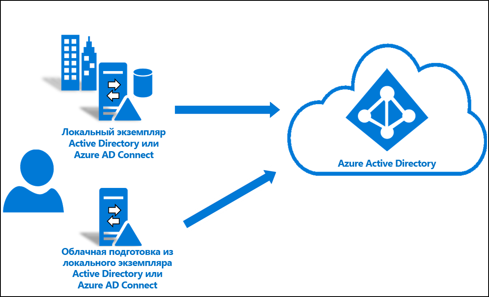

## Рекомендации
Прежде чем начать работу с этим руководством, примите во внимание следующее:
1. Убедитесь, что вы знакомы с основами подготовки облачных сред. 
2. Убедитесь, что вы используете службу синхронизации Azure AD Connect версии 1.4.32.0 или более поздней и настроили правила синхронизации, как указано в документации. При пилотном развертывании вы удалите тестовое подразделение или группу из области синхронизации Azure AD Connect. Перемещение объектов за пределы области действия приводит к удалению этих объектов из Azure AD. Объекты пользователя в Azure AD удаляются обратимо, то есть их можно восстановить. Объекты групп в Azure AD удаляются необратимо, то есть их невозможно восстановить. В службе синхронизации Azure AD Connect появился новый тип ссылки, который предотвращает удаление в случае пилотного сценария. 
3. Убедитесь, что для объектов в области пилотного развертывания заполнен параметр ms-ds-consistencyGUID, чтобы при подготовке облачных служб происходило строгое сопоставление этих объекты. 

   > [!NOTE]
   > Служба синхронизации Azure AD Connect по умолчанию не заполняет *ms-ds-consistencyGUID* для групповых объектов. Выполните действия, описанные в [этой записи блога](https://blogs.technet.microsoft.com/markrenoden/2017/10/13/choosing-a-sourceanchor-for-groups-in-multi-forest-sync-with-aad-connect/), чтобы заполнить *MS-DS-consistencyGUID* для групповых объектов.

4. Это расширенный сценарий. Следите за тем, чтобы в точности выполнять действия, описанные в этом учебнике.

## Предварительные требования
Для работы с этим учебником требуется следующее:
- Тестовая среда со службой синхронизации Azure AD Connect версии 1.4.32.0 или более поздней.
- Подразделение или группа, которые находятся в области синхронизации и могут использоваться в пилотной среде. Мы советуем начинать с небольшого набора объектов.
- Сервер под управлением Windows Server 2012 R2 или более поздней версии, на котором будет размещен агент подготовки.  Это не может быть тот же сервере, где размещается Azure AD Connect.
- Привязка к источнику для службы синхронизации AAD Connect Sync должна быть либо в виде *objectGuid*, либо в виде *MS-DS-consistencyGUID*.

## Обновление Azure AD Connect

Версия службы [Azure AD Connect](https://www.microsoft.com/download/details.aspx?id=47594) не должна быть ниже 1.4.32.0. Чтобы обновить службу синхронизации Azure AD Connect, выполните шаги из статьи [Azure AD Connect: обновление до последней версии](../hybrid/how-to-upgrade-previous-version.md).  

## Остановка планировщика
Служба синхронизации Azure AD Connect синхронизирует изменения в вашем локальном каталоге, используя планировщик. Если нужно изменить и добавить пользовательские правила, отключите этот планировщик, чтобы операции синхронизации не выполнялись одновременно с вашей работой.  Выполните следующие действия.

1.  На сервере, где выполняется служба синхронизации Azure AD Connect, откройте PowerShell с правами администратора.
2.  Запустите `Stop-ADSyncSyncCycle`.  Нажмите клавишу ВВОД.
3.  Запустите `Set-ADSyncScheduler -SyncCycleEnabled $false`.

>[!NOTE] 
>Если вы используете собственный настраиваемый планировщик для службы синхронизации AAD Connect, отключите его. 

## Создание пользовательского правила для входящего трафика пользователя

 1. Запустите редактор синхронизации из меню приложений на рабочем столе, как показано ниже: 
 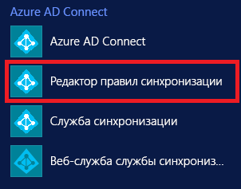 
 
 2. Выберите **Входящие** из раскрывающегося списка в поле "Направление" и щелкните **Добавить новое правило**.
 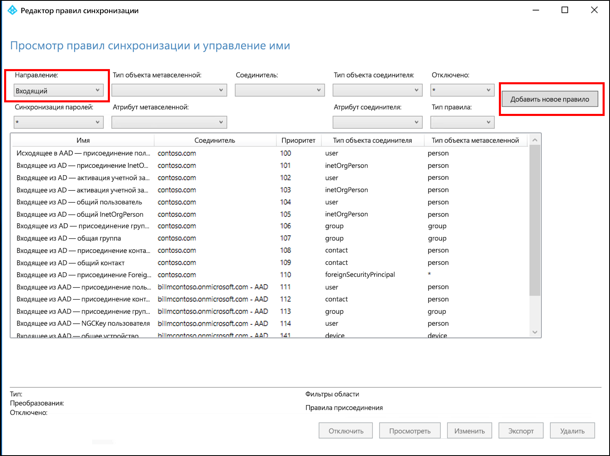 
 
 3. На странице **Описание** задайте следующие параметры и щелкните **Далее**.

    **Имя.** Присвойте правилу понятное имя. 
    **Описание.** Введите информативное описание.  
    **Connected System** (Подключенная система). Выберите соединитель AD, для которого записывается пользовательское правило синхронизации. 
    **Connected System Object Type** (Тип объекта подключенной системы). Пользователь 
    **Metaverse Object Type** (Тип объекта метавселенной). Модель Person 
    **Тип связи**. Объединение 
    **Приоритет**. Укажите уникальное в системе значение. 
    **Тег**. Оставьте это поле пустым. 
    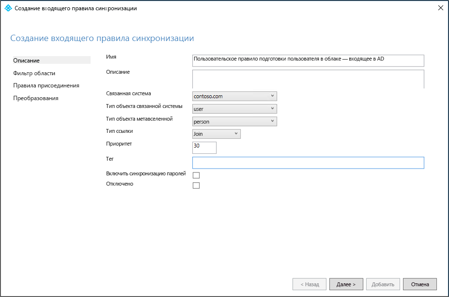. 
 
 4. На странице **Scoping filter** (Фильтр области) введите имя подразделения или группы безопасности, на которых должен быть основан пилотный проект.  Чтобы отфильтровать по подразделению, добавьте часть, которая отвечает за название подразделения, в различающемся имени. Это правило будет применяться ко всем пользователям, которые относятся к этому подразделению.  Таким образом, если различающееся имя завершается строкой "OU=CPUsers,DC=contoso,DC=com", вы добавите такой фильтр.  Нажмите кнопку **Далее**. 

    |правило;|Атрибут|Оператор|Значение|
    |-----|----|----|-----|
    |Подразделение для определения области|DN|ENDSWITH|Различающееся имя подразделения.|
    |Группа для определения области||ISMEMBEROF|Различающееся имя группы безопасности.|

    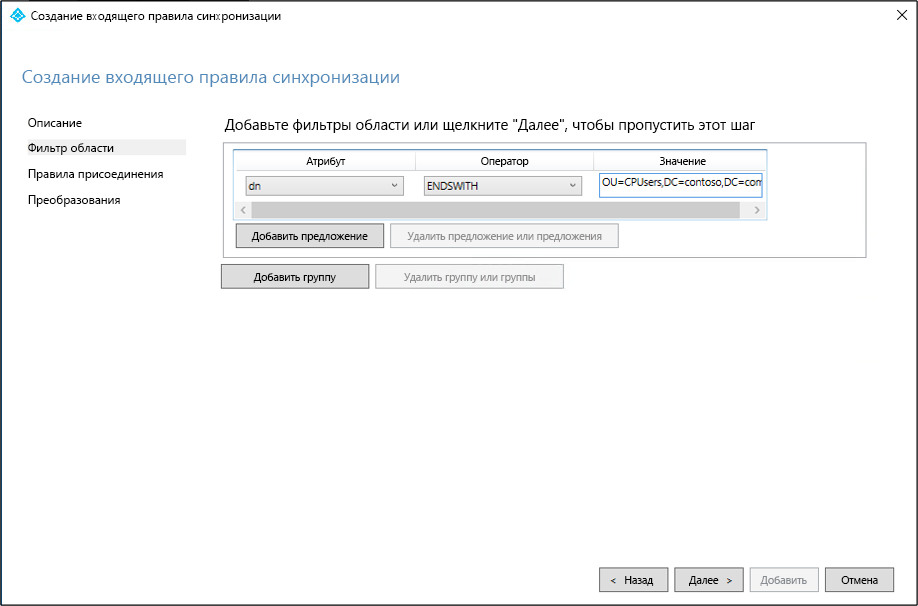 
 
 5. На странице **Join rules** (Правила объединения) щелкните **Далее**.
 6. На странице **Преобразования** добавьте преобразование константы, чтобы значение True передавалось в атрибут cloudNoFlow. Щелкните **Добавить**.
 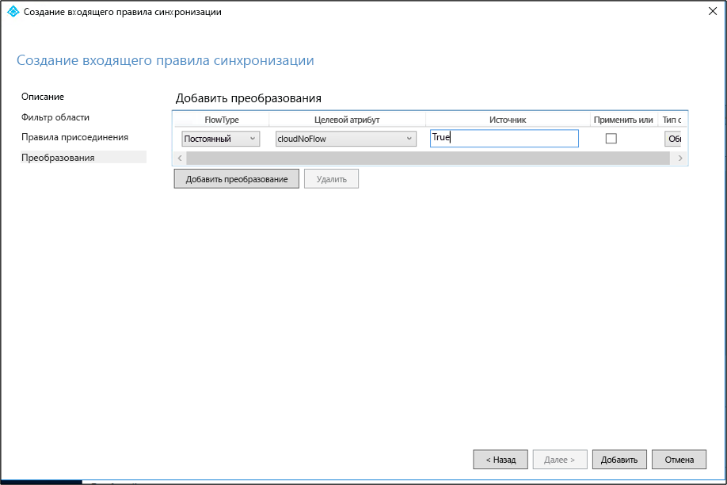 

Эти же действия необходимо выполнить для объектов всех типов (пользователей, групп и контактов). Повторите шаги для каждого настроенного соединителя AD или каждого леса AD. 

## Создание пользовательского правила для исходящего трафика пользователя

 1. Выберите **Исходящие** из раскрывающегося списка в поле "Направление" и щелкните **Добавить правило**.
 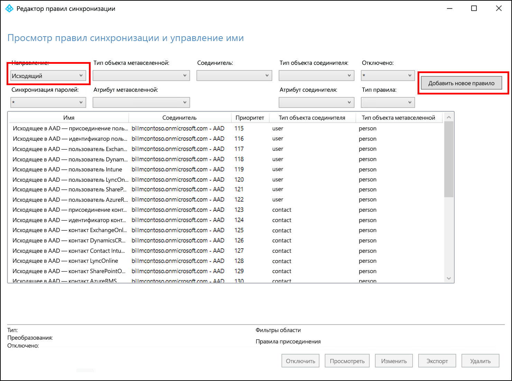 
 
 2. На странице **Описание** задайте следующие параметры и щелкните **Далее**.

    **Имя.** Присвойте правилу понятное имя. 
    **Описание.** Введите информативное описание.  
    **Connected System** (Подключенная система). Выберите соединитель AAD, для которого записывается пользовательское правило синхронизации. 
    **Connected System Object Type** (Тип объекта подключенной системы). Пользователь 
    **Metaverse Object Type** (Тип объекта метавселенной). Модель Person 
    **Тип связи**. JoinNoFlow 
    **Приоритет**. Укажите уникальное в системе значение. 
    **Тег**. Оставьте это поле пустым. 
    
    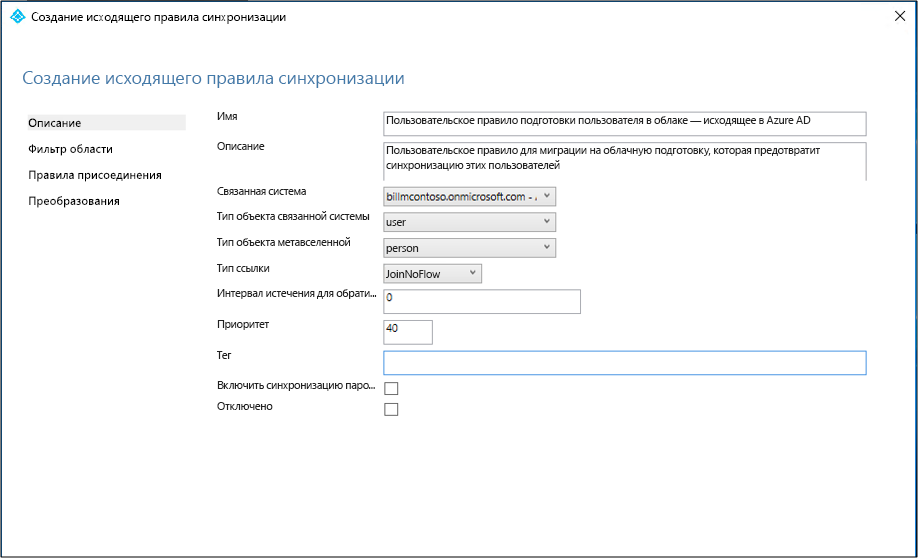 
 
 3. На странице **Фильтр области** выберите "**cloudNoFlow** равно **true**". Нажмите кнопку **Далее**.
 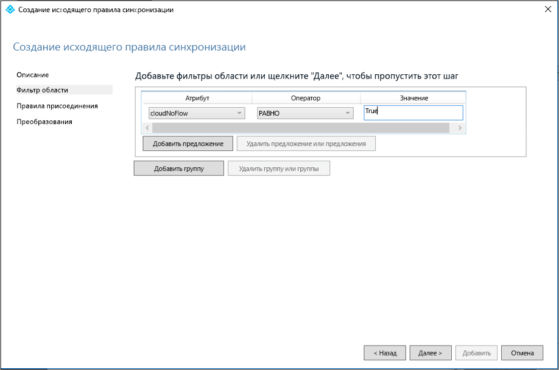 
 
 4. На странице **Join rules** (Правила объединения) щелкните **Далее**.
 5. На странице **Преобразования** щелкните **Добавить**.

Эти же действия необходимо выполнить для объектов всех типов (пользователей, групп и контактов).

## Установка агента подготовки Azure AD Connect
1. Войдите на сервер, который будет использоваться с разрешениями администратора организации.  Если вы используете учебник [по созданию базовой среды AD и Azure](tutorial-basic-ad-azure.md), это будет CP1.
2. Скачайте агент подготовки облака Azure AD Connect [здесь](https://go.microsoft.com/fwlink/?linkid=2109037).
3. Запустите подготовку облака Azure AD Connect (AADConnectProvisioningAgent.Installer).
3. На экране-заставке **примите** условия лицензионного соглашения и щелкните **Установить**. 
 

4. После завершения этой операции откроется мастер настройки.  Войдите с учетной записью глобального администратора Azure AD.
5. На экране **Connect Active Directory** (Подключение Active Directory) щелкните **Добавить каталог** и выполните вход с учетной записью администратора Active Directory.  Эта операция добавляет локальный каталог.  Щелкните **Далее**. 
 

6. На странице **Конфигурация завершена** щелкните **Подтвердить**.  Эта операция регистрирует и перезапускает агент. 
 

7. После завершения операции появится сообщение **Your was successfully verified** (Вас успешно проверили).  Здесь можно щелкнуть **Выйти**. 
 
8. Если вы по-прежнему видите начальный экран-заставку, щелкните **Закрыть**. 1. Войдите на сервер, который будет использоваться с разрешениями администратора организации.
2. Скачайте агент подготовки облака Azure AD Connect [здесь](https://go.microsoft.com/fwlink/?linkid=2109037).
3. Запустите подготовку облака Azure AD Connect (AADConnectProvisioningAgent.Installer).
3. На экране-заставке **примите** условия лицензионного соглашения и щелкните **Установить**. 
 

4. После завершения этой операции откроется мастер настройки.  Войдите с учетной записью глобального администратора Azure AD.
5. На экране **Connect Active Directory** (Подключение Active Directory) щелкните **Добавить каталог** и выполните вход с учетной записью администратора Active Directory.  Эта операция добавляет локальный каталог.  Щелкните **Далее**. 
 

6. На странице **Конфигурация завершена** щелкните **Подтвердить**.  Эта операция регистрирует и перезапускает агент. 
 

7. После завершения операции появится сообщение **Your was successfully verified** (Вас успешно проверили).  Здесь можно щелкнуть **Выйти**. 
 
8. Если вы по-прежнему видите начальный экран-заставку, щелкните **Закрыть**.

## Проверка установки агента
Проверка агента выполняется на портале Azure и на локальном сервере, где выполняется агент.

### Проверка агента на портале Azure
Чтобы проверить, что агент доступен в Azure, сделайте следующее:

1. Войдите на портал Azure.
2. Слева выберите **Azure Active Directory**, щелкните **Azure AD Connect** и в центре выберите **Управление подготовкой (предварительная версия)** . 
 

3.  На экране **Подготовка Azure AD (предварительная версия)** щелкните **Проверить все агенты**.
 
 
4. На экране **локальных агентов подготовки** вы увидите установленные агенты.  Убедитесь, что нужный агент присутствует в этом списке с пометкой **Disabled** (Отключено).  По умолчанию агент подготовки отключен.  

### На локальном сервере
Чтобы убедиться, что агент выполняется, сделайте следующее.

1.  Войдите на сервер с учетной записью администратора.
2.  Откройте страницу **Службы**, перейдя к ней в интерфейсе или выполнив команду Services.msc в строке запуска из меню "Пуск".
3.  В разделе **Службы** убедитесь, что **агент обновления Microsoft Azure AD Connect** и **агент подготовки Microsoft Azure AD Connect** присутствуют в списке и имеют состояние **Выполняется**.

## Настройка процесса подготовки облака Azure AD Connect
Чтобы настроить процесс подготовки, выполните следующие действия.

 1. Войдите на портал Azure.
 2. Щелкните **Azure Active Directory**.
 3. Щелкните **Azure AD Connect**.
 4. Выберите **Управление подготовкой (предварительная версия)** 
 . 
 5.  Щелкните **Новая конфигурация**
 . 
 6.  На экране конфигурации перейдите к разделу **Сообщение электронной почты с уведомлением**, переместите селектор в положение **Включить** и щелкните **Сохранить**.
  
 7. В разделе **Настройка** выберите **Все пользователи**, чтобы изменить область действия правила конфигурации.
 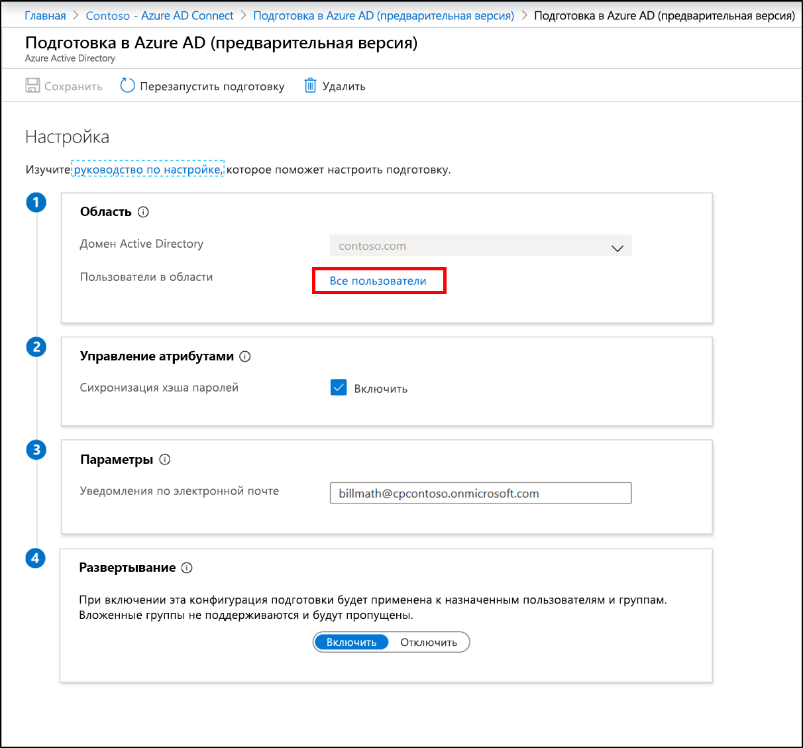 
 8. Справа измените область, включив в нее только что созданное подразделение: "OU=CPUsers,DC=contoso,DC=com".
 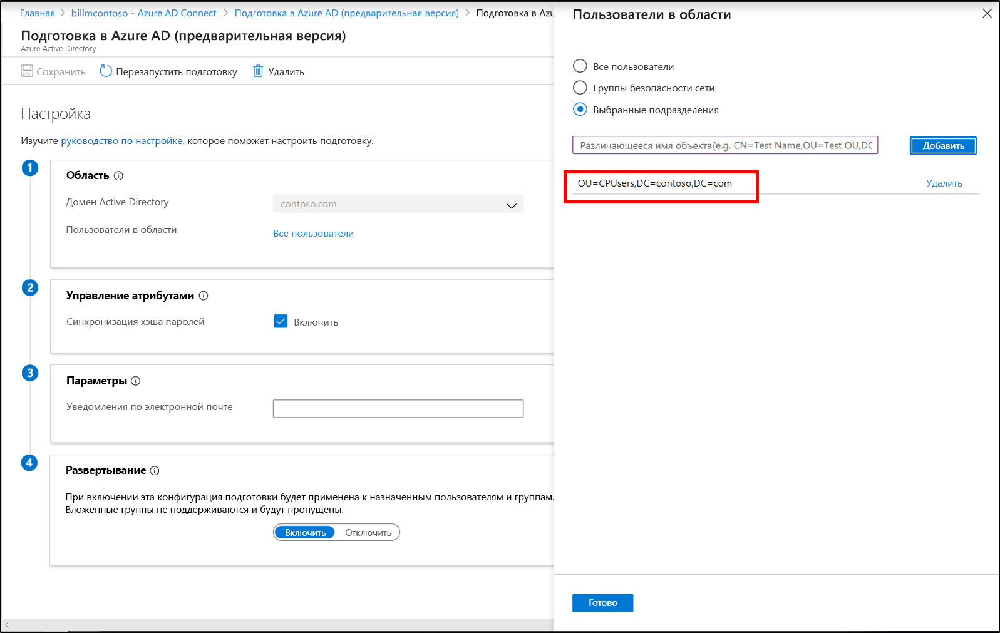 
 9.  Щелкните **Готово** и **Сохранить**.
 10. Теперь область будет включать одно подразделение. 
 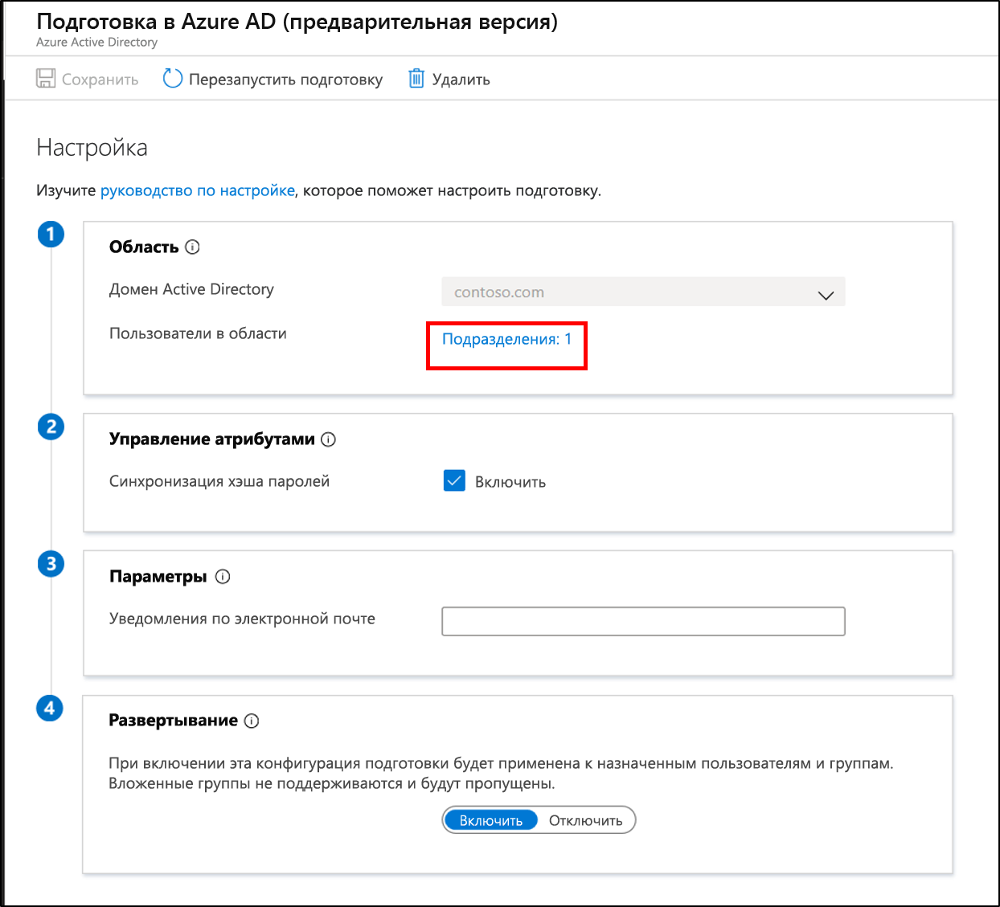 
 

## Проверка подготовки пользователей с помощью подготовки облака
Теперь вы проверите, были ли пользователи из локального каталога синхронизированы и добавлены в клиент Azure AD.  Имейте в виду, что эта операция может занять несколько часов.  Чтобы проверить подготовку пользователей с помощью подготовки облака, выполните следующие шаги.

1. Перейдите на [портал Azure](https://portal.azure.com) и выполните вход с учетной записью, имеющей подписку Azure.
2. Слева выберите **Azure Active Directory**.
3. Щелкните **Azure AD Connect**.
4. Щелкните **Управление подготовкой (предварительная версия)** .
5. Нажмите кнопку **Журналы**.
6. Выполните поиск по имени пользователя, чтобы убедиться в том, что этот пользователь подготовлен с помощью подготовки облака.

Кроме того, можно проверить существование пользователя и группы в Azure AD.

## Запуск планировщика
Служба синхронизации Azure AD Connect синхронизирует изменения в вашем локальном каталоге, используя планировщик. Итак, вы завершили изменение правил и теперь можете перезапустить планировщик.  Выполните следующие действия.

1.  На сервере, где выполняется служба синхронизации Azure AD Connect, откройте PowerShell с правами администратора.
2.  Запустите `Set-ADSyncScheduler -SyncCycleEnabled $true`.
3.  Запустите `Start-ADSyncSyncCycle`.  Нажмите клавишу ВВОД.  

>[!NOTE] 
>Если вы используете собственный настраиваемый планировщик для синхронизации AAD Connect, включите его. 

## Если что-то пошло не так
Если пилотный проект не работает должным образом, вы можете вернуться к настройке службы синхронизации Azure AD Connect, выполнив следующие шаги.
1.  Отключите конфигурацию автоматической подготовки на портале Azure. 
2.  С помощью редактора правил синхронизации отключите все настраиваемые правила синхронизации, созданные для подготовки облака. При таком отключении должна запуститься полная синхронизация для всех соединителей.

## Исключение подразделения пилотного проекта из настройки службы синхронизации Azure AD Connect
Убедившись, что пользователями из подразделения пилотного проекта успешно управляет служба подготовки облака, вы можете повторно настроить Azure AD Connect, чтобы исключить созданное ранее подразделение пилотного проекта.  В дальнейшем синхронизацию этих пользователей будет выполнять агент подготовки облака.  Для настройки области Azure AD Connect выполните следующие действия.

 1. На сервере, где работает Azure AD Connect, дважды щелкните значок Azure AD Connect.
 2. Щелкните **Настроить**.
 3. Щелкните **Настроить параметры синхронизации** и нажмите кнопку "Далее".
 4. Войдите в Azure AD и щелкните **Далее**.
 5. На экране **Подключить каталоги** щелкните **Далее**.
 6. На экране **Фильтрация доменов и подразделений** щелкните **Синхронизировать выбранные домены и подразделения**.
 7. Разверните свой домен и **отмените выбор** подразделения **CPUsers**.  Щелкните **Далее**.
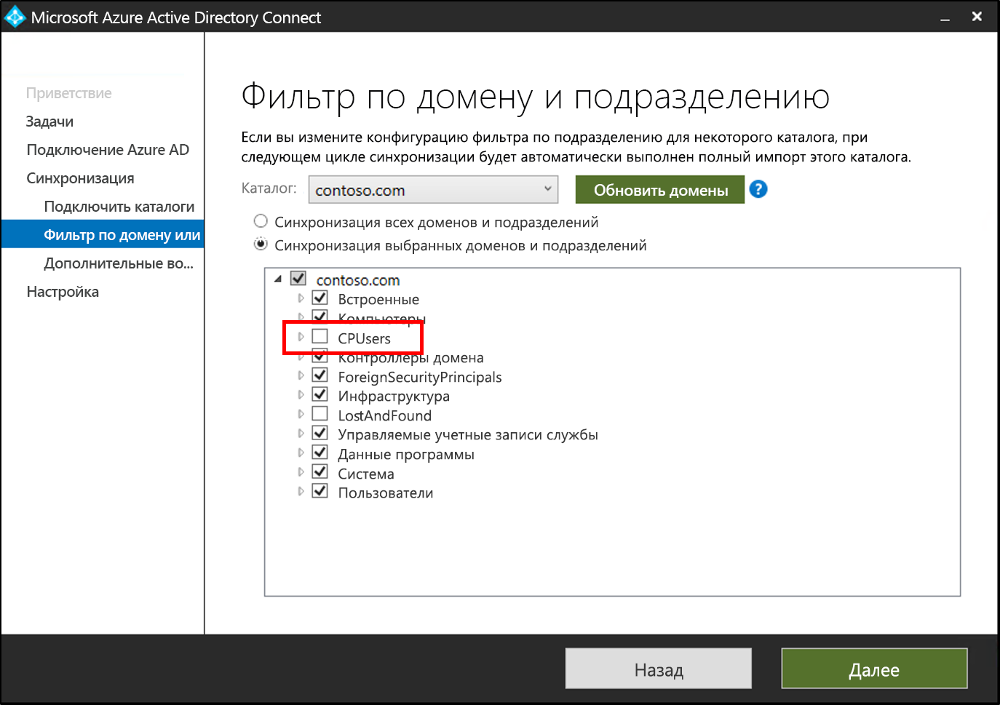 
 9. На экране **Дополнительные возможности** щелкните **Далее**.
 10. На экране **Все готово к настройке** щелкните **Настроить**.
 11. По завершении щелкните **Выход**. 

## Дополнительная информация 

- [Что собой представляет подготовка?](what-is-provisioning.md)
- [What is Azure AD Connect cloud provisioning?](what-is-cloud-provisioning.md) (Что такое подготовка облака Azure AD Connect?)

