# Руководство. Интеграция одного леса с одним клиентом Azure AD

В этом руководстве описывается создание гибридной среды удостоверений с помощью Azure Active Directory (Azure AD) Connect Cloud.

Вы можете использовать среду, созданную в этом руководстве, для тестирования или для получения более привычных сведений о подготовке облака.

## Технические условия
### В центре администрирования Azure Active Directory

1. Создайте облачную учетную запись глобального администратора в клиенте Azure AD. Таким образом, вы сможете управлять конфигурацией клиента, если работа локальных служб завершится сбоем или они станут недоступными. Узнайте больше о [добавлении облачной учетной записи глобального администратора](../active-directory-users-create-azure-portal.md). Этот шаг очень важен, чтобы не потерять доступ к клиенту.
2. Добавьте одно [имя личного домена](../active-directory-domains-add-azure-portal.md) (или несколько) в клиент Azure AD. Пользователи могут выполнить вход с помощью одного из этих доменных имен.

### В локальной среде

1. Идентификация присоединенного к домену сервера узла под управлением Windows Server 2012 R2 или более поздней версии с минимальным объемом ОЗУ 4 ГБ и .NET 4.7.1 + Runtime 

2. Если между серверами и Azure AD настроен брандмауэр, необходимо настроить указанные ниже элементы.
   - Убедитесь, что агенты могут выполнять *Исходящие* запросы к Azure AD через следующие порты:

     | Номер порта | Как он используется |
     | --- | --- |
     | **80** | Скачивание списков отзыва сертификатов при проверке SSL-сертификата. |
     | **443** | Обработка всего исходящего трафика для службы. |
     | **8080** (необязательно) | Агенты сообщают о своем состоянии каждые 10 минут через порт 8080, если порт 443 недоступен. Это данные о состоянии отображаются на портале Azure AD. |
     
     Если брандмауэр применяет правила в соответствии с отправляющими трафик пользователями, откройте эти порты для трафика, поступающего от служб Windows, которые работают как сетевая служба.
   - Если брандмауэр или прокси-сервер позволяет указать надежные суффиксы, добавьте соединения t в **\*. msappproxy.NET** и **\*. servicebus.Windows.NET**. Если нет, разрешите доступ к [диапазонам IP-адресов центра обработки данных Azure](https://www.microsoft.com/download/details.aspx?id=41653). Список диапазонов IP-адресов обновляется еженедельно.
   - Агентам требуется доступ к **Login.Windows.NET** и **Login.microsoftonline.com** для первоначальной регистрации. Откройте эти URL-адреса в брандмауэре.
   - Для проверки сертификата Разблокируйте следующие URL-адреса: **mscrl.Microsoft.com:80**, **CRL.Microsoft.com:80**, **OCSP.msocsp.com:80**и **www\.Microsoft.com:80**. Так как эти URL-адреса используются для проверки сертификатов в других продуктах Майкрософт, они уже могут быть разблокированы.

## Установка агента подготовки Azure AD Connect
1. Войдите на сервер, присоединенный к домену.  Если вы используете учебник по [основным службам Active Directory и среде Azure](tutorial-basic-ad-azure.md) , это будет DC1.
2. Войдите в портал Azure, используя только облачные учетные данные глобального администратора.
3. В левой части выберите **Azure Active Directory**, щелкните **Azure AD Connect**и в центре выберите **Управление подготовка (Предварительная версия)** .

   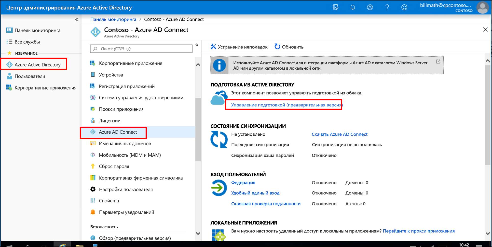

4. Щелкните **скачать агент**.
5. Запустите агент подготовки Azure AD Connect.
6. На экране-заставке **примите** условия лицензионного соглашения и нажмите кнопку **установить**.

   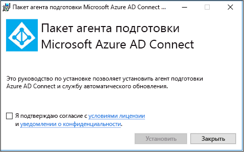

7. После завершения этой операции будет запущен мастер настройки.  Войдите с помощью своей учетной записи глобального администратора Azure AD.  Обратите внимание, что если включена улучшенная безопасность IE, вход будет заблокирован.  В этом случае закройте установку, отключите усиленную безопасность Internet Explorer в диспетчер сервера и щелкните **Мастер подготовки агента подключения AAD** , чтобы перезапустить установку.
8. На экране **подключение Active Directory** нажмите кнопку **Добавить каталог** , а затем выполните вход с помощью учетной записи администратора домена Active Directory.  Примечание. учетная запись администратора домена не должна иметь требований к изменению пароля. Если срок действия пароля истекает или изменяется, необходимо будет повторно настроить агент с новыми учетными данными. Эта операция добавит локальный каталог.  Щелкните **Далее**.

   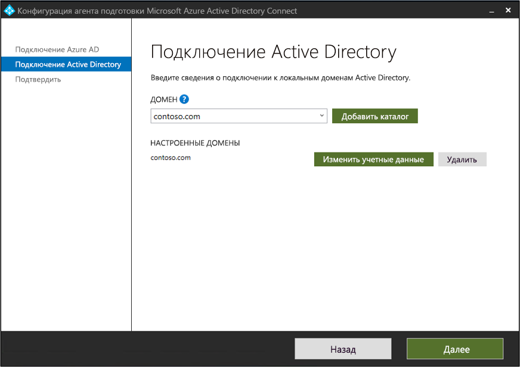

9. На экране **Конфигурация завершена** нажмите кнопку **подтвердить**.  Эта операция регистрирует и перезапускает агент.

   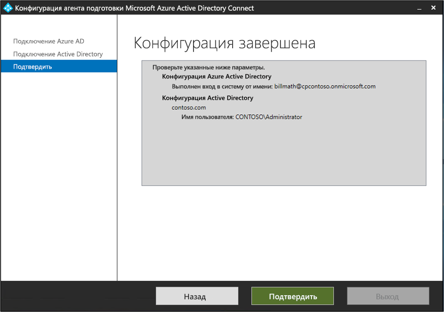

10. После завершения этой операции вы увидите уведомление: **Конфигурация агента успешно проверена.**  Можно нажать кнопку **выход**. 
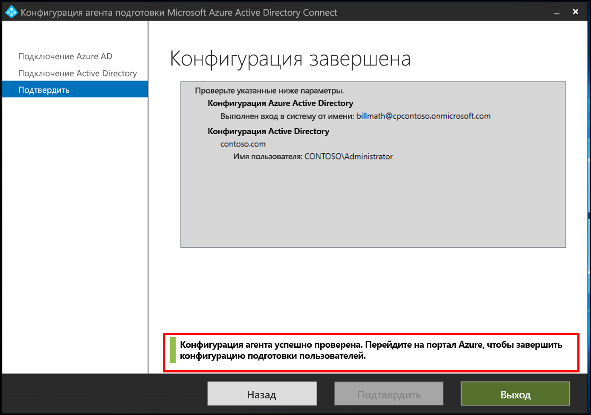 
11. Если вы по-прежнему видите начальный экран заставки, нажмите кнопку **Закрыть**.

## Проверка установки агента
Проверка агента выполняется в портал Azure и на локальном сервере, на котором выполняется агент.

### Проверка агента портал Azure
Чтобы проверить, что агент отображается в Azure, выполните следующие действия.

1. Войдите на портал Azure.
2. Слева выберите **Azure Active Directory**, щелкните **Azure AD Connect** и в центре выберите **Управление подготовка (Предварительная версия)** . 
 

3.  На экране **Подготовка Azure AD (Предварительная версия)** щелкните **проверить все агенты**.
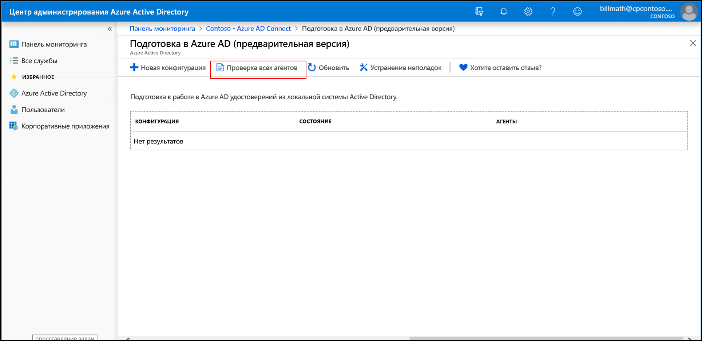 
 
4. На **экране "локальные агенты подготовки** " вы увидите установленные агенты.  Убедитесь, что рассматриваемый агент включен и помечен как **Активный**.
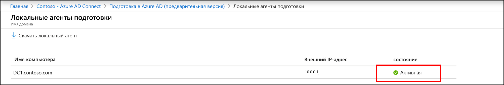 

### На локальном сервере
Чтобы проверить, работает ли агент, выполните следующие действия.

1.  Вход на сервер с учетной записью администратора
2.  Откройте **службы** , перейдя к ней или перейдя к запуску/запуску/Services. msc.
3.  В разделе " **службы**" убедитесь, что **Microsoft Azure AD подключение к агенту обновления агента** и **Microsoft Azure AD подключение к** системе установлены, а состояние **выполняется**.

## Настройка подготовки облачных Azure AD Connect
 Чтобы настроить подготовку, выполните следующие действия.

1.  Войдите на портал Azure AD.
2.  Щелкните **Azure Active Directory**
3.  Щелкните **Azure AD Connect**
4.  Выберите **Управление подготовка (Предварительная версия)** 

5.  Щелкните **New Configuration**
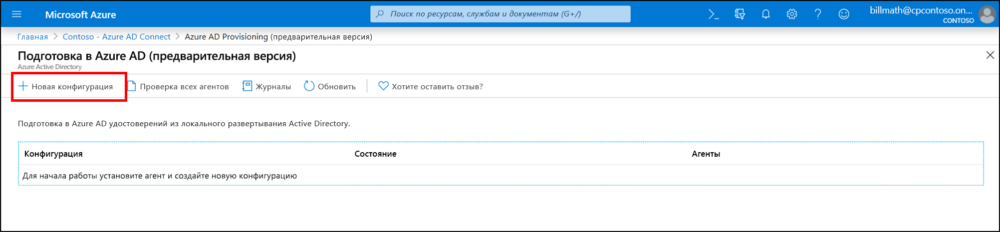
7.  На экране Конфигурация введите **уведомление по электронной почте**, переместите селектор, чтобы **включить** его, и нажмите кнопку **сохранить**.
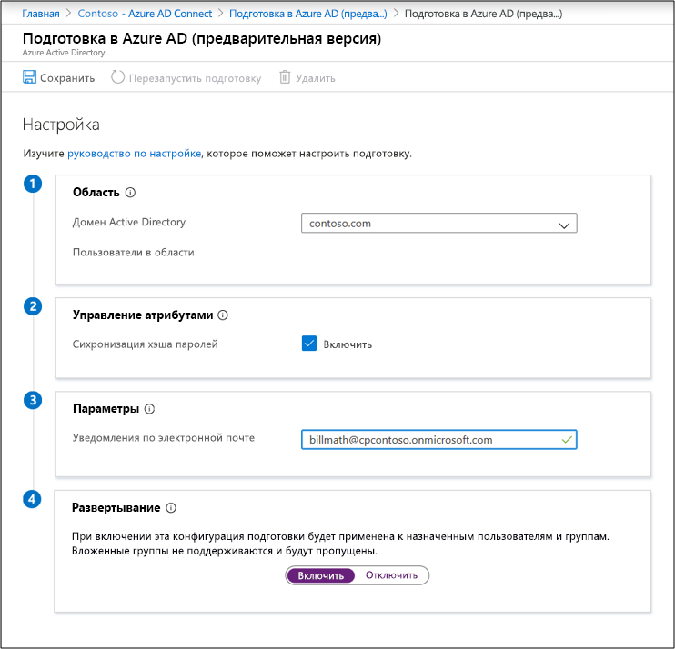
1.  Теперь состояние конфигурации должно быть **работоспособным**.
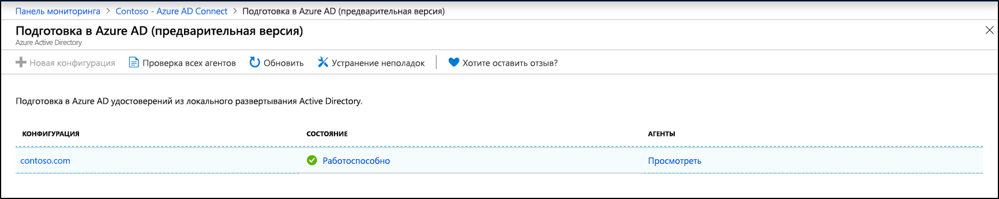

## Проверка создания пользователей и выполнения синхронизации
Теперь вы убедитесь, что пользователи в локальном каталоге были синхронизированы и теперь существуют в нашем клиенте Azure AD.  Имейте в виду, что эта операция может занять несколько часов.  Чтобы проверить синхронизацию пользователей, выполните указанные ниже действия.

1. Перейдите на [портал Azure](https://portal.azure.com) и выполните вход с учетной записью, имеющей подписку Azure.
2. Слева выберите **Azure Active Directory**.
3. В разделе **Управление** выберите **Пользователи**.
4. Убедитесь в том, что новый пользователь отображается в клиенте. 
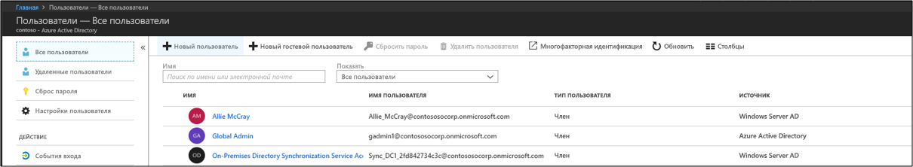 

## Проверка входа с помощью одной из учетных записей

1. Перейдите на сайт [https://myapps.microsoft.com](https://myapps.microsoft.com).
2. Выполните вход с помощью учетной записи пользователя, которая была создана в новом клиенте.  Для этого следует использовать следующий формат: (user@domain.onmicrosoft.com). Используйте тот же пароль, что и для входа в локальную среду. 
   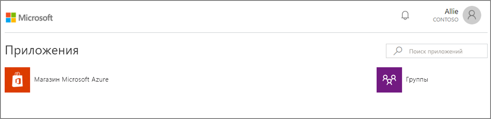 

Вы успешно настроили среду гибридной идентификации, которую можно использовать для тестирования и ознакомления с возможностями Azure.

## Дальнейшие действия 

- [Что такое подготовка?](what-is-provisioning.md)
- [Что такое Azure AD Connect подготовки облака?](what-is-cloud-provisioning.md)
