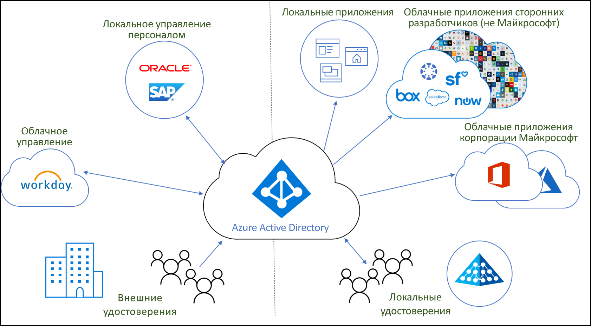
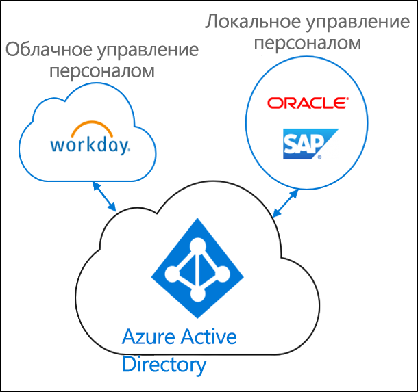
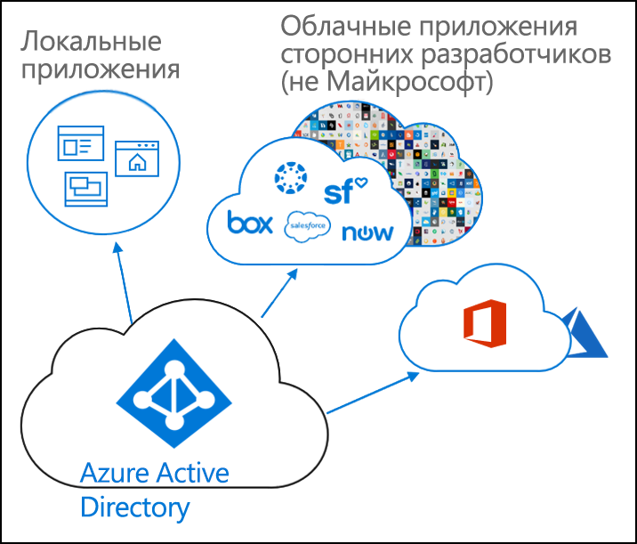
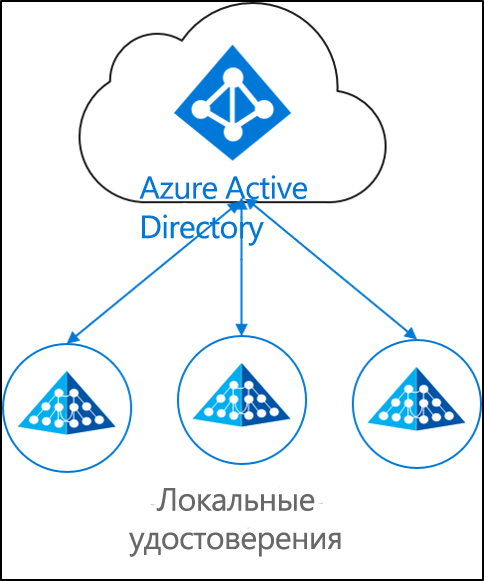

# Что такое подготовка удостоверений?

Сегодня предприятия и организации все чаще комбинируют локальные и облачные приложения.  Пользователям требуется доступ к приложениям как локально, так и в облаке. В этих разных приложениях (как локальных, так и облачных) должно быть одно удостоверение.

Подготовка — это процесс создания объекта на основе определенных условий, поддержание актуального состояния объекта и его удаление при невыполнении условий. Например, когда новый пользователь присоединяется к организации, он входит в систему управления персоналом.  На этом этапе подготовка может создать соответствующую учетную запись пользователя в облаке, в Active Directory и в различных приложениях, к которым пользователю необходим доступ.  Это позволяет пользователю начать работу и получить доступ к нужным приложениям и системам в первый день. 

Что касается Azure Active Directory, подготовка может быть разбита на следующие ключевые сценарии.  

- **[Подготовка на основе управления персоналом](#hr-driven-provisioning)**  
- **[Подготовка приложений](#app-provisioning)**  
- **[Подготовка каталога](#directory-provisioning)** 

## Подготовка на основе управления персоналом

Подготовка от управления персоналом до облака включает создание объектов (пользователей, ролей, групп и т. д.) на основе сведений, которые находятся в системе управления персоналом.  

Самый распространенный сценарий: новые сотрудники присоединяются к компании и вносятся в систему управления персоналом.  Как только это происходит, они подготавливаются к работе в облаке.  В данном случае в Azure AD.  Подготовка от управления персоналом может охватывать следующие сценарии. 

- **Наем новых сотрудников.** При добавлении нового сотрудника в систему управления персоналом в облаке в Active Directory, Azure Active Directory и при необходимости в Office 365, а также в других приложениях SaaS, поддерживаемых Azure AD, автоматически создается учетная запись пользователя с обратной записью адреса электронной почты в системе управления персоналом в облаке.
- **Обновления атрибута и профиля сотрудника**. При обновлении записи сотрудника в системе управления персоналом в облаке (например, имени, должности или руководителя) его учетная запись пользователя будет автоматически обновлена в Active Directory, Azure Active Directory и при необходимости в Office 365 и других приложениях SaaS, поддерживаемых Azure AD.
- **Увольнения сотрудников**. При увольнении сотрудника в системе управления персоналом в облаке его учетная запись пользователя будет автоматически отключена в Active Directory, Azure Active Directory и при необходимости в Office 365 и других приложениях SaaS, поддерживаемых Azure AD.
- **Повторные наймы сотрудников**. При повторном поступлении сотрудника на работу в системе управления персоналом в облаке его старая учетная запись может быть автоматически активирована повторно или повторно подготовлена (в зависимости от вашего желания) в Active Directory, Azure Active Directory и при необходимости в Office 365 и других приложениях SaaS, поддерживаемых Azure AD.

## Подготовка приложений

В Azure Active Directory (Azure AD) термин **[подготовка приложений](https://docs.microsoft.com/azure/active-directory/manage-apps/user-provisioning)** относится к автоматическому созданию удостоверений и ролей пользователей в облачных приложениях, к которым пользователям требуется доступ. Кроме создания удостоверений пользователей, автоматическая подготовка включает в себя обслуживание и удаление удостоверений пользователей по мере изменения их статуса или ролей. Типичные сценарии включают подготовку пользователя Azure AD к таким приложениям, как [Dropbox](https://docs.microsoft.com/azure/active-directory/saas-apps/dropboxforbusiness-provisioning-tutorial), [Salesforce](https://docs.microsoft.com/azure/active-directory/saas-apps/salesforce-provisioning-tutorial), [ServiceNow](https://docs.microsoft.com/azure/active-directory/saas-apps/servicenow-provisioning-tutorial), и других.

## Подготовка каталога

Локальная подготовка включает подготовку из локальных источников (например, Active Directory) в Azure AD.  

Самый распространенный сценарий — подготовка пользователя из Active Directory (AD) к работе в Azure AD.

Это достигается за счет синхронизации Azure AD Connect, подготовки облака Azure AD Connect и Microsoft Identity Manager. 
 
## Дальнейшие действия 

- [What is Azure AD Connect cloud provisioning?](what-is-cloud-provisioning.md) (Что такое подготовка облака Azure AD Connect?)
- [Установка средства подготовки облака](how-to-install.md)
