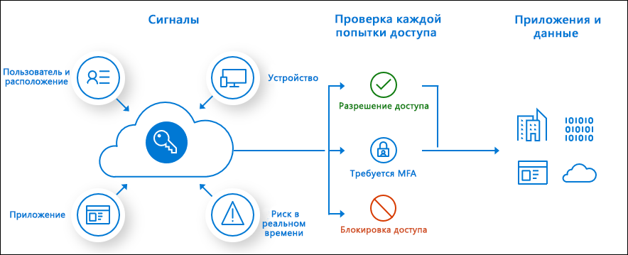

# Что собой представляет условный доступ

Современные периметры безопасности теперь выходят за пределы сети организации, чтобы включить удостоверение пользователя и устройства. Организации могут использовать эти сигналы идентификации как часть решений по управлению доступом. 

Условный доступ — это средство, используемое Azure Active Directory для объединения сигналов, принятия решений и применения политик организации. Условный доступ является основой новой плоскости управления, управляемой удостоверениями.

Политики условного доступа в своей простейшей форме — это операторы если-то; если пользователь хочет получить доступ к ресурсу, то он должен выполнить действие. Пример: Менеджер модуля "Зарплата" хочет получить доступ к приложению по платежной ведомости и должен выполнить многофакторную аутентификацию для доступа к ней.

Администраторы сталкиваются с двумя основными целями:

- продуктивная работа пользователей в любом месте и в любое время;
- защищать ресурсы организации.

С помощью политик условного доступа можно применять необходимые элементы управления доступом, чтобы обеспечить безопасность вашей организации и не выходить за пределы пользователя, когда это не требуется.

Политики условного доступа применяются после того, как пользователь прошел однофакторную аутентификацию. Условный доступ не предназначен в качестве первой линии защиты организации для таких сценариев, как атаки типа "отказ в обслуживании" (DoS), но может использовать сигналы этих событий для определения доступа.

## Общие сигналы

Общие сигналы, которые может учитывать условный доступ при принятии решения о политике, включают перечисленные ниже сигналы.

- Пользователь или членство в группе
   - Политики могут быть нацелены на конкретных пользователей и группы, предоставляя администраторам детальный контроль над доступом.
- Сведения о расположении IP-адреса
   - Организации могут создавать диапазоны доверенных IP-адресов, которые можно использовать при принятии решений о политике. 
   - Администраторы могут указать диапазоны IP-адресов целых стран, чтобы заблокировать или разрешить трафик.
- Устройство
   - Для применения политик условного доступа можно использовать пользователей с устройствами определенных платформ или устройствами, помеченными определенным состоянием.
- Приложение
   - Пользователи, пытающиеся получить доступ к конкретным приложениям, могут запускать различные политики условного доступа. 
- Обнаружение рисков в режиме реального времени, а также вычисленных рисков
   - Интеграция сигналов с защитой идентификации Azure AD позволяет использовать политики условного доступа для обнаружения опасного поведения при входе. Затем политики могут заставить пользователей изменить пароли или выполнить многофакторную проверку подлинности, чтобы уменьшить уровень риска или заблокировать доступ, пока администратор не выполнит ручное действие.
- Microsoft Cloud App Security (MCAS)
   - Позволяет выполнять мониторинг доступа к пользовательским приложениям и сеанса, а также контролировать их в режиме реального времени, повышая наглядность и контроль доступа и действий, выполняемых в облачной среде.

## Общие решения

- Заблокировать доступ
   - Наиболее ограничительное решение
- Предоставление доступа
   - Для наименее ограничительного решения, все еще может потребоваться один или несколько из приведенных ниже вариантов.
      - Требование многофакторной идентификации
      - Требовать, чтобы устройство было отмечено как соответствующее
      - Требование устройства с гибридным присоединением к Azure AD
      - Требование утвержденного клиентского приложения
      - Требование политики защиты приложений (предварительная версия)

## Обычно применяемые политики

Многие организации имеют распространенные проблемы с доступом, которые политики условного доступа могут использовать следующим образом:

- по требованию многофакторной проверки подлинности для пользователей с административными ролями;
- по требованию многофакторной проверки подлинности для задач управления Azure;
- блокировка входа для пользователей, пытающихся использовать устаревшие протоколы проверки подлинности;
- по требованию надежных расположений для многофакторной проверки подлинности регистраций Azure;
- блокировка или предоставление доступа из конкретных расположений;
- блокировка рискованного поведения при входе;
- по требованию управляемых организацией устройств для определенных приложений.

## Требования лицензий

[!INCLUDE [Active Directory P1 license](../../../includes/active-directory-p1-license.md)]

Клиенты с [лицензиями Microsoft 365 бизнес](https://docs.microsoft.com/office365/servicedescriptions/microsoft-365-service-descriptions/microsoft-365-business-service-description) также имеют доступ к функциям условного доступа. 

## Дополнительная информация

[Building a Conditional Access policy piece by piece](concept-conditional-access-policies.md) (Пошаговое создание политики условного доступа)

Сведения о реализации условного доступа см.в статье [How To: Plan your Conditional Access deployment in Azure Active Directory](plan-conditional-access.md) (Практическое руководство. Планирование развертывания с условным доступом в Azure Active Directory).

[Что такое Защита идентификации Azure Active Directory (обновленная)?](../identity-protection/overview-v2.md)

[Общие сведения о Microsoft Cloud App Security](https://docs.microsoft.com/cloud-app-security/what-is-cloud-app-security)

[Документация по Microsoft Intune](https://docs.microsoft.com/intune/index)