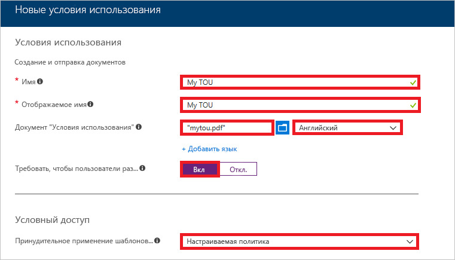
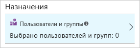
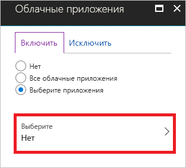
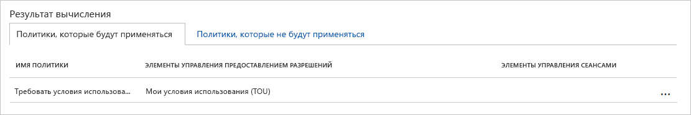
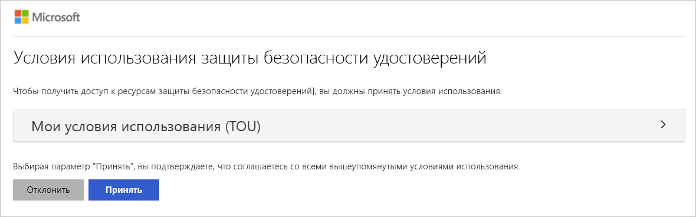
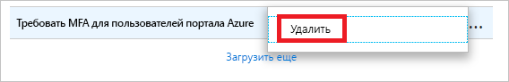

# Краткое руководство. Требование принятия условий использования перед доступом к облачным приложениям

Прежде чем обращаться к определенным облачным приложениям в существующей среде, необходимо получить согласие от пользователей в форме принятия условий использования (ToU). Условный доступ Azure Active Directory (Azure AD) предоставляет вам следующие возможности.

- Простой способ настройки условий использования (ToU)
- Возможность требовать принятия ваших условий использования с помощью политики условного доступа  

В этом кратком руководстве содержатся инструкции по настройке [политики условного доступа Azure AD](../active-directory-conditional-access-azure-portal.md), которая требует принятия условий использования (ToU) для выбранных облачных приложений в существующей среде.

Если у вас еще нет подписки Azure, [создайте бесплатную учетную запись Azure](https://azure.microsoft.com/free/?WT.mc_id=A261C142F), прежде чем начинать работу.

## Предварительные требования

Чтобы выполнить сценарий в этом кратком руководстве, вам понадобится:

- **доступ к Azure AD Premium** — условный доступ Azure AD является возможностью Azure AD Premium;
- **тестовая учетная запись Isabella Simonsen** — сведения о создании тестовой учетной записи см. в разделе о [добавлении облачных пользователей](../fundamentals/add-users-azure-active-directory.md#add-a-new-user).

## Проверка входа

Целью этого шага является ознакомление со входом в систему без политики условного доступа.

**Чтобы проверить вход в систему, выполните следующие действия.**

1. Войдите на [портал Azure](https://portal.azure.com/) с учетной записью Isabella Simonsen.
1. Выполните выход.

## Создание условий использования

В этом разделе описана процедура создания примера условий использования (ToU). При создании условий использования (ToU) выберите значение для **Принудительного применения шаблонов политик условного доступа**. Как только будут созданы условия использования (ToU), при выборе **Настраиваемой политики** откроется диалоговое окно для создания новой политики условного доступа.

**Чтобы создать условия использования, выполните следующие действия.**

1. Создайте новый документ в Microsoft Word.

1. Введите **Мои условия использования**, а затем сохраните документ на компьютере как **mytou.pdf**.

1. Войдите на [портал Azure](https://portal.azure.com) с правами глобального администратора, администратора безопасности или администратора условного доступа.

1. На портале Azure на панели навигации слева щелкните **Azure Active Directory**.

   

1. На странице **Azure Active Directory** в разделе **Безопасность** щелкните **Условный доступ**.

   

1. В разделе **Управление** щелкните **Условия использования**.

   

1. В верхнем меню щелкните **Добавить условия**.

   

1. На странице **Новые условия использования** выполните следующие действия.

   

   1. В текстовом поле **Имя** введите **Мои условия использования (TOU)**.

   1. В текстовом поле **Отображаемое имя** введите **Мои условия использования (TOU)**.

   1. Отправьте условия использования в формате PDF.

   1. В качестве **языка** выберите **английский**.

   1. В параметре **Требовать, чтобы пользователи развернули условия использования** выберите **Включить**.

   1. В параметре **Принудительное применение шаблонов политик условного доступа** выберите **Настраиваемая политика**.

   1. Нажмите кнопку **Создать**.

## Создание политики условного доступа

В этом разделе показано, как создать необходимую политику условного доступа. В сценарии в этом кратком руководстве используются следующие компоненты:

- Портал Azure в качестве заполнителя облачного приложения, которому требуется принятие условий использования (ToU). 
- пример пользователя для проверки политики условного доступа.  

В политике задайте следующие значения.

| Параметр | Значение |
| --- | --- |
| Пользователи и группы | Isabella Simonsen |
| Облачные приложения | Управление Microsoft Azure |
| Предоставление доступа | Мои условия использования (TOU) |

**Чтобы настроить политику условного доступа, выполните следующие действия.**

1. На странице **Создать** в текстовом поле **Имя** введите **Требовать условия использования для Изабеллы**.

   

1. В разделе **Назначение** щелкните **Пользователи и группы**.

   

1. На странице **Пользователи и группы** выполните следующие действия.

   

   1. Щелкните **Выбор пользователей и групп**, а затем выберите **Пользователи и группы**.

   1. Нажмите кнопку **Выбрать**.

   1. На странице **Выбор** выберите **Isabella Simonsen**, а затем нажмите кнопку **Выбрать**.

   1. На странице **Пользователи и группы** нажмите кнопку **Готово**.

1. Щелкните **Облачные приложения**.

   

1. На странице **Облачные приложения** выполните следующие действия.

   

   1. Щелкните **Выбрать приложения**.

   1. Нажмите кнопку **Выбрать**.

   1. На странице **Выбор** выберите **Управление Microsoft Azure**, а затем нажмите кнопку **Выбрать**.

   1. На странице **Облачные приложения** нажмите кнопку **Готово**.

1. В разделе **Элементы управления доступом** щелкните **Предоставить**.

   

1. На странице **Предоставление** выполните следующие действия.

   

   1. Выберите **Предоставить доступ**.

   1. Выберите **Мои условия использования (TOU)**.

   1. Нажмите кнопку **Выбрать**.

1. В разделе **Включение политики** щелкните **Вкл**.

   

1. Нажмите кнопку **Создать**.

## Оценка смоделированного входа

Теперь, когда вы настроили политику условного доступа, вероятно, вы захотите узнать, работает ли она так, как ожидалось. В качестве первого шага используйте инструмент What If для политик условного доступа, чтобы смоделировать вход тестового пользователя. При имитации оценивается влияние входа на политики и создается отчет об имитации.  

Для инициализации инструмента оценки What If задайте следующие значения:

- **Isabella Simonsen** в качестве пользователя;
- **Управление Microsoft Azure** в качестве облачного приложения.

После нажатия кнопки **What If** создается отчет о моделировании, содержащий следующие данные.

- **Требовать условия использования для Изабеллы** в разделе **Политики, которые будут применяться**
- **Мои условия использования (TOU)** как **Элементы управления предоставлением прав**.

**Чтобы оценить политику условного доступа, выполните следующие действия.**

1. На странице [Условный доступ — политики](https://portal.azure.com/#blade/Microsoft_AAD_IAM/ConditionalAccessBlade/Policies) в меню в верхней части нажмите кнопку **What If**.  

   

1. Щелкните **Пользователи**, выберите **Isabella Simonsen**, а затем нажмите кнопку **Выбрать**.

   

1. Чтобы выбрать облачное приложение, выполните следующие действия.

   

   1. Щелкните **Облачные приложения**.

   1. На странице **Облачные приложения** щелкните **Выбрать приложения**.

   1. Нажмите кнопку **Выбрать**.

   1. На странице **Выбор** выберите **Управление Microsoft Azure**, а затем нажмите кнопку **Выбрать**.

   1. На странице "Облачные приложения" нажмите кнопку **Готово**.

1. Щелкните **What If**.

## Проверка политики условного доступа

В предыдущем разделе вы узнали, как оценить смоделированный вход. Помимо имитации необходимо проверить политику условного доступа, чтобы убедиться в правильности ее работы.

Чтобы проверить политику, попробуйте войти на [портал Azure](https://portal.azure.com) с помощью тестовой учетной записи **Isabella Simonsen**. Вы уведите диалоговое окно, в котором нужно принять условия использования.

## Очистка ресурсов

Если тестовый пользователь и политика условного доступа больше не нужны, удалите их.

- Сведения об удалении пользователя Azure AD см. в разделе об [удалении пользователей из Azure AD](../fundamentals/add-users-azure-active-directory.md#delete-a-user).

- Чтобы удалить политику, выберите ее и нажмите кнопку **Удалить** на панели инструментов быстрого доступа.

    

- Чтобы удалить ваши условия использования, выберите их и щелкните **Удалить условия** на панели инструментов вверху.

    

## Дополнительная информация

> [!div class="nextstepaction"]
> [Требование многофакторной идентификации (MFA) для конкретных приложений с помощью условного доступа Azure Active Directory](app-based-mfa.md)
> [Block access when a session risk is detected with Azure Active Directory conditional access](app-sign-in-risk.md) (Блокировка доступа при обнаружении риска безопасности сеанса с помощью условного доступа Azure Active Directory)
