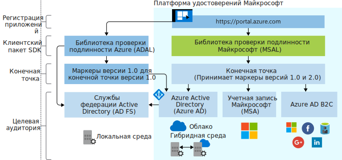

# Развитие платформы удостоверений Майкрософт

Платформа удостоверений Майкрософт — это решение на основе платформы для разработчиков Azure Active Directory (Azure AD). С ее помощью разработчики могут создавать приложения, которые обеспечивают вход пользователей в систему и получение маркеров для вызова таких API, как Microsoft Graph, или других программных интерфейсов, созданных разработчиками. Она включает в себя службу аутентификации, библиотеки с открытым кодом, механизмы регистрации и настройки приложений (через портал разработчиков и API приложения), полную документацию по разработке, примеры для быстрого запуска, примеры кода, учебники, руководства и другое содержимое, предназначенное для разработчиков. Платформа удостоверений Майкрософт поддерживает стандартные отраслевые протоколы, такие как OAuth 2.0 и OpenID Connect.

До сих пор большинство разработчиков использовали платформу Azure AD версии 1.0 для проверки подлинности рабочих и учебных учетных записей (подготовленных в Azure AD), запрашивая маркеры из конечной точки Azure AD версии 1.0 с помощью библиотеки аутентификации Azure AD (ADAL), используя портал Azure для регистрации и настройки приложения, а также API Graph Azure AD для программной конфигурации приложений.

Платформа удостоверений Майкрософт (версии 2.0) поможет вам охватить следующих пользователей:

- пользователи с рабочими и учебными учетными записями (учетные записи, подготовленные в Azure AD);
- пользователи с личными учетными записями (например, Outlook.com или Hotmail.com);
- клиенты, которые используют собственные адреса электронной почты или удостоверения социальных сетей (например, LinkedIn, Facebook, Google) через предложение Azure AD B2C.

С помощью единой платформы удостоверений Майкрософт вы можете написать один сегмент кода и выполнить аутентификацию любого удостоверения Майкрософт в своем приложении. Для нескольких платформ доступна полностью поддерживаемая библиотека с открытым исходным кодом, которая называется библиотекой аутентификации (MSAL). Библиотека MSAL проста в использовании. Она предоставляет отличные возможности единого входа (SSO) для ваших пользователей и обеспечивает высокий уровень надежности и производительности. Ее разработано с применением жизненного цикла разработки безопасного ПО Microsoft (SDL). При вызове API вы можете настроить свое приложение на применение добавочного согласия, которое позволяет отложить запрос согласия для более агрессивных областей, пока приложение не будет гарантировать использование таких областей во время выполнения.

Вы можете зарегистрировать и настроить свое приложение на портале Azure, а также использовать API Microsoft Graph для программной конфигурации приложения.

Обновляйте свое приложение в удобном для вас темпе. Приложения, созданные с использованием библиотек ADAL, все еще поддерживаются. Кроме того, поддерживаются смешанные портфели приложений, которые состоят из приложений, созданных с использованием ADAL, и приложений, созданных с использованием библиотек MSAL. Это означает, что приложения, использующие последнюю версию ADAL и последнюю версию MSAL, будут обеспечивать единый вход благодаря общему для этих библиотек кэшу маркеров. Приложения, обновленные с ADAL до MSAL, будут поддерживать состояние входа пользователя в систему после обновления.

## Работа с платформой удостоверений Майкрософт

На следующей схеме показана общая процедура идентификации Майкрософт, включая процесс регистрации приложений, пакеты SDK, конечные точки и поддерживаемые удостоверения.

### Процесс регистрации приложения

Процесс **[регистрации приложений](https://go.microsoft.com/fwlink/?linkid=2083908)** на портале Azure — это единый процесс для управления всеми приложениями, которые вы интегрировали с платформой удостоверений Майкрософт. Если вы выполняли процесс регистрации на портале регистрации приложений, используйте вместо него портал Azure для этой операции.

Для интеграции с Azure AD B2C (при аутентификации социальных или локальных удостоверений) вам необходимо зарегистрировать свое приложение в клиенте B2C. Этот процесс также выполняется на портале Azure.

**API приложения в Microsoft Graph** в настоящее время находится в режиме предварительной версии. С помощью этого API можно программно настраивать приложения, интегрированные с платформой удостоверений Майкрософт, для аутентификации любого удостоверения Майкрософт. Однако до тех пор, пока этот API не станет общедоступным, нужно использовать API Azure AD Graph версии 1.6 и манифест приложения.

### Библиотеки MSAL

С помощью библиотеки MSAL вы можете создавать приложения, которые выполняют аутентификацию всех удостоверений Майкрософт. Библиотеки MSAL на .NET и JavaScript являются общедоступными. Библиотеки MSAL для iOS и Android находятся в режиме предварительной версии. Их можно использовать в рабочей среде. Мы предоставляем для предварительной версии библиотек MSAL тот же уровень поддержки, что и для общедоступных версий MSAL и ADAL.

Вы также можете использовать библиотеки MSAL для интеграции приложения с Azure AD B2C.

Серверные библиотеки для создания веб-приложений и веб-API общедоступны: [ASP.NET](https://docs.microsoft.com/aspnet/overview) и [ASP.NET Core](https://docs.microsoft.com/aspnet/core/?view=aspnetcore-2.2).

### Конечная точка платформы удостоверений Майкрософт

Конечная точка платформы удостоверений Майкрософт (версии 2.0) теперь получила сертификат OIDC. Ее можно использовать с библиотеками аутентификации Майкрософт (MSAL) или любой другой библиотекой, соответствующей стандартам. Она реализует доступные для чтения области в соответствии с отраслевыми стандартами.

## Дополнительная информация

Узнайте больше о версиях 1.0 и 2.0.

* [Общие сведения о платформе удостоверений Майкрософт версии 2.0](v2-overview.md)
* [Общие сведения об Azure Active Directory (версии 1.0) для разработчиков](v1-overview.md)
