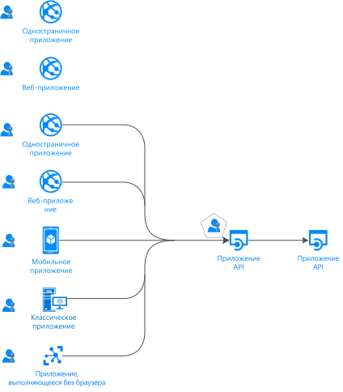
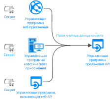
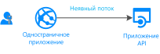
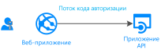
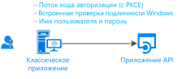
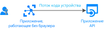
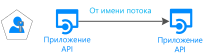

# Потоки проверки подлинности и сценарии приложений

Конечная точка платформы удостоверений Майкрософт (версии 2.0) поддерживает проверку подлинности для различных современных архитектур приложений, которые основаны на стандартном отраслевом протоколе [OAuth 2.0 или OpenID Connect](active-directory-v2-protocols.md).  С помощью [библиотек проверки подлинности](reference-v2-libraries.md) приложения выполняют проверку подлинности удостоверений и получают маркеры для доступа к защищенным интерфейсам API. В этой статье описываются различные потоки проверки подлинности и сценарии приложений, в которых они используются.  В этой статье также приведены списки [сценариев приложений и поддерживаемых потоков проверки подлинности](#scenarios-and-supported-authentication-flows), а также [сценарии приложений, поддерживаемые платформы и языки](#scenarios-and-supported-platforms-and-languages).

## Категории приложений

Маркеры можно получить из приложений нескольких типов: веб-приложения, мобильные или классические приложения, веб-API и приложения, работающие на устройствах без браузера (или iOT). Приложения можно классифицировать по следующим категориям:

- [Защищенные ресурсы и клиентские приложения](#protected-resources-vs-client-applications). Некоторые сценарии относятся к защите ресурсов (веб-приложения или веб-API), а другие — к получению маркера безопасности для вызова защищенного веб-API.
- [С пользователями или без пользователей](#with-users-or-without-users). В некоторых сценариях предполагается участие вошедшего в систему пользователя, тогда как в других пользователь не участвует (сценарии управляющей программы).
- [Одностраничные приложения, общедоступные клиентские приложения и конфиденциальные клиентские приложения](#single-page-applications-public-client-applications-and-confidential-client-applications). Есть три крупные категории типов приложений. Библиотеки и объекты, используемые для работы с ними, будут отличаться.
- [Аудитория входа](v2-supported-account-types.md#certain-authentication-flows-dont-support-all-the-account-types). Некоторые потоки проверки подлинности недоступны для определенных аудиторий входа. Некоторые потоки доступны только для рабочих или учебных учетных записей, а некоторые — для рабочих или учебных учетных записей и личных учетных записей Майкрософт. Допустимая аудитория зависит от потоков проверки подлинности.
- [Поддерживаемые потоки OAuth 2.0](#scenarios-and-supported-authentication-flows).  Потоки проверки подлинности используются для реализации сценариев приложений, в которых запрашиваются маркеры.  Между сценариями приложений и потоками проверки подлинности не существует сопоставления "один к одному".
- [Поддерживаемые платформы](#scenarios-and-supported-platforms-and-languages). Для каждой платформы доступны не все сценарии приложений.

### Защищенные ресурсы и клиентские приложения

Сценарии проверки подлинности предполагают два действия:

- **Получение маркеров безопасности** для защищенного веб-API. Корпорация Майкрософт рекомендует использовать [библиотеки проверки подлинности](reference-v2-libraries.md#microsoft-supported-client-libraries) для получения маркеров, в частности семейство библиотек проверки подлинности Майкрософт (MSAL).
- **Защита веб-API** (или веб-приложения). Одной из проблем защиты ресурса (веб-приложения или веб-API) является проверка маркера безопасности. На некоторых платформах корпорация Майкрософт предлагает [библиотеки ПО промежуточного слоя](reference-v2-libraries.md#microsoft-supported-server-middleware-libraries).

### С пользователями или без пользователей

Большинство сценариев проверки подлинности получают маркеры от имени **пользователя** (выполнившего вход).

Тем не менее также есть сценарии (управляющие программы), где приложения будут получать маркеры от своего имени (без пользователя).

### Одностраничные приложения, общедоступные клиентские приложения и конфиденциальные клиентские приложения

Маркеры безопасности можно получить из приложений нескольких типов. Приложения, как правило, делятся на три категории:

- **Одностраничные приложения** (SPA) — это форма веб-приложений, в которой маркеры принимаются из приложения, запущенного в браузере (написанном на языке JavaScript или Typescript). Многие современные приложения содержат интерфейсное одностраничное приложение, созданное преимущественно на языке JavaScript. Часто приложение создается с помощью таких платформ, как Angular, React или Vue. MSAL.js — это единственная библиотека проверки подлинности Майкрософт, поддерживающая одностраничные приложения.

- **В общедоступных клиентских приложениях** всегда выполняется вход пользователей. К этим приложениям относятся:
  - классические приложения, вызывающие веб-API от имени выполнившего вход пользователя;
  - мобильные приложения;
  - третья категория приложений, выполняющихся на устройствах без браузера (приложения, не использующие браузер, например в iOT).

  Они представлены классом MSAL с именем [PublicClientApplication](msal-client-applications.md).

- **Конфиденциальные клиентские приложения**:
  - веб-приложения, вызывающие веб-API;
  - веб-API, вызывающие веб-API;
  - управляющие программы (даже если они реализованы как консольная служба, например управляющая программа в Linux, или служба Windows).
 
  Эти типы приложений используют [ConfidentialClientApplication](msal-client-applications.md).

## Сценарии приложений

Конечная точка платформы удостоверений Майкрософт поддерживает проверку подлинности для различных архитектур приложений: одностраничные приложения, веб-приложения, веб-API, мобильные и собственные приложения, а также управляющие программы и приложения на стороне сервера.  Приложения используют различные потоки проверки подлинности для выполнения входа пользователей и получения маркеров для вызова защищенных API.

### Одностраничное приложение

Многие современные веб-приложения создаются в качестве одностраничных клиентских приложений, написанных с использованием JavaScript или платформы SPA, таких как Angular, Vue.js и React.js. Эти приложения работают в веб-браузере и имеют характеристики проверки подлинности, отличные от традиционных серверных веб-приложений. Платформа удостоверений Майкрософт позволяет одностраничным приложениям поддерживать вход пользователей, а также получать токены для доступа к внутренним службам или веб-API.

Дополнительные сведения см. в статье [Одностраничные приложения](scenario-spa-overview.md).

### Выполнение входа пользователя в веб-приложении

Чтобы **защитить веб-приложение** (выполнение входа пользователя), будет использоваться следующее:

- В .NET ASP.NET или ASP.NET Core с ПО промежуточного слоя Open ID Connect ASP.NET. В этом случае защита ресурса включает проверку маркера безопасности, которая выполняется с помощью [расширений IdentityModel для библиотеки .NET](https://github.com/AzureAD/azure-activedirectory-identitymodel-extensions-for-dotnet/wiki), а не библиотек MSAL.

- При разработке на языке Node.js будет использоваться Passport.js.

Дополнительные сведения см. в статье [Веб-приложение, которое поддерживает вход пользователей](scenario-web-app-sign-user-overview.md).

### Веб-приложения, в которые могут входить пользователи и которые могут вызывать веб-API от имени пользователя

В веб-приложении для **вызова веб-API** от имени пользователя нужно использовать MSAL`ConfidentialClientApplication`. Вы будете использовать поток кода авторизации, сохранив полученный маркер в кэше маркеров. Затем контроллер будет автоматически получать токены из кэша при необходимости. MSAL обновляет маркер, если это необходимо.

Дополнительные сведения см. в статье [Веб-приложение, вызывающее веб-API](scenario-web-app-call-api-overview.md).

### Классическое приложение, вызывающее веб-API от имени выполнившего вход пользователя

Чтобы вызвать веб-API из классического приложения, которое поддерживает вход пользователей, нужно использовать интерактивные методы получения маркера PublicClientApplication MSAL. Эти интерактивные методы позволяют управлять пользовательским интерфейсом входа в систему. Чтобы реализовать это взаимодействие, MSAL использует веб-браузер.

Для размещенных в Windows приложений, работающих на компьютерах, присоединенных к домену Windows или к присоединенных к AAD, есть другая возможность. Эти приложения могут получать маркер автоматически, используя [встроенную проверку подлинности Windows](https://aka.ms/msal-net-iwa).

Приложения, выполняющиеся на устройстве без браузера, по-прежнему смогут вызывать API от имени пользователя. Для проверки подлинности пользователю потребуется войти на другое устройство с веб-браузером. Чтобы реализовать этот сценарий, необходимо использовать [поток кода устройства](https://aka.ms/msal-net-device-code-flow).

Наконец, хотя это и не рекомендуется, вы можете использовать [имя пользователя и пароль](https://aka.ms/msal-net-up) в общедоступных клиентских приложениях. Этот поток по-прежнему необходим в некоторых сценариях (например, DevOps), но следует помнить, что его использование накладывает ограничения на приложение. Например, приложения, использующие этот поток, не смогут выполнить вход пользователя, которому необходимо выполнить многофакторную проверку подлинности (условный доступ). Это не позволит вашему приложению воспользоваться преимуществами единого входа. Аутентификация с помощью имени пользователя/пароля также противоречит принципам современной проверки подлинности и предоставляется только для прежних версий.

Если в классических приложениях кэш маркеров должен быть постоянным, необходимо [настроить сериализацию кэша маркеров](https://aka.ms/msal-net-token-cache-serialization). Вы можете даже включить обратную и прямую совместимость кэшей маркеров с библиотеками проверки подлинности предыдущих поколений (ADAL.NET 3. x и 4. x), реализовав [сериализацию сдвоенного кэша маркеров](https://aka.ms/msal-net-dual-cache-serialization).

Дополнительные сведения см. в статье [Классическое приложение, вызывающее веб-API](scenario-desktop-overview.md).

### Мобильное приложение, вызывающее веб-API от имени пользователя, вошедшего в систему в интерактивном режиме

Как и в классических приложениях, для получения маркера для вызова веб-API мобильное приложение будет использовать интерактивные методы получения маркера PublicClientApplication MSAL, чтобы получить токен для вызова веб-API.

MSAL iOS и MSAL Android по умолчанию используют системный веб-браузер. Однако вы также можете настроить использование встроенного веб-представления. В зависимости от мобильной платформы существуют определенные особенности: (UWP, iOS, Android).

В некоторых сценариях, включающих условный доступ, связанный с идентификатором устройства или зарегистрированным устройством требуется установить [брокер](https://github.com/AzureAD/azure-activedirectory-library-for-dotnet/wiki/leveraging-brokers-on-Android-and-iOS) на устройстве. К примерам брокеров относятся корпоративный портал Майкрософт (на Android), Microsoft Authenticator (Android и iOS). MSAL теперь может взаимодействовать с брокерами.

> [!NOTE]
> К вашему мобильному приложению (с помощью MSAL.iOS, MSAL.Android или MSAL.NET/Xamarin) могут применяться политики защиты приложений (например, предотвращение копирования какого-либо защищенного текста пользователем). Этим [управляет служба Intune](https://docs.microsoft.com/intune/app-sdk), и такое приложение распознается службой Intune как управляемое приложение. [Пакет SDK для Intune](https://docs.microsoft.com/intune/app-sdk-get-started) отделен от библиотек MSAL и взаимодействует с AAD самостоятельно.

Дополнительные сведения см. в статье [Мобильное приложение, вызывающее веб-API](scenario-mobile-overview.md).

### Защищенный веб-API

Конечную точку платформы удостоверений Майкрософт можно использовать для защиты веб-служб, таких как веб-API REST. Защищенный веб-API вызывается с помощью маркера доступа для защиты своих данных и проверки подлинности входящих запросов. Объект, вызывающий веб-API, добавляет маркер доступа в начале заголовка авторизации HTTP-запроса. Если вы хотите защитить веб-API ASP.NET или ASP.NET Core, необходимо проверить маркер доступа. Для этого вы будете использовать ПО промежуточного слоя JWT ASP.NET. В этом случае проверка выполняется с помощью [расширений IdentityModel для библиотеки .NET](https://github.com/AzureAD/azure-activedirectory-identitymodel-extensions-for-dotnet/wiki), а не MSAL.NET.

Дополнительные сведения см. в статье [Защищенный веб-API](scenario-protected-web-api-overview.md).

### Веб-API, вызывающий другой подчиненный веб-API от имени пользователя, для которого он вызывался

Более того, если вы хотите, чтобы ваш защищенный веб-API ASP.NET или ASP.NET Core вызывал другой веб-API от имени пользователя, приложению потребуется получить маркер для подчиненного веб-API, используя метод ConfidentialClientApplication, получающий маркер [от имени пользователя](https://aka.ms/msal-net-on-behalf-of). Это также называется вызовами между службами.
Веб-API, вызывающие другие веб-API, также должны предоставлять настраиваемую сериализацию кэша.

  

Дополнительные сведения см. в статье [Веб-API, вызывающее веб-API](scenario-web-api-call-api-overview.md).

### Классическое приложение или служба или веб-приложение управляющей программы, вызывающее веб-API без пользователя (в собственном имени)

Приложениям, использующим долговременные процессы или работающим без взаимодействия с пользователем, также нужна возможность доступа к защищенным веб-API. Такие приложения могут выполнять проверку подлинности и получать маркеры, используя удостоверение приложения (а не делегированное удостоверение пользователя). Они могут подтвердить свое удостоверение с помощью секрета или сертификата клиента.
Вы можете написать такие приложения (управляющую программу), получающие маркер для приложения с помощью методов получения [учетных данных клиента](https://aka.ms/msal-net-client-credentials) ConfidentialClientApplication MSAL. Предполагается, что приложение ранее зарегистрировало секрет (пароль приложения или сертификат или утверждение клиента) с помощью Azure AD, который затем совместно используется с этим вызовом.

Дополнительные сведения см. в статье [Приложение управляющей программы, вызывающее веб-API](scenario-daemon-overview.md).

## Сценарии и поддерживаемые потоки проверки подлинности

Сценарии с использованием получения маркеров также сопоставляются с потоками проверки подлинности OAuth 2.0, описанными в [протоколах платформы удостоверений Майкрософт](active-directory-v2-protocols.md).

|Сценарий | Подробный пример сценария | Поток/предоставление разрешения OAuth 2.0 | Аудитория |
|--|--|--|--|
|  | [Одностраничное приложение](scenario-spa-overview.md) | [Неявный](v2-oauth2-implicit-grant-flow.md) | Рабочие или учебные учетные записи и личные учетные записи, B2C
|  | [Веб-приложение, которое поддерживает вход пользователей](scenario-web-app-sign-user-overview.md) | [Код авторизации](v2-oauth2-auth-code-flow.md) | Рабочие или учебные учетные записи и личные учетные записи, B2C |
|  | [Веб-приложение, которое вызывает веб-API](scenario-web-app-call-api-overview.md) | [Код авторизации](v2-oauth2-auth-code-flow.md) | Рабочие или учебные учетные записи и личные учетные записи, B2C |
|  | [Классическое приложение, которое вызывает веб-API](scenario-desktop-overview.md)| Интерактивный ([код авторизации](v2-oauth2-auth-code-flow.md) с PKCE) | Рабочие или учебные учетные записи и личные учетные записи, B2C |
| | | Встроенная Windows | Рабочие или учебные учетные записи |
| | | [Пароль владельца ресурса](v2-oauth-ropc.md)  | Рабочие или учебные учетные записи, B2C |
| | [Классическое приложение, которое вызывает веб-API](scenario-desktop-overview.md) | [Код устройства](v2-oauth2-device-code.md)  | Рабочие или учебные учетные записи* |
|  | [Мобильное приложение, которое вызывает веб-API](scenario-mobile-overview.md) | Интерактивный ([код авторизации](v2-oauth2-auth-code-flow.md) с PKCE)  |   Рабочие или учебные учетные записи и личные учетные записи, B2C
| | | Пароль владельца ресурса  | Рабочие или учебные учетные записи, B2C |
|  | [Управляющая программа](scenario-daemon-overview.md) | [Учетные данные клиента](v2-oauth2-client-creds-grant-flow.md)  |   Разрешения только для приложения (без пользователя) только в организациях AAD
|  | [Веб-API, которые вызывают веб-API](scenario-web-api-call-api-overview.md)| [От имени](v2-oauth2-on-behalf-of-flow.md) | Рабочие или учебные учетные записи и личные учетные записи |

## Сценарии, поддерживаемые платформы и языки

Не все типы приложений доступны на каждой платформе. Для создания приложений также можно использовать различные языки. Библиотеки проверки подлинности Майкрософт поддерживают ряд **платформ** (JavaScript, .NET Framework, .NET Core, Windows 10 или UWP, Xamarin.iOS, Xamarin.Android, собственная платформа iOS, собственная платформа Android, Java, Python).

|Сценарий  | Windows | Linux | Mac | iOS | Android
|--|--|--|--|--|--|--|
| [Одностраничное приложение](scenario-spa-overview.md)   |  MSAL.js |  MSAL.js |  MSAL.js |  MSAL.js |  MSAL.js
| [Веб-приложение, которое поддерживает вход пользователей](scenario-web-app-sign-user-overview.md)   |   ASP.NET ASP.NET Core | ASP.NET Core | ASP.NET Core
| [Веб-приложение, которое вызывает веб-API](scenario-web-app-call-api-overview.md)    |    ASP.NET + MSAL.NET   ASP.NET Core + MSAL.NET  msal4j  Flask + MSAL Python| ASP.NET Core + MSAL.NET  msal4j  Flask + MSAL Python| ASP.NET Core + MSAL.NET  msal4j  Flask + MSAL Python
| [Классическое приложение, которое вызывает веб-API](scenario-desktop-overview.md)     |   MSAL.NET  MSAL.NET  msal4j  MSAL Python| MSAL.NET  msal4j  MSAL Python|  MSAL.NET  msal4j  MSAL Python
| [Мобильное приложение, которое вызывает веб-API](scenario-mobile-overview.md)    |  MSAL.NET  MSAL.NET | | |  MSAL.iOS |  MSAL.Android
| [Управляющая программа](scenario-daemon-overview.md)    |  MSAL.NET MSAL.NET  msal4j  MSAL Python|  MSAL.NET  msal4j  MSAL Python| MSAL.NET  msal4j  MSAL Python
| [Веб-API, которые вызывают веб-API](scenario-web-api-call-api-overview.md)    |  MSAL.NET MSAL.NET  msal4j  MSAL Python|  MSAL.NET  msal4j  MSAL Python| MSAL.NET  msal4j  MSAL Python

См.также [Библиотеки, поддерживаемые корпорацией Майкрософт, по ОС/языку](reference-v2-libraries.md#microsoft-supported-libraries-by-os--language)

## Дополнительная информация
Ознакомьтесь с [основными понятиями о проверке подлинности](authentication-scenarios.md) и [маркерах доступа](access-tokens.md).
