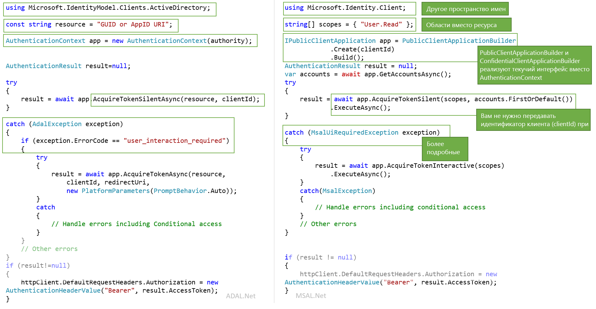

# <a name="migrating-applications-to-msalnet"></a>Перенос приложений на MSAL.NET

Как MSAL.NET, так и ADAL.NET используются для аутентификации сущностей Azure AD и маркеров запроса из Azure AD. До настоящего времени большинство разработчиков использовали для аутентификации удостоверений Azure AD (рабочих и учебных учетных записей) платформу Azure AD для разработчиков (версия 1.0), запрашивая маркеры через библиотеку аутентификации Azure AD (ADAL). Теперь с помощью MSAL.NET вы можете выполнять аутентификацию для более широкого набора удостоверений Майкрософт (удостоверения Azure AD, учетные записи Майкрософт и социальных сетей, а также локальные учетные записи в сочетании с Azure AD B2C) через конечную точку платформы удостоверений Майкрософт. 

Эта статья описывает алгоритм выбора между библиотекой аутентификации Майкрософт для .NET (MSAL.NET) и библиотекой аутентификации Azure AD для .NET (ADAL.NET), а также дает их сравнительный анализ.  

## <a name="differences-between-adal-and-msal-apps"></a>Различия между приложениями ADAL и MSAL
В большинстве случаев рекомендуется использовать MSAL.NET и конечную точку платформы удостоверений Майкрософт, так как это последнее поколение библиотек аутентификации Майкрософт. Используя MSAL.NET, вы получаете маркеры для пользователей, входящих в приложение с учетной записью Azure AD (рабочей или учебной), учетной записью Майкрософт (личной MSA) или через Azure AD B2C. 

Если вы уже знакомы с конечной точкой Azure AD для разработчиков (версия 1.0) и библиотекой ADAL.NET, ознакомьтесь со статьей [об отличиях платформы удостоверений Майкрософт версии 2.0](active-directory-v2-compare.md).

Но ADAL.NET пока остается обязательной для тех случаев, когда приложению нужно обрабатывать вход пользователей из более ранних версий [служб федерации Active Directory (ADFS)](/windows-server/identity/active-directory-federation-services). Подробные сведения см. в статье о [поддержке ADFS](https://aka.ms/msal-net-adfs-support).

На следующем рисунке приведены некоторые различия между ADAL.NET и MSAL.NET: 

### <a name="nuget-packages-and-namespaces"></a>Пакеты NuGet и пространства имен

Библиотека ADAL.NET предоставляется в составе пакета NuGet [Microsoft.IdentityModel.Clients.ActiveDirectory](https://www.nuget.org/packages/Microsoft.IdentityModel.Clients.ActiveDirectory). Для нее нужно использовать пространство имен `Microsoft.IdentityModel.Clients.ActiveDirectory`.

Чтобы использовать MSAL.NET, следует добавить пакет NuGet [Microsoft.Identity.Client](https://www.nuget.org/packages/Microsoft.Identity.Client) и задействовать пространство имен `Microsoft.Identity.Client`.

### <a name="scopes-not-resources"></a>Области вместо ресурсов

ADAL.NET получает маркеры для *ресурсов*, а MSAL.NET — для *областей*. Для нескольких переопределений AcquireToken в MSAL.NET требуется параметр с именем scopes(`IEnumerable<string> scopes`). Этот параметр представляет собой простой список строк, которые объявляют нужные разрешения и запрашиваемые ресурсы. Например, часто используются [области Microsoft Graph](/graph/permissions-reference).

Из MSAL также можно получить доступ к ресурсам версии 1.0. Подробнее об этом см. в разделе [Области для веб-API, которые принимают маркеры версии 1.0](#scopes-for-a-web-api-accepting-v10-tokens). 

### <a name="core-classes"></a>Основные классы

- ADAL.NET использует [AuthenticationContext](https://github.com/AzureAD/azure-activedirectory-library-for-dotnet/wiki/AuthenticationContext:-the-connection-to-Azure-AD) для представления подключения к службе токенов безопасности (STS) или серверу авторизации с помощью объекта Authority. Библиотека MSAL.NET, в свою очередь, основана на концепции [клиентских приложений](https://github.com/AzureAD/microsoft-authentication-library-for-dotnet/wiki/Client-Applications). Она предоставляет два отдельных класса: `PublicClientApplication` и `ConfidentialClientApplication`.

- Получение токенов. ADAL.NET и MSAL.NET поддерживают одинаковые вызовы для аутентификации (`AcquireTokenAsync` и `AcquireTokenSilentAsync` для ADAL.NET, `AcquireTokenInteractive` и `AcquireTokenSilent` в MSAL.NET), но с разными обязательными параметрами. В числе отличий важно отметить, что в MSAL.NET уже не нужно передавать в приложение `ClientID` при каждом вызове AcquireTokenXX. Теперь `ClientID` задается только один раз при создании `IPublicClientApplication` или `IConfidentialClientApplication`.

### <a name="iaccount-not-iuser"></a>IAccount вместо IUser

ADAL.NET управляет пользователями. Пользователем считается конкретный человек или агент программного обеспечения, но любому из них могут принадлежать одна или несколько учетных записей в системе идентификации Майкрософт (несколько учетных записей Azure AD, Azure AD B2C, личных учетных записей Майкрософт). 

В MSAL.NET 2.x определена концепция учетной записи (через интерфейс IAccount). Это важное изменение предоставляет правильную семантику, то есть отражает возможность использования одним пользователем нескольких учетных записей в разных каталогах AAD. Также MSAL.NET предоставляет более подробные сведения в сценариях гостевого входа, в частности сведения о домашней учетной записи.

Дополнительные сведения о различиях между IUser и IAccount см. в описании [MSAL.NET 2.x](https://aka.ms/msal-net-2-released).

### <a name="exceptions"></a>Исключения

#### <a name="interaction-required-exceptions"></a>Взаимодействия требовали исключений

MSAL.NET более явно использует исключения. Например, при сбое автоматической аутентификации в ADAL процедура должна перехватывать исключение и выполнять поиск кода ошибки `user_interaction_required`:

```csharp
catch(AdalException exception)
{
 if (exception.ErrorCode == “user_interaction_required”)
 {
  try
  {“try to authenticate interactively”}}
 }
}
```

Подробнее см. в описании [рекомендуемого метода получения маркера](https://github.com/AzureAD/azure-activedirectory-library-for-dotnet/wiki/AcquireTokenSilentAsync-using-a-cached-token#recommended-pattern-to-acquire-a-token) для ADAL.NET.

При работе с MSAL.NET следует перехватывать исключение `MsalUiRequiredException`, как описано в разделе [AcquireTokenSilent](https://github.com/AzureAD/microsoft-authentication-library-for-dotnet/wiki/AcquireTokenSilentAsync-using-a-cached-token).

```csharp
catch(MsalUiRequiredException exception)
{
 try {“try to authenticate interactively”}
}
```

#### <a name="handling-claim-challenge-exceptions"></a>Обработка исключений по запросу утверждений

В ADAL.NET исключения по запросу утверждений обрабатываются следующим образом:

- Исключение `AdalClaimChallengeException`, производное от `AdalServiceException`, генерируется службой в том случае, если ресурсу нужны дополнительные утверждения от пользователя (например, двухфакторная аутентификация). Член `Claims` содержит некоторый фрагмент JSON с ожидаемыми утверждениями.
- Работающее с ADAL.NET общедоступное клиентское приложение, которое получит такое исключение, должно вызывать переопределение `AcquireTokenInteractive` с параметром утверждения. Это переопределение `AcquireTokenInteractive` никогда не обращается к кэшу, так как в этом нет необходимости. Дело в том, что маркер в кэше наверняка не имеет правильных утверждений (иначе не возникло бы исключение `AdalClaimChallengeException`). Это означает, что проверять кэш не нужно. Обратите внимание, что `ClaimChallengeException` может возникать в веб-API, в котором выполняется поток OBO, и в этом случае следует вызвать `AcquireTokenInteractive` из общедоступного клиентского приложения, которое обращалось к этому веб-API.
- Дополнительные сведения и примеры вы найдете в разделе [об обработке исключения AdalClaimChallengeException](https://github.com/AzureAD/azure-activedirectory-library-for-dotnet/wiki/Exceptions-in-ADAL.NET#handling-adalclaimchallengeexception).

В MSAL.NET исключения по запросу утверждений обрабатываются следующим образом:

- Запросы `Claims` создаются в исключении `MsalServiceException`.
- Существует метод `.WithClaim(claims)`, который можно применить к построителю `AcquireTokenInteractive`. 

### <a name="supported-grants"></a>Поддерживаемые предоставляемые разрешения

MSAL.NET и конечная точка версии 2.0 пока поддерживают не все предоставляемые разрешения. Ниже приведена сводка со сравнением предоставляемых разрешений, которые поддерживаются в ADAL.NET и MSAL.NET.

#### <a name="public-client-applications"></a>Общедоступные клиентские приложения

Следующие предоставляемые разрешения поддерживаются в ADAL.NET и MSAL.NET для классических и мобильных приложений.

Предоставление доступа | ADAL.NET | MSAL.NET
----- |----- | -----
Interactive | [Интерактивная аутентификация](https://github.com/AzureAD/azure-activedirectory-library-for-dotnet/wiki/Acquiring-tokens-interactively---Public-client-application-flows) | [Получение маркеров в интерактивном режиме через MSAL.NET](https://github.com/AzureAD/microsoft-authentication-library-for-dotnet/wiki/Acquiring-tokens-interactively)
Встроенная проверка подлинности Windows | [Встроенная аутентификация Windows (Kerberos)](https://github.com/AzureAD/azure-activedirectory-library-for-dotnet/wiki/AcquireTokenSilentAsync-using-Integrated-authentication-on-Windows-(Kerberos)) | [Встроенная аутентификация Windows](msal-authentication-flows.md#integrated-windows-authentication)
Имя пользователя и пароль | [Получение маркеров с использованием имени пользователя и пароля](https://github.com/AzureAD/azure-activedirectory-library-for-dotnet/wiki/Acquiring-tokens-with-username-and-password)| [Аутентификация по имени пользователя и паролю](msal-authentication-flows.md#usernamepassword)
Поток кода устройства | [Профиль устройства для устройств без веб-браузеров](https://github.com/AzureAD/azure-activedirectory-library-for-dotnet/wiki/Device-profile-for-devices-without-web-browsers) | [Поток кода на устройстве](msal-authentication-flows.md#device-code)

#### <a name="confidential-client-applications"></a>Конфиденциальные клиентские приложения

Следующие предоставляемые разрешения поддерживаются в ADAL.NET и MSAL.NET для веб-приложений, веб-API и управляющих программ.

Тип приложения | Предоставление доступа | ADAL.NET | MSAL.NET
----- | ----- | ----- | -----
Веб-приложение, веб-API, управляющая программа | Учетные данные клиента | [Потоки учетных данных клиента в ADAL.NET](https://github.com/AzureAD/azure-activedirectory-library-for-dotnet/wiki/Client-credential-flows) | [Потоки учетных данных клиента в MSAL.NET](msal-authentication-flows.md#client-credentials)
Веб-API | От имени | [Вызовы между службами от имени пользователя через ADAL.NET](https://github.com/AzureAD/azure-activedirectory-library-for-dotnet/wiki/Service-to-service-calls-on-behalf-of-the-user) | [Вызов от имени через MSAL.NET](msal-authentication-flows.md#on-behalf-of)
Веб-приложение | Код аутентификации | [Получение маркеров с помощью кодов авторизации в веб-приложениях через ADAL.NET](https://github.com/AzureAD/azure-activedirectory-library-for-dotnet/wiki/Acquiring-tokens-with-authorization-codes-on-web-apps) | [Получение маркеров с помощью кодов авторизации в веб-приложениях через MSAL.NET](msal-authentication-flows.md#authorization-code)

### <a name="cache-persistence"></a>Сохраняемость кэша

ADAL.NET позволяет расширить класс `TokenCache`, чтобы реализовать нужные функции сохраняемости на платформах без защищенного хранилища (.NET Framework и .NET core) с помощью методов `BeforeAccess` и `BeforeWrite`. Дополнительные сведения см. в разделе [о сериализации кэша маркеров в ADAL.NET](https://github.com/AzureAD/azure-activedirectory-library-for-dotnet/wiki/Token-cache-serialization).

MSAL.NET предоставляет кэш маркеров в закрытом классе, то есть не позволяет расширить его. Это означает, что сохраняемость кэша маркеров следует реализовать в виде вспомогательного класса, который взаимодействует с закрытым кэшем маркеров. Такое взаимодействие описано в разделе [о сериализации кэша маркеров MSAL.NET](https://github.com/AzureAD/microsoft-authentication-library-for-dotnet/wiki/token-cache-serialization).

## <a name="signification-of-the-common-authority"></a>Обозначение единого центра

Если вы используете центр https://login.microsoftonline.com/common в версии 1.0, пользователи могут входить с любой учетной записью AAD (любой организации). Подробнее см. в статье [о проверке в ADAL.NET](https://github.com/AzureAD/azure-activedirectory-library-for-dotnet/wiki/AuthenticationContext:-the-connection-to-Azure-AD#authority-validation).

Если вы используете центр https://login.microsoftonline.com/common в версии 2.0, пользователи смогут входить с любой корпоративной (AAD) или личной учетной записью Майкрософт (MSA). Если при использовании MSAL.NET вы хотите ограничить вход только учетными записями AAD (поведение, аналогичное ADAL.NET), необходимо использовать https://login.microsoftonline.com/organizations. Дополнительные сведения см. в описании параметра `authority` в статье об [общедоступном клиентском приложении](https://github.com/AzureAD/microsoft-authentication-library-for-dotnet/wiki/Client-Applications#publicclientapplication).

## <a name="v10-and-v20-tokens"></a>Маркеры версии 1.0 и версии 2.0

Существуют две версии маркеров:
- маркеры версии 1.0;
- маркеры версии 2.0. 

Конечная точка версии 1.0 (используется в ADAL) выдает только маркеры версии 1.0.

Но конечная точка версии 2.0 (используется в MSAL) умеет выдавать маркеры любой версии, которую принимает веб-API. В манифесте приложения веб-API доступно свойство, которое позволяет разработчикам выбрать допустимую версию маркера. См. описание `accessTokenAcceptedVersion` в справочной документации [о манифесте приложения](reference-app-manifest.md).

Дополнительные сведения о маркерах версий 1.0 и 2.0 см. в статье [Microsoft identity platform access tokens](access-tokens.md) (Маркеры доступа к платформе удостоверений Майкрософт).

## <a name="scopes-for-a-web-api-accepting-v10-tokens"></a>Области для веб-API, которые принимают маркеры версии 1.0

Разрешения OAuth2 задаются для областей разрешений, которые веб-API (ресурс) версии 1.0 предоставляет клиентским приложениям. Эти области действия разрешений могут быть назначены клиентским приложениям во время предоставления согласия. См. раздел об oauth2Permissions в документации по [манифесту приложения Azure Active Directory](active-directory-application-manifest.md).

### <a name="scopes-to-request-access-to-specific-oauth2-permissions-of-a-v10-application"></a>Области для запроса доступа к конкретным разрешениям OAuth2 в приложении версии 1.0

Если вы хотите получать маркеры для конкретной области приложения версии 1.0 (например, для AAD Graph, то есть https://graph.windows.net) , вам необходимо создать `scopes` путем объединения идентификатора требуемого ресурса с нужным разрешением OAuth2 для этого ресурса.

Например, для доступа к имени пользователя в веб-API версии 1.0 с URI приложения `ResourceId` следует указать следующее:

```csharp
var scopes = new [] {  ResourceId+"/user_impersonation"};
```

Если вам нужны права чтения и записи для MSAL.NET Azure Active Directory через API AAD Graph (https://graph.windows.net/) , следует создать список областей, как в следующем фрагменте кода:

```csharp
ResourceId = "https://graph.windows.net/";
var scopes = new [] { ResourceId + “Directory.Read”, ResourceID + “Directory.Write”}
```

#### <a name="warning-should-you-have-one-or-two-slashes-in-the-scope-corresponding-to-a-v10-web-api"></a>Предупреждение. Использование одной или двух косых черт в области, которая соответствует веб-API версии 1.0

Если вам нужны права записи в область, соответствующую API Azure Resource Manager (https://management.core.windows.net/) , вам следует запросить следующую область (обратите внимание на две косые черты). 

```csharp
var scopes = new[] {"https://management.core.windows.net//user_impersonation"};
var result = await app.AcquireTokenInteractive(scopes).ExecuteAsync();

// then call the API: https://management.azure.com/subscriptions?api-version=2016-09-01
```

Это связано с тем, что API Resource Manager ожидает получить косую черту в утверждении audience (`aud`), а вторая косая черта отделяет имя API от области действия.

Azure AD использует следующую логику:
- Для конечной точки ADAL (версия 1.0) с маркером доступа версии 1.0 (единственный поддерживаемый вариант) aud=resource.
- Для конечной точки MSAL (версии 2.0), которая запрашивает маркер доступа для ресурса, принимающего маркеры версии 2.0, aud=resource.AppId.
- Для конечной точки MSAL (версии 2.0), которая запрашивает маркер доступа для ресурса, принимающего маркеры версии 1.0 (как в примере выше), AAD выполняет синтаксический анализ параметра audience из запрошенной области, используя все символы до последней косой черты в качестве идентификатора ресурса. Поэтому если https:\//database.windows.net ожидает для audience значение "https://database.windows.net/ ", следует запросить область https:\/ /database.windows.net//.default. См. также описание проблемы №[747](https://github.com/AzureAD/microsoft-authentication-library-for-dotnet/issues/747) об отсутствии завершающей косой черты в URL-адресе ресурса, что приводит к сбою аутентификации SQL № 747.


### <a name="scopes-to-request-access-to-all-the-permissions-of-a-v10-application"></a>Области для запроса доступа ко всем разрешениям в приложении версии 1.0

Например, если вы хотите получить маркер для всех статических областей приложения версии 1.0, необходимо использовать

```csharp
ResourceId = "someAppIDURI";
var scopes = new [] {  ResourceId+"/.default"};
```

### <a name="scopes-to-request-in-the-case-of-client-credential-flow--daemon-app"></a>Области для запроса при использовании клиентского потока учетных данных или управляющей программы

Если используется клиентский поток учетных данных, следует передать область `/.default`. Для AAD это означает "все разрешения на уровне приложения, которые администратор согласился предоставлять при регистрации приложения".

## <a name="adal-to-msal-migration"></a>Переход с ADAL на MSAL

В ADAL.NET версии 2.X стали доступны маркеры обновления, что позволяет создавать решения на основе таких маркеров, кэшируя их и с помощью методов `AcquireTokenByRefreshToken`, предоставляемых в ADAL 2.x. Такие решения удобны для следующих сценариев:
* Долго выполняющиеся службы, которые выполняют действия (в том числе обновление панелей мониторинга) от имени пользователя, когда пользователь уже закрыл подключение. 
* Предоставление клиенту возможности применить RT для веб-службы в сценарии WebFarm (кэширование выполняется на стороне клиента с использованием зашифрованного файла cookie, а не на стороне сервера).

Но в MSAL.NET это не применяется, так как из соображений безопасности мы не рекомендуем использовать маркеры обновления таким образом. Это затруднит переход на MSAL 3.x, так как API не предоставляет способ для передачи ранее полученных маркеров обновления. 

К счастью, в MSAL.NET теперь доступен API, который позволяет переносить полученные ранее маркеры обновления в `IConfidentialClientApplication`. 

```CSharp
/// <summary>
/// Acquires an access token from an existing refresh token and stores it and the refresh token into 
/// the application user token cache, where it will be available for further AcquireTokenSilent calls.
/// This method can be used in migration to MSAL from ADAL v2 and in various integration 
/// scenarios where you have a RefreshToken available. 
/// (see https://aka.ms/msal-net-migration-adal2-msal2)
/// </summary>
/// <param name="scopes">Scope to request from the token endpoint. 
/// Setting this to null or empty will request an access token, refresh token and ID token with default scopes</param>
/// <param name="refreshToken">The refresh token from ADAL 2.x</param>
IByRefreshToken.AcquireTokenByRefreshToken(IEnumerable<string> scopes, string refreshToken);
```
 
Этот метод позволяет передавать ранее использованный маркер обновления вместе с любым нужными областями (ресурсами). Маркер обновления будет заменен на новый и повторно кэширован в приложении.  

Так как этот метод предназначен для нетипичного сценария, его нельзя использовать для `IConfidentialClientApplication` без предварительного преобразования в `IByRefreshToken`.

Этот фрагмент кода демонстрирует перенос конфиденциального клиентского приложения. `GetCachedRefreshTokenForSignedInUser` получает маркер обновления, сохраненный в хранилище предыдущей версией приложения, которое использовало ADAL 2.x. `GetTokenCacheForSignedInUser` выполняет десериализацию кэша для пользователя, выполнившего вход (в конфиденциальном клиентском приложении обычно создается отдельный кэш для каждого пользователя).

```csharp
TokenCache userCache = GetTokenCacheForSignedInUser();
string rt = GetCachedRefreshTokenForSignedInUser();

IConfidentialClientApplication app;
app = ConfidentialClientApplicationBuilder.Create(clientId)
 .WithAuthority(Authority)
 .WithRedirectUri(RedirectUri)
 .WithClientSecret(ClientSecret)
 .Build();
IByRefreshToken appRt = app as IByRefreshToken;
         
AuthenticationResult result = await appRt.AcquireTokenByRefreshToken(null, rt)
                                         .ExecuteAsync()
                                         .ConfigureAwait(false);
```

Вы увидите, что в AuthenticationResult возвращаются маркер доступа и маркер идентификатора, а новый маркер обновления сохраняется в кэше.

Этот метод можно использовать в разных процессах интеграции, если у вас есть готовый маркер обновления.

## <a name="next-steps"></a>Дополнительная информация

Дополнительные сведения об областях можно найти в статье [Permissions and consent in the Microsoft identity platform endpoint](v2-permissions-and-consent.md) (Разрешения и согласие для конечной точки платформы удостоверений Майкрософт).
