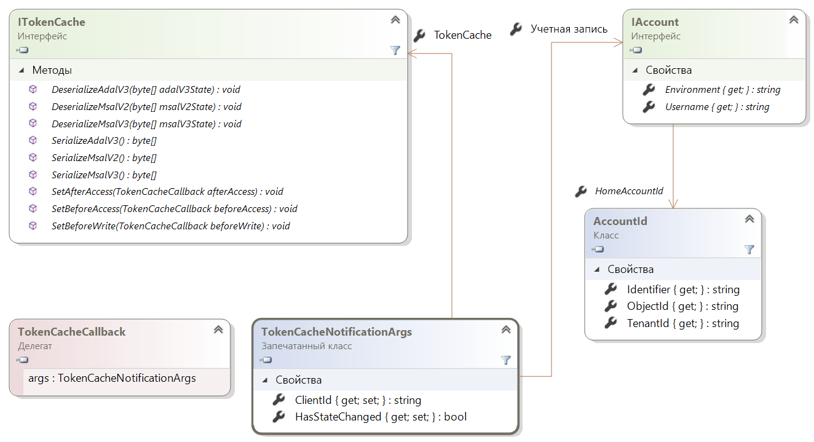
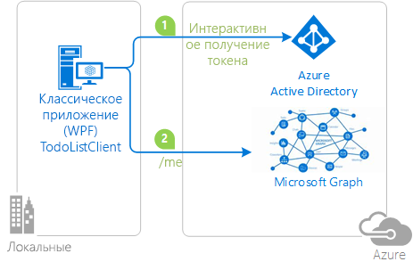

# <a name="token-cache-serialization-in-msalnet"></a>Сериализация кэша маркеров в MSAL.NET
Библиотека аутентификации Майкрософт (MSAL) кэширует каждый [полученный маркер](msal-acquire-cache-tokens.md).  В коде приложения следует сначала попытаться получить маркер из кэша, а лишь затем использовать для этого другие средства.  В этой статье рассматриваются стандартная и пользовательская сериализации для кэша маркеров в MSAL.NET.

Эта статья предназначена для MSAL.NET версии 3.x. Если вас интересует MSAL.NET 2.x, перейдите к статье [о сериализации кэша маркеров в MSAL.NET 2.x](https://github.com/AzureAD/microsoft-authentication-library-for-dotnet/wiki/Token-cache-serialization-2x).

## <a name="default-serialization-for-mobile-platforms"></a>Стандартная сериализация для мобильных платформ

В MSAL.NET по умолчанию предоставляется кэш маркеров в памяти. Сериализация по умолчанию работает на всех платформах, которые предоставляют пользователю безопасное хранилище. Это справедливо для универсальной платформы Windows (UWP), Xamarin.iOS и Xamarin.Android.

> [!Note]
> При переносе проекта Xamarin.Android из MSAL.NET 1.x на MSAL.NET 3.x вы можете добавить в проект параметр `android:allowBackup="false"`, чтобы избежать появления старых кэшированных маркеров при восстановлении из локального хранилища в Visual Studio. См. описание [проблемы № 659](https://github.com/AzureAD/microsoft-authentication-library-for-dotnet/issues/659#issuecomment-436181938).

## <a name="custom-serialization-for-windows-desktop-apps-and-web-appsweb-apis"></a>Пользовательская сериализация для классических приложений Windows, веб-приложений и веб-API

Помните, что пользовательская сериализация не поддерживается на мобильных платформах (UWP, Xamarin.iOS и Xamarin.Android). MSAL уже предоставляет безопасный и эффективный механизм сериализации для этих платформ. Но архитектура классических приложений .NET и приложений .NET Core слишком отличается, и MSAL не позволяет реализовать универсальный механизм сериализации. Например, веб-сайты могут хранить маркеры в кэше Redis, а классические приложения — в зашифрованном файле. Поэтому сериализация в стандартной конфигурации не предоставляется. Чтобы приложение .NET или .NET Core могло использовать постоянный кэш маркеров, необходимо настроить сериализацию.

Для сериализации кэша маркеров используются следующие классы и интерфейсы:

- `ITokenCache` определяет события для подписки на запросы сериализации кэша маркеров, а также методы для сериализации и десериализации кэша в разных форматах (ADAL версии 3.0, MSAL 2.x и MSAL 3.x = ADAL версии 5.0).
- Обратный вызов `TokenCacheCallback` передается событиям, что позволяет обрабатывать операции сериализации. Они будут вызываться с аргументами типа `TokenCacheNotificationArgs`.
- `TokenCacheNotificationArgs` предоставляет только `ClientId` приложения и ссылку на пользователя, для которого доступен маркер.

  

> [!IMPORTANT]
> MSAL.NET создает кэши маркеров и предоставляет кэш `IToken` при вызове свойств `UserTokenCache` и `AppTokenCache` приложения. Вам не нужно самостоятельно реализовать этот интерфейс. При реализации пользовательской сериализации для кэша маркеров в вашу зону ответственности входит следующее:
> - Реагирование на "события" `BeforeAccess` и `AfterAccess` (или их асинхронные версии). Делегат `BeforeAccess` отвечает за десериализацию кэша, а `AfterAccess` выполняет сериализацию кэша.
> - Часть этих событий сохраняют или загружают большие двоичные объекты, которые передаются через аргумент события в нужное хранилище.

Стратегии будут разными в зависимости от того, выполняется ли сериализация кэша маркеров для [общедоступного клиентского приложения](msal-client-applications.md) (классическое приложение) или [конфиденциального клиентского приложения](msal-client-applications.md) (веб-приложение, веб-API, управляющая программа).

### <a name="token-cache-for-a-public-client"></a>Кэш маркеров для общедоступного клиента 

Начиная с версии MSAL.NET 2.x у вас есть несколько способов для сериализации кэша маркеров в общедоступном клиенте. Кэш можно сериализовать только в формат MSAL.NET (единый формат кэша для нескольких версий MSAL и платформ).  Вы можете также поддерживать [устаревшую](https://github.com/AzureAD/azure-activedirectory-library-for-dotnet/wiki/Token-cache-serialization) сериализацию кэша маркеров из ADAL версии 3.

Настройка сериализации кэша маркера для совместного использования состояния единого входа между ADAL.NET 3.x, ADAL.NET 5.x и MSAL.NET описана в одном из разделов следующего примера: [active-directory-dotnet-v1-to-v2](https://github.com/Azure-Samples/active-directory-dotnet-v1-to-v2).

> [!Note]
> Формат кэша маркеров MSAL.NET версии 1.1.4-preview уже не поддерживается в MSAL 2.x. Если у вас есть приложения, которые используют MSAL.NET 1.x, пользователям придется выполнять вход повторно. Кроме того, поддерживается миграция из ADAL 4.x (и версии 3.x).

#### <a name="simple-token-cache-serialization-msal-only"></a>Простая сериализация кэша маркеров (только для MSAL)

Ниже приведен пример основной реализации пользовательской сериализации кэша маркеров для классических приложений. Здесь в качестве кэша для маркеров пользователей применяется файл, расположенный в одной папке с приложением.

После сборки приложения вы можете включить сериализацию, вызвав метод `TokenCacheHelper.EnableSerialization()` и передав ему `UserTokenCache` приложения.

```csharp
app = PublicClientApplicationBuilder.Create(ClientId)
    .Build();
TokenCacheHelper.EnableSerialization(app.UserTokenCache);
```

Вспомогательный класс `TokenCacheHelper` определен следующим образом:

```csharp
static class TokenCacheHelper
 {
  public static void EnableSerialization(ITokenCache tokenCache)
  {
   tokenCache.SetBeforeAccess(BeforeAccessNotification);
   tokenCache.SetAfterAccess(AfterAccessNotification);
  }

  /// <summary>
  /// Path to the token cache
  /// </summary>
  public static readonly string CacheFilePath = System.Reflection.Assembly.GetExecutingAssembly().Location + ".msalcache.bin3";

  private static readonly object FileLock = new object();


  private static void BeforeAccessNotification(TokenCacheNotificationArgs args)
  {
   lock (FileLock)
   {
    args.TokenCache.DeserializeMsalV3(File.Exists(CacheFilePath)
            ? ProtectedData.Unprotect(File.ReadAllBytes(CacheFilePath),
                                      null,
                                      DataProtectionScope.CurrentUser)
            : null);
   }
  }

  private static void AfterAccessNotification(TokenCacheNotificationArgs args)
  {
   // if the access operation resulted in a cache update
   if (args.HasStateChanged)
   {
    lock (FileLock)
    {
     // reflect changesgs in the persistent store
     File.WriteAllBytes(CacheFilePath,
                         ProtectedData.Protect(args.TokenCache.SerializeMsalV3(),
                                                 null,
                                                 DataProtectionScope.CurrentUser)
                         );
    }
   }
  }
 }
```

Предварительную версию сериализатора для производственных сред с файлом кэша маркеров, предназначенную для общедоступных клиентских приложений (классических приложений под управлением Windows, Mac и Linux), вы можете получить в библиотеке открытого кода [Microsoft.Identity.Client.Extensions.Msal](https://github.com/AzureAD/microsoft-authentication-extensions-for-dotnet/tree/master/src/Microsoft.Identity.Client.Extensions.Msal). Это решение можно включить в приложение из следующего пакета NuGet: [Microsoft.Identity.Client.Extensions.Msal](https://www.nuget.org/packages/Microsoft.Identity.Client.Extensions.Msal/).

#### <a name="dual-token-cache-serialization-msal-unified-cache-and-adal-v3"></a>Сериализация сдвоенного кэша маркеров (единого кэша для MSAL и ADAL версии 3)

Если вы хотите реализовать сериализацию кэша маркеров сразу для обоих стандартных форматов кэша (для ADAL.NET 4.x, MSAL.NET 2.x и для других MSAL того же поколения и более старых на той же платформе), изучите следующий код:

```csharp
string appLocation = Path.GetDirectoryName(Assembly.GetEntryAssembly().Location;
string cacheFolder = Path.GetFullPath(appLocation) + @"..\..\..\..");
string adalV3cacheFileName = Path.Combine(cacheFolder, "cacheAdalV3.bin");
string unifiedCacheFileName = Path.Combine(cacheFolder, "unifiedCache.bin");

IPublicClientApplication app;
app = PublicClientApplicationBuilder.Create(clientId)
                                    .Build();
FilesBasedTokenCacheHelper.EnableSerialization(app.UserTokenCache,
                                               unifiedCacheFileName,
                                               adalV3cacheFileName);

```

В этом случае вспомогательный класс определяется так:

```csharp
using System;
using System.IO;
using System.Security.Cryptography;
using Microsoft.Identity.Client;

namespace CommonCacheMsalV3
{
 /// <summary>
 /// Simple persistent cache implementation of the dual cache serialization (ADAL V3 legacy
 /// and unified cache format) for a desktop applications (from MSAL 2.x)
 /// </summary>
 static class FilesBasedTokenCacheHelper
 {
  /// <summary>
  /// Enables the serialization of the token cache
  /// </summary>
  /// <param name="adalV3CacheFileName">File name where the cache is serialized with the
  /// ADAL V3 token cache format. Can
  /// be <c>null</c> if you don't want to implement the legacy ADAL V3 token cache
  /// serialization in your MSAL 2.x+ application</param>
  /// <param name="unifiedCacheFileName">File name where the cache is serialized
  /// with the Unified cache format, common to
  /// ADAL V4 and MSAL V2 and above, and also across ADAL/MSAL on the same platform.
  ///  Should not be <c>null</c></param>
  /// <returns></returns>
  public static void EnableSerialization(ITokenCache tokenCache, string unifiedCacheFileName, string adalV3CacheFileName)
  {
   UnifiedCacheFileName = unifiedCacheFileName;
   AdalV3CacheFileName = adalV3CacheFileName;

   tokenCache.SetBeforeAccess(BeforeAccessNotification);
   tokenCache.SetAfterAccess(AfterAccessNotification);
  }

  /// <summary>
  /// File path where the token cache is serialized with the unified cache format
  /// (ADAL.NET V4, MSAL.NET V3)
  /// </summary>
  public static string UnifiedCacheFileName { get; private set; }

  /// <summary>
  /// File path where the token cache is serialized with the legacy ADAL V3 format
  /// </summary>
  public static string AdalV3CacheFileName { get; private set; }

  private static readonly object FileLock = new object();

  public static void BeforeAccessNotification(TokenCacheNotificationArgs args)
  {
   lock (FileLock)
   {
    args.TokenCache.DeserializeAdalV3(ReadFromFileIfExists(AdalV3CacheFileName));
    try
    {
     args.TokenCache.DeserializeMsalV3(ReadFromFileIfExists(UnifiedCacheFileName));
    }
    catch(Exception ex)
    {
     // Compatibility with the MSAL v2 cache if you used one
     args.TokenCache.DeserializeMsalV2(ReadFromFileIfExists(UnifiedCacheFileName));
    }
   }
  }

  public static void AfterAccessNotification(TokenCacheNotificationArgs args)
  {
   // if the access operation resulted in a cache update
   if (args.HasStateChanged)
   {
    lock (FileLock)
    {
     WriteToFileIfNotNull(UnifiedCacheFileName, args.TokenCache.SerializeMsalV3());
     if (!string.IsNullOrWhiteSpace(AdalV3CacheFileName))
     {
      WriteToFileIfNotNull(AdalV3CacheFileName, args.TokenCache.SerializeAdalV3());
     }
    }
   }
  }

  /// <summary>
  /// Read the content of a file if it exists
  /// </summary>
  /// <param name="path">File path</param>
  /// <returns>Content of the file (in bytes)</returns>
  private static byte[] ReadFromFileIfExists(string path)
  {
   byte[] protectedBytes = (!string.IsNullOrEmpty(path) && File.Exists(path))
       ? File.ReadAllBytes(path) : null;
   byte[] unprotectedBytes = encrypt ?
       ((protectedBytes != null) ? ProtectedData.Unprotect(protectedBytes, null, DataProtectionScope.CurrentUser) : null)
       : protectedBytes;
   return unprotectedBytes;
  }

  /// <summary>
  /// Writes a blob of bytes to a file. If the blob is <c>null</c>, deletes the file
  /// </summary>
  /// <param name="path">path to the file to write</param>
  /// <param name="blob">Blob of bytes to write</param>
  private static void WriteToFileIfNotNull(string path, byte[] blob)
  {
   if (blob != null)
   {
    byte[] protectedBytes = encrypt
      ? ProtectedData.Protect(blob, null, DataProtectionScope.CurrentUser)
      : blob;
    File.WriteAllBytes(path, protectedBytes);
   }
   else
   {
    File.Delete(path);
   }
  }

  // Change if you want to test with an un-encrypted blob (this is a json format)
  private static bool encrypt = true;
 }
}
```

### <a name="token-cache-for-a-web-app-confidential-client-application"></a>Кэш маркеров для веб-приложения (конфиденциального клиентского приложения)

В веб-приложении или веб-API для кэша можно использовать сеансы, кэш Redis или базу данных.

В веб-приложениях или веб-API для каждой учетной записи следует использовать один кэш маркеров.  Для веб-приложений кэш маркера должен быть снабжен ключом идентификатора учетной записи.  Для веб-API учетная запись должна быть привязана к хэшу маркера, используемого для вызова API. MSAL.NET обеспечивает сериализацию кэша пользовательских маркеров в .NET Framework и на подплатформах .NET Core. События запускаются при обращении к кэшу, приложения могут выбрать, следует ли выполнять сериализацию или десериализовать кэш. В конфиденциальных клиентских приложениях, обрабатывающих пользователей (веб-приложения, которые выполняют вход пользователей и вызывают веб-API, а также веб-API, вызывающие нисходящие веб-API), может быть много пользователей, и пользователи обрабатываются параллельно. По соображениям безопасности и производительности нашей рекомендацией является сериализация одного кэша на пользователя. События сериализации вычисляют ключ кэша на основе удостоверения обработанного пользователя и сериализации и десериализации кэша маркеров для этого пользователя.

Примеры использования кэша маркеров для веб-приложений и веб-API вы найдете в [учебнике по веб-приложениям ASP.NET Core](https://ms-identity-aspnetcore-webapp-tutorial), на этапе [2-2. Кэш маркеров](https://github.com/Azure-Samples/active-directory-aspnetcore-webapp-openidconnect-v2/tree/master/2-WebApp-graph-user/2-2-TokenCache). Пример реализации можно изучить в папке [TokenCacheProviders](https://github.com/AzureAD/microsoft-authentication-extensions-for-dotnet/tree/master/src/Microsoft.Identity.Client.Extensions.Web/TokenCacheProviders) в библиотеке [microsoft-authentication-extensions-for-dotnet](https://github.com/AzureAD/microsoft-authentication-extensions-for-dotnet) (доступна из папки [ Microsoft.Identity.Client.Extensions.Web](https://github.com/AzureAD/microsoft-authentication-extensions-for-dotnet/tree/master/src/Microsoft.Identity.Client.Extensions.Web)). 

## <a name="next-steps"></a>Следующие шаги
Приведенные ниже примеры демонстрируют сериализацию кэша маркеров.

| Пример | Платформа | Описание|
| ------ | -------- | ----------- |
|[active-directory-dotnet-desktop-msgraph-v2](https://github.com/azure-samples/active-directory-dotnet-desktop-msgraph-v2) | Классическое приложение (WPF) | Приложение Windows для классических приложений .NET (WPF), вызывающее API Microsoft Graph. |
|[active-directory-dotnet-v1-to-v2](https://github.com/Azure-Samples/active-directory-dotnet-v1-to-v2) | Классическое приложение (консольное) | Набор решений Visual Studio, демонстрирующий преобразование приложений AAD версии 1.0 (с использованием ADAL.NET) в приложения AAD версии 2.0 (с использованием MSAL.NET), которые также называются конвергированными приложениями. Отдельное внимание уделяется [переносу кэша маркеров](https://github.com/Azure-Samples/active-directory-dotnet-v1-to-v2/blob/master/TokenCacheMigration/README.md).|
