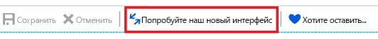
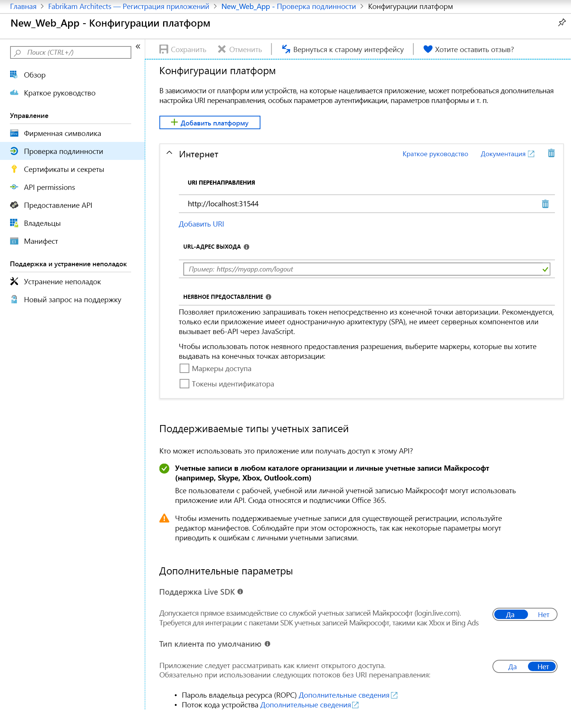
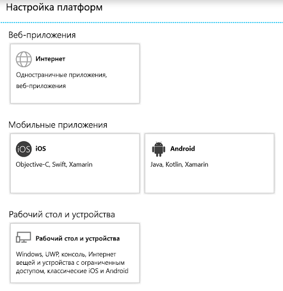

# Краткое руководство. Настройка клиентского приложения для доступа к веб-API

Чтобы клиентское конфиденциальное или веб-приложение могло участвовать в потоке предоставления кода авторизации, требующего проверки подлинности (и получения маркера доступа), ему необходимо установить безопасные учетные данные. По умолчанию на портале Azure используется метод аутентификации "идентификатор клиента + секретный ключ".

Кроме того, чтобы клиент смог получить доступ к веб-API, предоставляемому приложением ресурсов (например, API Microsoft Graph), платформа согласия должна позволить ему получить требуемое разрешение в зависимости от запрошенных разрешений. По умолчанию все приложения могут выбирать разрешения из API Microsoft Graph. [Разрешение API Graph "Вход в систему и чтение профиля пользователя"](https://developer.microsoft.com/graph/docs/concepts/permissions_reference#user-permissions) будет выбрано по умолчанию. Можно выбрать из [двух типов разрешений](developer-glossary.md#permissions) для каждого требуемого веб-API:

* **Разрешения приложения**. Вашему клиентскому приложению требуется доступ к веб-API от своего имени (без контекста пользователя). Этот тип разрешения требует согласия администратора и недоступен для общедоступных (классических и мобильных) клиентских приложений.
* **Делегированное разрешение**. Вашему приложению требуется доступ к веб-API от лица выполнившего вход пользователя, но с ограничением доступа по выбранному разрешению. Этот тип разрешения может быть предоставлен пользователем, если только для разрешения не требуется согласие администратора.

  > [!NOTE]
  > Когда вы добавляете в приложение делегированные разрешения, согласие не предоставляется автоматически для всех пользователей в клиенте. Пользователи должны по-прежнему вручную предоставлять согласие на дополнительные делегированные разрешения в среде выполнения, если администратор не дает согласие от имени всех пользователей.

В этом кратком руководстве мы покажем, как настроить приложение для выполнения следующих задач:

* [Добавьте URI перенаправления в приложение](#add-redirect-uris-to-your-application).
* [Настройка расширенных параметров для приложения](#configure-advanced-settings-for-your-application)
* [Изменение поддерживаемых типов учетных записей](#modify-supported-account-types)
* [Добавление учетных данных в веб-приложение](#add-credentials-to-your-web-application)
* [Добавьте разрешения для доступа к веб-API](#add-permissions-to-access-web-apis).

## Предварительные требования

Чтобы приступить к работе, выполните следующие предварительные требования:

* Ознакомьтесь с общими сведениями о поддерживаемых [разрешениях и согласии](v2-permissions-and-consent.md). Для создания приложений, которые будут использовать другие пользователи или приложения, это важно понимать.
* Установите клиент, содержащий зарегистрированные приложения.
  * Если у вас нет зарегистрированных приложений, [ознакомьтесь со сведениями о регистрации приложений с помощью платформы удостоверений Майкрософт](quickstart-register-app.md).

## Войдите на портал Azure и выберите приложение.

Чтобы настроить приложение, выполните следующие действия.

1. Войдите на [портал Azure](https://portal.azure.com) с помощью личной учетной записи Майкрософт либо рабочей или учебной учетной записи.
1. Если учетная запись предоставляет доступ нескольким клиентам, выберите свою учетную запись в правом верхнем углу и нужный клиент Azure AD для этого сеанса портала.
1. В области навигации слева выберите службу **Azure Active Directory**, а затем выберите **Регистрация приложений**.
1. Найдите и выберите приложение, которое нужно настроить. После выбора приложения появится страница **Обзор** приложения или главная страница регистрации.
1. Выполните действия по настройке приложения для доступа к веб-API:
    * [Добавьте URI перенаправления в приложение](#add-redirect-uris-to-your-application).
    * [Настройка расширенных параметров для приложения](#configure-advanced-settings-for-your-application)
    * [Изменение поддерживаемых типов учетных записей](#modify-supported-account-types)
    * [Добавление учетных данных в веб-приложение](#add-credentials-to-your-web-application)
    * [Добавьте разрешения для доступа к веб-API](#add-permissions-to-access-web-apis).

## Добавление URI перенаправления в приложение

Чтобы добавить URI перенаправления в приложение, сделайте следующее:

1. На странице **Обзор** выберите раздел **Проверка подлинности**.
1. Чтобы добавить пользовательский URI перенаправления для общедоступных клиентских приложений и веб-приложений, сделайте следующее:
   1. Найдите раздел **URI перенаправления**.
   1. Выберите тип приложения, которое вы создаете — **Веб** или **общедоступного клиента (для мобильных и классических приложений)** .
   1. Введите URI перенаправления для приложения.
      * Для веб-приложений укажите основной URL-адрес приложения. Например, выполняемое на локальном компьютере веб-приложение может иметь адрес `http://localhost:31544`. Пользователи будут использовать этот URL-адрес для входа в приложение веб-клиента.
      * Для общедоступных приложений укажите URI, который использует AAD для возвращения ответов маркера. Укажите значение, используемое в вашем приложении, например `https://MyFirstApp`.

1. Чтобы выбрать из предлагаемых URI перенаправления для общедоступных клиентов (мобильные устройства, компьютеры), сделайте следующее:
    1. Найдите раздел о предлагаемых **URI перенаправления для общедоступных клиентов (мобильные устройства, компьютеры)** .
    1. Выберите соответствующий URI перенаправления для приложения с помощью флажков. Вы также можете ввести пользовательский URI перенаправления. Если вы не уверены, что использовать, ознакомьтесь с документацией по библиотеке.

Существуют определенные ограничения, которые применяются для URI перенаправления. Дополнительные сведения см. в статье [Redirect URI/reply URL restrictions and limitations](https://docs.microsoft.com/azure/active-directory/develop/reply-url) (Ограничения для универсального кода ресурса (URI) перенаправления и URL-адреса ответа).
> [!NOTE]
> Ознакомьтесь с новым интерфейсом для настройки **проверки подлинности**, который позволяет указать для приложения параметры по критериям целевой платформы и (или) устройства.
>
> Чтобы увидеть это представление, выберите действие **Try out the new experience** (Попробовать новый интерфейс) в стандартном представлении страницы **Проверка подлинности**.
>
> 
>
> Откроется [новая страница  **Настройка платформы**](#configure-platform-settings-for-your-application).

### Настройка расширенных параметров для приложения

В зависимости от того, какое приложение вы регистрируете, может потребоваться настройка дополнительных параметров, например:

* **URL-адрес выхода**.
* Для одностраничных приложений можно включить **неявное предоставление разрешения** и выбрать маркеры, которые будет выдавать конечная точка проверки авторизации.
* Для классических приложений, которые получают маркеры через интеграцию с проверкой подлинности Windows, потоком кода устройства или по имени пользователя и паролю, выберите в разделе **Тип клиента по умолчанию** для параметра **Считать приложение общедоступным клиентом.** значение **Да**.
* Для устаревших приложений, которые использовали ранее Live SDK для интеграции со службой учетная записью Майкрософт, включите **поддержку Live SDK**. Для новых приложений этот параметр не требуется.
* **Тип клиента по умолчанию**

### Изменение поддерживаемых типов учетных записей

**Поддерживаемые типы учетных записей** определяют, кто может использовать приложение или обращаться к API.

Когда вы завершите [настройку поддерживаемых типов учетных записей](quickstart-register-app.md) при первоначальной регистрации приложения, этот параметр можно будет изменять только через редактор манифестов приложений и только в следующих случаях.

* Когда вы изменяете типы учетных записей с **AzureADMyOrg** или **AzureADMultipleOrgs** на **AzureADandPersonalMicrosoftAccount** или наоборот.
* Когда вы изменяете типы учетных записей с **AzureADMyOrg** на **AzureADMultipleOrgs** или наоборот.

Чтобы изменить поддерживаемые типы учетных записей для существующей регистрации приложения, выполните следующие действия.

* По инструкциям из статьи [о настройке манифеста приложения](reference-app-manifest.md) обновите ключ `signInAudience`.

## Настройка параметров платформы для приложения

Чтобы настроить параметры приложения на основе платформы или устройства, необходимо выбрать целевой объект.

1. На странице **Конфигурации платформ** выберите **Добавить платформу** и выберите один из доступных параметров.

   

1. Введите сведения о параметрах для выбранной платформы.

   | платформа                | Варианты              | Параметры конфигурации            |
   |-------------------------|----------------------|-----------------------------------|
   | **Веб-приложения**    | **Веб-приложения**              | Введите **URI перенаправления** для приложения. |
   | **Мобильные приложения** | **iOS**              | Введите **Идентификатор набора** для приложения, который можно найти в XCode в файле Info.plist или в разделе "Параметры сборки". Добавление идентификатора набора автоматически создает для приложения URI перенаправления. |
   |                         | **Android**          | * Укажите для приложения **Имя пакета**, которое указано в файле AndroidManifest.xml. * Создайте и введите **хэш подписи**. Добавление хэша подписи автоматически создает для приложения URI перенаправления.  |
   | **Рабочий стол и устройства**   | **Рабочий стол и устройства** | * Необязательно. Если вы создаете приложения для настольных компьютеров и устройств, выберите один из **рекомендуемых URI перенаправления**. * Необязательно. Введите **Пользовательский URI перенаправления**, который обозначает расположение для перенаправления пользователей из Azure AD в ответ на запросы проверки подлинности. Например, для приложений .NET Core, в которых требуется взаимодействие, используйте `https://localhost`. |

   > [!IMPORTANT]
   > Для мобильных приложений, которые не используют последнюю библиотеку MSAL и не используют брокер, необходимо настроить URI перенаправления в поле **Рабочий стол и устройства.**

1. В зависимости от выбранной платформы для настройки могут быть доступны дополнительные параметры. Для **веб-приложений** можно настроить следующее.
    * Добавление URI перенаправления
    * Настройте для **неявного предоставления разрешения** те токены, которые должна выдавать конечная точка авторизации.
        * Для одностраничных приложений выберите одновременно **Токены доступа** и **Маркеры идентификации**.
        * Для веб-приложений выберите только **Маркеры идентификации.**

## Добавление учетных данных в веб-приложение

Чтобы добавить учетные данные в веб-приложение, сделайте следующее:

1. На странице **Обзор** выберите раздел **сертификатов и секретов**.

1. Для добавления сертификата сделайте следующее:

    1. Выберите **Отправить сертификат**.
    1. Выберите файл, который вы хотите отправить. Он должен быть одного из следующих типов файлов: CER, PEM, CRT.
    1. Выберите **Добавить**.

1. Для добавления секрета клиента сделайте следующее:

    1. Выберите **New client secret** (Создать секрет клиента).
    1. Добавьте описание секрета клиента.
    1. Выберите длительность.
    1. Выберите **Добавить**.

> [!NOTE]
> Правый столбец будет содержать значение секрета клиента после сохранения изменений конфигурации. **Не забудьте скопировать значение** для использования в коде клиентского приложения, так как оно станет недоступно после закрытия страницы.

## Добавление разрешений для доступа к веб-API

Чтобы добавить разрешения для доступа к API ресурсов из клиента, сделайте следующее:

1. На странице **Обзор** приложения выберите **Разрешения API**.
1. Нажмите кнопку **Add a permission** (Добавить разрешение).
1. По умолчанию в представлении будет доступен выбор из **API Майкрософт**. Выберите раздел API, который вас интересует:
    * **API Майкрософт** — позволяет выбрать разрешения для API Майкрософт, например Microsoft Graph.
    * **Интерфейсы API, используемые моей организацией** — позволяют выбрать разрешения для API, предоставленные организацией, или API, с которыми интегрирована организация.
    * **Мои API** — позволяет выбрать разрешения для API, которые вы предоставили.
1. После выбора API появится страница **запроса разрешений API**. Если интерфейс API предоставляет делегированные разрешения и разрешения приложения, выберите тип разрешения, который требуется приложению.
1. После выбора щелкните **Добавить разрешения**. Вы вернетесь на страницу **разрешений API**, где разрешения были сохранены и добавлены в таблицу.

## Дополнительная информация

Дополнительные сведения о других кратких руководствах по управлению приложениями см. в следующих ресурсах:

* [Краткое руководство: регистрация приложения с помощью платформы удостоверений Майкрософт (предварительная версия)](quickstart-register-app.md)
* [Краткое руководство. Настройка приложения для доступа к веб-API (предварительная версия)](quickstart-configure-app-expose-web-apis.md)
* [Краткое руководство. Изменение учетных записей, поддерживаемых приложением (предварительная версия)](quickstart-modify-supported-accounts.md)
* [Краткое руководство. Удаление приложения, зарегистрированного с помощью платформы удостоверений Майкрософт (предварительная версия)](quickstart-remove-app.md)

Дополнительные сведения о двух объектах Azure AD, представляющих зарегистрированное приложение, и о взаимосвязи между ними см. в разделе [Объекты приложения и субъекта-службы в Azure Active Directory (Azure AD)](app-objects-and-service-principals.md).

Дополнительные сведения о фирменной символике, которой следует пользоваться при разработке приложений в среде Azure Active Directory (Azure AD) см. в разделе [Рекомендации по фирменной символике для приложений](howto-add-branding-in-azure-ad-apps.md).
