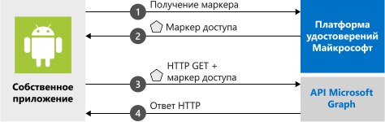

# <a name="quickstart-sign-in-users-and-call-the-microsoft-graph-api-from-an-android-app"></a>Краткое руководство. Вход пользователей и вызов API Microsoft Graph из приложения Android

В этом кратком руководстве содержится пример кода, который демонстрирует, как приложение Android может входить в личные или рабочие и учебные учетные записи, получать маркер доступа и вызывать API Microsoft Graph.



> [!NOTE]
> **Предварительные требования**
> * Android Studio 
> * Требуется Android 16+

## <a name="step-1-get-the-sample-app"></a>Шаг 1. Получение примера приложения

[Скопируйте код](https://github.com/Azure-Samples/ms-identity-android-java.git).

## <a name="step-2-register-your-application"></a>Шаг 2. Регистрация приложения

Чтобы зарегистрировать объект приложения и добавить сведения о регистрации этого объекта приложения в пример проекта вручную, выполните следующие действия:

1. Перейдите на [портал Azure](https://aka.ms/MobileAppReg).
1. На панели [Регистрация приложений](https://portal.azure.com/?feature.broker=true#blade/Microsoft_AAD_IAM/ActiveDirectoryMenuBlade/RegisteredApps) щелкните **+Новая регистрация**.
1. Введите **имя** приложения, а затем, не указывая URI перенаправления, щелкните **Зарегистрировать**.
1. В разделе **Управление** выберите **Аутентификация** >  **+ Добавить платформу** > **Android**. (Чтобы увидеть этот экран, возможно, потребуется выбрать **Попробовать новый пользовательский интерфейс** рядом с верхней частью колонки).
1. Введите **имя пакета** проекта (`com.azuresamples.msalandroidapp`).
1. В разделе **Хэш подписи** на странице **Настройка приложения Android** щелкните **Generating a development Signature Hash** (Создание хэша подписи разработки) и скопируйте команду KeyTool для применения на платформе, используемой для разработки приложения Android.

   > [!Note]
   > KeyTool. exe устанавливается как часть пакета средств разработки Java (JDK). Необходимо также установить средство OpenSSL для выполнения команды KeyTool.  Вам понадобятся keytool и каталог OpenSSL\bin для вашего пути.

1. Выполните команду keytool, скопированную на портале, в окне терминала.
1. Введите созданный хэш подписи на портале в поле **Хэш подписи**.
1. Щелкните `Configure` и сделайте копию **конфигурации MSAL**. Скопируйте и вставьте ее в файл конфигурации на следующем шаге. Нажмите кнопку **Done**(Готово).

## <a name="step-3-add-your-app-registration"></a>Шаг 3. Добавление регистрации приложения

1. Откройте пример проекта в Android Studio.
1. В разделе **app** > **res** > **raw** откройте файл **auth_config_multiple_account.json**.  Вставьте содержимое конфигурации MSAL. В результате будет добавлен идентификатор клиента, идентификатор арендатора и redirect_uri с портала. Это будет выглядеть примерно так, но со значениями, указанными для идентификатора клиента, идентификатора арендатора и redirect_uri:

    ```json
    {
      "client_id" : "<your_client_id_here>",
      "authorization_user_agent" : "DEFAULT",
      "redirect_uri" : "<your_redirect_uri_here>",
      "account_mode" : "MULTIPLE",
      "broker_redirect_uri_registered": true,
      "authorities" : [
        {
          "type": "AAD",
          "audience": {
            "type": "AzureADandPersonalMicrosoftAccount",
            "tenant_id": "common"
          }
        }
      ]
    }
    ```

1. Выберите **app** > **res** > **raw**, откройте файл **auth_config_single_account.json** и вставьте содержимое конфигурации MSAL. Он будет выглядеть, как файл **auth_config_multiple_account.json** выше.
1. В **app** > **manifests** > **AndroidManifest.xml** найдите действие `BrowserTabActivity`. Эта запись позволяет корпорации Майкрософт выполнять обратный вызов приложения после завершения проверки подлинности:

    ```xml
    ...
    <activity android:name="com.microsoft.identity.client.BrowserTabActivity">
                <intent-filter>
                    <action android:name="android.intent.action.VIEW" />
    
                    <category android:name="android.intent.category.DEFAULT" />
                    <category android:name="android.intent.category.BROWSABLE" />
    
                    <!--
                        Add in your scheme/host from registered redirect URI
                        note that the leading "/" is required for android:path
                        For Example:
                        <data
                            android:host="com.azuresamples.msalandroidapp"
                            android:path="/1wIqXSqBj7w+h11ZifsnqwgyKrY="
                            android:scheme="msauth" />
                    -->
    
                    <data
                        android:host="YOUR_PACKAGE_NAME - must be registered at https://aka.ms/MobileAppReg"
                        android:path="/YOUR_DECODED_SIGNATURE_HASH - must be registered at https://aka.ms/MobileAppReg"
                        android:scheme="msauth" />
                </intent-filter>
            </activity>
    ```
    
1. Замените имя пакета, зарегистрированного на портале Azure, значением `android:host=`.  В этом случае это будет `com.azuresamples.msalandroidapp`.

    > [!IMPORTANT]
    > Значение **android:path** **должно** иметь начальный символ "/", иначе под значением появится красная линия, и пример приложения не запустится.
     
1. Замените хэш ключа, полученный ранее при запуске keytool и введенный на портале Azure, на значение `android:path=`. Хэш подписи не должен быть указан в формате URL-адреса.

## <a name="step-4-run-the-sample-app"></a>Шаг 4. Запуск примера приложения

Выберите эмулятор или устройство из раскрывающегося списка **доступных устройств** Android Studio и запустите приложение.

Пример приложения запускается на экране **Single Account Mode** (Режим единой учетной записи). Область по умолчанию, **user.read**, предоставляется по умолчанию и используется при чтении данных собственного профиля во время вызова API Microsoft Graph. URL-адрес для вызова Microsoft Graph API предоставляется по умолчанию. При необходимости их можно изменить.


Используйте меню приложения для переключения между режимами одной и нескольких учетных записей.

В режиме одной учетной записи войдите с помощью рабочей или домашней учетной записи:

1. Выберите **Get graph data interactively** (Получить данные графов в интерактивном режиме ), чтобы запросить у пользователя учетные данные. Вы увидите выходные данные вызова API Microsoft Graph в нижней части экрана.
2. После входа в систему выберите **Get graph data silently** (Получить данные графов без уведомления), чтобы вызвать Microsoft Graph API, не запрашивая у пользователя учетные данные снова. Вы увидите выходные данные вызова API Microsoft Graph в нижней части экрана.

В режиме нескольких учетных записей можно повторить те же действия.  Кроме того, можно удалить учетную запись для входа. При этом кэшированные токены для этой учетной записи также удаляются.

## <a name="how-the-sample-works"></a>Как работает этот пример

Код разделен на фрагменты, демонстрирующие, как записывать приложение MSAL для одной и нескольких учетных записей. Файлы кода организованы следующим образом:

| Файл  | Что демонстрирует  |
|---------|---------|
| MainActivity | Управляет пользовательским интерфейсом |
| MSGraphRequestWrapper  | Вызывает API Microsoft Graph, используя токен, предоставленный MSAL |
| MultipleAccountModeFragment  | Инициализирует приложение с несколькими учетными записями, загружает учетную запись пользователя и получает токен для вызова API Microsoft Graph |
| SingleAccountModeFragment | Инициализирует приложение с одной учетной записью, загружает учетную запись пользователя и получает токен для вызова API Microsoft Graph |
| res/auth_config_multiple_account.json  | Файл конфигурации нескольких учетных записей |
| res/auth_config_single_account.json  | Файл конфигурации одной учетной записи |
| Скрипты Gradle/build.grade (модуль: app) | Здесь добавляются зависимости библиотеки MSAL |

Теперь мы рассмотрим эти файлы подробнее и вызовем код, относящийся к MSAL, в каждом из них

### <a name="add-msal-to-the-app"></a>Добавление MSAL в приложение

MSAL ([com.microsoft.identity.client](https://javadoc.io/doc/com.microsoft.identity.client/msal)) — это библиотека, используемая для выполнения входа пользователей и запросов маркеров, которые нужны для доступа к API, защищенному платформой удостоверений Майкрософт. Gradle 3.0+ устанавливает библиотеку при добавлении в файл **Скрипты Gradle** > **build.gradle (модуль: app)** в разделе **Зависимости** следующего фрагмента кода:

```gradle  
implementation 'com.microsoft.identity.client:msal:1.0.0'
```

Следующий фрагмент кода можно увидеть в примере проекта в build.gradle (модуль: app):

```java
dependencies {
    ...
    implementation 'com.microsoft.identity.client:msal:1.0.0-RC7'
    ...
}
```

Он указывает Gradle загрузить и создать MSAL из Maven Central.

### <a name="msal-imports"></a>Операции импорта MSAL

Операции импорта, относящиеся к библиотеке MSAL: `com.microsoft.identity.client.*`.  Например, вы увидите `import com.microsoft.identity.client.PublicClientApplication;`, что является пространством имен для класса `PublicClientApplication`, который представляет общедоступное клиентское приложение.

### <a name="singleaccountmodefragmentjava"></a>SingleAccountModeFragment.java

В этом файле показано, как создать приложение MSAL для одной учетной записи и вызвать API Microsoft Graph.

Приложения с одной учетной записью используются только одним пользователем.  Например, у вас может быть только одна учетная запись для входа в приложение сопоставления.

#### <a name="single-account-msal-initialization"></a>Инициализация MSAL одной учетной записи

В `onCreateView()` создается `PublicClientApplication` с одной учетной записью с использованием сведений о конфигурации, хранящихся в файле `auth_config_single_account.json`.  Таким образом вы инициализируете библиотеку MSAL для использования в приложении MSAL с одной учетной записью:

```java
...
// Creates a PublicClientApplication object with res/raw/auth_config_single_account.json
PublicClientApplication.createSingleAccountPublicClientApplication(getContext(),
        R.raw.auth_config_single_account,
        new IPublicClientApplication.ISingleAccountApplicationCreatedListener() {
            @Override
            public void onCreated(ISingleAccountPublicClientApplication application) {
                /**
                    * This test app assumes that the app is only going to support one account.
                    * This requires "account_mode" : "SINGLE" in the config json file.
                    **/
                mSingleAccountApp = application;
                loadAccount();
            }

            @Override
            public void onError(MsalException exception) {
                displayError(exception);
            }
        });
```

#### <a name="sign-in-a-user"></a>Вход пользователя

Код для входа пользователя находится в `initializeUI()`, в обработчике щелчков `signInButton`.

Прежде чем пытаться получить токены, вызовите `signIn()`. `signIn()` ведет себя так, как будто вызывается `acquireToken()`, в результате чего пользователь получает интерактивный запрос на вход.

Вход пользователя является асинхронной операцией. Передается обратный вызов, который вызывает API Microsoft Graph и обновляет пользовательский интерфейс после входа пользователя:

```java
mSingleAccountApp.signIn(getActivity(), null, getScopes(), getAuthInteractiveCallback());
```

#### <a name="sign-out-a-user"></a>Выход пользователя

Код для выхода пользователя находится в `initializeUI()`, в обработчике щелчков `signOutButton`.  Выход пользователя является асинхронной операцией. При выходе пользователя также очищается кеш токена для этой учетной записи. Для обновления пользовательского интерфейса после выхода из учетной записи пользователя создается обратный вызов:

```java
mSingleAccountApp.signOut(new ISingleAccountPublicClientApplication.SignOutCallback() {
    @Override
    public void onSignOut() {
        updateUI(null);
        performOperationOnSignOut();
    }

    @Override
    public void onError(@NonNull MsalException exception) {
        displayError(exception);
    }
});
```

#### <a name="get-a-token-interactively-or-silently"></a>Получение токена в интерактивном режиме или автоматически

Чтобы пользователь получил минимальное количество запросов, токен обычно получается автоматически. Если возникает ошибка, попытайтесь перейти к токену в интерактивном режиме. Когда приложение вызывает `signIn()` впервые, оно фактически действует как вызов `acquireToken()`, который запрашивает учетные данные пользователя.

Ниже представлены некоторые ситуации, когда пользователю может быть предложено выбрать учетную запись, ввести учетные данные или дать согласие на разрешения, запрошенные вашим приложением:

* Первый вход пользователя в приложение.
* Если пользователь сбрасывает пароль, то потребуется вводить свои учетные данные.
* Если отменяется согласие.
* Приложение явно требует согласия.
* Когда ваше приложение впервые запрашивает доступ к ресурсу.
* Когда требуются политики условного доступа или MFA.

Код для интерактивного получения токена (то есть с помощью пользовательского интерфейса) находится в `initializeUI()` в обработчике щелчков `callGraphApiInteractiveButton`:

```java
/**
 * If acquireTokenSilent() returns an error that requires an interaction (MsalUiRequiredException),
 * invoke acquireToken() to have the user resolve the interrupt interactively.
 *
 * Some example scenarios are
 *  - password change
 *  - the resource you're acquiring a token for has a stricter set of requirement than your Single Sign-On refresh token.
 *  - you're introducing a new scope which the user has never consented for.
 */
mSingleAccountApp.acquireToken(getActivity(), getScopes(), getAuthInteractiveCallback());
```

Если пользователь уже выполнил вход, `acquireTokenSilentAsync()` позволяет приложениям запрашивать токены автоматически, как показано в `initializeUI()`, в обработчике щелчков `callGraphApiSilentButton`:

```java
/**
  * Once you've signed the user in,
  * you can perform acquireTokenSilent to obtain resources without interrupting the user.
  */
  mSingleAccountApp.acquireTokenSilentAsync(getScopes(), AUTHORITY, getAuthSilentCallback());
```

#### <a name="load-an-account"></a>Загрузка учетной записи

Код для загрузки учетной записи находится в `loadAccount()`.  Загрузка учетной записи пользователя является асинхронной операцией, поэтому обратные вызовы для обработки при загрузке учетной записи, изменении или возникновении ошибки передаются в MSAL.  Следующий код также обрабатывает `onAccountChanged()`, что происходит при удалении учетной записи, переходе пользователя на другую учетную запись и т. д.

```java
private void loadAccount() {
    ...

    mSingleAccountApp.getCurrentAccountAsync(new ISingleAccountPublicClientApplication.CurrentAccountCallback() {
        @Override
        public void onAccountLoaded(@Nullable IAccount activeAccount) {
            // You can use the account data to update your UI or your app database.
            updateUI(activeAccount);
        }

        @Override
        public void onAccountChanged(@Nullable IAccount priorAccount, @Nullable IAccount currentAccount) {
            if (currentAccount == null) {
                // Perform a cleanup task as the signed-in account changed.
                performOperationOnSignOut();
            }
        }

        @Override
        public void onError(@NonNull MsalException exception) {
            displayError(exception);
        }
    });
```

#### <a name="call-microsoft-graph"></a>Вызов Microsoft Graph

Когда пользователь выполнил вход, вызов Microsoft Graph выполняется через HTTP-запрос с помощью `callGraphAPI()`. Эта функция представляет собой программу-оболочку, которая упрощает пример, выполняя некоторые задачи, такие как получение маркера доступа из `authenticationResult`, упаковка вызова MSGraphRequestWrapper и отображение результатов вызова.

```java
private void callGraphAPI(final IAuthenticationResult authenticationResult) {
    MSGraphRequestWrapper.callGraphAPIUsingVolley(
            getContext(),
            graphResourceTextView.getText().toString(),
            authenticationResult.getAccessToken(),
            new Response.Listener<JSONObject>() {
                @Override
                public void onResponse(JSONObject response) {
                    /* Successfully called graph, process data and send to UI */
                    ...
                }
            },
            new Response.ErrorListener() {
                @Override
                public void onErrorResponse(VolleyError error) {
                    ...
                }
            });
}
```

### <a name="auth_config_single_accountjson"></a>auth_config_single_account.json

Это файл конфигурации для приложения MSAL, использующего одну учетную запись.

Описание этих полей см. в разделе [Android Microsoft Authentication Library (MSAL) configuration file](msal-configuration.md) (Файл конфигурации библиотеки аутентификации Microsoft для Android (MSAL)).

Обратите внимание на присутствие `"account_mode" : "SINGLE"`, который настраивает это приложение для использования одной учетной записи.

```json
{
  "client_id" : "<your_client_id_here>",
  "authorization_user_agent" : "DEFAULT",
  "redirect_uri" : "<your_redirect_uri_here>",
  "account_mode" : "SINGLE",
  "broker_redirect_uri_registered": true,
  "authorities" : [
    {
      "type": "AAD",
      "audience": {
        "type": "AzureADandPersonalMicrosoftAccount",
        "tenant_id": "common"
      }
    }
  ]
}
```

### <a name="multipleaccountmodefragmentjava"></a>MultipleAccountModeFragment.java

В этом файле показано, как создать приложение MSAL с несколькими учетными записями и вызвать API Microsoft Graph. 

Примером приложения с несколькими учетными записями является почтовое приложение, которое позволяет работать с несколькими учетными записями пользователей, такими как рабочая и личная учетная запись.

#### <a name="multiple-account-msal-initialization"></a>Инициализация MSAL нескольких учетных записей

В `onCreateView()` объект приложения с несколькими учетными записями (`IMultipleAccountPublicClientApplication`) создается с использованием сведений о конфигурации, хранящихся в `auth_config_multiple_account.json file`:

```java
// Creates a PublicClientApplication object with res/raw/auth_config_single_account.json
PublicClientApplication.createMultipleAccountPublicClientApplication(getContext(),
        R.raw.auth_config_multiple_account,
        new IPublicClientApplication.IMultipleAccountApplicationCreatedListener() {
            @Override
            public void onCreated(IMultipleAccountPublicClientApplication application) {
                mMultipleAccountApp = application;
                loadAccount();
            }

            @Override
            public void onError(MsalException exception) {
                ...
            }
        });
```

Созданный объект `MultipleAccountPublicClientApplication` хранится в переменной члена класса, чтобы его можно было использовать для взаимодействия с библиотекой MSAL для получения токенов, загрузки и удаления учетной записи пользователя.

#### <a name="load-an-account"></a>Загрузка учетной записи

Приложения с несколькими учетными записями обычно вызывают `GetAccounts()`, чтобы выбрать учетную запись для использования в операциях MSAL. Код для загрузки учетной записи находится в `loadAccount()`.  Загрузка учетной записи пользователя является асинхронной операцией. Поэтому обратный вызов обрабатывает ситуации, когда учетная запись загружается, изменяется или возникает ошибка.

```java
/**
    * Load the currently signed-in account, if there's any.
    * In the shared device mode, if the user is signed out from the device, the app can also perform the clean-up work in onAccountChanged().
    */
private void loadAccount() {
    ...
    mMultipleAccountApp.getAccounts(new IPublicClientApplication.LoadAccountsCallback() {
        @Override
        public void onTaskCompleted(final List<IAccount> result) {
            // You can use the account data to update your UI or your app database.
            accountList = result;
            updateUI(accountList);
        }

        @Override
        public void onError(MsalException exception) {
            displayError(exception);
        }
    });
}
```

#### <a name="get-a-token-interactively-or-silently"></a>Получение токена в интерактивном режиме или автоматически

Ниже представлены некоторые ситуации, когда пользователю может быть предложено выбрать учетную запись, ввести учетные данные или дать согласие на разрешения, запрошенные вашим приложением:

* первый вход пользователей в приложение;
* Если пользователь сбрасывает пароль, то потребуется вводить свои учетные данные. 
* Если отменяется согласие. 
* Приложение явно требует согласия. 
* Когда ваше приложение впервые запрашивает доступ к ресурсу.
* Когда требуются политики условного доступа или MFA.

Приложения с несколькими учетными записями обычно должны получать токены в интерактивном режиме, то есть в пользовательском интерфейсе, с вызовом `acquireToken()`.  Код для интерактивного получения токена находится в `initializeUI()`, в обработчике щелчков `callGraphApiInteractiveButton`:

```java
/**
 * Acquire token interactively. It will also create an account object for the silent call as a result (to be obtained by getAccount()).
 *
 * If acquireTokenSilent() returns an error that requires an interaction,
 * invoke acquireToken() to have the user resolve the interrupt interactively.
 *
 * Some example scenarios are
 *  - password change
 *  - the resource you're acquiring a token for has a stricter set of requirement than your SSO refresh token.
 *  - you're introducing a new scope which the user has never consented for.
 */
mMultipleAccountApp.acquireToken(getActivity(), getScopes(), getAuthInteractiveCallback());
```

Приложения не требуют, чтобы пользователи выполняли вход каждый раз при запросе токена. Если пользователь уже выполнил вход, `acquireTokenSilentAsync()` позволяет приложениям запрашивать токены без запроса к пользователю, как показано в `initializeUI()` в обработчике щелчков `callGraphApiSilentButton`:

```java
/**
 * Performs acquireToken without interrupting the user.
 *
 * This requires an account object of the account you're obtaining a token for.
 * (can be obtained via getAccount()).
 */
mMultipleAccountApp.acquireTokenSilentAsync(getScopes(),
accountList.get(accountListSpinner.getSelectedItemPosition()),
AUTHORITY,
getAuthSilentCallback());
```

#### <a name="remove-an-account"></a>Удаление учетной записи

Код для удаления учетной записи и всех кэшированных токенов для учетной записи находится в `initializeUI()` в обработчике кнопки удаления учетной записи. Прежде чем вы сможете удалить учетную запись, вам нужен объект учетной записи, который вы получаете из функций MSAL, таких как `getAccounts()` и `acquireToken()`. Так как удаление учетной записи является асинхронной операцией, обратный вызов `onRemoved` предоставляется для обновления пользовательского интерфейса.

```java
/**
  * Removes the selected account and cached tokens from this app (or device, if the device is in shared mode).
  */
mMultipleAccountApp.removeAccount(accountList.get(accountListSpinner.getSelectedItemPosition()),
        new IMultipleAccountPublicClientApplication.RemoveAccountCallback() {
            @Override
            public void onRemoved() {
                ...
                /* Reload account asynchronously to get the up-to-date list. */
                loadAccount();
            }

            @Override
            public void onError(@NonNull MsalException exception) {
                displayError(exception);
            }
        });
```

### <a name="auth_config_multiple_accountjson"></a>auth_config_multiple_account.json

Это файл конфигурации для приложения MSAL, которое использует несколько учетных записей.

Описание этих полей см. в разделе [Android Microsoft Authentication Library (MSAL) configuration file](msal-configuration.md) (Файл конфигурации библиотеки аутентификации Microsoft для Android (MSAL)).

В отличие от файла конфигурации [auth_config_single_account.json](#auth_config_single_accountjson), в этом файле конфигурации указано `"account_mode" : "MULTIPLE"` вместо `"account_mode" : "SINGLE"`, так как это приложение с несколькими учетными записями.

```json
{
  "client_id" : "<your_client_id_here>",
  "authorization_user_agent" : "DEFAULT",
  "redirect_uri" : "<your_redirect_uri_here>",
  "account_mode" : "MULTIPLE",
  "broker_redirect_uri_registered": true,
  "authorities" : [
    {
      "type": "AAD",
      "audience": {
        "type": "AzureADandPersonalMicrosoftAccount",
        "tenant_id": "common"
      }
    }
  ]
}
```

## <a name="next-steps"></a>Дополнительная информация

### <a name="learn-the-steps-to-create-the-application-used-in-this-quickstart"></a>Изучите этапы создания приложения, используемые в этом кратком руководстве

В руководстве по Android вы найдете пошаговые инструкции для создания приложений и функций, а также полное описание того, о чем говорится в этом кратком руководстве.

> [!div class="nextstepaction"]
> [Вход пользователей и вызов API Microsoft Graph из приложения Android](https://docs.microsoft.com/azure/active-directory/develop/guidedsetups/active-directory-android)

### <a name="msal-for-android-library-wiki"></a>MSAL для вики-сайта библиотеки Android

Дополнительные сведения см. в статье

> [!div class="nextstepaction"]
> [MSAL для вики-сайта библиотеки Android](https://github.com/AzureAD/microsoft-authentication-library-for-android/wiki)

[!INCLUDE [Help and support](../../../includes/active-directory-develop-help-support-include.md)]

Помогите нам улучшить платформу Microsoft Identity. Поделитесь своим мнением, ответив на два вопроса.

> [!div class="nextstepaction"]
> [Опрос по платформе удостоверений Майкрософт](https://forms.office.com/Pages/ResponsePage.aspx?id=v4j5cvGGr0GRqy180BHbRyKrNDMV_xBIiPGgSvnbQZdUQjFIUUFGUE1SMEVFTkdaVU5YT0EyOEtJVi4u)
