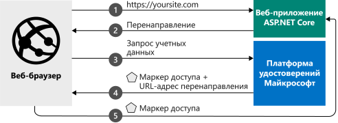

# <a name="quickstart-add-sign-in-with-microsoft-to-an-aspnet-core-web-app"></a>Краткое руководство. Добавление возможности входа в веб-приложение ASP.NET Core с помощью учетной записи Майкрософт

[!INCLUDE [active-directory-develop-applies-v2](../../../includes/active-directory-develop-applies-v2.md)]

В этом кратком руководстве вы узнаете, как веб-приложение ASP.NET Core позволяет войти в личные учетные записи (hotmail.com, outlook.com и т. д.), а также рабочие и учебные учетные записи из любого экземпляра Azure Active Directory (Azure AD).



> [!div renderon="docs"]
> ## <a name="register-and-download-your-quickstart-app"></a>Регистрация и скачивание приложения, используемого в этом кратком руководстве
> У вас есть два варианта запуска приложения, используемого в этом кратком руководстве:
> * [Экспресс-способ] [Вариант 1. Регистрация и автоматическая настройка приложения, а затем скачивание примера кода](#option-1-register-and-auto-configure-your-app-and-then-download-your-code-sample)
> * [Вручную] [Вариант 2. Регистрация и настройка приложения и примера кода вручную](#option-2-register-and-manually-configure-your-application-and-code-sample)
>
> ### <a name="option-1-register-and-auto-configure-your-app-and-then-download-your-code-sample"></a>Вариант 1. Регистрация и автоматическая настройка приложения, а затем скачивание примера кода
>
> 1. Откройте [Регистрация приложений](https://aka.ms/aspnetcore2-1-aad-quickstart-v2) на портале Azure.
> 1. Введите имя приложения и нажмите кнопку **Зарегистрировать**.
> 1. Следуйте инструкциям для загрузки и автоматической настройки нового приложения одним щелчком мыши.
>
> ### <a name="option-2-register-and-manually-configure-your-application-and-code-sample"></a>Вариант 2. Регистрация и настройка приложения и примера кода вручную
>
> #### <a name="step-1-register-your-application"></a>Шаг 1. Регистрация приложения
> Чтобы зарегистрировать приложение и добавить сведения о его регистрации в решение вручную, сделайте следующее:
>
> 1. Войдите на [портал Azure](https://portal.azure.com) с помощью личной учетной записи Майкрософт либо рабочей или учебной учетной записи.
> 1. Если учетная запись предоставляет доступ нескольким клиентам, выберите свою учетную запись в правом верхнем углу и нужный клиент Azure AD для этого сеанса портала.
> 1. Перейдите на страницу [Регистрация приложений](https://go.microsoft.com/fwlink/?linkid=2083908) Платформы удостоверений Майкрософт для разработчиков.
> 1. Выберите **Новая регистрация**.
> 1. После появления страницы **Регистрация приложения** введите сведения о регистрации приложения:
>    - В разделе **Имя** введите понятное имя приложения, которое будет отображаться пользователям приложения, например `AspNetCore-Quickstart`.
>    - В поле **URI перенаправления** добавьте `https://localhost:44321/` и выберите **Зарегистрировать**.
> 1. Выберите меню **Проверка подлинности**, а затем добавьте следующие сведения:
>    - В поле **URI перенаправления** добавьте `https://localhost:44321/signin-oidc` и выберите **Сохранить**.
>    - В разделе **Дополнительные параметры** задайте для параметра **URL-адрес выхода** значение `https://localhost:44321/signout-oidc`.
>    - В разделе **Неявное предоставление** установите флажок **Токен идентификатора**.
>    - Щелкните **Сохранить**.

> [!div class="sxs-lookup" renderon="portal"]
> #### <a name="step-1-configure-your-application-in-the-azure-portal"></a>Шаг 1. Настройка приложения на портале Azure
> Чтобы пример кода для этого краткого руководства работал, необходимо добавить URL-адреса ответа `https://localhost:44321/` и `https://localhost:44321/signin-oidc`, URL-адрес выхода `https://localhost:44321/signout-oidc` и запросить выдачу токенов идентификации конечной точкой авторизации.
> > [!div renderon="portal" id="makechanges" class="nextstepaction"]
> > [Внести это изменение для меня]()
>
> > [!div id="appconfigured" class="alert alert-info"]
> > . Ваше приложение настроено с помощью этих атрибутов.

#### <a name="step-2-download-your-aspnet-core-project"></a>Шаг 2. Скачивание проекта ASP.NET Core

- [Скачайте решение Visual Studio 2017](https://github.com/Azure-Samples/active-directory-aspnetcore-webapp-openidconnect-v2/archive/aspnetcore2-2.zip).

#### <a name="step-3-configure-your-visual-studio-project"></a>Шаг 3. Настройка проекта Visual Studio

1. Извлеките ZIP-файл в локальную папку, расположенную в корневой папке (например, **C:\Azure-Samples**).
1. Если вы используете Visual Studio 2017, откройте решение в Visual Studio (необязательно).
1. Измените файл **appsettings.json**. Найдите `ClientId` и замените `ClientId` на значение **идентификатора зарегистрированного приложения (клиента)**. 

    ```json
    "ClientId": "Enter_the_Application_Id_here"
    "TenantId": "Enter_the_Tenant_Info_Here"
    ```

> [!div renderon="docs"]
> Описание
> - `Enter_the_Application_Id_here` — **идентификатор приложения (клиента)**, зарегистрированного на портале Azure. **Идентификатор приложения (клиента)** можно найти на странице **Обзор** приложения.
> - `Enter_the_Tenant_Info_Here` — один из следующих вариантов:
>   - Если приложение поддерживает **учетные записи только в этом каталоге организации**, замените это значение **идентификатором клиента** или **именем клиента** (например, contoso.microsoft.com).
>   - Если ваше приложение поддерживает вариант **Учетные записи в любом каталоге организации**, замените это значение на `organizations`.
>   - Если приложение поддерживает вариант **Все пользователи с учетными записями Майкрософт**, замените это значение на `common`.
>
> > [!TIP]
> > Чтобы найти значения параметров **Идентификатор приложения (клиента)**, **Идентификатор каталога (клиента)** и **Поддерживаемые типы учетных записей**, на портале Azure перейдите на страницу **Обзор**.

## <a name="more-information"></a>Дополнительные сведения

В этом разделе представлены общие сведения о коде, необходимом для выполнения входа пользователей. Они помогут вам понять принципы работы кода, основные аргументы, а также решить, нужно ли добавлять возможность входа в имеющееся приложение ASP.NET Core.

### <a name="startup-class"></a>Класс Startup

ПО промежуточного слоя *Microsoft.AspNetCore.Authentication* использует класс Startup, который выполняется при инициализации хост-процесса:

```csharp
public void ConfigureServices(IServiceCollection services)
{
  services.Configure<CookiePolicyOptions>(options =>
  {
    // This lambda determines whether user consent for non-essential cookies is needed for a given request.
    options.CheckConsentNeeded = context => true;
    options.MinimumSameSitePolicy = SameSiteMode.None;
  });

  services.AddAuthentication(AzureADDefaults.AuthenticationScheme)
          .AddAzureAD(options => Configuration.Bind("AzureAd", options));

  services.Configure<OpenIdConnectOptions>(AzureADDefaults.OpenIdScheme, options =>
  {
    options.Authority = options.Authority + "/v2.0/";         // Microsoft identity platform

    options.TokenValidationParameters.ValidateIssuer = false; // accept several tenants (here simplified)
  });

  services.AddMvc(options =>
  {
     var policy = new AuthorizationPolicyBuilder()
                     .RequireAuthenticatedUser()
                     .Build();
     options.Filters.Add(new AuthorizeFilter(policy));
  })
  .SetCompatibilityVersion(CompatibilityVersion.Version_2_1);
}
```

Метод `AddAuthentication` добавляет в службу аутентификацию на основе файлов cookie, используемую в сценариях браузера, а также настраивает запрос OpenID Connect. 

Строка, содержащая `.AddAzureAd`, добавляет в ваше приложение функцию аутентификации платформы удостоверений Майкрософт. Затем приложение настраивается для входа с использованием конечной точки платформы удостоверений Майкрософт.

> |Where  |  |
> |---------|---------|
> | ClientId  | Идентификатор приложения (клиента), зарегистрированного на портале Azure. |
> | Authority | Конечная точка службы токенов безопасности для проверки подлинности пользователей. Обычно это <https://login.microsoftonline.com/{tenant}/v2.0> для общедоступного облака, где {tenant} — имя вашего клиента, идентификатор клиента или *common* для ссылки на общую конечную точку (используется для мультитенантных приложений). |
> | TokenValidationParameters | Список параметров для проверки маркеров. В этом случае для `ValidateIssuer` задано значение `false`, чтобы указать, что приложение может принимать операции входа с любых типов личных, рабочих или учебных учетных записей. |


> [!NOTE]
> Параметр `ValidateIssuer = false` приводится в этом кратком руководстве для упрощения. В реальных приложениях необходимо проверить издателя.
> См. примеры кода, чтобы узнать, как это сделать.

### <a name="protect-a-controller-or-a-controllers-method"></a>Защита контроллера или метода контроллера

Контроллер или его методы можно защитить с помощью атрибута `[Authorize]`. Этот атрибут ограничивает доступ к контроллеру и методам, позволяя выполнять действия только пользователям, прошедшим проверку подлинности. Это означает, что когда к контроллеру получает доступ неаутентифицированный пользователь, выполняется запрос проверки подлинности.

[!INCLUDE [Help and support](../../../includes/active-directory-develop-help-support-include.md)]

## <a name="next-steps"></a>Дополнительная информация

Ознакомьтесь с этим руководством по ASP.NET Core в репозитории GitHub, чтобы узнать, как добавить функцию аутентификацию в новое веб-приложение ASP.NET Core, вызвать Microsoft Graph и другие API Майкрософт, вызвать собственные API, добавить функцию авторизации, а также выполнить вход пользователей в национальные облака или использовать удостоверения социальных сетей:

> [!div class="nextstepaction"]
> [Руководство. Веб-приложение ASP.NET Core](https://github.com/Azure-Samples/active-directory-aspnetcore-webapp-openidconnect-v2/)
