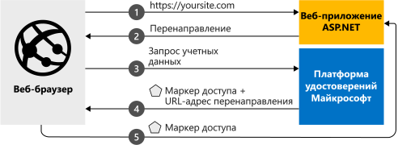

# <a name="quickstart-add-microsoft-identity-platform-sign-in-to-an-aspnet-web-app"></a>Краткое руководство. Добавление функции входа платформы Microsoft Identity в веб-приложение ASP.NET

Из этого краткого руководства вы узнаете, как скачать и выполнить пример кода, в котором показана реализация входа в веб-приложение ASP.NET для пользователей из любой организации Azure Active Directory (Azure AD). 

Иллюстрацию см. в разделе [Как работает этот пример](#how-the-sample-works).
> [!div renderon="docs"]
> ## <a name="prerequisites"></a>Предварительные требования
>
> * Учетная запись Azure с активной подпиской. [Создайте учетную запись](https://azure.microsoft.com/free/?WT.mc_id=A261C142F) бесплатно.
> * [Visual Studio 2019](https://visualstudio.microsoft.com/vs/)
> * [.NET Framework 4.7.2 или более поздней версии](https://dotnet.microsoft.com/download/visual-studio-sdks)
>
> ## <a name="register-and-download-your-quickstart-app"></a>Регистрация и скачивание приложения, используемого в этом кратком руководстве
> У вас есть два варианта запуска приложения, используемого в этом кратком руководстве:
> * [Экспресс-способ] [Вариант 1. Регистрация и автоматическая настройка приложения, а затем скачивание примера кода](#option-1-register-and-auto-configure-your-app-and-then-download-your-code-sample)
> * [Вручную] [Вариант 2. Регистрация и настройка приложения и примера кода вручную](#option-2-register-and-manually-configure-your-application-and-code-sample)
>
> ### <a name="option-1-register-and-auto-configure-your-app-and-then-download-your-code-sample"></a>Вариант 1. Регистрация и автоматическая настройка приложения, а затем скачивание примера кода
>
> 1. Откройте на [портале Azure новую панель регистрации приложений](https://portal.azure.com/#blade/Microsoft_AAD_RegisteredApps/applicationsListBlade/quickStartType/AspNetWebAppQuickstartPage/sourceType/docs).
> 1. Введите имя своего приложения и щелкните **Зарегистрировать**.
> 1. Следуйте инструкциям для загрузки и автоматической настройки нового приложения одним щелчком мыши.
>
> ### <a name="option-2-register-and-manually-configure-your-application-and-code-sample"></a>Вариант 2. Регистрация и настройка приложения и примера кода вручную
>
> #### <a name="step-1-register-your-application"></a>Шаг 1. Регистрация приложения
> Чтобы зарегистрировать приложение и добавить сведения о его регистрации в решение вручную, сделайте следующее:
>
> 1. Войдите на [портал Azure](https://portal.azure.com) с помощью личной учетной записи Майкрософт либо рабочей или учебной учетной записи.
> 1. Если учетная запись предоставляет доступ нескольким клиентам, выберите свою учетную запись в правом верхнем углу и нужный клиент Azure AD для этого сеанса портала.
> 1. Перейдите на страницу [Регистрация приложений](https://go.microsoft.com/fwlink/?linkid=2083908) Платформы удостоверений Майкрософт для разработчиков.
> 1. Выберите **Новая регистрация**.
> 1. После появления страницы **Регистрация приложения** введите сведения о регистрации приложения:
>      - В разделе **Имя** введите понятное имя приложения, которое будет отображаться пользователям приложения, например `ASPNET-Quickstart`.
>      - В поле **URI перенаправления** добавьте `https://localhost:44368/` и щелкните **Зарегистрировать**.
>      - В области навигации слева в разделе управления выберите **Проверка подлинности**.
>          - В подразделе **Неявное предоставление** выберите **Токен идентификатора**.
>          - Нажмите кнопку **Сохранить**.

> [!div class="sxs-lookup" renderon="portal"]
> #### <a name="step-1-configure-your-application-in-azure-portal"></a>Шаг 1. Настройка приложения на портале Azure
> Для работы примера кода в этом кратком руководстве необходимо добавить URL-адрес ответа `https://localhost:44368/`.
> > [!div renderon="portal" id="makechanges" class="nextstepaction"]
> > [Внести это изменение для меня]()
>
> > [!div id="appconfigured" class="alert alert-info"]
> >  Ваше приложение настроено с использованием этого атрибута

#### <a name="step-2-download-your-project"></a>Шаг 2. Скачивание проекта

> [!div renderon="docs"]
> [Скачайте решение Visual Studio 2019](https://github.com/AzureADQuickStarts/AppModelv2-WebApp-OpenIDConnect-DotNet/archive/master.zip)

> [!div renderon="portal" class="sxs-lookup"]
> Запустите проект с помощью Visual Studio 2019.
> [!div renderon="portal" id="autoupdate" class="sxs-lookup nextstepaction"]
> [Скачивание примера кода](https://github.com/AzureADQuickStarts/AppModelv2-WebApp-OpenIDConnect-DotNet/archive/master.zip)

> [!div class="sxs-lookup" renderon="portal"]
> #### <a name="step-3-your-app-is-configured-and-ready-to-run"></a>Шаг 3. Приложение настроено и готово к запуску
> Мы настроили проект, указав значения свойств приложения.

> [!div renderon="docs"]
> #### <a name="step-3-run-your-visual-studio-project"></a>Шаг 3. Выполнение проекта Visual Studio

1. Извлеките ZIP-файл в локальную папку, расположенную как можно ближе к корневой папке (например, **C:\Azure-Samples**).
1. Откройте решение в Visual Studio (AppModelv2-WebApp-OpenIDConnect-DotNet.sln).
1. В зависимости от версии Visual Studio может потребоваться щелкнуть правой кнопкой мыши проект `AppModelv2-WebApp-OpenIDConnect-DotNet` и выбрать **Восстановить пакеты NuGet**
1. Откройте консоль диспетчера пакетов (Представление -> Другие окна -> Консоль диспетчера пакетов) и выполните `Update-Package Microsoft.CodeDom.Providers.DotNetCompilerPlatform -r`.

> [!div renderon="docs"]
> 5. В файле **Web.config** замените параметры `ClientId` и `Tenant` на:
>    ```xml
>    <add key="ClientId" value="Enter_the_Application_Id_here" />
>    <add key="Tenant" value="Enter_the_Tenant_Info_Here" />
>    ```
>    Где:
> - `Enter_the_Application_Id_here` — идентификатор регистрируемого приложения.
> - `Enter_the_Tenant_Info_Here` — один из следующих вариантов:
>   - Если ваше приложение поддерживает вариант **Только моя организация**, замените это значение на **идентификатор клиента** или **имя клиента** (например contoso.onmicrosoft.com).
>   - Если ваше приложение поддерживает вариант **Учетные записи в любом каталоге организации**, замените это значение на `organizations`.
>   - Если приложение поддерживает вариант **Все пользователи с учетными записями Майкрософт**, замените это значение на `common`.
>
> > [!TIP]
> > - Чтобы найти значения параметров *Идентификатор приложения*, *Идентификатор каталога (клиента)* и *Поддерживаемые типы учетных записей*, перейдите на страницу **Обзор**.
> > - Убедитесь, что значение `redirectUri` в файле **Web.config** соответствует **URI перенаправления**, определенному для регистрации приложения в Azure AD (если это не так, перейдите в меню **проверки подлинности**, чтобы зарегистрировать приложение и изменить **URI перенаправления** на требуемое значение).

> [!div class="sxs-lookup" renderon="portal"]
> > [!NOTE]
> > `Enter_the_Supported_Account_Info_Here`

## <a name="more-information"></a>Дополнительные сведения

В этом разделе представлены общие сведения о коде, необходимом для выполнения входа пользователей. Это может быть полезно для рассмотрения принципов работы кода и основных аргументов. Также вы поймете, нужно ли добавлять функцию входа в существующее приложение ASP.NET.

### <a name="how-the-sample-works"></a>Как работает этот пример


### <a name="owin-middleware-nuget-packages"></a>Пакеты NuGet для ПО промежуточного слоя OWIN

Вы можете настроить конвейер проверки подлинности, используя проверку подлинности на основе файлов cookie, с помощью OpenID Connect в ASP.NET и пакетов ПО промежуточного слоя OWIN. Эти пакеты можно установить, выполнив в **консоли диспетчера пакетов** Visual Studio следующие команды:

```powershell
Install-Package Microsoft.Owin.Security.OpenIdConnect
Install-Package Microsoft.Owin.Security.Cookies
Install-Package Microsoft.Owin.Host.SystemWeb
```

### <a name="owin-startup-class"></a>Класс Startup OWIN

По промежуточного слоя OWIN использует *класс startup*, выполняемый при инициализации процесса размещения. В этом кратком руководстве используется файл *startup.cs*. расположенный в корневой папке. В следующем коде показан параметр, используемый в этом кратком руководстве:

```csharp
public void Configuration(IAppBuilder app)
{
    app.SetDefaultSignInAsAuthenticationType(CookieAuthenticationDefaults.AuthenticationType);

    app.UseCookieAuthentication(new CookieAuthenticationOptions());
    app.UseOpenIdConnectAuthentication(
        new OpenIdConnectAuthenticationOptions
        {
            // Sets the ClientId, authority, RedirectUri as obtained from web.config
            ClientId = clientId,
            Authority = authority,
            RedirectUri = redirectUri,
            // PostLogoutRedirectUri is the page that users will be redirected to after sign-out. In this case, it is using the home page
            PostLogoutRedirectUri = redirectUri,
            Scope = OpenIdConnectScope.OpenIdProfile,
            // ResponseType is set to request the id_token - which contains basic information about the signed-in user
            ResponseType = OpenIdConnectResponseType.IdToken,
            // ValidateIssuer set to false to allow personal and work accounts from any organization to sign in to your application
            // To only allow users from a single organizations, set ValidateIssuer to true and 'tenant' setting in web.config to the tenant name
            // To allow users from only a list of specific organizations, set ValidateIssuer to true and use ValidIssuers parameter
            TokenValidationParameters = new TokenValidationParameters()
            {
                ValidateIssuer = false // Simplification (see note below)
            },
            // OpenIdConnectAuthenticationNotifications configures OWIN to send notification of failed authentications to OnAuthenticationFailed method
            Notifications = new OpenIdConnectAuthenticationNotifications
            {
                AuthenticationFailed = OnAuthenticationFailed
            }
        }
    );
}
```

> |Where  | Описание |
> |---------|---------|
> | `ClientId`     | Идентификатор приложения, зарегистрированного на портале Azure |
> | `Authority`    | Конечная точка STS для проверки подлинности пользователей. Обычно это `https://login.microsoftonline.com/{tenant}/v2.0` для общедоступного облака, где {tenant} — имя вашего клиента, идентификатор клиента или *common* для ссылки на общую конечную точку (используется для мультитенантных приложений). |
> | `RedirectUri`  | URL-адрес, куда пользователи переходят после проверки подлинности на конечной точке платформы удостоверений Майкрософт |
> | `PostLogoutRedirectUri`     | URL-адрес, куда пользователи переходят после выхода |
> | `Scope`     | Список запрашиваемых областей, разделенных пробелами |
> | `ResponseType`     | Запрос, в котором указано, что ответ после проверки подлинности содержит маркер идентификации |
> | `TokenValidationParameters`     | Список параметров для проверки маркеров. В этом случае для `ValidateIssuer` задано значение `false`, чтобы указать, что приложение может принимать операции входа с любых типов личных, рабочих или учебных учетных записей |
> | `Notifications`     | Список делегатов, которые могут выполняться для разных сообщений *OpenIdConnect* |


> [!NOTE]
> Параметр `ValidateIssuer = false` приводится в этом кратком руководстве для упрощения. В реальных приложениях необходимо проверить издателя.
> См. примеры кода, чтобы узнать, как это сделать.

### <a name="initiate-an-authentication-challenge"></a>Инициирование запроса проверки подлинности

Вы можете настроить принудительный вход пользователя, настроив запрос проверки подлинности в контроллере:

```csharp
public void SignIn()
{
    if (!Request.IsAuthenticated)
    {
        HttpContext.GetOwinContext().Authentication.Challenge(
            new AuthenticationProperties{ RedirectUri = "/" },
            OpenIdConnectAuthenticationDefaults.AuthenticationType);
    }
}
```

> [!TIP]
> Запрос проверки подлинности описанным выше способом необязательный и обычно используется, если представление должно быть доступно для пользователей, прошедших и не прошедших проверку подлинности. Кроме того, можно защитить контроллеры, используя метод, описанный в следующем разделе.

### <a name="protect-a-controller-or-a-controllers-method"></a>Защита контроллера или метода контроллера

Контроллер или его действия можно защитить с помощью атрибута `[Authorize]`. Этот атрибут ограничивает доступ к контроллеру или действиям, разрешив доступ к действиям в контроллере только прошедшим проверку подлинности пользователям. Это означает, что запрос проверки подлинности будет выполняться автоматически, если пользователь, *не прошедший проверку подлинности*, попытается получить доступ к одному из действий или контроллеру с указанным атрибутом `[Authorize]`.

[!INCLUDE [Help and support](../../../includes/active-directory-develop-help-support-include.md)]

## <a name="next-steps"></a>Дальнейшие действия

В руководстве по ASP.NET вы найдете пошаговые инструкции по созданию приложений и функций, а также полное описание того, о чем говорится в этом кратком руководстве.

> [!div class="nextstepaction"]
> [Реализация входа в веб-приложение ASP.NET с использованием учетной записи Майкрософт](tutorial-v2-asp-webapp.md)
