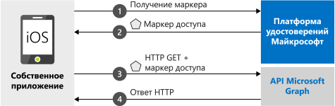

# <a name="quickstart-sign-in-users-and-call-the-microsoft-graph-api-from-an-ios-app"></a>Краткое руководство. Вход пользователей и вызов API Microsoft Graph из приложения iOS

[!INCLUDE [active-directory-develop-applies-v2-msal](../../../includes/active-directory-develop-applies-v2-msal.md)]

В этом кратком руководстве содержится пример кода, который демонстрирует, как собственное приложение iOS может входить в личные, рабочие и школьные учетные записи, получать маркер доступа и вызывать Microsoft Graph API.



> [!NOTE]
> **Предварительные требования**
> * XCode 10 или более поздней версии
> * iOS 10 или более поздней версии 

> [!div renderon="docs"]
> ## <a name="register-and-download-your-quickstart-app"></a>Регистрация и скачивание приложения, используемого в этом кратком руководстве
> У вас есть два варианта запуска приложения, используемого в этом кратком руководстве:
> * [Экспресс-способ] [Вариант 1. Регистрация и автоматическая настройка приложения, а затем скачивание примера кода](#option-1-register-and-auto-configure-your-app-and-then-download-your-code-sample)
> * [Вручную] [Вариант 2. Регистрация и настройка приложения и примера кода вручную](#option-2-register-and-manually-configure-your-application-and-code-sample)
>
> ### <a name="option-1-register-and-auto-configure-your-app-and-then-download-your-code-sample"></a>Вариант 1. Регистрация и автоматическая настройка приложения, а затем скачивание примера кода
> #### <a name="step-1-register-your-application"></a>Шаг 1. Регистрация приложения
> Регистрация приложения:
> 1. Откройте на [портале Azure новую панель регистрации приложений](https://portal.azure.com/#blade/Microsoft_AAD_RegisteredApps/applicationsListBlade/quickStartType/IosQuickstartPage/sourceType/docs).
> 1. Введите имя приложения и нажмите кнопку **Зарегистрировать**.
> 1. Следуйте инструкциям, чтобы быстро скачать и автоматически настроить новое приложение.
>
> ### <a name="option-2-register-and-manually-configure-your-application-and-code-sample"></a>Вариант 2. Регистрация и настройка приложения и примера кода вручную
>
> #### <a name="step-1-register-your-application"></a>Шаг 1. Регистрация приложения
> Чтобы зарегистрировать приложение и добавить сведения о его регистрации в решение вручную, сделайте следующее:
>
> 1. Перейдите на страницу [Регистрация приложений](https://aka.ms/MobileAppReg) Платформы удостоверений Майкрософт для разработчиков.
> 1. Выберите **Новая регистрация**.
> 1. После появления страницы **Регистрация приложения** введите сведения о регистрации приложения:
>      - В разделе **Имя** введите понятное имя приложения, которое будет отображаться пользователям, когда они входят в приложение и предоставляют ему разрешения, например `iOSQuickstart`.
>      - Другие конфигурации на этой странице можно пропустить. 
>      - Нажмите кнопку `Register`.
> 1. Щелкните новое приложение и перейдите к `Authentication` > `Add Platform` > `iOS`.    
>      - Введите ***идентификатор пакета*** вашего приложения. 
> 1. Щелкните `Configure` (Настроить) и сохраните сведения о ***конфигурации MSAL*** для последующего использования. 

> [!div renderon="portal" class="sxs-lookup"]
>
> #### <a name="step-1-configure-your-application"></a>Шаг 1. Настройка приложения
> Для работы примера кода в этом кратком руководстве необходимо добавить URI перенаправления, совместимые с брокером авторизации. 
> > [!div renderon="portal" id="makechanges" class="nextstepaction"]
> > [Внести это изменение для меня]()
>
> > [!div id="appconfigured" class="alert alert-info"]
> > . Ваше приложение настроено с помощью этих атрибутов

#### <a name="step-2-download-your-web-server-or-project"></a>Шаг 2. Скачивание веб-сервера или проекта

- [Скачайте пример кода.](https://github.com/Azure-Samples/active-directory-ios-swift-native-v2/archive/master.zip)

#### <a name="step-3-configure-your-project"></a>Шаг 3. Настройка проекта

> [!div renderon="docs"]
> Если вы выбрали вариант 1 выше, можно пропустить эти шаги. 

> [!div renderon="portal" class="sxs-lookup"]
> 1. Извлеките ZIP-файл и откройте проект в XCode.
> 1. Измените **ViewController.swift** и замените строку, начинающуюся с "let kClientID", следующим фрагментом кода.
>    ```swift
>    let kClientID = "Enter_the_Application_Id_here"
>    let kAuthority = "https://login.microsoftonline.com/Enter_the_Tenant_Info_Here"
>
>    ```
> 1. Щелкните **Info.plist**, а затем выберите **Открыть как** >  **Исходный код**.
> 1. Добавьте ***идентификатор пакета*** в корневой узел словаря.
>
>    ```xml
>    <key>CFBundleURLTypes</key>
>    <array>
>       <dict>
>          <key>CFBundleURLSchemes</key>
>          <array>
>             <string>msauth.Enter_the_Bundle_Id_Here</string>
>          </array>
>       </dict>
>    </array>
> 
>    ```
> 1. Создайте и запустите приложение. 

> [!div renderon="docs"]
>
> 1. Извлеките ZIP-файл и откройте проект в XCode.
> 1. Измените **ViewController.swift** и замените строку, начинающуюся с let kClientID, следующим фрагментом кода.
>
>    ```swift
>    let kClientID = "<ENTER_YOUR_APPLICATION/CLIENT_ID>"
> 
>    ```
> 1. Щелкните **Info.plist**, а затем выберите **Открыть как** >  **Исходный код**.
> 1. Добавьте ***идентификатор пакета*** в корневой узел словаря.
>
>    ```xml
>    <key>CFBundleURLTypes</key>
>    <array>
>       <dict>
>          <key>CFBundleURLSchemes</key>
>          <array>
>             <string>msauth.<ENTER_YOUR_BUNDLE_ID></string>
>          </array>
>       </dict>
>    </array>
>
>    ```
> 1. Создайте и запустите приложение. 

## <a name="more-information"></a>Дополнительные сведения

Дополнительные сведения о кратком руководстве содержатся в этих разделах.

### <a name="getting-msal"></a>Получение MSAL

MSAL ([MSAL.framework](https://github.com/AzureAD/microsoft-authentication-library-for-objc)) — это библиотека, используемая для выполнения входа пользователей и запросов маркеров, которые нужны для доступа к API, защищенному платформой удостоверений Майкрософт. MSAL можно добавить в приложение, используя следующее действие.

```
$ vi Podfile

```
Добавьте в файл Podfile следующий код (целевую исполняющую среду проекта):

```
use_frameworks!

target 'MSALiOS' do
   pod 'MSAL', '~> 0.4.0'
end

```

### <a name="msal-initialization"></a>Инициализация MSAL

Добавив следующий код, вы можете добавить ссылку на MSAL.

```swift
import MSAL
```

Затем выполните инициализацию MSAL с помощью следующего кода.

```swift
let authority = try MSALAADAuthority(url: URL(string: kAuthority)!)
            
let msalConfiguration = MSALPublicClientApplicationConfig(clientId: kClientID, redirectUri: nil, authority: authority)
self.applicationContext = try MSALPublicClientApplication(configuration: msalConfiguration)

```

> |Описание ||
> |---------|---------|
> | `clientId` | Идентификатор зарегистрированного приложения на *portal.azure.com* |
> | `authority` | Конечная точка платформы удостоверений Майкрософт. В большинстве случаев это будет *https<span/>://login.microsoftonline.com/common* |
> | `redirectUri` | URI перенаправления приложения. Можете передать нуль, чтобы использовать значение по умолчанию, или ваш пользовательский URI перенаправления. |

### <a name="additional-app-requirements"></a>Дополнительные требования для приложения  

Ваше приложение также должно содержать следующий код в объекте `AppDelegate`. Это позволит пакету SDK MSAL обрабатывать ответ токена из приложения брокера авторизации при выполнении проверки подлинности.

 ```swift
 func application(_ app: UIApplication, open url: URL, options: [UIApplication.OpenURLOptionsKey : Any] = [:]) -> Bool {
         guard let sourceApplication = options[UIApplication.OpenURLOptionsKey.sourceApplication] as? String else {
             return false
         }
         
         return MSALPublicClientApplication.handleMSALResponse(url, sourceApplication: sourceApplication)
     }

```

Наконец, ваше приложение должно содержать запись `LSApplicationQueriesSchemes` в файле ***Info.plist*** вместе с элементом `CFBundleURLTypes`. Пример уже содержит эту запись. 

   ```xml 
   <key>LSApplicationQueriesSchemes</key>
   <array>
      <string>msauth</string>
      <string>msauthv2</string>
   </array>
   ```

### <a name="sign-in-users--request-tokens"></a>Выполнение входа пользователей и запрос токенов

MSAL имеет два метода получения маркеров безопасности: `acquireToken` и `acquireTokenSilent`.

#### <a name="acquiretoken-getting-a-token-interactively"></a>acquireToken. Интерактивное получение маркера

Иногда требуется взаимодействие пользователей с платформой удостоверений Майкрософт. В таких случаях пользователю может потребоваться выбрать свою учетную запись, ввести учетные данные или предоставить согласие на разрешения приложения. Например, 

* первый вход пользователей в приложение;
* Если пользователь сбрасывает пароль, то потребуется вводить свои учетные данные. 
* Когда ваше приложение впервые запрашивает доступ к ресурсу.
* Когда требуются политики условного доступа или MFA.

```swift
let parameters = MSALInteractiveTokenParameters(scopes: kScopes)
applicationContext.acquireToken(with: parameters) { (result, error) in /* Add your handling logic */}
```

> |Описание||
> |---------|---------|
> | `scopes` | Содержит запрашиваемые области (то есть `[ "user.read" ]` для Microsoft Graph или `[ "<Application ID URL>/scope" ]` для пользовательских веб-API (`api://<Application ID>/access_as_user`)). |

#### <a name="acquiretokensilent-getting-an-access-token-silently"></a>acquireTokenSilent. Автоматическое получение маркера доступа

Приложения не требуют, чтобы пользователи выполняли вход каждый раз при запросе маркера. Если пользователь уже вошел, этот метод позволяет приложениям запрашивать маркеры автоматически. 

```swift
let parameters = MSALSilentTokenParameters(scopes: kScopes, account: applicationContext.allAccounts().first)
applicationContext.acquireTokenSilent(with: parameters) { (result, error) in /* Add your handling logic */}
```

> |Описание ||
> |---------|---------|
> | `scopes` | Содержит запрашиваемые области (то есть `[ "user.read" ]` для Microsoft Graph или `[ "<Application ID URL>/scope" ]` для пользовательских веб-API (`api://<Application ID>/access_as_user`)). |
> | `account` | Учетная запись, для которой запрашивается токен. В этот кратком руководстве рассматривается приложение с одной учетной записью. Если вы хотите создать приложение с несколькими учетными записями, нужно определить логику, которая будет использоваться в учетной записи для запросов токенов `applicationContext.account(forHomeAccountId: self.homeAccountId)`. |

## <a name="next-steps"></a>Дополнительная информация

В руководстве по iOS вы найдете пошаговые инструкции по созданию приложений, а также полное описание того, о чем говорится в этом кратком руководстве.

### <a name="learn-the-steps-to-create-the-application-used-in-this-quickstart"></a>Изучите этапы создания приложения, используемые в этом кратком руководстве

> [!div class="nextstepaction"]
> [Вызов API Microsoft Graph из приложения iOS](https://docs.microsoft.com/azure/active-directory/develop/guidedsetups/active-directory-ios)

[!INCLUDE [Help and support](../../../includes/active-directory-develop-help-support-include.md)]