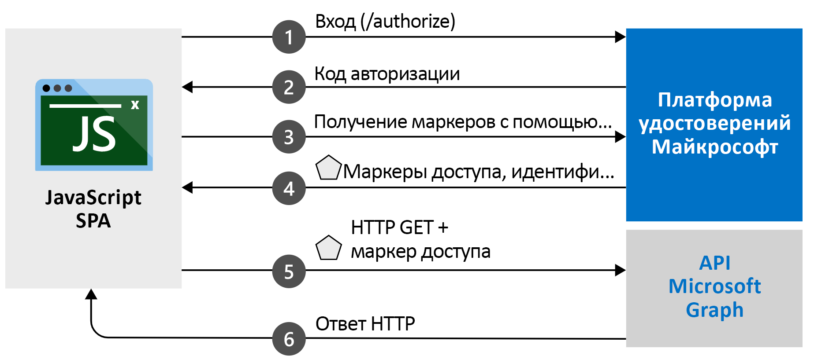

# <a name="quickstart-sign-in-users-and-get-an-access-token-in-a-javascript-spa-using-the-auth-code-flow"></a>Краткое руководство. Вход пользователей и получение маркера доступа в SPA JavaScript с помощью потока кода авторизации

В этом кратком руководстве вы выполните пример кода, который демонстрирует, как одностраничное приложение (SPA) JavaScript может выполнять вход с помощью личных, рабочих и учебных учетных записей с помощью потока кода авторизации. Также в этом примере кода демонстрируется получение маркера доступа для вызова веб-API, в данном случае API Microsoft Graph. Иллюстрацию см. в разделе [Как работает этот пример](#how-the-sample-works).

В этом кратком руководстве используется MSAL.js версии 2.0 с потоком кода авторизации. Есть аналогичное руководство для MSAL.js версии 1.0 с неявным потоком: [Краткое руководство. Вход пользователей в одностраничных приложениях JavaScript](./quickstart-v2-javascript.md).

[!INCLUDE [MSAL.js 2.0 and Azure AD B2C temporary incompatibility notice](../../../includes/msal-b2c-cors-compatibility-notice.md)]

## <a name="prerequisites"></a>Предварительные требования

* Подписка Azure. [Создать подписку Azure бесплатно](https://azure.microsoft.com/free/?WT.mc_id=A261C142F)
* [Node.js](https://nodejs.org/en/download/)
* [Visual Studio Code](https://code.visualstudio.com/download) или любой другой редактор кода.

> [!div renderon="docs"]
> ## <a name="register-and-download-your-quickstart-application"></a>Регистрация и скачивание приложения, используемого в этом кратком руководстве
> Чтобы запустить приложение, используемое в этом кратком руководстве, выберите любой из следующих вариантов.
>
> ### <a name="option-1-express-register-and-auto-configure-your-app-and-then-download-your-code-sample"></a>Вариант 1 (экспресс-способ). Регистрация и автоматическая настройка приложения, а затем скачивание примера кода
>
> 1. Войдите на [портал Azure](https://portal.azure.com).
> 1. Если ваша учетная запись предоставляет доступ к нескольким клиентам, в правом верхнем углу щелкните свою учетную запись и выберите для текущего сеанса работы нужный клиент Azure AD.
> 1. Щелкните [Регистрация приложений](https://portal.azure.com/#blade/Microsoft_AAD_RegisteredApps/ApplicationsListBlade/quickStartType/JavascriptSpaQuickstartPage/sourceType/docs).
> 1. Введите имя приложения.
> 1. В разделе **Поддерживаемые типы учетных записей** выберите **Accounts in any organizational directory and personal Microsoft accounts** (Учетные записи в любом каталоге организации и личные учетные записи Майкрософт).
> 1. Выберите **Зарегистрировать**.
> 1. Перейдите на панель быстрого запуска и следуйте инструкциям по скачиванию и автоматической настройке нового приложения.
>
> ### <a name="option-2-manual-register-and-manually-configure-your-application-and-code-sample"></a>Вариант 2 (вручную). Регистрация и настройка приложения и примера кода вручную
>
> #### <a name="step-1-register-your-application"></a>Шаг 1. Регистрация приложения
>
> 1. Войдите на [портал Azure](https://portal.azure.com).
> 1. Если ваша учетная запись предоставляет доступ к нескольким клиентам, в правом верхнем углу щелкните свою учетную запись и выберите для текущего сеанса работы нужный клиент Azure AD.
> 1. Щелкните [Регистрация приложений](https://go.microsoft.com/fwlink/?linkid=2083908).
> 1. Выберите **Новая регистрация**.
> 1. Когда откроется страница **Register an application** (Регистрация приложения), введите имя приложения.
> 1. В разделе **Поддерживаемые типы учетных записей** выберите **Accounts in any organizational directory and personal Microsoft accounts** (Учетные записи в любом каталоге организации и личные учетные записи Майкрософт).
> 1. Выберите **Зарегистрировать**. На странице приложения **Обзор** запишите **идентификатор приложения (клиента)** для использования в будущем.
> 1. В левой области зарегистрированного приложения выберите **Проверка подлинности**.
> 1. В разделе **Конфигурации платформ** щелкните **Добавить платформу**. На открывшейся панели выберите **Одностраничное приложение**.
> 1. В поле **URI перенаправления** укажите значение `http://localhost:3000/`.
> 1. Нажмите кнопку **Настроить**.

> [!div class="sxs-lookup" renderon="portal"]
> #### <a name="step-1-configure-your-application-in-the-azure-portal"></a>Шаг 1. Настройка приложения на портале Azure
> Для работы примера кода в этом кратком руководстве необходимо добавить `redirectUri` со значением `http://localhost:3000/`.
> > [!div renderon="portal" id="makechanges" class="nextstepaction"]
> > [Внести эти изменения для меня]()
>
> > [!div id="appconfigured" class="alert alert-info"]
> > . Ваше приложение настроено с помощью этих атрибутов.

#### <a name="step-2-download-the-project"></a>Шаг 2. Скачивание проекта

> [!div renderon="docs"]
> [Скачайте основные файлы проекта](https://github.com/Azure-Samples/ms-identity-javascript-v2/archive/master.zip), чтобы запустить проект с помощью веб-сервера, используя Node.js.

> [!div renderon="portal" class="sxs-lookup"]
> Запустите проект с помощью веб-сервера, используя Node.js.

> [!div renderon="portal" class="sxs-lookup" id="autoupdate" class="nextstepaction"]
> [Скачивание примера кода](https://github.com/Azure-Samples/ms-identity-javascript-v2/archive/master.zip)

> [!div renderon="docs"]
> #### <a name="step-3-configure-your-javascript-app"></a>Шаг 3. Настройка приложения JavaScript
>
> В папке *app* откройте файл *authConfig.js* и измените в нем значения `clientID`, `authority` и `redirectUri` для объекта `msalConfig`.
>
> ```javascript
> // Config object to be passed to Msal on creation
> const msalConfig = {
>   auth: {
>     clientId: "Enter_the_Application_Id_Here",
>     authority: "Enter_the_Cloud_Instance_Id_HereEnter_the_Tenant_Info_Here",
>     redirectUri: "Enter_the_Redirect_Uri_Here",
>   },
>   cache: {
>     cacheLocation: "sessionStorage", // This configures where your cache will be stored
>     storeAuthStateInCookie: false, // Set this to "true" if you are having issues on IE11 or Edge
>   }
> };
> ```

> [!div renderon="portal" class="sxs-lookup"]
> > [!NOTE]
> > `Enter_the_Supported_Account_Info_Here`

> [!div renderon="docs"]
>
> Измените значения в разделе `msalConfig`, как описано далее.
>
> - `Enter_the_Application_Id_Here` содержит **идентификатор приложения (клиента)** для зарегистрированного приложения.
> - `Enter_the_Cloud_Instance_Id_Here` представляет экземпляр облака Azure. Для основного или глобального облака Azure введите `https://login.microsoftonline.com/`. Сведения для **национальных** облаков (например, Китая) см. в [этой статье](authentication-national-cloud.md).
> - `Enter_the_Tenant_info_here` может иметь одно из следующих значений.
>   - Если приложение поддерживает *учетные записи только в этом каталоге организации*, замените это значение **идентификатором клиента** или **именем клиента**. Например, `contoso.microsoft.com`.
>   - Если приложение поддерживает *учетные записи в любом каталоге организации*, замените это значение на `organizations`.
>   - Если приложение поддерживает *учетные записи в любом каталоге организации и личные учетные записи Майкрософт*, замените это значение на `common`. В примерах **этого краткого руководства** укажите `common`.
>   - Чтобы ограничить поддержку только *личными учетными записями Microsoft*, замените это значение на `consumers`.
> - Параметр `Enter_the_Redirect_Uri_Here` равен `http://localhost:3000/`.
>
> Если вы используете основное (глобальное) облако Azure, значение `authority` в файле *authConfig.js* должно выглядеть примерно так:
>
> ```javascript
> authority: "https://login.microsoftonline.com/common",
> ```
>
> > [!TIP]
> > Чтобы найти значения параметров **Идентификатор приложения (клиента)** , **Идентификатор каталога (клиента)** и **Поддерживаемые типы учетных записей**, на портале Azure перейдите на страницу регистрации приложения **Обзор**.
>
> [!div class="sxs-lookup" renderon="portal"]
> #### <a name="step-3-your-app-is-configured-and-ready-to-run"></a>Шаг 3. Приложение настроено и готово к запуску
> Мы настроили проект, указав значения свойств приложения.

> [!div renderon="docs"]
>
> Затем в той же папке измените файл *graphConfig.js*, задав значения `graphMeEndpoint` и `graphMailEndpoint` для объекта `apiConfig`.
>
> ```javascript
>   // Add here the endpoints for MS Graph API services you would like to use.
>   const graphConfig = {
>     graphMeEndpoint: "Enter_the_Graph_Endpoint_Herev1.0/me",
>     graphMailEndpoint: "Enter_the_Graph_Endpoint_Herev1.0/me/messages"
>   };
>
>   // Add here scopes for access token to be used at MS Graph API endpoints.
>   const tokenRequest = {
>       scopes: ["Mail.Read"]
>   };
> ```
>
> [!div renderon="docs"]
>
> `Enter_the_Graph_Endpoint_Here` обозначает конечную точку, к которой будут направляться вызовы API. Для основной (глобальной) службы API Microsoft Graph введите значение `https://graph.microsoft.com/` (включая замыкающую косую черту). Дополнительные сведения о службе Microsoft Graph в национальных облаках см. [здесь](/graph/deployments).
>
> Если вы используете основное (глобальное) облако Azure, значения `graphMeEndpoint` и `graphMailEndpoint` в файле *graphConfig.js* должны выглядеть примерно так:
>
> ```javascript
> graphMeEndpoint: "https://graph.microsoft.com/v1.0/me",
> graphMailEndpoint: "https://graph.microsoft.com/v1.0/me/messages"
> ```
>
> #### <a name="step-4-run-the-project"></a>Шаг 4. Запуск проекта

Запустите проект на веб-сервере с помощью Node.js:

1. Чтобы запустить сервер, выполните в каталоге проекта следующую команду.
    ```console
    npm install
    npm start
    ```
1. Перейдите по адресу `http://localhost:3000/`.

1. Нажмите кнопку **Войти**, чтобы начать процесс входа в систему, а затем вызовите API Microsoft Graph.

    После первого входа предоставьте приложению разрешение на использование данных вашего профиля для входа. После выполнения входа сведения о вашем профиле пользователя должны отображаться на странице.

## <a name="more-information"></a>Дополнительные сведения

### <a name="how-the-sample-works"></a>Как работает этот пример



### <a name="msaljs"></a>msal.js

MSAL.js — это библиотека, используемая для выполнения входа пользователей и запросов маркеров, которые нужны для доступа к API, защищенному платформой удостоверений Майкрософт. В файле примера *index.html* содержится ссылка на библиотеку:

```html
<script type="text/javascript" src="https://alcdn.msauth.net/browser/2.0.0-beta.0/js/msal-browser.js" integrity=
"sha384-r7Qxfs6PYHyfoBR6zG62DGzptfLBxnREThAlcJyEfzJ4dq5rqExc1Xj3TPFE/9TH" crossorigin="anonymous"></script>
```

Если у вас установлен Node.js, последнюю версию можно скачать с помощью диспетчера пакетов npm из Node.js:

```console
npm install @azure/msal-browser
```

## <a name="next-steps"></a>Дальнейшие действия

Более подробное пошаговое руководство по созданию приложения для этого краткого руководства см. в следующем учебнике:

> [!div class="nextstepaction"]
> [Руководство по входу и вызовам в Microsoft Graph >](./tutorial-v2-javascript-auth-code.md)