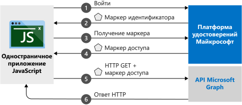

# <a name="quickstart-sign-in-users-and-acquire-an-access-token-from-a-javascript-single-page-application"></a>Краткое руководство. Выполнение входа пользователей и получение маркера доступа от одностраничного приложения JavaScript

Из этого краткого руководства вы узнаете, как использовать пример кода, который демонстрирует, как одностраничное приложение (SPA) JavaScript может выполнять вход с помощью личных, рабочих и учебных учетных записей. Одностраничное приложение JavaScript также может получить маркер доступа для вызова API Microsoft Graph или любого веб-API.



## <a name="prerequisites"></a>Предварительные требования

В этом руководстве требуется следующая конфигурация.
* Чтобы запустить проект с сервером Node.js, скачайте и установите [Node.js](https://nodejs.org/en/download/).
* Чтобы внести правки в файлы проекта, скачайте и установите [Visual Studio Code](https://code.visualstudio.com/download).
* Чтобы запустить проект как решение Visual Studio, скачайте и установите [Visual Studio 2019](https://visualstudio.microsoft.com/downloads/).

> [!div renderon="docs"]
> ## <a name="register-and-download-your-quickstart-application"></a>Регистрация и скачивание приложения, используемого в этом кратком руководстве
> Чтобы запустить приложение, используемое в этом кратком руководстве, выберите любой из следующих вариантов.
>
> ### <a name="option-1-express-register-and-auto-configure-your-app-and-then-download-your-code-sample"></a>Вариант 1 (экспресс-способ). Регистрация и автоматическая настройка приложения, а затем скачивание примера кода
>
> 1. Войдите на [портал Azure](https://portal.azure.com) с помощью личной учетной записи Майкрософт либо рабочей или учебной учетной записи.
> 1. Если ваша учетная запись предоставляет доступ к нескольким клиентам, в правом верхнем углу щелкните свою учетную запись и выберите для текущего сеанса работы нужный клиент Azure AD.
> 1. Откройте на [портале Azure новую панель регистрации приложений](https://portal.azure.com/#blade/Microsoft_AAD_RegisteredApps/ApplicationsListBlade/quickStartType/JavascriptSpaQuickstartPage/sourceType/docs).
> 1. Введите имя приложения и нажмите кнопку **Зарегистрировать**.
> 1. Следуйте инструкциям, чтобы быстро скачать и автоматически настроить новое приложение.
>
> ### <a name="option-2-manual-register-and-manually-configure-your-application-and-code-sample"></a>Вариант 2 (вручную). Регистрация и настройка приложения и примера кода вручную
>
> #### <a name="step-1-register-your-application"></a>Шаг 1. Регистрация приложения
>
> 1. Войдите на [портал Azure](https://portal.azure.com) с помощью личной учетной записи Майкрософт либо рабочей или учебной учетной записи.
>
> 1. Если ваша учетная запись предоставляет доступ к нескольким клиентам, в правом верхнем углу щелкните свою учетную запись и выберите для текущего сеанса работы нужный клиент Azure AD.
> 1. Перейдите на страницу [Регистрация приложений](https://go.microsoft.com/fwlink/?linkid=2083908) платформы удостоверений Майкрософт для разработчиков.
> 1. Выберите **Новая регистрация**.
> 1. Когда откроется страница **Register an application** (Регистрация приложения), введите имя приложения.
> 1. В разделе **Поддерживаемые типы учетных записей** выберите **Accounts in any organizational directory and personal Microsoft accounts** (Учетные записи в любом каталоге организации и личные учетные записи Майкрософт).
> 1. В разделе **URI перенаправления** в раскрывающемся списке выберите **Веб-платформа**, а затем задайте значение `http://localhost:30662/`.
> 1. Выберите **Зарегистрировать**. На странице приложения **Обзор** запишите **идентификатор приложения (клиента)** для использования в будущем.
> 1. Для этого краткого руководства должно быть включено [неявное предоставление разрешения потока](v2-oauth2-implicit-grant-flow.md). В левой области зарегистрированного приложения выберите **Проверка подлинности**.
> 1. В разделе **Дополнительные параметры** в области **Неявное предоставление** установите флажки **Токен идентификатора** и **Маркеры доступа**. Токены идентификатора и маркеры доступа необходимы, так как это приложение должно выполнять вход пользователей и вызов API.
> 1. В верхней части области щелкните **Сохранить**.

> [!div class="sxs-lookup" renderon="portal"]
> #### <a name="step-1-configure-your-application-in-the-azure-portal"></a>Шаг 1. Настройка приложения на портале Azure
> Для работы примера кода в этом кратком руководстве необходимо добавить URL-адрес перенаправления `http://localhost:30662/` и включить **неявное предоставление разрешения**.
> > [!div renderon="portal" id="makechanges" class="nextstepaction"]
> > [Внести эти изменения для меня]()
>
> > [!div id="appconfigured" class="alert alert-info"]
> > . Ваше приложение настроено с помощью этих атрибутов.

#### <a name="step-2-download-the-project"></a>Шаг 2. Скачивание проекта

Выберите вариант, подходящий для вашей среды разработки:

* [Скачайте основные файлы проекта](https://github.com/Azure-Samples/active-directory-javascript-graphapi-v2/archive/quickstart.zip), чтобы запустить проект с помощью веб-сервера, используя Node.js. Чтобы открыть файлы, используйте редактор, например [Visual Studio Code](https://code.visualstudio.com/).

* (Необязательно.) [Скачайте проект Visual Studio](https://github.com/Azure-Samples/active-directory-javascript-graphapi-v2/archive/vsquickstart.zip), чтобы запустить его с помощью сервера IIS. Извлеките ZIP-файл в локальную папку (например, *C:\Azure-Samples*).


#### <a name="step-3-configure-your-javascript-app"></a>Шаг 3. Настройка приложения JavaScript

> [!div renderon="docs"]
> В папке *JavaScriptSPA* измените файл *index.html* и установите значения `clientID` и `authority` в разделе `msalConfig`.

> [!div class="sxs-lookup" renderon="portal"]
> В папке *JavaScriptSPA* измените файл *index.html* и замените `msalConfig` следующим кодом:

```javascript
var msalConfig = {
    auth: {
        clientId: "Enter_the_Application_Id_here",
        authority: "https://login.microsoftonline.com/Enter_the_Tenant_info_here"
    },
    cache: {
        cacheLocation: "localStorage",
        storeAuthStateInCookie: true
    }
};

```
> [!div renderon="portal"]
> > [!NOTE]
> > В этом кратком руководстве поддерживается Enter_the_Supported_Account_Info_Here.


> [!div renderon="docs"]
>
> Описание
> - *\<Enter_the_Application_Id_here>*  — **идентификатор приложения (клиент)** для зарегистрированного приложения.
> - *\<Enter_the_Tenant_info_here>* присваивается одно из следующих значений:
>    - Если приложение поддерживает *учетные записи только в этом каталоге организации*, замените это значение **идентификатором клиента** или **именем клиента** (например, *contoso.microsoft.com*).
>    - Если ваше приложение поддерживает *учетные записи в любом каталоге организации*, замените это значение на **organizations**.
>    - Если приложение поддерживает *учетные записи в любом каталоге организации и личные учетные записи Майкрософт*, замените это значение на **common**. Чтобы ограничить поддержку только *личными учетными записями Майкрософт*, замените это значение на **consumers**.
>
> > [!TIP]
> > Чтобы найти значения параметров **Идентификатор приложения (клиента)** , **Идентификатор каталога (клиента)** и **Поддерживаемые типы учетных записей**, на портале Azure перейдите на страницу **Обзор**.
>

#### <a name="step-4-run-the-project"></a>Шаг 4. Запуск проекта

* Если вы используете [Node.js](https://nodejs.org/en/download/), сделайте следующее:

    1. Чтобы запустить сервер, выполните в каталоге проекта следующую команду.

        ```batch
        npm install
        node server.js
        ```

    1. Откройте веб-браузер и перейдите на страницу `http://localhost:30662/`.
    1. Нажмите кнопку **Войти**, чтобы войти в систему, а затем вызовите API Microsoft Graph.


* Если вы используете Visual Studio, выберите решение проекта и нажмите клавишу [F5](https://visualstudio.microsoft.com/downloads/), чтобы запустить проект.

Когда приложение загрузится в браузере, нажмите кнопку **Войти**. После первого входа предоставьте приложению разрешение на использование данных вашего профиля для входа. После выполнения входа сведения о вашем профиле пользователя должны отображаться на странице.

## <a name="more-information"></a>Дополнительные сведения

### <a name="msaljs"></a>msal.js

MSAL — это библиотека, используемая для выполнения входа пользователей и запросов маркеров, которые нужны для доступа к API, защищенному платформой удостоверений Майкрософт. В файле *index.html*, используемом в кратком руководстве, содержится ссылка на библиотеку:

```html
<script src="https://secure.aadcdn.microsoftonline-p.com/lib/1.0.0/js/msal.min.js"></script>
```
> [!TIP]
> Приведенную выше версию можно заменить последней выпущенной версией в разделе с [выпусками MSAL.js](https://github.com/AzureAD/microsoft-authentication-library-for-js/releases).


Кроме того, если вы установили Node.js, последнюю версию можно скачать с помощью диспетчера пакетов Node.js (NPM):

```batch
npm install msal
```

### <a name="msal-initialization"></a>Инициализация MSAL

В примере кода ниже показано, как инициализировать библиотеку MSAL:

```javascript
var msalConfig = {
    auth: {
        clientId: "Enter_the_Application_Id_here",
        authority: "https://login.microsoftonline.com/Enter_the_Tenant_Info_Here"
    },
    cache: {
        cacheLocation: "localStorage",
        storeAuthStateInCookie: true
    }
};

var myMSALObj = new Msal.UserAgentApplication(msalConfig);
```

> |Where  |  |
> |---------|---------|
> |`ClientId`     | Идентификатор приложения, зарегистрированного на портале Azure.|
> |`authority`    | (Необязательно.) Это URL-адрес центра сертификации, предназначенный для поддержки типов учетных записей, как описано выше в разделе конфигурации. По умолчанию центром является `https://login.microsoftonline.com/common`. |
> |`cacheLocation`  | (Необязательно.) Этот параметр настраивает хранилище браузера для состояния проверки подлинности. По умолчанию используется sessionStorage.   |
> |`storeAuthStateInCookie`  | (Необязательно.) Библиотека, которая хранит состояние запроса проверки подлинности, необходимое для проверки потоков аутентификации, в файлах cookie браузера. Параметр файла cookie установлен для браузеров IE и Edge, чтобы уменьшить определенные [известные проблемы](https://github.com/AzureAD/microsoft-authentication-library-for-js/wiki/Known-issues-on-IE-and-Edge-Browser#issues). |

Подробные сведения о доступных настраиваемых параметрах см. в статье [Initialize client applications using MSAL.js](msal-js-initializing-client-applications.md) (Инициализация клиентских приложений с помощью MSAL.js).

### <a name="sign-in-users"></a>Выполнение входа пользователей

В приведенном ниже фрагменте кода показано, как выполнить вход пользователей:

```javascript
var requestObj = {
    scopes: ["user.read"]
};

myMSALObj.loginPopup(requestObj).then(function (loginResponse) {
    //Login Success callback code here
}).catch(function (error) {
    console.log(error);
});
```

> |Where  |  |
> |---------|---------|
> | `scopes`   | (Необязательно.) Содержит области, для которых запрашивается согласие пользователя во время входа в систему. Например, `[ "user.read" ]` для Microsoft Graph или `[ "<Application ID URL>/scope" ]` для пользовательских веб-API (то есть `api://<Application ID>/access_as_user`). |

> [!TIP]
> Можно также использовать метод `loginRedirect`, чтобы с текущей страницы выполнялось перенаправление на страницу входа вместо отображения всплывающего окна.

### <a name="request-tokens"></a>Запрос маркеров

В MSAL есть три метода получения маркеров: `acquireTokenRedirect`, `acquireTokenPopup` и `acquireTokenSilent`.

#### <a name="get-a-user-token-silently"></a>Автоматическое получение маркера пользователя

Метод `acquireTokenSilent` обрабатывает получение и обновление маркера без участия пользователя. После первого выполнения метода `loginRedirect` или `loginPopup` обычно используется метод `acquireTokenSilent`, чтобы получить маркеры для доступа к защищенным ресурсам для последующих вызовов. Вызовы для запроса или обновления маркеров выполняются автоматически.

```javascript
var requestObj = {
    scopes: ["user.read"]
};

myMSALObj.acquireTokenSilent(requestObj).then(function (tokenResponse) {
    // Callback code here
    console.log(tokenResponse.accessToken);
}).catch(function (error) {
    console.log(error);
});
```

> |Where  |  |
> |---------|---------|
> | `scopes`   | Содержит запрашиваемые области, которые должны быть возвращены в маркере доступа для API. Например, `[ "user.read" ]` для Microsoft Graph или `[ "<Application ID URL>/scope" ]` для пользовательских веб-API (то есть `api://<Application ID>/access_as_user`).|

#### <a name="get-a-user-token-interactively"></a>Интерактивное получение маркера пользователя

Иногда требуется настроить принудительное взаимодействие пользователей с конечной точкой платформы удостоверений Майкрософт. Например:
* Пользователям может потребоваться повторно ввести учетные данные, так как истек срок действия пароля.
* Ваше приложение запрашивает доступ к дополнительным областям ресурса, на обращение к которым пользователь должен дать согласие.
* Требуется двухфакторная проверка подлинности.

Обычный рекомендуемый шаблон для большинства приложений — вызов `acquireTokenSilent`, перехват исключения, а затем вызов `acquireTokenPopup` (или `acquireTokenRedirect`) для запуска интерактивного запроса.

Вызов `acquireTokenPopup` приводит к появлению всплывающего окна для входа. (Или `acquireTokenRedirect` приводит к перенаправлению пользователей на конечную точку платформы удостоверений Майкрософт.) В этом окне пользователям необходимо подтверждать свои учетные данные, давать согласие на требуемый ресурс и выполнять двухфакторную аутентификацию.

```javascript
var requestObj = {
    scopes: ["user.read"]
};

myMSALObj.acquireTokenPopup(requestObj).then(function (tokenResponse) {
    // Callback code here
    console.log(tokenResponse.accessToken);
}).catch(function (error) {
    console.log(error);
});
```

> [!NOTE]
> В этом кратком руководстве для Microsoft Internet Explorer используются методы `loginRedirect` и `acquireTokenRedirect` из-за [известной проблемы](https://github.com/AzureAD/microsoft-authentication-library-for-js/wiki/Known-issues-on-IE-and-Edge-Browser#issues) с обработкой всплывающих окон в Internet Explorer.

## <a name="next-steps"></a>Дополнительная информация

Более подробное пошаговое руководство по созданию приложения для этого краткого руководства см. в следующей статье:

> [!div class="nextstepaction"]
> [Tutorial to sign in and call MS Graph](https://docs.microsoft.com/azure/active-directory/develop/guidedsetups/active-directory-javascriptspa) (Руководство по вызову API Microsoft Graph)

Чтобы ознакомиться с документацией, часто задаваемыми вопросами, проблемами и многим другим в репозитории MSAL, перейдите по ссылке:

> [!div class="nextstepaction"]
> [Библиотека проверки подлинности Майкрософт для JavaScript](https://github.com/AzureAD/microsoft-authentication-library-for-js)

Помогите нам улучшить платформу Microsoft Identity. Поделитесь своим мнением, ответив на два вопроса.

> [!div class="nextstepaction"]
> [Опрос по платформе удостоверений Майкрософт](https://forms.office.com/Pages/ResponsePage.aspx?id=v4j5cvGGr0GRqy180BHbRyKrNDMV_xBIiPGgSvnbQZdUQjFIUUFGUE1SMEVFTkdaVU5YT0EyOEtJVi4u)