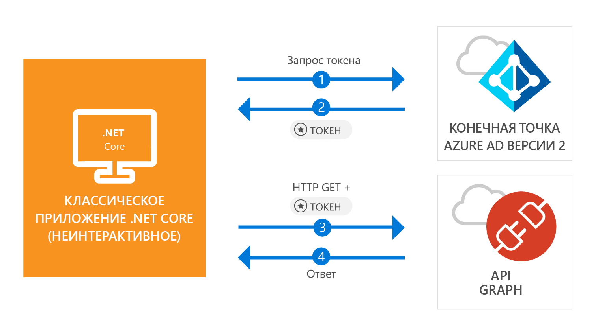

# <a name="quickstart-acquire-a-token-and-call-microsoft-graph-api-from-a-console-app-using-apps-identity"></a>Краткое руководство. Получение маркера безопасности и вызов API Microsoft Graph из консольного приложения с помощью удостоверения приложения

[!INCLUDE [active-directory-develop-applies-v2-msal](../../../includes/active-directory-develop-applies-v2-msal.md)]

В этом кратком руководстве вы узнаете, как создать приложение .NET Core, которое может получить маркер доступа, используя собственное удостоверение приложения, а затем вызвать API Microsoft Graph для отображения [списка пользователей](https://docs.microsoft.com/graph/api/user-list) в каталоге. Этот сценарий полезен в ситуациях, где автономное, автоматическое задание или службу Windows необходимо запустить с использованием удостоверения приложения, а не удостоверения пользователя.



## <a name="prerequisites"></a>Предварительные требования

Для работы с этим кратким руководством вам понадобится [.NET Core 2.1](https://www.microsoft.com/net/download/dotnet-core/2.1).

> [!div renderon="docs"]
> ## <a name="register-and-download-your-quickstart-app"></a>Регистрация и скачивание приложения, используемого в этом кратком руководстве

> [!div renderon="docs" class="sxs-lookup"]
>
> У вас есть два варианта запуска приложения, используемого в этом кратком руководстве:
> * [Экспресс-способ] [Вариант 1. Регистрация и автоматическая настройка приложения, а затем скачивание примера кода](#option-1-register-and-auto-configure-your-app-and-then-download-your-code-sample)
> * [Вручную] [Вариант 2. Регистрация и настройка приложения и примера кода вручную](#option-2-register-and-manually-configure-your-application-and-code-sample)
>
> ### <a name="option-1-register-and-auto-configure-your-app-and-then-download-your-code-sample"></a>Вариант 1. Регистрация и автоматическая настройка приложения, а затем скачивание примера кода
>
> 1. Откройте [Регистрация приложений (предварительная версия)](https://portal.azure.com/?Microsoft_AAD_RegisteredApps=true#blade/Microsoft_AAD_RegisteredApps/applicationsListBlade/quickStartType/DotNetCoreDaemonQuickstartPage/sourceType/docs) на портале Azure.
> 1. Введите имя приложения и нажмите кнопку **Зарегистрировать**.
> 1. Следуйте инструкциям, чтобы быстро скачать и автоматически настроить новое приложение.
>
> ### <a name="option-2-register-and-manually-configure-your-application-and-code-sample"></a>Вариант 2. Регистрация и настройка приложения и примера кода вручную

> [!div renderon="docs"]
> #### <a name="step-1-register-your-application"></a>Шаг 1. Регистрация приложения
> Чтобы зарегистрировать приложение и добавить сведения о его регистрации в решение вручную, сделайте следующее:
>
> 1. Войдите на [портал Azure](https://portal.azure.com) с помощью личной учетной записи Майкрософт либо рабочей или учебной учетной записи.
> 1. Если учетная запись предоставляет доступ нескольким клиентам, выберите свою учетную запись в правом верхнем углу и нужный клиент Azure AD для этого сеанса портала.
> 1. В области навигации слева выберите службу **Azure Active Directory**, а затем выберите **Регистрация приложений (предварительная версия)** > **Новая регистрация**.
> 1. В разделе **Имя** введите понятное имя приложения, которое будет отображаться пользователям приложения, например `Daemon-console`, а затем выберите **Зарегистрировать**, чтобы создать приложение.
> 1. После регистрации выберите меню **Сертификаты и секреты**.
> 1. В разделе **Секреты клиента** выберите **+ Новый секрет клиента**. Назначьте ему имя и выберите **Добавить**. Скопируйте секрет в безопасное место. Его нужно будет использовать в коде.
> 1. Теперь выберите меню **Разрешения API**, нажмите кнопку **+ Добавить разрешение** и выберите **Microsoft Graph**.
> 1. Выберите **Разрешения приложений**.
> 1. В узле **Пользователь** выберите **User.Read.All**, а затем щелкните **Добавить разрешения**.

> [!div class="sxs-lookup" renderon="portal"]
> ### <a name="download-and-configure-your-quickstart-app"></a>Скачивание и настройка приложения, используемого в этом кратком руководстве
> 
> #### <a name="step-1-configure-your-application-in-azure-portal"></a>Шаг 1. Настройка приложения на портале Azure
> Для работы примера кода в этом кратком руководстве необходимо создать секрет клиента и добавить разрешение приложения API Graph **User.Read.All**.
> > [!div renderon="portal" id="makechanges" class="nextstepaction"]
> > [Внести эти изменения для меня]()
>
> > [!div id="appconfigured" class="alert alert-info"]
> > . Ваше приложение настроено с помощью этих атрибутов.

#### <a name="step-2-download-your-visual-studio-project"></a>Шаг 2. Скачивание проекта Visual Studio

[Скачайте проект Visual Studio](https://github.com/Azure-Samples/active-directory-dotnetcore-daemon-v2/archive/master.zip)

#### <a name="step-3-configure-your-visual-studio-project"></a>Шаг 3. Настройка проекта Visual Studio

1. Извлеките ZIP-файл в локальную папку, расположенную как можно ближе к корню диска (например, **C:\Azure-Samples**).
1. Откройте решение в Visual Studio — **daemon-console.sln** (необязательно).
1. Измените файл **appsettings.json**, заменив значения полей `ClientId`, `Tenant` и `ClientSecret` следующими:

    ```json
    "Tenant": "Enter_the_Tenant_Id_Here",
    "ClientId": "Enter_the_Application_Id_Here",
    "ClientSecret": "Enter_the_Client_Secret_Here"
    ```
    > > [!div renderon="portal" id="certandsecretspage" class="sxs-lookup"]
    > > [Создание секрета клиента]()
    
    > [!div renderon="docs"]
    >> Описание
    >> * `Enter_the_Application_Id_Here` — это **идентификатор приложения (клиента)**, которое вы зарегистрировали.
    >> * `Enter_the_Tenant_Id_Here` — замените это значение на **идентификатор клиента** или **имя клиента** (например, contoso.microsoft.com).
    >> * `Enter_the_Client_Secret_Here` — замените это значение на секрет клиента, созданный на шаге 1.

    > [!div renderon="docs"]
    > > [!TIP]
    > > Чтобы найти значения параметров **Идентификатор приложения (клиента)** и **Идентификатор каталога (клиента)**, на портале Azure перейдите на страницу приложения **Обзор**. Чтобы создать ключ, перейдите на страницу **Сертификаты и секреты**.
    
#### <a name="step-4-admin-consent"></a>Шаг 4. Согласие администратора

Любому *разрешению только для приложения* требуется согласие администратора. Это означает, что глобальный администратор каталога должен дать согласие приложению. Выберите один из приведенных ниже вариантов в зависимости от своей роли.

##### <a name="global-tenant-administrator"></a>Глобальный администратор клиента

> [!div renderon="docs"]
> Если вы являетесь глобальным администратором клиента, перейдите на страницу **Разрешения API** в разделе регистрации приложения (предварительная версия) на портале Azure и выберите **Предоставить согласие администратора для {имя каталога}**.

> [!div renderon="portal" class="sxs-lookup"]
> Если вы являетесь глобальным администратором, перейдите на страницу **Разрешения API** и выберите **Предоставить согласия администратора для имя_клиента**.
> > [!div id="apipermissionspage"]
> > [Переход на страницу "Разрешения API"]()

##### <a name="standard-user"></a>Обычный пользователь

Если вы являетесь обычным пользователем клиента, то необходимо попросить глобального администратора предоставить согласие администратора для вашего приложения. Чтобы сделать это, предоставьте следующий URL-адрес администратору:

```url
https://login.microsoftonline.com/Enter_the_Tenant_Id_Here/adminconsent?client_id=Enter_the_Application_Id_Here
```

> [!div renderon="docs"]
>> Описание
>> * `Enter_the_Tenant_Id_Here` — замените это значение на **идентификатор клиента** или **имя клиента** (например, contoso.microsoft.com).
>> * `Enter_the_Application_Id_Here` — это **идентификатор приложения (клиента)**, которое вы зарегистрировали.

> [!NOTE]
> После предоставления согласия для приложения с использованием предыдущего URL-адреса может появиться ошибка *AADSTS50011: для приложения не зарегистрирован адрес ответа*. Это происходит из-за того, что у этого приложения и URL-адреса нет URI перенаправления. Игнорируйте эту ошибку.

#### <a name="step-5-run-the-application"></a>Шаг 5. Выполнение приложения

Если вы используете Visual Studio, нажмите клавишу **F5** для запуска приложения, в противном случае запустите приложение с помощью командной строки или консоли.

```console
cd {ProjectFolder}\daemon-console
dotnet run
```

> Описание
> * *{ProjectFolder}* — это папка, куда вы извлекли ZIP-файл. Например, **C:\Azure-Samples\active-directory-dotnetcore-daemon-v2**.

В результате вы увидите список пользователей в каталоге Azure AD.

## <a name="more-information"></a>Дополнительные сведения

### <a name="msalnet"></a>MSAL.NET

MSAL ([Microsoft.Identity.Client](https://www.nuget.org/packages/Microsoft.Identity.Client)) — это библиотека, используемая для регистрации пользователей и запросов маркеров безопасности, которые используются при доступе к API, защищенному Microsoft Azure Active Directory (Azure AD). Как описано выше, в этом кратком руководстве маркеры запрашиваются с использованием собственного удостоверения приложения вместо делегированных разрешений. Поток проверки подлинности, используемый в данном случае, называется *[потоком учетных данных клиента OAuth](v2-oauth2-client-creds-grant-flow.md)*. Дополнительные сведения о том, как использовать MSAL.NET с потоком учетных данных клиента см. [в этой статье](https://aka.ms/msal-net-client-credentials).

 MSAL.NET можно установить, выполнив в **консоли диспетчера пакетов** Visual Studio следующую команду.

```powershell
Install-Package Microsoft.Identity.Client -Pre
```

### <a name="msal-initialization"></a>Инициализация MSAL

Добавив следующий код, вы можете добавить ссылку на MSAL.

```csharp
using Microsoft.Identity.Client;
```

Затем выполните инициализацию MSAL с помощью следующего кода.

```csharp
ClientCredential clientCredentials = new ClientCredential(secret: config.ClientSecret);

var app = new ConfidentialClientApplication(
    clientId: config.ClientId, 
    authority: config.Authority, 
    redirectUri: "https://daemon", 
    clientCredential: clientCredentials, 
    userTokenCache: null, 
    appTokenCache: new TokenCache()
);
```

> | Описание ||
> |---------|---------|
> | `secret` | Секрет клиента, созданный для приложения на портале Azure. |
> | `clientId` | **Идентификатор приложения (клиента)**, зарегистрированного на портале Azure. Это значение можно найти на странице приложения **Обзор** на портале Azure. |
> | `Authority`    | (Необязательно.) Конечная точка службы токенов безопасности для проверки подлинности пользователей. Обычно https://login.microsoftonline.com/{tenant} для общедоступного облака, где {tenant} — имя или идентификатор вашего клиента.|
> | `redirectUri`  | URL-адрес, куда пользователи переходят после проверки подлинности. Так как это консольное или неинтерактивное приложение, в этом случае этот параметр не используется. |
> | `clientCredentials`  | Объект учетных данных клиента, содержащий секрет или сертификат. |
> | `userTokenCache`  | Экземпляр кэша маркеров для пользователя. Так как это приложение выполняется в контексте приложения, а не пользователя, в этом случае значением будет null.|
> | `appTokenCache`  | Экземпляр кэша маркеров для приложения.|

Дополнительные сведения см. в [справочной документации по `ConfidentialClientApplication`](https://docs.microsoft.com/dotnet/api/microsoft.identity.client.confidentialclientapplication.-ctor?view=azure-dotnet#Microsoft_Identity_Client_ConfidentialClientApplication__ctor_System_String_System_String_System_String_Microsoft_Identity_Client_ClientCredential_Microsoft_Identity_Client_TokenCache_Microsoft_Identity_Client_TokenCache).

### <a name="requesting-tokens"></a>Запрос маркеров

Чтобы запросить маркер с помощью удостоверение приложения, используйте метод `AcquireTokenForClientAsync`.

```csharp
result = await app.AcquireTokenForClientAsync(scopes);
```

> |Описание| |
> |---------|---------|
> | `scopes` | Содержит запрошенные области. Для конфиденциальных клиентов следует использовать формат, аналогичный `{Application ID URI}/.default`, который указывает, что запрашиваемые области — это те, которые статически определены в объекте приложения, заданном на портале Azure (для Microsoft Graph `{Application ID URI}` указывает на `https://graph.microsoft.com`). Для пользовательских веб-API `{Application ID URI}` определяется в разделе **Предоставление API** в разделе регистрации приложения (предварительная версия) на портале Azure. |

Дополнительные сведения см. в [справочной документации по `AcquireTokenForClientAsync`](https://docs.microsoft.com/dotnet/api/microsoft.identity.client.confidentialclientapplication.acquiretokenforclientasync?view=azure-dotnet#Microsoft_Identity_Client_ConfidentialClientApplication_AcquireTokenForClientAsync_System_Collections_Generic_IEnumerable_System_String__).

[!INCLUDE [Help and support](../../../includes/active-directory-develop-help-support-include.md)]

## <a name="next-steps"></a>Дополнительная информация

Дополнительные сведения о разрешениях и согласии:

> [!div class="nextstepaction"]
> [Разрешения и согласие](v2-permissions-and-consent.md)

Чтобы узнать больше о потоке проверки подлинности для этого сценария, ознакомьтесь с потоком учетных данных клиента OAuth 2.0:

> [!div class="nextstepaction"]
> [Поток учетных данных клиента OAuth](v2-oauth2-client-creds-grant-flow.md)

> [!div class="nextstepaction"]
> [Потоки учетных данных клиента с использованием MSAL.NET](https://aka.ms/msal-net-client-credentials)