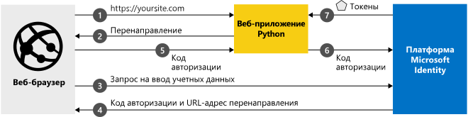

# <a name="quickstart-add-sign-in-with-microsoft-to-a-python-web-app"></a>Краткое руководство. Добавление возможности входа в веб-приложение Python с помощью учетной записи Майкрософт

[!INCLUDE [active-directory-develop-applies-v2](../../../includes/active-directory-develop-applies-v2.md)]

В этом кратком руководстве вы узнаете, как интегрировать веб-приложение Python с Платформой удостоверений Майкрософт. Ваше приложение сможет авторизовать пользователя, получить маркер доступа для вызова API Microsoft Graph и выполнить запрос к API Microsoft Graph.

Когда вы завершите работу с этим руководством, ваше приложение сможет принимать операции входа с помощью личных учетных записей Майкрософт (включая outlook.com, live.com и другие), а также рабочих или учебных учетных записей из любой компании или организации, в которых используется Azure Active Directory.



## <a name="prerequisites"></a>Предварительные требования

Для запуска этого примера потребуется:

- [Python 2.7+](https://www.python.org/downloads/release/python-2713) или [Python 3+](https://www.python.org/downloads/release/python-364/)
- [Flask](http://flask.pocoo.org/), [Flask-сеанс](https://pythonhosted.org/Flask-Session/), [запросы](https://2.python-requests.org/en/master/)
- [MSAL Python](https://github.com/AzureAD/microsoft-authentication-library-for-python) 
- Клиент Azure Active Directory (Azure AD). Дополнительные сведения о том, как получить клиент Azure AD, см. в статье [Как получить клиент Azure AD.](https://docs.microsoft.com/azure/active-directory/develop/quickstart-create-new-tenant)

> [!div renderon="docs"]
>
> ## <a name="register-and-download-your-quickstart-app"></a>Регистрация и скачивание приложения, используемого в этом кратком руководстве
>
> У вас есть два варианта запуска приложения, используемого в этом кратком руководстве: оперативно (вариант 1) и вручную (вариант 2)
>
> ### <a name="option-1-register-and-auto-configure-your-app-and-then-download-your-code-sample"></a>Вариант 1. Регистрация и автоматическая настройка приложения, а затем скачивание примера кода
>
> 1. Откройте [Регистрация приложений](https://portal.azure.com/#blade/Microsoft_AAD_IAM/ActiveDirectoryMenuBlade/RegisteredApps) на портале Azure.
> 1. Выберите **Новая регистрация**.
> 1. Введите имя приложения и нажмите кнопку **Зарегистрировать**.
> 1. Следуйте инструкциям, чтобы быстро скачать и автоматически настроить новое приложение.
>
> ### <a name="option-2-register-and-manually-configure-your-application-and-code-sample"></a>Вариант 2. Регистрация и настройка приложения и примера кода вручную
>
> #### <a name="step-1-register-your-application"></a>Шаг 1. Регистрация приложения
>
> Чтобы зарегистрировать приложение и добавить сведения о его регистрации в решение вручную, сделайте следующее:
>
> 1. Войдите на [портал Azure](https://portal.azure.com) с помощью личной учетной записи Майкрософт либо рабочей или учебной учетной записи.
> 1. Если учетная запись предоставляет доступ нескольким клиентам, выберите свою учетную запись в правом верхнем углу и нужный клиент Azure AD для этого сеанса портала.
> 1. Перейдите на страницу [Регистрация приложений](https://go.microsoft.com/fwlink/?linkid=2083908) Платформы удостоверений Майкрософт для разработчиков.
> 1. Выберите **Новая регистрация**.
> 1. После появления страницы **Регистрация приложения** введите сведения о регистрации приложения:
>      - В разделе **Имя** введите понятное имя приложения, которое будет отображаться пользователям приложения, например `python-webapp`.
>      - В разделе **Поддерживаемые типы учетных записей** выберите **Accounts in any organizational directory and personal Microsoft accounts** (Учетные записи в любом каталоге организации и личные учетные записи Майкрософт).
>      - В разделе **URI перенаправления** в раскрывающемся списке выберите **Веб-платформа**, а затем задайте значение `http://localhost:5000/getAToken`.
>      - Выберите **Зарегистрировать**. На странице приложения **Обзор** запишите **идентификатор приложения (клиента)** для использования в будущем.
> 1. В левом меню выберите **Сертификаты и секреты** и выберите **Новый секрет клиента** в разделе **Секреты клиента**:
>
>      - Введите описание ключа (экземпляр секрета приложения).
>      - Выберите срок действия ключа**в 1 год**.
>      - При нажатии кнопки **Добавить** будет отображаться значение ключа.
>      - Скопируйте значение ключа. Оно понадобится вам позднее.
>
> [!div class="sxs-lookup" renderon="portal"]
>
> #### <a name="step-1-configure-your-application-in-azure-portal"></a>Шаг 1. Настройка приложения на портале Azure
>
> Для работы примера кода в этом кратком руководстве необходимо:
>
> 1. Добавьте URL-адрес для ответа как`http://localhost:5000/getAToken`.
> 1. Создание Секрета клиента.
>
> > [!div renderon="portal" id="makechanges" class="nextstepaction"]
> > [Внести это изменение для меня]()
> > [!div id="appconfigured" class="alert alert-info"]
> >  Ваше приложение настроено с использованием этого атрибута

#### <a name="step-2-download-your-project"></a>Шаг 2. Скачивание проекта

[Скачайте пример кода.](https://github.com/Azure-Samples/ms-identity-python-webapp/archive/master.zip)

#### <a name="step-3-configure-the-application"></a>Шаг 3. Настройка приложения

1. Извлеките ZIP-файл в локальную папку, расположенную как можно ближе к корневой папке (например, **C:\Azure-Samples**).
1. Если вы используете интегрированную среду разработки, откройте образец в вашей избранной интегрированной среде разработки (необязательно).
1. Откройте файл **app_config.py**, который можно найти в корневой папке, и замените его следующим фрагментом кода:

```python
AUTHORITY = "https://login.microsoftonline.com/Enter_the_Tenant_Name_Here"
CLIENT_ID = "Enter_the_Application_Id_here"
CLIENT_SECRET = "Enter_the_Client_Secret_Here"
SCOPE = ["https://graph.microsoft.com/User.Read"]
REDIRECT_URI = "http://localhost:5000/getAToken"
```

> [!div renderon="docs"]
> Описание
>
> - `Enter_the_Application_Id_here` — идентификатор регистрируемого приложения.
> - `Enter_the_Tenant_Info_Here` — один из следующих вариантов:
>   - Если ваше приложение поддерживает вариант **Только моя организация**, замените это значение на **идентификатор клиента** или **имя клиента** (например contoso.onmicrosoft.com).
>   - Если ваше приложение поддерживает вариант **Учетные записи в любом каталоге организации**, замените это значение на `organizations`.
>   - Если приложение поддерживает вариант **Все пользователи с учетными записями Майкрософт**, замените это значение на `common`.
> - `Enter_the_Client_Secret_Here` — это **Секрет клиента**, созданного вами в пункте **Сертификаты и Секреты** для зарегистрированного приложения.

#### <a name="step-4-run-the-code-sample"></a>Шаг 4. Запуск примера кода

- Вам потребуется установить библиотеку Python MSAL, Flask Framework, Flask-Sessions для управления сеансами на стороне сервера и выполнения запросов с помощью PIP следующим образом:

```Shell
pip install msal
pip install flask
pip install Flask-Session
pip install requests
```

- Если переменная среды для Flask уже задана: Запустите "app.py" из оболочки или командной строки:

```Shell
python app.py
```

- Если переменная среды для Flask еще не задана:

    1. Введите следующие команды в оболочку или в командную строку, перейдя в каталог проекта:

```Shell
export FLASK_APP=app.py
export FLASK_DEBUG=1
flask run
```

[!INCLUDE [Help and support](../../../includes/active-directory-develop-help-support-include.md)]
