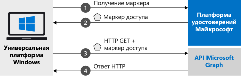

# <a name="quickstart-call-the-microsoft-graph-api-from-a-universal-windows-platform-uwp-application"></a>Краткое руководство. Вызов API Microsoft Graph из приложения для универсальной платформы Windows (UWP)

В этом кратком руководстве содержится пример кода, который демонстрирует, как приложение универсальной платформы Windows (UWP) может входить от имени пользователей в личные, рабочие и учебные учетные записи, получать маркер доступа и вызывать API Microsoft Graph.



> [!div renderon="docs"]
> ## <a name="register-and-download-your-quickstart-app"></a>Регистрация и скачивание приложения, используемого в этом кратком руководстве
> [!div renderon="docs" class="sxs-lookup"]
> У вас есть два варианта запуска приложения, используемого в этом кратком руководстве:
> * [Экспресс-способ] [Вариант 1. Регистрация и автоматическая настройка приложения, а затем скачивание примера кода](#option-1-register-and-auto-configure-your-app-and-then-download-your-code-sample)
> * [Вручную] [Вариант 2. Регистрация и настройка приложения и примера кода вручную](#option-2-register-and-manually-configure-your-application-and-code-sample)
>
> ### <a name="option-1-register-and-auto-configure-your-app-and-then-download-your-code-sample"></a>Вариант 1. Регистрация и автоматическая настройка приложения, а затем скачивание примера кода
>
> 1. Откройте на [портале Azure новую панель регистрации приложений](https://portal.azure.com/#blade/Microsoft_AAD_RegisteredApps/applicationsListBlade/quickStartType/UwpQuickstartPage/sourceType/docs).
> 1. Введите имя своего приложения и щелкните **Зарегистрировать**.
> 1. Следуйте инструкциям для загрузки и автоматической настройки нового приложения одним щелчком мыши.
>
> ### <a name="option-2-register-and-manually-configure-your-application-and-code-sample"></a>Вариант 2. Регистрация и настройка приложения и примера кода вручную
> [!div renderon="docs"]
> #### <a name="step-1-register-your-application"></a>Шаг 1. Регистрация приложения
> Чтобы зарегистрировать приложение и добавить сведения о его регистрации в решение, сделайте следующее:
> 1. Войдите на [портал Azure](https://portal.azure.com) с помощью личной учетной записи Майкрософт либо рабочей или учебной учетной записи.
> 1. Если учетная запись предоставляет доступ нескольким клиентам, выберите свою учетную запись в правом верхнем углу и нужный клиент Azure AD для этого сеанса портала.
> 1. Перейдите на страницу [Регистрация приложений](https://aka.ms/MobileAppReg) Платформы удостоверений Майкрософт для разработчиков.
> 1. Выберите **Новая регистрация**.
> 1. После появления страницы **Регистрация приложения** введите сведения о регистрации приложения:
>      - В разделе **Имя** введите понятное имя приложения, которое будет отображаться пользователям приложения, например `UWP-App-calling-MsGraph`.
>      - В разделе **Поддерживаемые типы учетных записей** выберите **Accounts in any organizational directory and personal Microsoft accounts (for example, Skype, Xbox, Outlook.com)** (Учетные записи в любом каталоге организации и личные учетные записи Майкрософт (например, Skype, Xbox, Outlook.com)).
>      - Выберите **Зарегистрировать**, чтобы создать приложение.
> 1. В списке страниц приложения выберите **Проверка подлинности**.
> 1. Разверните раздел **Desktop + devices** (Настольный компьютер и устройства).  (Если раздел **Desktop + devices** (Настольный компьютер и устройства) не отображается, сначала щелкните верхний баннер, чтобы просмотреть краткие сведения об аутентификации)
> 1. В разделе **URI перенаправления** выберите **Добавить URI**.  Введите **urn:ietf:wg:oauth:2.0:oob**.
> 1. Щелкните **Сохранить**.

> [!div renderon="portal" class="sxs-lookup alert alert-info"]
> #### <a name="step-1-configure-your-application"></a>Шаг 1. Настройка приложения
> Для работы примера кода в этом кратком руководстве необходимо добавить URI перенаправления в виде **urn:ietf:wg:oauth:2.0:oob**.
> > [!div renderon="portal" id="makechanges" class="nextstepaction"]
> > [Внести это изменение для меня]()
>
> > [!div id="appconfigured" class="alert alert-info"]
> > . Ваше приложение настроено с помощью этих атрибутов.

#### <a name="step-2-download-your-visual-studio-project"></a>Шаг 2. Скачивание проекта Visual Studio

 - [Скачайте проект Visual Studio](https://github.com/Azure-Samples/active-directory-dotnet-native-uwp-v2/archive/msal3x.zip)

#### <a name="step-3-configure-your-visual-studio-project"></a>Шаг 3. Настройка проекта Visual Studio

1. Извлеките ZIP-файл в локальную папку, расположенную как можно ближе к корню диска (например, **C:\Azure-Samples**).
1. Откройте проект в Visual Studio. Может появиться запрос на установку пакета SDK UWP. Примите его.
1. Измените файл **MainPage.Xaml.cs**, заменив значение поля `ClientId`:

    ```csharp
    private const string ClientId = "Enter_the_Application_Id_here";
    ```

> [!div renderon="docs"]
> Описание
> - `Enter_the_Application_Id_here` — идентификатор регистрируемого приложения.
>
> > [!TIP]
> > Чтобы найти *идентификатор приложения*, перейдите в раздел **Обзор** на портале.

#### <a name="step-4-run-your-application"></a>Шаг 4. Запуск приложения

Для работы с этим кратким руководством на компьютере Windows:

1. На панели инструментов Visual Studio выберите нужную платформу (**x64** или **x86**, но не ARM).
   > Проследите, чтобы значение для целевого устройства изменилось с *Устройство* на *Локальный компьютер*.
1. Выберите "Отладка", а затем — **Запуск без отладки**.

## <a name="more-information"></a>Дополнительные сведения

Этот раздел содержит дополнительные сведения о работе с этим кратким руководством.

### <a name="msalnet"></a>MSAL.NET

MSAL ([Microsoft.Identity.Client](https://www.nuget.org/packages/Microsoft.Identity.Client)) — это библиотека, используемая для выполнения входа пользователей и запросов маркеров безопасности. Маркеры безопасности нужны для доступа к API, защищенному платформой удостоверений Майкрософт для разработчиков. MSAL можно установить, выполнив в *консоли диспетчера пакетов* Visual Studio следующую команду.

```powershell
Install-Package Microsoft.Identity.Client -IncludePrerelease
```

### <a name="msal-initialization"></a>Инициализация MSAL

Добавив следующий код, вы можете добавить ссылку на MSAL.

```csharp
using Microsoft.Identity.Client;
```

Затем выполните инициализацию MSAL с помощью следующего кода:

```csharp
public static IPublicClientApplication PublicClientApp;
PublicClientApp = new PublicClientApplicationBuilder.Create(ClientId)
                                                    .Build();
```

> |Описание ||
> |---------|---------|
> | `ClientId` | **Идентификатор приложения (клиента)**, зарегистрированного на портале Azure. Это значение можно найти на странице приложения **Обзор** на портале Azure. |

### <a name="requesting-tokens"></a>Запрос маркеров

В MSAL есть два метода получения маркеров в приложении UWP: `AcquireTokenInteractive` и `AcquireTokenSilent`.

#### <a name="get-a-user-token-interactively"></a>Интерактивное получение маркера пользователя

В некоторых ситуациях необходимо принудительное взаимодействие пользователя с конечной точкой платформы удостоверений Майкрософт через всплывающее окно, чтобы подтвердить учетные данные или предоставить согласие. Некоторые примеры:

- первый вход пользователей в приложение;
- когда пользователям может потребоваться повторно ввести учетные данные, так как истек срок действия пароля;
- когда ваше приложение запрашивает доступ к ресурсу, для чего пользователь должен предоставить согласие;
- когда требуется двухфакторная проверка подлинности.

```csharp
authResult = await App.PublicClientApp.AcquireTokenInteractive(scopes)
                      .ExecuteAsync();
```

> |Описание||
> |---------|---------|
> | `scopes` | Содержит запрашиваемые области (такие как `{ "user.read" }` для Microsoft Graph или `{ "api://<Application ID>/access_as_user" }` для пользовательских веб-API). |

#### <a name="get-a-user-token-silently"></a>Автоматическое получение маркера пользователя

Используйте метод `AcquireTokenSilent`, чтобы получить маркеры безопасности для доступа к защищенным ресурсам после первоначального метода `AcquireTokenAsync`. Вы не хотите требовать от пользователя проверки своих учетных данных каждый раз, когда ему необходимо получить доступ к ресурсу. Большую часть времени вы хотите приобретать и обновлять маркеры без какого-либо взаимодействия с пользователем.

```csharp
var accounts = await App.PublicClientApp.GetAccountsAsync();
var firstAccount = accounts.FirstOrDefault();
authResult = await App.PublicClientApp.AcquireTokenSilent(scopes, firstAccount)
                                      .ExecuteAsync();
```

> |Описание ||
> |---------|---------|
> | `scopes` | Содержит запрашиваемые области (такие как `{ "user.read" }` для Microsoft Graph или `{ "api://<Application ID>/access_as_user" }` для пользовательских веб-API) |
> | `firstAccount` | Указывает первую учетную запись пользователя в кэше (MSAL поддерживает нескольких пользователей в одном приложении) |

[!INCLUDE [Help and support](../../../includes/active-directory-develop-help-support-include.md)]

## <a name="next-steps"></a>Дополнительная информация

В руководстве по классическому приложению Windows вы найдете пошаговые инструкции по созданию приложений и компонентов, в том числе полное описание того, о чем говорится в этом кратком руководстве.

> [!div class="nextstepaction"]
> [Вызов API Microsoft Graph из приложения для универсальной платформы Windows (XAML)](tutorial-v2-windows-uwp.md)
