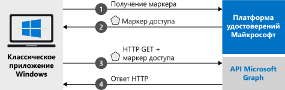

# <a name="quickstart-acquire-a-token-and-call-microsoft-graph-api-from-a-windows-desktop-app"></a>Краткое руководство. Получение маркера безопасности и вызов API Microsoft Graph из классического приложения Windows

Из этого краткого руководства вы узнаете, как скачать и выполнить пример кода. В примере кода показано, как в классическом приложении .NET для Windows (WPF) реализовать вход пользователей и получение маркера доступа для вызова API Microsoft Graph. 

Иллюстрацию см. в разделе [Как работает этот пример](#how-the-sample-works).

> [!div renderon="docs"]
> ## <a name="prerequisites"></a>Предварительные требования
>
> * [Visual Studio 2019](https://visualstudio.microsoft.com/vs/) с установленной рабочей нагрузкой [Разработка приложений для универсальной платформы Windows](/windows/uwp/get-started/get-set-up).
>
> ## <a name="register-and-download-your-quickstart-app"></a>Регистрация и скачивание приложения, используемого в этом кратком руководстве
> У вас есть два варианта запуска приложения, используемого в этом кратком руководстве:
> * [Экспресс-способ] [Вариант 1. Регистрация и автоматическая настройка приложения, а затем скачивание примера кода](#option-1-register-and-auto-configure-your-app-and-then-download-your-code-sample)
> * [Вручную] [Вариант 2. Регистрация и настройка приложения и примера кода вручную](#option-2-register-and-manually-configure-your-application-and-code-sample)
>
> ### <a name="option-1-register-and-auto-configure-your-app-and-then-download-your-code-sample"></a>Вариант 1. Регистрация и автоматическая настройка приложения, а затем скачивание примера кода
>
> 1. Перейдите к интерфейсу быстрого запуска <a href="https://portal.azure.com/#blade/Microsoft_AAD_RegisteredApps/applicationsListBlade/quickStartType/WinDesktopQuickstartPage/sourceType/docs" target="_blank">Портал Azure > Регистрация приложений<span class="docon docon-navigate-external x-hidden-focus"></span></a>.
> 1. Введите имя приложения и нажмите кнопку **Зарегистрировать**.
> 1. Следуйте инструкциям, чтобы быстро скачать и автоматически настроить новое приложение.
>
> ### <a name="option-2-register-and-manually-configure-your-application-and-code-sample"></a>Вариант 2. Регистрация и настройка приложения и примера кода вручную
>
> #### <a name="step-1-register-your-application"></a>Шаг 1. Регистрация приложения
> Чтобы зарегистрировать приложение и добавить сведения о его регистрации в решение вручную, сделайте следующее:
>
> 1. Войдите на <a href="https://portal.azure.com/" target="_blank">портал Azure<span class="docon docon-navigate-external x-hidden-focus"></span></a>.
> 1. Если у вас есть доступ к нескольким клиентам, в верхнем меню используйте фильтр **Каталог и подписка** :::image type="icon" source="./media/common/portal-directory-subscription-filter.png" border="false":::, чтобы выбрать клиент, в котором следует зарегистрировать приложение.
> 1. Найдите и выберите **Azure Active Directory**.
> 1. В разделе **Управление** выберите **Регистрация приложений** > **Создать регистрацию**.
> 1. Введите **имя** приложения, например `Win-App-calling-MsGraph`. Пользователи приложения могут видеть это имя. Вы можете изменить его позже.
> 1. В разделе **Поддерживаемые типы учетных записей** выберите **Accounts in any organizational directory and personal Microsoft accounts (for example, Skype, Xbox, Outlook.com)** (Учетные записи в любом каталоге организации и личные учетные записи Майкрософт (например, Skype, Xbox, Outlook.com)).
> 1. Выберите **Зарегистрировать**, чтобы создать приложение.
> 1. В разделе **Управление** выберите **Проверка подлинности**.
> 1. Поочередно выберите **Добавить платформу** > **Мобильные и классические приложения**.
> 1. В разделе **URI перенаправления** выберите `https://login.microsoftonline.com/common/oauth2/nativeclient`.
> 1. Нажмите кнопку **Настроить**.

> [!div class="sxs-lookup" renderon="portal"]
> #### <a name="step-1-configure-your-application-in-azure-portal"></a>Шаг 1. Настройка приложения на портале Azure
> Для работы примера кода в этом кратком руководстве необходимо добавить URL-адрес ответа **https://login.microsoftonline.com/common/oauth2/nativeclient** .
> > [!div renderon="portal" id="makechanges" class="nextstepaction"]
> > [Внести это изменение для меня]()
>
> > [!div id="appconfigured" class="alert alert-info"]
> > . Ваше приложение настроено с помощью этих атрибутов.

#### <a name="step-2-download-your-visual-studio-project"></a>Шаг 2. Скачивание проекта Visual Studio

> [!div renderon="docs"]
> [Скачайте проект Visual Studio](https://github.com/Azure-Samples/active-directory-dotnet-desktop-msgraph-v2/archive/msal3x.zip)

> [!div class="sxs-lookup" renderon="portal"]
> Запустите проект с помощью Visual Studio 2019.
> [!div renderon="portal" id="autoupdate" class="sxs-lookup nextstepaction"]
> [Скачивание примера кода](https://github.com/Azure-Samples/active-directory-dotnet-desktop-msgraph-v2/archive/msal3x.zip)

> [!div class="sxs-lookup" renderon="portal"]
> #### <a name="step-3-your-app-is-configured-and-ready-to-run"></a>Шаг 3. Приложение настроено и готово к запуску
> Мы уже настроили для проекта нужные значения свойств приложения, и его можно запускать.

> [!div class="sxs-lookup" renderon="portal"]
> > [!NOTE]
> > `Enter_the_Supported_Account_Info_Here`

> [!div renderon="docs"]
> #### <a name="step-3-configure-your-visual-studio-project"></a>Шаг 3. Настройка проекта Visual Studio
> 1. Извлеките ZIP-файл в локальную папку, расположенную как можно ближе к корню диска (например, **C:\Azure-Samples**).
> 1. Откройте проект в Visual Studio.
> 1. Измените файл **App.Xaml.cs**, заменив значения полей `ClientId` и `Tenant` следующим кодом:
>
>    ```csharp
>    private static string ClientId = "Enter_the_Application_Id_here";
>    private static string Tenant = "Enter_the_Tenant_Info_Here";
>    ```
>
> Где:
> - `Enter_the_Application_Id_here` — это **идентификатор приложения (клиента)** , которое вы зарегистрировали.
> - `Enter_the_Tenant_Info_Here` может иметь несколько значений.
>   - Если приложение поддерживает **учетные записи только в этом каталоге организации**, замените это значение **идентификатором клиента** или **именем клиента** (например, contoso.microsoft.com).
>   - Если ваше приложение поддерживает вариант **Учетные записи в любом каталоге организации**, замените это значение на `organizations`.
>   - Если приложение поддерживает **учетные записи в любом каталоге организации и личные учетные записи Майкрософт**, укажите значение `common`.
>
> > [!TIP]
> > Чтобы найти значения параметров **Идентификатор приложения (клиента)** , **Идентификатор каталога (клиента)** и **Поддерживаемые типы учетных записей**, на портале Azure перейдите на страницу **Обзор**.

## <a name="more-information"></a>Дополнительные сведения

### <a name="how-the-sample-works"></a>Как работает этот пример


### <a name="msalnet"></a>MSAL.NET
MSAL ([Microsoft.Identity.Client](https://www.nuget.org/packages/Microsoft.Identity.Client)) — это библиотека, используемая для выполнения входа пользователей и запросов маркеров, которые нужны для доступа к API, защищенному платформой удостоверений Майкрософт. MSAL можно установить, выполнив в **консоли диспетчера пакетов** Visual Studio следующую команду.

```powershell
Install-Package Microsoft.Identity.Client -IncludePrerelease
```

### <a name="msal-initialization"></a>Инициализация MSAL

Добавив следующий код, вы можете добавить ссылку на MSAL.

```csharp
using Microsoft.Identity.Client;
```

Затем выполните инициализацию MSAL с помощью следующего кода.

```csharp
public static IPublicClientApplication PublicClientApp;
PublicClientApplicationBuilder.Create(ClientId)
                .WithRedirectUri("https://login.microsoftonline.com/common/oauth2/nativeclient")
                .WithAuthority(AzureCloudInstance.AzurePublic, Tenant)
                .Build();
```

> |Где: | Описание |
> |---------|---------|
> | `ClientId` | **Идентификатор приложения (клиента)** , зарегистрированного на портале Azure. Это значение можно найти на странице приложения **Обзор** на портале Azure. |

### <a name="requesting-tokens"></a>Запрос маркеров

В MSAL есть два метода получения маркеров: `AcquireTokenInteractive` и `AcquireTokenSilent`.

#### <a name="get-a-user-token-interactively"></a>Интерактивное получение маркера пользователя

В некоторых ситуациях необходимо принудительное взаимодействие пользователя с конечной точкой платформы удостоверений Майкрософт через всплывающее окно, чтобы подтвердить учетные данные или предоставить согласие. Некоторые примеры:

- первый вход пользователей в приложение;
- когда пользователям может потребоваться повторно ввести учетные данные, так как истек срок действия пароля;
- когда ваше приложение запрашивает доступ к ресурсу, на обращение к которому пользователь должен дать согласие.
- когда требуется двухфакторная проверка подлинности.

```csharp
authResult = await App.PublicClientApp.AcquireTokenInteractive(_scopes)
                                      .ExecuteAsync();
```

> |Где:| Описание |
> |---------|---------|
> | `_scopes` | Содержит запрашиваемые области, такие как `{ "user.read" }` для Microsoft Graph или `{ "api://<Application ID>/access_as_user" }` для пользовательских веб-API. |

#### <a name="get-a-user-token-silently"></a>Автоматическое получение маркера пользователя

Вы не хотите требовать от пользователя проверки своих учетных данных каждый раз, когда ему необходимо получить доступ к ресурсу. Большую часть времени вы хотите приобретать и обновлять маркеры без какого-либо взаимодействия с пользователем. Можно использовать метод `AcquireTokenSilent`, чтобы получить маркеры безопасности для доступа к защищенным ресурсам после первоначального метода `AcquireTokenInteractive`:

```csharp
var accounts = await App.PublicClientApp.GetAccountsAsync();
var firstAccount = accounts.FirstOrDefault();
authResult = await App.PublicClientApp.AcquireTokenSilent(scopes, firstAccount)
                                      .ExecuteAsync();
```

> |Где: | Описание |
> |---------|---------|
> | `scopes` | Содержит запрашиваемые области, такие как `{ "user.read" }` для Microsoft Graph или `{ "api://<Application ID>/access_as_user" }` для пользовательских веб-API. |
> | `firstAccount` | Указывает первого пользователя в кэше (MSAL поддерживает нескольких пользователей в одном приложении). |

[!INCLUDE [Help and support](../../../includes/active-directory-develop-help-support-include.md)]

## <a name="next-steps"></a>Дальнейшие действия

В руководстве по классическому приложению Windows вы найдете пошаговые инструкции по созданию приложений и компонентов, в том числе полное описание того, о чем говорится в этом кратком руководстве.

> [!div class="nextstepaction"]
> [Руководство по вызову API Graph](./tutorial-v2-windows-desktop.md)
