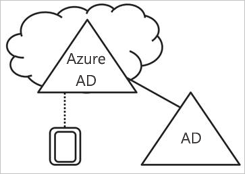
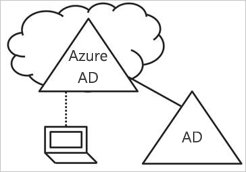
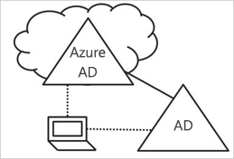

# Что такое удостоверение устройства?

В эпоху мобильных и облачных технологий Azure Active Directory (Azure AD) обеспечивает единый вход для устройств, приложений и служб из любого расположения. В связи с увеличением количества устройств (включая BYOD) ИТ-специалисты все чаще сталкиваются с двумя противоположными задачами:

- продуктивная работа пользователей в любом месте и в любое время;
- постоянная защита корпоративных ресурсов.

С помощью устройств в Azure AD пользователи получают доступ к корпоративным ресурсам. Для защиты корпоративных ресурсов ИТ-администраторам требуется возможность управлять удостоверениями этих устройств. Это позволит предоставлять пользователям доступ к ресурсам с устройств, которые соответствуют стандартам безопасности и нормативным требованиям.

Управление удостоверениями устройств также лежит в основе [условного доступа на основе устройств](../conditional-access/require-managed-devices.md). Используя условный доступ на основе устройств, можно разрешать доступ к ресурсам в своей среде только управляемым устройствам.

## Добавление устройств в Azure AD

Существуют два варианта добавления устройства в Azure AD.

- Регистрация
- Присоединение

**Регистрация** устройства в Azure AD позволяет управлять идентификатором устройства. В ходе регистрации служба регистрации устройств Azure Active Directory назначает устройству идентификатор, который используется для проверки подлинности устройства при входе пользователя в Azure AD. Идентификатор можно использовать для включения или отключения устройства.

При применении вместе с таким решением MDM (управление мобильными устройствами), как Microsoft Intune, в атрибуты устройства в Azure Active Directory добавляются дополнительные данные о нем. Это позволяет создавать правила условного доступа, которые обеспечивают доступ с устройств в соответствии с вашими стандартами безопасности и соблюдения нормативных требований. Дополнительные сведения о регистрации устройств в Microsoft Intune см. в статье [Что такое регистрация устройств?](https://docs.microsoft.com/intune/device-enrollment)

**Присоединение** устройства является расширением для регистрации устройства. Это означает, что оно предоставляет все преимущества регистрации устройства и дополнительно изменяет локальное состояние устройства. За счет изменения локального состояния пользователи могут входить на устройство с помощью рабочей или учебной учетной записи организации вместо личной учетной записи.

## Устройства, зарегистрированные в Azure AD

Устройства, зарегистрированные в Azure AD, обеспечивают поддержку в сценарии **Принеси свое устройство (BYOD)** . В этом случае пользователь может обращаться к корпоративным ресурсам под контролем Azure Active Directory с помощью личного устройства.  

Доступ основан на рабочей или учебной учетной записи, которая была введена на устройстве.  
Например, Windows 10 позволяет добавлять рабочую или учебную учетную запись на ПК, планшет или телефон.  
После того как пользователь добавит рабочую или учебную учетную запись, устройство регистрируется в Azure AD, а при необходимости — также в системе управления мобильными устройствами (MDM), настроенной в организации.
Пользователи организации могут удобно добавлять рабочие или учебные учетные записи на свои личные устройства:

- при первом доступе к рабочему приложению;
- вручную через меню **Параметры** (при использовании Windows 10).

Состояние зарегистрированного в Azure AD устройства можно настроить для устройств **Windows 10, iOS, Android и macOS**.

## Устройства, присоединенные к Azure AD

Устройства, присоединенные к Azure AD, упрощают выполнение следующих задач:

- развертывание Windows на корпоративных устройствах;
- доступ к корпоративным приложениям и ресурсам с любого устройства Windows.
- Возможность управлять корпоративными устройствами в облаке

Присоединение к Azure AD могут развертываться с помощью любого из следующих методов:

- [Windows Autopilot](https://docs.microsoft.com/windows/deployment/windows-autopilot/windows-10-autopilot);
- [массовое развертывание](https://docs.microsoft.com/intune/windows-bulk-enroll);
- [самообслуживание пользователей](azuread-joined-devices-frx.md).

**Присоединение к Azure AD** предназначено для организаций, которые хотят размещать ресурсы в основном в облаке (то есть в первую очередь применять облачные службы с целью уменьшить использование локальной инфраструктуры) или только в облаке (без использования локальной инфраструктуры). Нет никаких ограничений размера и типа организаций, которые могут развернуть присоединение к Azure AD. Присоединение к Azure AD хорошо работает даже в гибридной среде, обеспечивая доступ к локальным и облачным приложениям и ресурсам.

Интеграция устройств, присоединенных к Azure AD, обеспечивает следующие преимущества.

- **Единый вход (SSO)** в управляемые Azure приложения и службы SaaS. При доступе к рабочим ресурсам пользователи не видят запросов на дополнительную проверку подлинности. Функция единого входа доступна, даже если пользователи не подключены к доменной сети.
- **Перенос** пользовательских параметров между устройствами с поддержкой рабочих или учебных учетных записей (с соблюдением корпоративных требований). Для просмотра параметров на устройствах пользователям не нужно подключать учетную запись Майкрософт (например, Hotmail).
- **Доступ к Microsoft Store для бизнеса** с использованием учетной записи Azure AD. Пользователи могут выбирать из коллекции предварительно определенных приложений в организации.
- Поддержка **Windows Hello** для удобного и безопасного доступа к ресурсам.
- **Ограничение доступа** к приложениям только с тех устройств, которые отвечают политике соответствия.
- **Легкий доступ к локальным ресурсам**, если устройство напрямую обращается к локальному контроллеру домена.

Несмотря на то что присоединение к Azure AD в первую очередь предназначено для организаций у которых нет локальной инфраструктуры Windows Server Active Directory, его, безусловно, можно использовать в следующих сценариях:

- Вы хотите перейти на облачную инфраструктуру, используя Azure AD и приложение управления основными данными, такое как Intune.
- вы не можете использовать присоединение к домену в локальной среде, например если требуется управлять мобильными устройствами, такими как планшеты и телефоны;
- вашим пользователям в основном нужен доступ к Office 365 или другим приложения SaaS, интегрированным с Azure AD;
- вы хотите управлять группой пользователей в Azure AD, а не в Active Directory. Это может действовать, например, для сезонных сотрудников, подрядчиков или учащихся.
- вы хотите, чтобы работники удаленных филиалов с ограниченной локальной инфраструктурой могли подключаться к основной сети;

Можно настроить устройства, присоединенные к Azure AD, для устройств Windows 10.

## Гибридные устройства, присоединенные к Azure AD

На протяжении более десяти лет многие организации использовали присоединение к доменам в своей локальной среде Active Directory для предоставления возможностей:

- ИТ-отделам для управления корпоративными устройствами центрального расположения;
- пользователям для входа на устройства с помощью рабочих или учебных учетных записей Active Directory.

Как правило, организации с локальной службой создают для подготовки устройств системные образы, а для управления устройствами часто применяют **System Center Configuration Manager (SCCM)** или **групповые политики**.

Если в вашей среде действует локальная служба AD и вы также хотите получить выгоду от возможностей, предоставляемых Azure Active Directory, можно использовать гибридные устройства, присоединенные к Azure AD. Эти устройства присоединены к локальной службе Active Directory и зарегистрированы в Azure Active Directory.

Гибридные устройства, присоединенные к Azure AD, следует использовать в указанных далее случаях.

- На этих устройствах развернуты приложения Win32, которые полагаются на аутентификацию компьютера с помощью Active Directory.
- Для управления устройствами вам нужны групповые политики.
- Вы хотите и дальше использовать системные образы для настройки устройств сотрудников.

Можно настроить гибридные устройства, присоединенные к Azure AD, для устройств Windows 10 низкого уровня, например Windows 8 и Windows 7.

## Сводка

Управление удостоверениями устройств в Azure AD позволяет:

- упростить процесс добавления устройств в Azure AD и управления ими;
- предоставить пользователям простой доступ к облачным ресурсам организации.

Как показывает опыт, необходимо использовать следующие устройства:

- устройства, зарегистрированные в Azure AD:
   - для личного пользования;
   - для регистрации устройств в Azure AD вручную;
- устройства, присоединенные к Azure AD:
   - для корпоративного пользования;
   - **не** присоединенные к локальной службе Azure AD;
   - для регистрации устройств в Azure AD вручную;
   - для изменения локального состояния устройства;
- гибридные устройства, присоединенные к Azure AD, для устройств, которые присоединены к локальной службе AD.
   - для корпоративного пользования;
   - присоединенные к локальной службе Azure AD;
   - для автоматической регистрации устройств в Azure AD;
   - для изменения локального состояния устройства;

## Требования лицензий

[!INCLUDE [Active Directory P1 license](../../../includes/active-directory-p1-license.md)]

## Дополнительная информация

- Чтобы получить общие сведения о том, как управлять удостоверениями устройств на портале Azure, ознакомьтесь с разделом [Как управлять устройствами с помощью портала Azure](device-management-azure-portal.md).
- Настройка
   - устройств Windows 10, зарегистрированных в Azure Active Directory, описывается в разделе [Регистрация персонального устройства в сети организации](../user-help/device-management-azuread-registered-devices-windows10-setup.md);
   - устройств, присоединенных к Azure Active Directory, описывается в разделе [Практическое руководство: Планирование реализации присоединения к Azure AD](azureadjoin-plan.md);
   - гибридные устройства, присоединенные к Azure AD, ознакомьтесь со статьей [Как планировать гибридную реализацию присоединения к Azure Active Directory](hybrid-azuread-join-plan.md).
- Дополнительные сведения об условном доступе на основе устройств см. в статье [Практическое руководство. Требование использовать только управляемые устройства для доступа к облачным приложениям с помощью условного доступа](../conditional-access/require-managed-devices.md).
