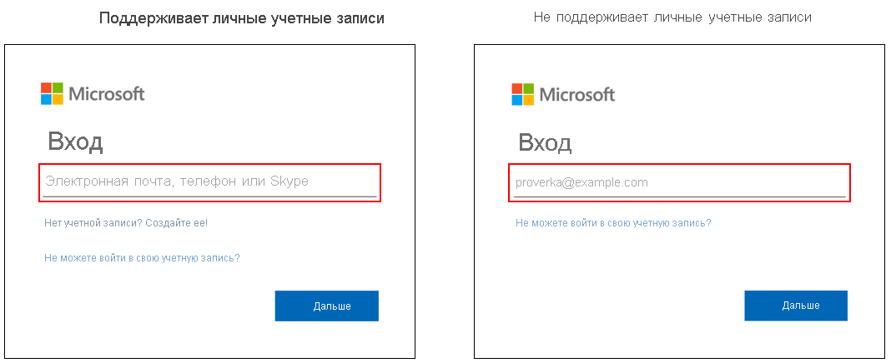

# Варианты входа для учетных записей Майкрософт в Azure Active Directory

Страница входа Microsoft 365 для Azure Active Directory (Azure AD) поддерживает рабочие и учебные учетные записи, а также учетные записи Майкрософт. Но в зависимости от ситуации пользователя может поддерживаться один или оба варианта. Например, страница входа в Azure AD поддерживает:

* приложения, в которые можно войти с помощью обоих типов учетных записей;
* организации, которые принимают гостей.

## Идентификация
Определить, поддерживает ли используемая организацией страница входа учетные записи Майкрософт, можно по тексту подсказки в поле для ввода имени пользователя. Если в тексте подсказки указано "Электронная почта, номер телефона или Skype", то страница входа поддерживает учетные записи Майкрософт.

[Дополнительные варианты входа можно использовать только для личных учетных записей Майкрософт](https://azure.microsoft.com/updates/microsoft-account-signin-options/ ). Они не поддерживаются при входе в ресурсы с помощью рабочей или учебной учетной записи.

## Дальнейшие действия

[Добавление имени личного домена с помощью портала Azure Active Directory](../fundamentals/add-custom-domain.md)