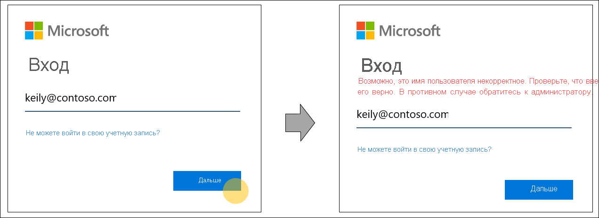
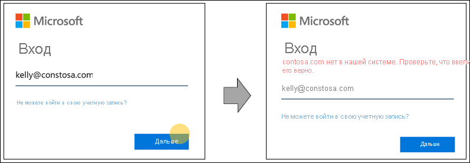

# Обнаружение домашней области на страницах входа Azure Active Directory

Мы изменили поведение при входе в Azure Active Directory (Azure AD), чтобы освободить место для новых методов проверки подлинности и повысить удобство использования. Во время входа Azure AD определяет, где пользователь должен проходить проверку подлинности. Azure AD принимает обоснованные решения, считывая параметры организации и пользователя для имени пользователя, введенного на странице входа. Это очередной шаг к будущему без паролей, который позволяет использовать FIDO 2.0 и другие дополнительные учетные данные.

## Поведение обнаружения домашней области

Исторически обнаружение домашней области выполнялось на основе домена, указанного при входе, или политикой обнаружения домашней области в некоторых устаревших приложениях. Например, метод обнаружения в Azure Active Directory позволял пользователю попасть на правильный экран сбора учетных данных для своей организации, даже допустив опечатку в имени пользователя. Достаточно лишь правильно указать доменное имя организации, например contoso.com. Такое поведение не позволяет точно настраивать взаимодействие на уровне отдельного пользователя.

Чтобы поддерживать более широкий набор учетных данных и повысить удобство использования, мы изменили поведение Azure AD для поиска имени пользователя в процессе входа. Теперь эта служба принимает обоснованные решения, считывая параметры уровня организации и уровня пользователя для имени пользователя, введенного на странице входа. Для поддержки такой возможности Azure Active Directory будет проверять, существует ли в указанном домене имя пользователя, введенное на странице входа, или перенаправлять пользователя на страницу ввода учетных данных.

Дополнительное преимущество такого метода — улучшение обмена сообщениями об ошибках. Ниже приведены некоторые примеры улучшенных сообщений об ошибках при входе в приложение, которое поддерживает только пользователей Azure Active Directory.

- Имя пользователя введено неправильно или еще не синхронизировано с Azure AD:
  
    
  
- Имя домена введено неправильно:
  
    
  
- Пользователь пытается войти с известным доменом клиента:
  
    
  
- Пароль введен неправильно, но имя пользователя верное:  
  
    
  
> [!IMPORTANT]
> Эта возможность может повлиять на федеративные домены, зависящие в применении федерации от старого механизма обнаружения домашней области на уровне домена. Актуальные сведения о добавлении поддержки федеративного домена см. в статье [Обнаружение домашней области во время входа для служб Microsoft 365](https://azure.microsoft.com/updates/signin-hrd/). А пока в некоторых организациях сотрудникам показали, как выполнять вход с несуществующим в Azure AD именем пользователя, но с правильным доменом, так как сейчас доменные имена правильно перенаправляют пользователей на конечную точку домена организации. Новый механизм входа не допускает такого сценария. Пользователю будет предложено изменить имя пользователя и будет запрещен вход с именем пользователя, которое не существует в Azure AD.
>
> Если у вас или в вашей организации есть механизмы, которые зависят от старого поведения, администраторам необходимо обновить документацию по проверке подлинности и входу, а также обучить сотрудников использовать для входа правильное имя пользователя Azure AD.
  
Если у вас есть замечания по поводу нового поведения, оставьте их в разделе **Обратная связь** для этой статьи.  

## Дальнейшие действия

[Добавление имени личного домена с помощью портала Azure Active Directory](../fundamentals/add-custom-domain.md)
