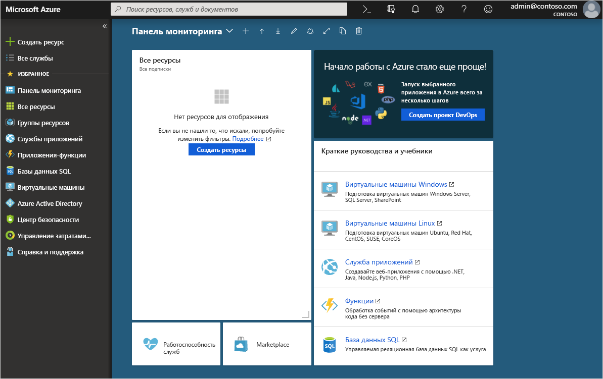
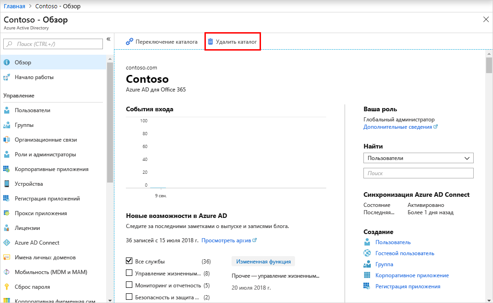

# Краткое руководство. Создание клиента в Azure Active Directory
С помощью портала Azure Active Directory (Azure AD) можно выполнять все административные задачи, включая создание клиента для своей организации. 

В этом кратком руководстве вы узнаете, как получить доступ к порталу Azure и Azure Active Directory. Кроме того, вы узнаете, как создать базовый клиент для своей организации.

Если у вас еще нет подписки Azure, [создайте бесплатную учетную запись](https://azure.microsoft.com/free/), прежде чем начинать работу.

## Создание клиента для организации
После входа на портал Azure можно создать клиент для своей организации. Новый клиент представляет организацию и помогает управлять определенным экземпляром облачных служб Майкрософт для внутренних и внешних пользователей.

### Создание клиента

1. Войдите на [портал Azure](https://portal.azure.com/) своей организации.

1. В меню портала Azure выберите **Создать ресурс**.  

    

1. Выберите **Удостоверение**, а затем щелкните **Azure Active Directory**.

    Откроется страница **Создание каталога**.

    

1.  На странице **Создание каталога** введите следующие сведения.
    
    - В поле **Название организации** введите _Contoso_.

    - В поле **Первоначальное доменное имя** введите _Contoso_.

    - Оставьте значение _США_ в поле **Страна или регион**.

1. Нажмите кнопку **создания**.

Будет создан клиент с доменом contoso.onmicrosoft.com.

## Очистка ресурсов
Если вы не собираетесь использовать это приложение в дальнейшем, можно удалить клиент, выполнив следующие действия:

- Войдите в каталог, который нужно удалить, с помощью фильтра **Каталог и подписка** на портале Azure и при необходимости переключитесь на целевой каталог.
- Выберите **Azure Active Directory**, а затем на странице **Contoso — обзор** выберите **Удалить каталог**.

    Клиент и связанные с ним данные будут удалены.

    

## Дальнейшие действия
- Изменение и добавление доменных имен описывается в статье [Добавление имени личного домена в Azure Active Directory](add-custom-domain.md).

- Добавление пользователей описывается в статье [Краткое руководство по добавлению новых пользователей в Azure Active Directory](add-users-azure-active-directory.md).

- Добавление групп и участников описывается в статье [Создание группы и добавление в нее пользователей в Azure Active Directory](active-directory-groups-create-azure-portal.md).

- Узнайте о [доступе на основе ролей с помощью управления привилегированными пользователями](../../role-based-access-control/pim-azure-resource.md) и [условном доступе](../../role-based-access-control/conditional-access-azure-management.md), чтобы упростить управление доступом к приложениям и ресурсам в своей организации.

- Узнайте об Azure AD, в частности о [лицензировании, терминологии и связанных функциях](active-directory-whatis.md).
