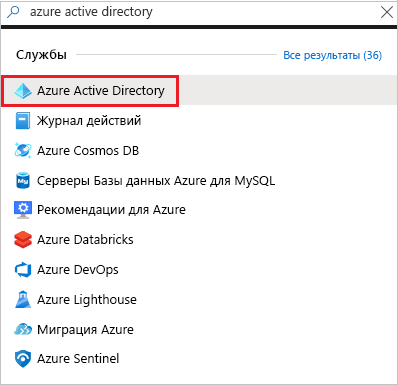
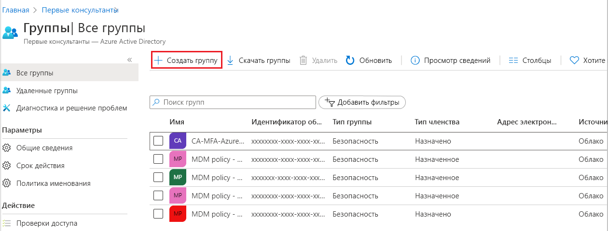
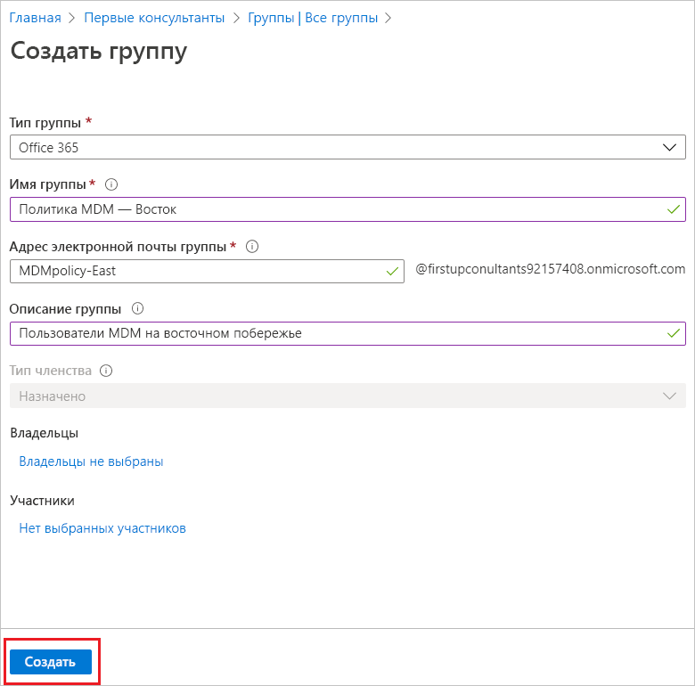
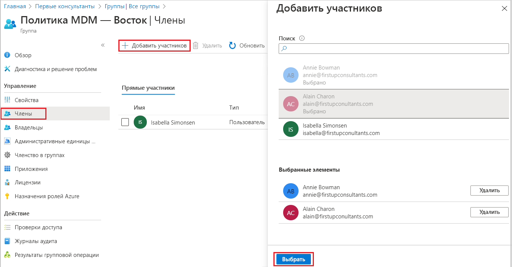
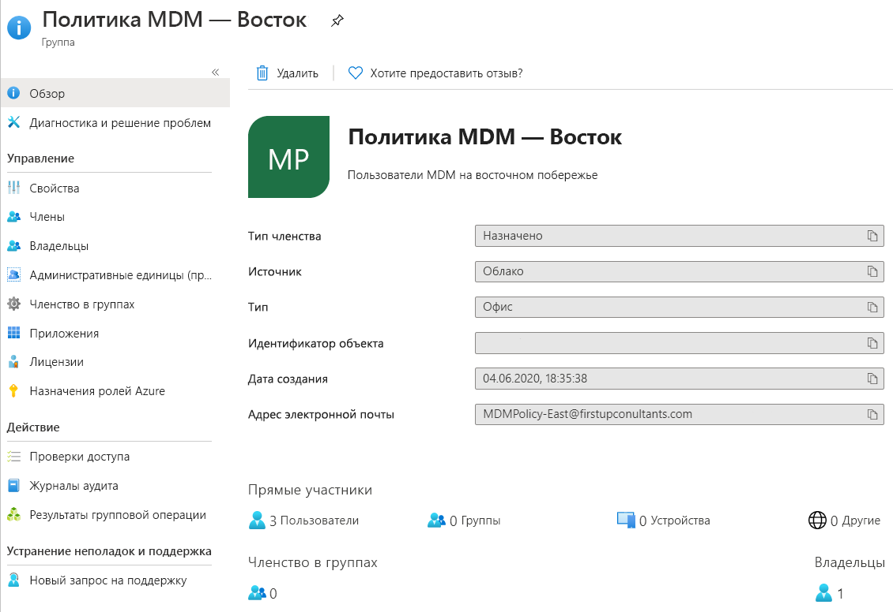

# Создание простой группы и добавление в нее участников с помощью Azure Active Directory
Можно создать простую группу с помощью портала Azure Active Directory (Azure AD). В целях этой статьи простая группа добавляется для отдельного ресурса владельцем этого ресурса (администратором) и включает в себя конкретных участников (сотрудников), которым требуется доступ к этому ресурсу. Более сложные сценарии, включая динамическое членство и создание правил, описываются в [документации по управлению пользователями Azure Active Directory](../users-groups-roles/index.yml).

## Создание простой группы и добавление участников
Можно создать простую группу и сразу добавить в нее участников.

### Создание простой группы и добавление в нее участников
1. Войдите на [портал Azure](https://portal.azure.com) с учетной записью глобального администратора каталога.

1. Найдите и выберите **Azure Active Directory**.

    

1. На странице **Active Directory** выберите **Группы**, а затем **Создать группу**.

    

1. На странице **Новая группа** укажите требуемые сведения.

    

   - **Тип группы** (обязательный параметр). Выберите стандартный тип группы. А именно: **Безопасность**. Используется для управления доступом участников и компьютеров к общим ресурсам группы пользователей. Например, можно создать группу безопасности для определенной политики безопасности. Поступив так, можно сразу предоставить набор разрешений всем участникам, а не добавлять эти разрешения каждому участнику по отдельности. Дополнительные сведения об управлении доступом к ресурсам см. в разделе [Управление доступом к ресурсам с помощью групп Azure Active Directory](active-directory-manage-groups.md).
               - **Office 365**. Обеспечивает возможности совместной работы, предоставляя участникам доступ к общему почтовому ящику, календарю, файлам, сайту SharePoint и многое другое. Этот параметр также позволяет предоставить доступ к группе пользователям за пределами вашей организации. Дополнительные сведения о Группах Office 365 см. в разделе [Сведения о Группах Office 365](https://support.office.com/article/learn-about-office-365-groups-b565caa1-5c40-40ef-9915-60fdb2d97fa2).

   - **Имя группы** (обязательный параметр). Добавьте осмысленное имя группы, которое легко запомнить. Начнется процесс проверки для определения того, используется ли имя для другой группы. Если имя уже используется, то во избежание повторяющихся имен вам будет предложено изменить имя своей группы.

   - **Адрес электронной почты группы (обязательно).** Добавьте адрес электронной почты для этой группы или оставьте автоматически введенный адрес электронной почты.

   - **Описание группы**. Добавьте дополнительное описание группы.

   - **Тип членства** (обязательный параметр). Выберите стандартный тип членства. А именно: **Назначенный**. Позволяет добавить конкретных пользователей в эту группу и предоставить им уникальные разрешения. В целях этой статьи мы используем этот параметр.
          - **Динамический пользователь.** Позволяет использовать правила динамического членства для автоматического добавления и удаления участников. Если атрибуты участника изменяются, система сверяется с правилами динамической группы для каталога, чтобы определить, соответствует ли этот участник требованиям правил (он добавляется) или больше не соответствует им (он удаляется).
          - **Динамическое устройство.** Позволяет использовать правила динамической группы для автоматического добавления и удаления устройств. Если атрибуты устройства изменяются, система сверяется с правилами динамической группы для каталога, чтобы определить, соответствует ли это устройство требованиям правил (он добавляется) или больше не соответствует им (он удаляется).

        >[!Important]
        >Можно создать динамическую группу для устройств или пользователей, но не для устройств и пользователей одновременно. Кроме того, вы не можете создать группу устройств на основе атрибутов их владельцев. Правила членства для устройств могут ссылаться только на атрибуты этих устройств. Дополнительные сведения о создании динамической группы для пользователей и устройств см. в разделе [Создание динамической группы и проверка состояния](../users-groups-roles/groups-create-rule.md).

1. Нажмите кнопку **Создать**.

    Ваша группа создана и готова для добавления участников.

1. Выберите область **Члены** на странице **Группа**, а затем начните поиск участников для добавления в группу на странице **Выбрать участников**.

    

1. Добавив участников, щелкните **Выбрать**.

    Страница **Общие сведения о группе** обновится, чтобы отобразить количество участников, добавленных в группу.

    

## Отключение отправки приветственного сообщения электронной почты

При создании любой группы Office 365 как с динамическим, так и со статическим членством, всем пользователям, добавляемым в группу, отправляется приветственное уведомление. Если изменяются любые атрибуты пользователя или устройства, все правила динамических групп в организации обрабатываются на предмет возможных изменений членства. После этого добавляемым пользователям также отправляются приветственные уведомления. Такое поведение можно отключить в [Exchange PowerShell](https://docs.microsoft.com/powershell/module/exchange/users-and-groups/Set-UnifiedGroup?view=exchange-ps). 

## Дополнительная информация
Теперь, когда вы добавили группу и хотя бы одного пользователя, вы можете выполнить следующее:

- [Просмотр групп и участников](active-directory-groups-view-azure-portal.md)

- [Управление членством в группах](active-directory-groups-membership-azure-portal.md)

- [Управление динамическими правилами для пользователей в группе](../users-groups-roles/groups-create-rule.md)

- [Изменение параметров группы](active-directory-groups-settings-azure-portal.md)

- [Управление доступом к ресурсам с помощью групп](active-directory-manage-groups.md)

- [Управление доступом к приложениям SaaS с помощью групп](../users-groups-roles/groups-saasapps.md)

- [Управление группами с помощью команд PowerShell](../users-groups-roles/groups-settings-v2-cmdlets.md)

- [Связывание подписки Azure с Azure Active Directory или добавление ее в службу](active-directory-how-subscriptions-associated-directory.md)
