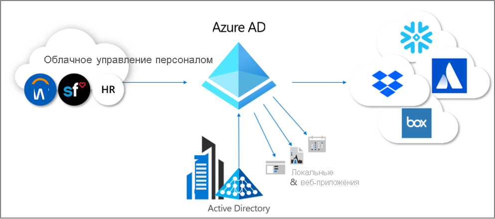
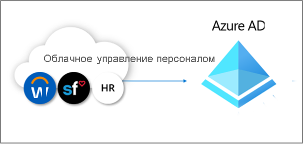

# Что собой представляет подготовка?

Подготовка и отзыв — это процессы, обеспечивающие согласованность цифровых удостоверений в нескольких системах.  Эти процессы обычно используются как часть [управления жизненным циклом удостоверений](what-is-identity-lifecycle-management.md).

**Подготовка**  — это процесс создания удостоверения в целевой системе на основе определенных условий.  **Отзыв**  — это процесс удаления удостоверения из целевой системы, когда условия больше не выполняются. **Синхронизация**  — это процесс поддержания подготовленного объекта в актуальном состоянии, чтобы между исходным и целевым объектом не было отличий.

Например, когда новый сотрудник присоединяется к организации, он входит в систему управления персоналом.  В этот момент создать соответствующую учетную запись пользователя в Azure AD может подготовка **из** системы управления персоналом **в** Azure Active Directory (Azure AD). Приложения, которые запрашивают Azure AD, смогут видеть эту учетную запись нового сотрудника.  Если существуют приложения, которые не используют Azure AD, то подготовка **из** Azure AD **в** базы данных этих приложений будет гарантировать наличие у пользователя доступа ко всем необходимым приложениям.  Этот процесс позволяет пользователю начать работу и получить доступ к нужным приложениям и системам с первого дня работы.  Аналогично, если характеристики сотрудников, такие как отдел или статус, изменяются в системе управления персоналом, синхронизация этих обновлений системы управления персоналом с Azure AD, а также другими приложениями и целевыми базами данных обеспечивает согласованность.

В настоящее время Azure AD предоставляет три области автоматической подготовки.  Они приведены ниже.  

- Подготовка из внешней полномочной системы, которая не является каталогом, для записи в Azure AD с помощью **[подготовки на основе управления персоналом](#hr-driven-provisioning)**  
- Подготовка из Azure AD в приложения с помощью **[подготовки приложений](#app-provisioning)**  
- Подготовка между Azure AD и доменными службами Active Directory с помощью **[подготовки между каталогами](#inter-directory-provisioning)** 

## Подготовка на основе управления персоналом

Подготовка на основе управления персоналом в Azure AD включает создание объектов, обычно удостоверений пользователей, которые представляют каждого сотрудника, однако в некоторых случаях включает и другие объекты, представляющие отделы или другие структуры, на основе информации, которая находится в системе управления персоналом.  

Самый распространенный сценарий: новые сотрудники присоединяются к компании и вносятся в систему управления персоналом.  После этого они автоматически подготавливаются в качестве нового пользователя в Azure AD без необходимости вмешательства администратора для каждого нового найма.  Как правило, подготовка из управления персоналом может охватывать следующие сценарии.

- **Прием новых сотрудников.** При добавлении нового сотрудника в систему управления персоналом учетная запись пользователя автоматически создается в Active Directory, Azure AD и, при необходимости, в каталогах для других приложений, поддерживаемых Azure AD, с обратной записью адреса электронной почты в систему управления персоналом.
- **Обновление атрибута и профиля сотрудника.** При обновлении записи сотрудника в системе управления персоналом (например, его имени, должности или руководителя) учетная запись пользователя будет автоматически обновлена в Active Directory, Azure AD и, при необходимости, в других приложениях, поддерживаемых Azure AD.
- **Увольнение сотрудников.** При увольнении сотрудника из управления персоналом вход с помощью учетной записью пользователя автоматически блокируется или же учетная запись удаляется в Active Directory, Azure AD и других приложениях.
- **Повторный наем сотрудников.** Когда сотрудника повторно вносят в систему облачного управления персоналом, его старая учетная запись может быть автоматически восстановлена или повторно подготовлена (в зависимости от ваших предпочтений).

Существует три варианта развертывания для подготовки на основе управления персоналом с помощью Azure AD:

1. Для организаций с одной подпиской на Workday или SuccessFactors, что не используют Active Directory
1. Для организаций с одной подпиской на Workday или SuccessFactors, что используют как Active Directory, так и Azure AD.
1. Для организаций с несколькими системами управления персоналом или с локальной системой управления персоналом, например SAP, Oracle eBusiness или PeopleSoft

Дополнительные сведения см. в статье [Что такое подготовка на основе управления персоналом?](what-is-hr-driven-provisioning.md)

## Подготовка приложений

В Azure AD термин **[подготовка приложений](https://docs.microsoft.com/azure/active-directory/manage-apps/user-provisioning)** относится к автоматическому созданию копий удостоверений пользователей в приложениях, к которым пользователям необходим доступ, или для приложений, имеющих собственное хранилище данных, отличающееся от Azure AD или Active Directory. Кроме создания удостоверений пользователей, подготовка приложений включает в себя обслуживание и удаление удостоверений пользователей из этих приложений при изменении состояния или ролей пользователя. К типичным сценариям относится подготовка пользователя Azure AD в таких приложениях, как [Dropbox](https://docs.microsoft.com/azure/active-directory/saas-apps/dropboxforbusiness-provisioning-tutorial), [Salesforce](https://docs.microsoft.com/azure/active-directory/saas-apps/salesforce-provisioning-tutorial), [ServiceNow](https://docs.microsoft.com/azure/active-directory/saas-apps/servicenow-provisioning-tutorial), поскольку каждое из этих приложений имеет собственный репозиторий пользователей, отличный от Azure AD.

Дополнительные сведения см. в статье [Что такое подготовка приложений?](what-is-app-provisioning.md).

## Подготовка между каталогами

Многие организации используют как Active Directory, так и Azure AD и могут иметь приложения, подключенные к Active Directory, например локальные файловые серверы.

Поскольку организации первоначально разворачивают локальную подготовку на основе управления персоналом, они уже могут иметь удостоверения пользователей для всех сотрудников организации в Active Directory.   Наиболее распространенным сценарием для подготовки между каталогами является подготовка в Azure AD пользователей, уже подключенных к Active Directory.  Эта подготовка обычно выполняется путем синхронизации или подготовки облака Azure AD Connect. 

Кроме того, организации могут также предоставлять доступ к локальным системам из Azure AD.  Например, организация может перенести гостевых пользователей в каталог Azure AD, однако этим гостевым пользователям потребуется доступ к локальным веб-приложениям на основе Встроенной проверки подлинности Windows (WIA) через прокси приложения.  Необходимым условием для этого является подготовка локальных учетных записей AD для пользователей в Azure AD.

Дополнительные сведения см. в статье [Что такое подготовка между каталогами?](what-is-inter-directory-provisioning.md)

 
## Дальнейшие действия 
- [Что такое управление жизненным циклом удостоверений?](what-is-identity-lifecycle-management.md)
- [Что такое подготовка на основе управления персоналом?](what-is-hr-driven-provisioning.md)
- [Что такое подготовка приложений?](what-is-app-provisioning.md)
- [Что такое подготовка между каталогами?](what-is-inter-directory-provisioning.md)
