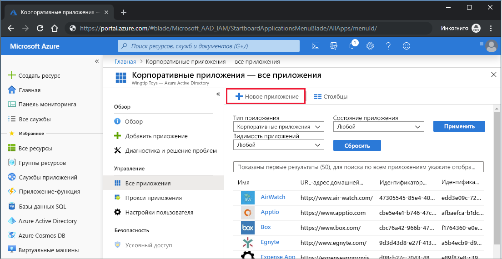
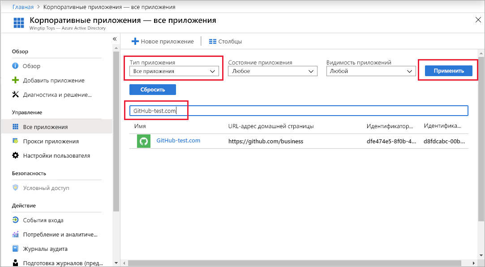
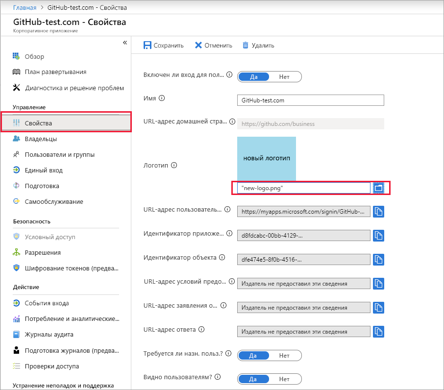

# Краткое руководство. Добавление приложения в клиент Azure Active Directory

Azure Active Directory (Azure AD) имеет галерею, содержащую тысячи предварительно интегрированных приложений. Некоторые приложения, которые используются вашей организацией, вероятно, находятся в коллекции. В этом кратком руководстве используется портал Azure для добавления приложения коллекции в клиент Azure Active Directory (Azure AD).

После добавления приложения в клиент Azure AD вы получите следующие возможности.

- Управлять доступом пользователей к приложению с помощью политики условного доступа.
- Настраивать единый вход в приложение для пользователей со своими учетными записями Azure AD.

## Перед началом работы

Чтобы добавить приложение в клиент, потребуется:

- подписка Azure AD;
- подписка с поддержкой единого входа для приложения.

Войдите на [портал Azure](https://portal.azure.com) в клиент Azure AD в качестве глобального администратора, администратора облачных приложений или администратора приложения.

Рекомендуется использовать нерабочую среду для проверки шагов в этом учебнике. Если у вас нет нерабочей среды Azure AD, можно [получить пробную версию на один месяц](https://azure.microsoft.com/pricing/free-trial/).

## Добавление приложения в клиент Azure AD

Чтобы добавить приложение коллекции в клиент Azure AD, выполните следующие действия.

1. На [портале Azure](https://portal.azure.com) в области навигации слева выберите **Azure Active Directory**.

1. В области **Azure Active Directory** выберите **Корпоративные приложения**.

    

1. Откроется панель **Все приложения** с отображением случайной выборки из приложений в клиенте Azure AD. В верхней части панели **Все приложения** щелкните **Новое приложение**.

    

1. На панели **Категории** вы увидите значки в области **Популярные приложения**, где представлена случайная выборка приложений из коллекции.  Для просмотра других приложений выберите **Показать больше**. Однако не рекомендуется выполнять поиск таким образом, так как в коллекции существуют тысячи приложений.

    

1. Для выполнения поиска приложения в разделе **Добавление из коллекции** введите имя приложения, которое необходимо добавить. Выберите приложение из результатов поиска и выберите **Добавить**. В следующем примере показана форма **Добавить приложение**, которая появляется в результате поиска GitHub.com.

    

1. В форме конкретного приложения можно изменить сведения о свойстве. Например, можно изменить имя приложения в соответствии с потребностями организации. В этом примере используется имя **GitHub-test**.

1. Когда закончите вносить изменения в свойства, выберите **Добавить**.

1. На странице "Начало работы" отображаются параметры для настройки приложения организации.

Приложение добавлено. Вы можете сделать перерыв. В следующих разделах показано, как изменить логотип и другие свойства приложения.

## Поиск клиента приложения Azure AD

Предположим, вам пришлось уйти, и теперь вы возвращаетесь, чтобы продолжить настройку своего приложения. Сначала нужно найти это приложение.

1. На **[портале Azure](https://portal.azure.com)** в области навигации слева выберите **Azure Active Directory**.

1. В области **Azure Active Directory** выберите **Корпоративные приложения**.

1. В раскрывающемся меню **Тип приложения** выберите **Все приложения** и щелкните **Применить**. Дополнительные сведения о параметрах просмотра см. в разделе [Просмотр всех корпоративных приложений, которыми вы можете управлять в Azure Active Directory](view-applications-portal.md).

1. Теперь видно список всех приложений в клиенте Azure AD. Список представляет собой случайную выборку. Чтобы просмотреть дополнительные приложения, щелкните элемент **Показать больше** один или несколько раз.

1. Чтобы быстро найти приложение в клиенте, в поле поиска введите имя приложения и выберите **Применить**. Этот пример находит тестовое приложение GitHub, которое было добавлено ранее.

    

## Настройка свойства входа пользователя

Теперь, когда приложение найдено, можно открыть и настроить его свойства.

Чтобы изменить свойства приложения, выполните следующие действия:

1. Выберите приложение, чтобы открыть его.
1. Выберите **Свойства**, чтобы открыть панель "Свойства" для редактирования.

    

1. Выделите минуту времени, чтобы разобраться в параметрах входа. Параметры определяют, как пользователи, которые назначены (или не назначены) приложению, могут входить в приложение. Они также определяют, может ли пользователь видеть приложение на панели доступа.

    - Параметр **Включено для входа пользователя** определяет, могут ли пользователи, назначенные приложению, выполнять вход в приложение.
    - Параметр **Требуется назначение пользователей** определяет, могут ли пользователи, не назначенные приложению, выполнять вход.
    - Параметр **Видимый пользователю** определяет, могут ли пользователи, назначенные приложению, видеть его на панели доступа и в средстве запуска O365.

1. Используйте следующие таблицы, чтобы выбрать параметры, которые лучше всего подходят для ваших потребностей.

   - Поведение **назначенных** пользователей.

       | Параметры свойств приложения | | | Взаимодействие с назначенным пользователем | |
       |---|---|---|---|---|
       | Включено для входа пользователей? | Требуется назначение пользователя? | Видимый для пользователей? | Могут ли назначенные пользователи войти? | Могут ли назначенные пользователи видеть приложение?* |
       | Да | Да | Да | Да | Да  |
       | Да | Да | Нет  | Да | Нет   |
       | Да | Нет  | Да | Да | Да  |
       | Да | Нет  | Нет  | Да | Нет   |
       | Нет  | Да | Да | Нет  | Нет   |
       | Нет  | Да | Нет  | Нет  | Нет   |
       | Нет  | Нет  | Да | Нет  | Нет   |
       | Нет  | Нет  | Нет  | Нет  | Нет   |

   - Поведение **неназначенных** пользователей.

       | Параметры свойств приложения | | | Взаимодействие с неназначенным пользователем | |
       |---|---|---|---|---|
       | Включено для входа пользователей? | Требуется назначение пользователя? | Видимый для пользователей? | Могут ли неназначенные пользователи войти? | Могут ли неназначенные пользователи видеть приложение?* |
       | Да | Да | Да | Нет  | Нет   |
       | Да | Да | Нет  | Нет  | Нет   |
       | Да | Нет  | Да | Да | Нет   |
       | Да | Нет  | Нет  | Да | Нет   |
       | Нет  | Да | Да | Нет  | Нет   |
       | Нет  | Да | Нет  | Нет  | Нет   |
       | Нет  | Нет  | Да | Нет  | Нет   |
       | Нет  | Нет  | Нет  | Нет  | Нет   |

     * Может ли пользователь видеть приложение на панели доступа и средство запуска приложений Office 365?

## Использование пользовательского логотипа

Чтобы использовать пользовательский логотип, выполните следующие действия.

1. Создайте логотип размером 215 на 215 пикселей и сохраните его в формате PNG.
1. Так как приложение уже найдено, выберите его.
1. На левой панели выберите **Свойства**.
1. Загрузите логотип.
1. По завершении нажмите кнопку **Сохранить**.

    

## Дополнительная информация

Из этого краткого руководства вы узнали, как добавить приложение коллекции в клиент Azure AD. А также, как изменить свойства приложения.

Теперь все готово для настройки единого входа.

> [!div class="nextstepaction"]
> [Настройка единого входа](configure-single-sign-on-portal.md)

