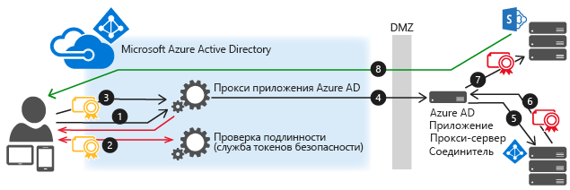

# <a name="kerberos-constrained-delegation-for-single-sign-on-sso-to-your-apps-with-application-proxy"></a>Ограниченное делегирование Kerberos для единого входа (SSO) в приложения с помощью прокси приложения

Вы можете организовать поддержку единого входа для локальных приложений, опубликованных через прокси приложения и защищенных с использованием встроенной проверки подлинности Windows. Для доступа к таким приложениям нужен билет Kerberos. Прокси приложения использует ограниченное делегирование Kerberos (KCD) для поддержки таких приложений. 

Для приложений, использующих встроенную проверку подлинности Windows (IWA), можно активировать единый вход, разрешив соединителям прокси приложения олицетворять пользователей. Соединители используют это разрешение для отправки и получения токенов от имени пользователей.

## <a name="how-single-sign-on-with-kcd-works"></a>Принцип работы единого входа с применением KCD
Эта диаграмма посвящена потоку, когда пользователь пытается получить доступ к локальному приложению, использующему IWA.



1. Пользователь вводит URL-адрес для получения доступа к локальному приложению через Application Proxy.
2. Прокси приложения перенаправляет запрос в службы проверки подлинности Azure AD, чтобы выполнить предварительную проверку подлинности. На этом этапе Azure AD применяет все применимые политики проверки подлинности и авторизации, например многофакторную проверку подлинности. Если пользователь проверен, Azure AD создает токен и отправляет его пользователю.
3. Пользователь передает токен в прокси приложения.
4. Прокси приложения проверяет маркер и извлекает из него имя участника-пользователя (UPN), а затем соединитель извлекает UPN и имя участника-службы (SPN) через безопасный канал с двойной проверкой подлинности.
5. Соединитель выполняет согласование ограниченного делегирования Kerberos (KCD) с локальным AD, олицетворяя пользователя, чтобы получить маркер Kerberos для приложения.
6. Active Directory отправляет токен Kerberos для приложения соединителю.
7. Соединитель отправляет исходный запрос на сервер приложений, используя токен Kerberos, полученный от AD.
8. Приложение отправляет соединителю ответ, который затем возвращается службе прокси приложения и пользователю.

## <a name="prerequisites"></a>Предварительные требования
Прежде чем организовать единый вход для приложений IWA, проверьте готовность следующих параметров и настроек в своей среде.

* Настройте свои приложения, например веб-приложения SharePoint, на использование встроенной проверки подлинности Windows. Дополнительные сведения см. в статье [Включение поддержки протокола проверки подлинности Kerberos](/previous-versions/windows/it-pro/windows-server-2008-R2-and-2008/dd759186(v=ws.11)) или (для SharePoint) в статье [Планирование проверки подлинности Kerberos в SharePoint 2013](/SharePoint/security-for-sharepoint-server/kerberos-authentication-planning).
* Все приложения имеют [имена субъектов-служб](https://social.technet.microsoft.com/wiki/contents/articles/717.service-principal-names-spns-setspn-syntax-setspn-exe.aspx).
* Сервер, на котором работает соединитель, и сервер, на котором работает приложение, должны быть присоединены к домену и должны быть частью одного и того же домена или доверенных доменов. Дополнительные сведения о присоединении к домену см. в разделе [Присоединение компьютера к домену](/previous-versions/windows/it-pro/windows-server-2012-R2-and-2012/dd807102(v=ws.11)).
* Сервер, на котором работает соединитель, должен иметь доступ на чтение атрибута TokenGroupsGlobalAndUniversal у пользователей. Эта стандартная настройка может измениться в случае усиления защиты среды.

### <a name="configure-active-directory"></a>Настройка Active Directory
Действия по настройке в Active Directory зависят от того, находятся ли соединитель прокси приложения и сервер приложения в одном и том же домене.

#### <a name="connector-and-application-server-in-the-same-domain"></a>Соединитель и сервер приложения находятся в одном домене
1. В Active Directory перейдите в раздел **средства**  >  **Пользователи и компьютеры**.
2. Выберите сервер, на котором работает соединитель.
3. Щелкните правой кнопкой мыши и выберите **Свойства**  >  **Делегирование**.
4. Выберите параметр **Доверять компьютеру делегирование указанных служб**. 
5. Выберите **Использовать любой протокол проверки подлинности**.
6. В разделе **Службы, с которыми эта учетная запись может использовать делегированные учетные данные** добавьте значение для идентификации имени субъекта-службы сервера приложений. После этого соединитель прокси приложения будет олицетворять пользователей в AD при работе с приложениями, указанными в списке.

   

#### <a name="connector-and-application-server-in-different-domains"></a>Соединитель и сервер приложения находятся в разных доменах
1. Список предварительных требований для работы с ограниченным делегированием Kerberos в разных доменах см. в статье [Ограниченное делегирование Kerberos в разных доменах](/previous-versions/windows/it-pro/windows-server-2012-R2-and-2012/hh831477(v=ws.11)).
2. Используйте `principalsallowedtodelegateto` свойство учетной записи службы (компьютера или выделенной учетной записи пользователя домена) веб-приложения, чтобы включить делегирование проверки подлинности Kerberos от прокси приложения (соединителя). Сервер приложений выполняется в контексте `webserviceaccount` , а делегированный сервер — `connectorcomputeraccount` . Выполните приведенные ниже команды на контроллере домена (под управлением Windows Server 2012 R2 или более поздней версии) в домене `webserviceaccount` . Для обеих учетных записей используйте неструктурированные имена (не UPN).

   Если `webserviceaccount` используется учетная запись компьютера, используйте следующие команды:

   ```powershell
   $connector= Get-ADComputer -Identity connectorcomputeraccount -server dc.connectordomain.com

   Set-ADComputer -Identity webserviceaccount -PrincipalsAllowedToDelegateToAccount $connector

   Get-ADComputer webserviceaccount -Properties PrincipalsAllowedToDelegateToAccount
   ```

   Если `webserviceaccount` это учетная запись пользователя, используйте следующие команды:

   ```powershell
   $connector= Get-ADComputer -Identity connectorcomputeraccount -server dc.connectordomain.com

   Set-ADUser -Identity webserviceaccount -PrincipalsAllowedToDelegateToAccount $connector

   Get-ADUser webserviceaccount -Properties PrincipalsAllowedToDelegateToAccount
   ```

## <a name="configure-single-sign-on"></a>Настройка единого входа 
1. Опубликуйте приложение в соответствии с инструкциями, описанными в статье [Публикация приложений с помощью прокси приложения](application-proxy-add-on-premises-application.md). Убедитесь, что **Azure Active Directory** выбран в качестве **Способа предварительной проверки подлинности**.
2. Когда приложение появится в списке корпоративных приложений, выберите его и щелкните **Единый вход**.
3. Выберите режим единого входа **Встроенная проверка подлинности Windows**.  
4. Введите **SPN внутреннего приложения** для сервера приложений. В этом примере таким именем для опубликованного приложения будет http/www.contoso.com. Это имя субъекта-службы должно входить в список служб, для которого соединитель может имеет делегированные учетные данные. 
5. Выберите **делегированную идентификацию для входа**, которую соединитель сможет использовать от имени пользователей. Дополнительные сведения см. в разделе [Работа с разными локальными и облачными удостоверениями](#working-with-different-on-premises-and-cloud-identities) .

     

## <a name="sso-for-non-windows-apps"></a>Единый вход для приложений не на базе Windows

Поток делегирования Kerberos в прокси приложения Azure AD запускается, когда Azure AD проверяет подлинность пользователя в облаке. После поступления запроса в локальную среду соединитель прокси приложения Azure AD выдает билет Kerberos от имени пользователя посредством взаимодействия с локальной службой Active Directory. Этот процесс называется ограниченным делегированием Kerberos (KCD). 

На следующем этапе запрос отправляется во внутреннее приложение с этим билетом Kerberos. 

Существует несколько механизмов, определяющих способ отправки билета Kerberos в таких запросах. Большинство серверов, отличных от Windows, должны получить его в виде токена SPNEGO. Этот механизм поддерживается в Azure AD Application Proxy, но по умолчанию отключен. Соединитель можно настроить для подключения SPNEGO или стандартного маркера Kerberos, но не для обоих.

При настройке компьютера соединителя для SPNEGO убедитесь, что все другие соединители в этой группе настроены с SPNEGO. Приложения, ожидающие Стандартный маркер Kerberos, должны маршрутизироваться через другие соединители, для которых не настроена SPNEGO. Некоторые веб-приложения принимают оба формата, не требуя изменения в конфигурации. 
 

Чтобы включить SPNEGO, сделайте следующее:

1. Откройте командную строку от имени администратора.
2. В командной строке выполните следующие команды на серверах соединителя, требующих SPNEGO.

    ```
    REG ADD "HKLM\SOFTWARE\Microsoft\Microsoft AAD App Proxy Connector" /v UseSpnegoAuthentication /t REG_DWORD /d 1
    net stop WAPCSvc & net start WAPCSvc
    ```

Приложения других ОС, кроме Windows, вместо доменных адресов электронной почты обычно используют имена пользователей или имена учетных записей SAM. Если это применимо к вашим приложениям, следует настроить поле делегированной идентификации для входа, чтобы связать облачные удостоверения с удостоверениями ваших приложений. 

## <a name="working-with-different-on-premises-and-cloud-identities"></a>Реализация единого входа в приложения с помощью прокси приложения
Прокси приложения предполагает, что пользователи используют одно и то же удостоверение как в облаке, так и в локальной среде. Но в некоторых средах из-за корпоративных политик или зависимостей приложений организациям может потребоваться использовать альтернативные идентификаторы для входа. В таких случаях вы по-прежнему можете использовать KCD для единого входа. Настройте параметр **Делегированная идентификация для входа** для каждого приложения. Он обозначает, какой идентификатор следует использовать при выполнении единого входа.  

Эта возможность позволяет многим организациям с разными локальными и облачными удостоверениями реализовать единый вход из облака в локальные приложения, чтобы пользователям не нужно было использовать разные имена и пароли. Сюда относятся следующие виды организаций:

* организации, имеющие несколько внутренних доменов (joe@us.contoso.com, joe@eu.contoso.com) и отдельный домен в облаке (joe@contoso.com);
* организации, у которых внутреннее доменное имя не поддерживает маршрутизацию (joe@contoso.usa), а допустимое доменное имя относится к облаку;
* организации, которые не используют внутренние доменные имена (joe);
* Используйте разные псевдонимы в локальной среде и в облаке. Например, joe-johns@contoso.com и joej@contoso.com.  

С помощью прокси приложения можно выбрать удостоверение для получения билета Kerberos. Этот параметр устанавливается в каждом отдельном приложении. Некоторые из этих параметров подходят для систем, не поддерживающих значения в формате адреса электронной почты, другие предназначены для альтернативного входа в систему.


Если вы используете делегированную идентификацию для входа, это значение может быть разным для разных доменов или лесов вашей организации. Этой проблемы можно избежать, опубликовав приложения дважды с использованием двух разных групп соединителей. Поскольку каждое приложение имеет собственную аудиторию, его соединители можно присоединить к другому домену.

Если для удостоверения входа используется **Локальное имя учетной записи SAM** , компьютер, на котором размещен соединитель, должен быть добавлен в домен, в котором находится учетная запись пользователя.

### <a name="configure-sso-for-different-identities"></a>Настройка единого входа для использования разных удостоверений
1. Настройте параметры Azure AD Connect так, чтобы основным удостоверением был адрес электронной почты (почта). Для этого при настройке следует изменить поле **Имя субъекта-пользователя** в параметрах синхронизации. Эти параметры также определяют, как именно пользователи входят в Office 365, на устройства Windows 10 и в другие приложения, использующие Azure AD в качестве хранилища своих удостоверений.  
     
2. В параметрах конфигурации приложения для приложения, которое вы хотите изменить, выберите нужное значение параметра **Делегированное удостоверение для входа** :

   * имя участника-пользователя (например, joe@contoso.com);
   * дополнительное имя участника-пользователя (например, joed@contoso.local);
   * имя пользователя, входящее в имя участника-пользователя (например, joe);
   * имя пользователя, входящее в дополнительное имя участника-пользователя (например, joed);
   * имя локальной учетной записи SAM (в зависимости от локальной конфигурации контроллера домена).

### <a name="troubleshooting-sso-for-different-identities"></a>Устранение неполадок единого входа для различных удостоверений
Если в процессе единого входа возникает ошибка, она отображается в журнале событий компьютера соединителя, как описано в [статье Устранение неполадок](application-proxy-back-end-kerberos-constrained-delegation-how-to.md).
Но в некоторых случаях запрос успешно отправляется внутреннему приложению, пока оно обрабатывает другие HTTP-ответы. Устранение подобных неполадок следует начинать с проверки события с номером 24029 в журнале событий сеанса прокси приложения на компьютере соединителя. Удостоверение пользователя, которое использовалось для делегирования, отображается в поле "Пользователь" в сведениях о событии. Чтобы включить журнал сеанса, выберите пункт **Отобразить аналитический и отладочный журналы** в меню "Вид" средства просмотра событий.

## <a name="next-steps"></a>Дальнейшие действия

* [Настройка приложения прокси приложения для использования ограниченного делегирования Kerberos](application-proxy-back-end-kerberos-constrained-delegation-how-to.md)
* [Устранение неполадок с прокси приложения](application-proxy-troubleshoot.md)