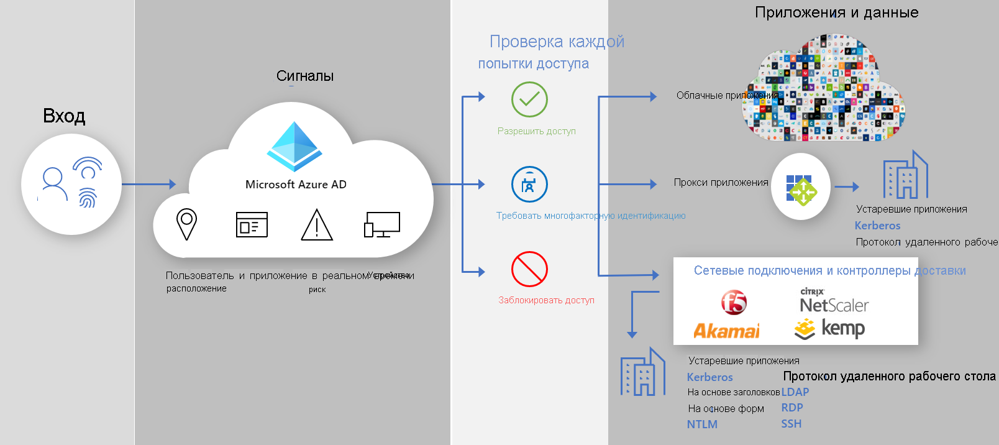

# Защищенный гибридный доступ. Защита устаревших приложений с помощью контроллеров и сетей доставки приложений

Теперь вы можете защитить локальные и облачные устаревшие приложения проверки подлинности, подключив их к Azure AD с помощью имеющегося контроллера доставки приложений или сети. Это позволит преодолеть разрыв и усилить уровень безопасности всех приложений с помощью таких возможностей Azure AD, как условный доступ и Защита идентификации Azure AD.

Используя имеющийся контроллер доставки и сети, вы можете легко обеспечить безопасность важных устаревших приложений, которые вы раньше не могли защитить с помощью Azure AD. Теперь вы имеете все необходимое для защиты этих приложений.

Приведенные ниже поставщики предлагают готовые решения и подробные рекомендации по интеграции с Azure AD.

* [F5 Big-IP APM](https://aka.ms/f5-hybridaccessguide)
* [Zscaler Private Access (ZPA)](https://aka.ms/zscaler-hybridaccessguide)
