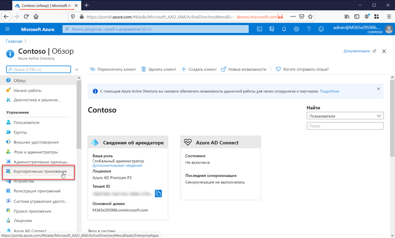

# Что такое управление приложениями?

Azure AD представляет собой Систему управления идентификацией и доступом (IAM). Она выполняет роль единого хранилища всех сведений о цифровых удостоверениях. Вы можете настроить программные приложения так, чтобы они использовали Azure AD для хранения информации о своих пользователях. 

В Azure AD также нужно настроить интеграцию с приложениями. Другими словами, эта система идентификации должна знать, какие приложения ее используют. Процесс предоставления в Azure AD информации об этих приложениях и о том, как работать с ними, называется управлением приложениями.

Управление приложениями выполняется в колонке **Корпоративные приложения** в разделе "Управление" на портале Azure Active Directory.

## Что такое Система управления идентификацией и доступом (IAM)?
Приложением называется некоторый объект программного обеспечения, используемый для выполнения определенной задачи. Большинство приложений требуют входа пользователей, что позволяет персонализировать взаимодействие с каждым конкретным пользователем. Другими словами, приложению нужно знать, кто именно сейчас использует его, чтобы предоставлять или удалять отдельные функциональные возможности для определенных пользователей.

Если бы каждое приложение отдельно отслеживало всех пользователей, это привело бы к созданию изолированных хранилищ имен пользователей и имен входа для каждого приложения. И любое из приложений ничего не знало бы о пользователях других приложений.

Централизованная система управления удостоверениями решает эту проблему, предоставляя единое расположение для хранения информации о пользователях, которую могут использовать все приложения. Такие системы известны как Системы управления идентификацией и доступом (IAM). Azure AD выполняет роль системы IAM для облака Microsoft.

>[!TIP]
>Система IAM предоставляет единое расположение для хранения всех удостоверений пользователей. Azure AD выполняет роль системы IAM для облака Microsoft.

## Зачем нужно управлять приложениями с помощью облачного решения?

Организации часто имеют в своем распоряжении сотни приложений, с помощью которых пользователи выполняют свою работу. Доступ к этим приложениям пользователи получают из многих устройств и расположений. Каждый день разрабатываются и добавляются новые приложения, а старые выводятся из эксплуатации. При таком количестве приложений и точек доступа дополнительное удобство при использовании облачных решений для управления доступом пользователей ко всем приложениям будет важнее, чем когда-либо.

>[!TIP]
>Коллекция приложений AAD содержит много популярных приложений, которые уже настроены для работы с поставщиком удостоверений Microsoft Azure AD.

## Как Azure AD работает с приложениями?

Azure AD упрощает процесс управления приложениями, предоставляя единую систему идентификации для облачных и локальных приложений. В Azure AD можно добавить приложения SaaS, локальные приложения и бизнес-приложения. Затем пользователи один раз выполняют вход, чтобы безопасно и легко обращаться к этим приложениям, а также Office 365 и другим бизнес-приложениям от корпорации Майкрософт. [Автоматизация подготовки пользователей](../app-provisioning/user-provisioning.md) позволяет сократить расходы на администрирование. Вы также можете использовать многофакторную проверку подлинности и политики условного доступа для обеспечения безопасного доступа к приложениям.

## Приложения какого типа можно интегрировать с Azure AD?

Существуют четыре основных типа приложений, которые можно добавить к **корпоративным приложениям** и управлять ими с помощью Azure AD.

- **Приложения из коллекции Azure AD**. В Azure AD имеется коллекция, содержащая тысячи приложений, в которые предварительно интегрированы средства единого входа в Azure AD. Некоторые приложения, которые используются вашей организацией, вероятно, находятся в коллекции. [Узнайте больше о планировании интеграции приложений](plan-an-application-integration.md) или получите подробные инструкции по интеграции для отдельных приложений, ознакомившись с [руководствами по приложениям SaaS](https://docs.microsoft.com/azure/active-directory/saas-apps/).

- **Локальные приложения с Application Proxy**. С помощью Azure AD Application Proxy можно интегрировать локальные веб-приложения с Azure AD, чтобы обеспечить возможности единого входа. Затем пользователи смогут обращаться к локальным веб-приложениям так же, как к Office 365 и другим приложениям SaaS. Дополнительные сведения см. в статье [Удаленный доступ к локальным приложениям через Azure Active Directory Application Proxy](application-proxy.md).

- **Специально разработанные приложения**. Создавая собственные бизнес-приложения, вы можете интегрировать их с Azure AD для поддержки возможностей единого входа. Зарегистрировав приложение в Azure AD, вы сможете управлять политикой аутентификации для него. Дополнительные сведения см. в [руководстве для разработчиков](developer-guidance-for-integrating-applications.md).

- **Приложения не из коллекции**. Используйте свои собственные приложения. Обеспечьте поддержку единого входа для других приложений, добавив их в Azure AD. Существует несколько способов интегрировать приложения. Некоторые из которых перечислены ниже. Дополнительные сведения см. в разделе [Настройка единого входа на основе SAML](configure-saml-single-sign-on.md).

>[!TIP]
>Вы можете интегрировать Azure AD с приложением, даже если оно размещено в коллекции приложений без предварительной настройки. Вы можете **интегрировать Azure AD с любыми** приложениями, перечисленными ниже.
> - Любая веб-ссылка или приложение, которые отображают **поле имени пользователя и пароля**.
> - Любое приложение, которое поддерживает **протоколы SAML или OpenID Connect**.
> - Любое приложение, которое поддерживает стандарт **System for Cross-domain Identity Management (SCIM)** .

## Управление рисками с помощью политик условного доступа

Взаимозависимость единого входа Azure AD с [условным доступом](../conditional-access/concept-conditional-access-cloud-apps.md) обеспечивает высокий уровень безопасности при доступе к приложениям. Возможности безопасности предусматривают облачную защиту личных данных, управление доступом на основе рисков, собственную многофакторную проверку подлинности и политики условного доступа. Эти возможности позволяют использовать политики управления на основе приложений или групп, которым требуется более высокий уровень безопасности.

## Повышайте производительность с помощью функции единого входа

Включение единого входа для всех приложений и Office 365 обеспечивает удобную процедуру входа в систему для существующих пользователей, уменьшая количество запросов на вход или устраняя необходимость в них. Среда пользователя без постоянных запросов или необходимости хранить многочисленные пароли воспринимается более связно и меньше отвлекает пользователя. Бизнес-группы могут управлять доступом и разрешать его с помощью самообслуживания и динамического членства. Разрешение авторизованным пользователям в организации управлять доступом к приложению повышает безопасность системы удостоверений.

Единый вход повышает безопасность. *Без единого входа* администраторы вынуждены создавать и обновлять учетные записи пользователей для каждого отдельного приложения, что требует времени. Кроме того, пользователям нужно отслеживать несколько наборов учетных данных, чтобы получать доступ к приложениям. В результате они записывают свои пароли или используют иные решения для управления паролями, связанные с другими угрозами безопасности данных. [Дополнительные сведения о едином входе](what-is-single-sign-on.md).

## Решение проблемы управления и соответствия требованиям

С помощью Azure AD можно отслеживать входы в приложения с помощью отчетов, которые используют средства управления информационной безопасностью и событиями безопасности. Воспользоваться отчетами можно на портале или посредством API-интерфейсов. Программными средствами проводить аудит доступа к приложениям, а также прекращать доступ неактивных пользователей, используя проверки доступа.

## Управление затратами

Путем переноса в Azure AD можно сэкономить средства и избавиться от ненужных затрат на управление локальной инфраструктурой. Кроме того, Azure AD предоставляет возможности самостоятельного обслуживания доступа к приложениям, что экономит время администраторов и пользователей. Единый вход устраняет необходимость в использовании паролей для отдельных приложений. Это позволяет сократить расходы, связанные со сбросом паролей для приложений и потерей производительности при получении новых паролей.

В приложениях для отдела кадров или других приложениях с большим количеством пользователей вы можете с помощью подготовки приложений автоматизировать процесс подготовки и отмены подготовки пользователей, как описано в статье [Автоматическая подготовка пользователей и ее отмена для приложений в Azure AD](../app-provisioning/user-provisioning.md).

## Дальнейшие действия

- [Цикл кратких руководств по управлению приложениями в Azure AD](view-applications-portal.md)
- [Руководство по интеграции Azure Active Directory с приложениями](plan-an-application-integration.md)
- [Автоматическая подготовка пользователей и ее отмена для приложений в Azure AD](../app-provisioning/user-provisioning.md)
