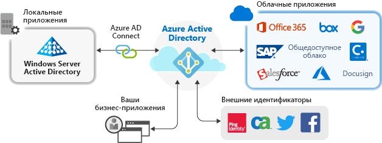

# Управление приложениями с помощью Azure Active Directory

Azure Active Directory (Azure AD) упрощает процесс управления приложениями, предоставляя единую систему идентификации для облачных и локальных приложений. В Azure AD можно добавить приложения SaaS, локальные приложения и бизнес-приложения. Затем пользователи один раз выполняют вход, чтобы безопасно и легко обращаться к этим приложениям, а также Office 365 и другим бизнес-приложениям от корпорации Майкрософт. Автоматизация подготовки пользователей позволяет сократить расходы на администрирование. Вы также можете использовать многофакторную проверку подлинности и политики условного доступа для обеспечения безопасного доступа к приложениям.

## Зачем нужно управлять приложениями с помощью облачного решения?

Организации часто имеют в своем распоряжении сотни приложений, с помощью которых пользователи выполняют свою работу. Доступ к этим приложениям пользователи получают из многих устройств и расположений. Каждый день разрабатываются и добавляются новые приложения, а старые выводятся из эксплуатации. При таком количестве приложений и точек доступа дополнительное удобство при использовании облачных решений для управления доступом пользователей ко всем приложениям будет важнее, чем когда-либо.

## Приложения какого типа можно интегрировать с Azure AD?
Существуют четыре основных типа приложений, которые можно добавить к **корпоративным приложениям** и управлять ими с помощью Azure AD.

-   **Приложения из коллекции Azure AD**. В Azure AD имеется коллекция, содержащая тысячи приложений, в которые предварительно интегрированы средства единого входа в Azure AD. Некоторые приложения, которые используются вашей организацией, вероятно, находятся в коллекции. [Узнайте больше о планировании интеграции приложений](plan-an-application-integration.md) или получите подробные инструкции по интеграции для отдельных приложений, ознакомившись с [руководствами по приложениям SaaS](https://docs.microsoft.com/azure/active-directory/saas-apps/). 

-   **Локальные приложения с Application Proxy**. С помощью Azure AD Application Proxy можно интегрировать локальные веб-приложения с Azure AD, чтобы обеспечить возможности единого входа. Пользователи смогут обращаться к этим локальным веб-приложениям так же, как к Office 365 и другим приложениям SaaS. [Узнайте, для чего и как используется Application Proxy](what-is-application-proxy.md).

-   **Специально разработанные приложения**. Создавая собственные бизнес-приложения, вы можете интегрировать их с Azure AD для поддержки возможностей единого входа. Зарегистрировав приложение в Azure AD, вы сможете управлять политикой аутентификации для него. Дополнительные сведения см. в [руководстве для разработчиков](developer-guidance-for-integrating-applications.md).

-   **Приложения не из коллекции**. Используйте свои собственные приложения. Обеспечьте поддержку единого входа для других приложений, добавив их в Azure AD. Можно интегрировать любую веб-ссылку или приложение с полем имени пользователя и пароля и поддержкой протоколов SAML или OpenID Connect либо системы SCIM. Дополнительные сведения см. в разделе [Настройка единого входа для приложений не из коллекции в платформе Microsoft identity](configure-single-sign-on-non-gallery-applications.md).

## Управление рисками с помощью политик условного доступа
Взаимозависимость единого входа Azure AD с [условным доступом](https://docs.microsoft.com/azure/active-directory/conditional-access/overview) обеспечивает высокий уровень безопасности при доступе к приложениям. Возможности безопасности предусматривают облачную защиту личных данных, управление доступом на основе рисков, собственную многофакторную проверку подлинности и политики условного доступа. Эти возможности позволяют использовать политики управления на основе приложений или групп, которым требуется более высокий уровень безопасности.

## Повышайте производительность с помощью функции единого входа
Включение единого входа для всех приложений и Office 365 обеспечивает удобную процедуру входа в систему для существующих пользователей, уменьшая количество запросов на вход или устраняя необходимость в них. Среда пользователя без постоянных запросов или необходимости хранить многочисленные пароли воспринимается более связно и меньше отвлекает пользователя. Бизнес-группы могут управлять доступом и разрешать его с помощью самообслуживания и динамического членства. Разрешение авторизованным пользователям в организации управлять доступом к приложению повышает безопасность системы удостоверений.

Единый вход повышает безопасность. *Без единого входа* администраторы вынуждены создавать и обновлять учетные записи пользователей для каждого отдельного приложения, что требует времени. Кроме того, пользователям нужно отслеживать несколько наборов учетных данных, чтобы получать доступ к приложениям. В результате они записывают свои пароли или используют иные решения для управления паролями, связанные с другими угрозами безопасности данных. [Дополнительные сведения о едином входе](what-is-single-sign-on.md).

## Решение проблемы управления и соответствия требованиям
С помощью Azure AD можно отслеживать входы в приложения с помощью отчетов, которые используют средства управления информационной безопасностью и событиями безопасности. Воспользоваться отчетами можно на портале или посредством API-интерфейсов. Программными средствами проводить аудит доступа к приложениям, а также прекращать доступ неактивных пользователей, используя проверки доступа.

## Управление затратами
Путем переноса в Azure AD можно сэкономить средства и избавиться от ненужных затрат на управление локальной инфраструктурой. Кроме того, Azure AD предоставляет возможности самостоятельного обслуживания доступа к приложениям, что экономит время администраторов и пользователей. Единый вход устраняет необходимость в использовании паролей для отдельных приложений. Это позволяет сократить расходы, связанные со сбросом паролей для приложений и потерей производительности при получении новых паролей.

## Дополнительная информация

- [Что такое Application Proxy?](what-is-application-proxy.md)
- [Краткое руководство Добавление приложение коллекции в клиент Azure AD](add-application-portal.md)
