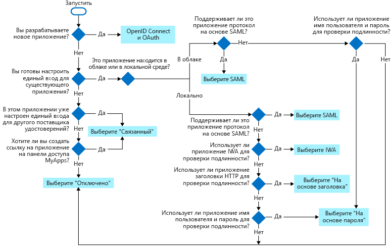

# Единый вход в приложениях в Azure Active Directory

Единый вход обеспечивает безопасность и удобство при входе пользователей в приложения в Azure Active Directory (Azure AD). В этой статье описываются способы единого входа и представлены рекомендации, которые помогут выбрать наиболее подходящий метод единого входа при настройке приложений.

- **С единым входом** пользователи входят один раз, используя одну учетную запись, и получают доступ к присоединенным к домену устройствам, ресурсам компании, приложениям SaaS (программное обеспечение как услуга) и веб-приложениям. После входа пользователь может запускать приложения с портала Office 365 или панели доступа к Azure AD MyApps. Администраторы могут централизовать управление учетными записями пользователей и автоматически добавлять или удалять доступ пользователей к приложениям с учетом членства в группах.

- **Без единого входа** пользователям приходится запоминать пароли для приложений и входить в каждое из них отдельно. ИТ-персоналу необходимо создавать и обновлять учетные записи пользователей для каждого приложения, например Office 365, Box и Salesforce. Пользователям приходится запоминать свои пароли, а также тратить время на вход в каждое приложение.

## Выбор способа единого входа

Настроить приложение для единого входа можно несколькими способами. Выбор способа единого входа зависит от того, как приложение настроено для аутентификации.

- В облачных приложениях может использоваться единый вход на основе OpenID Connect, OAuth, SAML или паролей либо связанный способ. Единый вход также можно отключить. 
- В локальных приложениях можно использовать единый вход на основе паролей, встроенной проверки подлинности Windows или заголовков либо связанный способ, а также можно отключить единый вход. Локальные варианты работают в том случае, если настроен прокси приложения.

Эта блок-схема поможет вам выбрать наиболее подходящий способ единого входа для вашей ситуации.

В приведенной ниже таблице представлена сводка способов единого входа, а также ссылки на дополнительные сведения.

| Способ единого входа | Типы приложений | Сценарии использования |
| :------ | :------- | :----- |
| [OpenID Connect и OAuth](#openid-connect-and-oauth) | Только в облаке | Используйте OpenID Connect и OAuth при разработке нового приложения. Эти протоколы упрощают настройку приложения, имеют простые пакеты SDK и позволяют приложению использовать MS Graph.
| [SAML](#saml-sso) | В облаке и локальной среде | По возможности выбирайте SAML для существующих приложений, которые не используют OpenID Connect или OAuth. SAML работает с приложениями, которые аутентифицируются с помощью одного из протоколов SAML.|
| [На основе пароля](#password-based-sso) | В облаке и локальной среде | Выберите способ на основе пароля, если в приложении выполняется аутентификация с помощью имени пользователя и пароля. Единый вход на основе пароля позволяет безопасно хранить пароли приложений и воспроизводить его с помощью расширения веб-браузера или мобильного приложения. Этот способ использует существующий процесс входа, предоставляемый приложением, однако позволяет администраторам управлять паролями. |
| [Связанный](#linked-sign-on) | В облаке и локальной среде | Выберите связанный единый вход, если приложение настроено для единого входа в другой службе поставщика удостоверений. При выборе этого варианта единый вход для приложения не настраивается. Однако для приложения может уже быть настроен единый вход с использованием другой службы, например служб федерации Active Directory.|
| [Disabled](#disabled-sso) | В облаке и локальной среде | Отключайте единый вход, если приложение не готово к настройке для единого входа. Пользователи должны вводить свои имя и пароль каждый раз при запуске этого приложения.|
| [Встроенная проверка подлинности Windows (IWA)](#integrated-windows-authentication-iwa-sso) | Только в локальной среде | Используйте этот способ единого входа для приложений, использующих [встроенную проверку подлинности Windows (IWA)](/aspnet/web-api/overview/security/integrated-windows-authentication) или поддерживающих утверждения. Для IWA соединители прокси приложений используют ограниченное делегирование Kerberos (KCD) для аутентификации пользователей в приложении. |
| [На основе заголовков](#header-based-sso) | Только в локальной среде | Используйте единый вход на основе заголовков, если приложение использует заголовки для проверки подлинности. Для единого входа на основе заголовков требуется PingAccess для Azure AD. Прокси приложения использует Azure AD для проверки подлинности пользователя, а затем передает трафик через службу соединителей.  |

## OpenID Connect и OAuth

При разработке новых приложений используйте современные протоколы, такие как OpenID Connect и OAuth, чтобы оптимально использовать единый вход для своего приложения на различных платформах устройств. OAuth позволяет пользователям и администраторам [дать согласие](configure-user-consent.md) для защищенных ресурсов, таких как [Microsoft Graph](/graph/overview). Мы удобно применять [пакеты SDK](../develop/reference-v2-libraries.md) для вашего приложения, а кроме того, приложение будет готово к использованию [Microsoft Graph](/graph/overview).

Дополнительные сведения можно найти в разделе

- [OAuth 2.0](../develop/v2-oauth2-auth-code-flow.md)
- [OpenID Connect 1.0](../develop/v2-protocols-oidc.md)
- [Руководство разработчика платформы Microsoft identity](https://docs.microsoft.com/azure/active-directory/develop/active-directory-developers-guide).

## Единый вход SAML

С **единым входом на основе SAML** Azure AD проходит проверку подлинности в приложении, используя учетную запись Azure AD пользователя. Azure AD передает приложению данные для входа через протокол соединения. Если используется единый вход на основе SAML, вы можете сопоставлять пользователей с конкретными ролями приложений согласно правилам, определенным в утверждениях SAML.

Выберите единый вход на основе SAML, если приложение поддерживает его.

Единый вход на основе SAML поддерживается для приложений, использующих любые из следующих протоколов:

- SAML 2.0
- WS-Federation

Чтобы настроить приложение SaaS для на основе SAML единого входа, см. в разделе [на основе SAML, настроить единый вход](configure-single-sign-on-portal.md). Кроме того, многие приложения SaaS имеют руководства [для определенных приложений](../saas-apps/tutorial-list.md), которые позволяют пошагово выполнить настройку единого входа на основе SAML.

Чтобы настроить приложение для WS-Federation, выполните то же руководство, чтобы настроить приложение на основе SAML единого входа, см. в разделе [на основе SAML, настроить единый вход](configure-single-sign-on-portal.md). На шаге, чтобы настроить приложение для использования Azure AD, вам понадобится заменить URL-адрес входа Azure AD для конечной точке WS-Federation `https://login.microsoftonline.com/<tenant-ID>/wsfed`.

Чтобы настроить приложение в локальной для на основе SAML единого входа, см. в разделе [SAML single-sign-on для локальных приложений с помощью прокси приложения](application-proxy-configure-single-sign-on-on-premises-apps.md).

Дополнительные сведения о принципе работы протокола SAML см. в статье [Протокол единого входа SAML](../develop/single-sign-on-saml-protocol.md).

## Единый вход на основе пароля

При использовании входа по паролю пользователям, чтобы войти в приложение, необходимо ввести имя пользователя и пароль при первом обращении к нему. После первого входа Azure AD предоставляет приложению имя пользователя и пароль.

Для единого входа на основе паролей используется имеющийся процесс проверки подлинности, предоставляемый приложением. Когда включается единый вход на основе паролей для приложения, служба Azure AD собирает и безопасно сохраняет имена пользователей и пароли для этого приложения. Учетные данные пользователей хранятся в каталоге в зашифрованном виде.

Выберите единый вход на основе пароля, если:

- приложение не поддерживает протокол единого входа SAML.
- приложение выполняет проверку подлинности с помощью имени пользователя и пароля, а не маркеров доступа и заголовков.

Единый вход на основе пароля поддерживается для любого облачного приложения со страницей входа на базе HTML. Пользователь может использовать любой из следующих браузеров:

- Internet Explorer 11 (в Windows 7 или более поздней версии);
- Microsoft Edge в Windows 10 Anniversary Edition или более поздней версии;
- Chrome в Windows 7 или более поздней версии и в Mac OS X;
- Firefox 26.0 или более поздней версии в Windows XP с пакетом обновления 2 (SP2) или более поздней версии и в Mac OS X 10.6 или более поздней версии.

Сведения о том, как настроить облачное приложение для единого входа на основе паролей, см. в разделе [Настройка приложения для единого входа на основе паролей](application-sign-in-problem-password-sso-gallery.md#configure-the-app-for-password-sso).

Сведения о том, как настроить локальное приложение для единого входа через прокси приложения, см. в статье [Хранение паролей для единого входа с помощью прокси приложения](application-proxy-configure-single-sign-on-password-vaulting.md).

### Как работает аутентификация для единого входа на основе пароля

Чтобы выполнить аутентификацию пользователя в приложении, Azure AD получает учетные данные пользователя из каталога и вводит их на странице входа в приложение.  Azure AD безопасно передает учетные данные пользователя через расширение веб-браузера или мобильное приложение. Этот процесс позволяет администратору управлять учетными данными пользователей и не требует, чтобы пользователи запоминали свои пароли.

> [!IMPORTANT]
> Учетные данные маскируются от пользователя в процессе автоматического входа. Однако учетные данные можно обнаруживать с помощью средств веб-отладки. Пользователи и администраторы должны следовать тем же политикам безопасности, что и в том случае, когда учетные данные были введены непосредственно пользователем.

### Управление учетными данными для единого входа на основе паролей

Паролями для каждого управления могут управлять администратор Azure AD или пользователи.

Когда администратор Azure AD управляет учетными данными:  

- пользователю не нужно сбрасывать или запоминать имя и пароль. Пользователь может получать доступ к приложению, выбирая его на панели доступа или по предоставленной ссылке;
- администратор может выполнять задачи управления с учетными данными. Например, администратор может обновлять доступ к приложениям в соответствии с членством пользователей в группах и состоянием сотрудников;
- администратор может использовать учетные данные администратора для предоставления доступа к приложениям, доступным множеству пользователей. Например, администратор может разрешить всем, у кого есть доступ к приложению, получать доступ к приложению для работы социальными сетями или совместного доступа к документам.

Когда пользователь управляет учетными данными:

- пользователи могут управлять своими паролями, при необходимости обновляя или удаляя их;
- администраторы по-прежнему могут задавать новые учетные данные для приложения.

## Связанный единый вход

Связанный единый вход позволяет службе Azure AD добавлять возможность единого входа в приложение, которое уже настроено для единого входа в другой службе. Связанное приложение может быть видно пользователям на портале Office 365 или портале Azure AD MyApps. Например, пользователь может запустить приложение, настроенное для единого входа в службах федерации Active Directory 2.0 (AD FS) на портале Office 365. Для связанных приложений, запускаемых с портала Office 365 или Azure AD MyApps, также доступна дополнительная отчетность.

### Связанный единый вход для миграции приложений

Связанный единый вход можно предоставить согласованный пользовательский интерфейс, пока выполняется перенос приложений за определенный период времени. При переносе приложений в Azure Active Directory, можно использовать связанный единый вход для быстро публикации ссылок на все приложения, которые планируется перенести.  Пользователи могут найти все ссылки на [портале MyApps](../user-help/active-directory-saas-access-panel-introduction.md) или в [средстве запуска приложений Office 365](https://support.office.com/article/meet-the-office-365-app-launcher-79f12104-6fed-442f-96a0-eb089a3f476a). Пользователи не знают, получают ли они доступ к связанному или перенесенному приложению.  

Когда пользователь пройдет проверку подлинности в связанном приложении, необходимо создать учетную запись, чтобы пользователь получил доступ к единому входу. Эта учетная запись может быть подготовлена либо автоматически, либо вручную администратором.

## Отключенный единый вход

Отключенный режим означает, что для приложения не используется единый вход. Если единый вход отключен, пользователям может потребоваться пройти проверку подлинности дважды. Сначала пользователи проходят проверку подлинности в Azure AD, а затем входят в приложение.

Используйте режим отключенного единого входа:

- если вы не готовы интегрировать это приложение с единым входом Azure AD;
- если вы тестируете другие аспекты приложения;
- в качестве уровня защиты для локального приложения, которое не требует проверки подлинности пользователей. Если единый вход отключен, пользователь должен проходить проверку подлинности.

## Единый вход со встроенной проверкой подлинности Windows (IWA)

[Прокси приложения](application-proxy.md) предоставляет единый вход для приложений, которые используют [встроенную проверку подлинности Windows (IWA)](/aspnet/web-api/overview/security/integrated-windows-authentication) или поддерживают утверждения. Если приложение использует встроенную аутентификацию Windows, прокси приложения выполняет проверку подлинности в приложении с помощью ограниченного делегирования Kerberos (KCD). В случае приложения с поддержкой утверждений, которое доверяет Azure Active Directory, единый вход для приложения работает, так как пользователь уже прошел проверку подлинности с помощью Azure AD.

Выберите один режим единого входа для предоставления единого входа в приложение в локальной, выполняющий проверку подлинности с помощью IWA встроенную проверку подлинности Windows.

Сведения о том, как настроить локальное приложение для IWA, см. в статье [Ограниченное делегирование Kerberos для единого входа в приложения с помощью прокси приложений](application-proxy-configure-single-sign-on-with-kcd.md).

### Принцип работы единого входа с применением KCD
На схеме показан процесс, в ходе которого пользователь получает доступ к локальному приложению, использующему IWA.

1. Пользователь вводит URL-адрес для доступа к локального приложения через прокси приложения.
1. Прокси приложения перенаправляет запрос в службы проверки подлинности Azure AD, чтобы выполнить предварительную проверку подлинности. На этом этапе Azure AD применяет все применимые политики проверки подлинности и авторизации, например многофакторную проверку подлинности. Если пользователь проверен, Azure AD создает токен и отправляет его пользователю.
1. Пользователь передает токен в прокси приложения.
1. Прокси приложения проверяет токен и получает из него имя участника-пользователя (UPN). Затем он отправляет запрос, UPN и имя субъекта-службы (SPN) соединителю через безопасный канал с двойной проверкой подлинности.
1. Соединитель использует ограниченное делегирование Kerberos (KCD) согласования с локальном каталоге AD, олицетворяя пользователя, чтобы получить маркер Kerberos для приложения.
1. Active Directory отправляет токен Kerberos для приложения соединителю.
1. Соединитель отправляет исходный запрос на сервер приложений, используя токен Kerberos, полученный от AD.
1. Приложение отправляет соединителю ответ, который затем возвращается службе прокси приложения и пользователю.

## Единый вход на основе заголовков

Единый вход на основе заголовков работает для приложений, использующих заголовки HTTP для проверки подлинности. В этом способе входа используется сторонняя служба проверки подлинности под названием PingAccess. Пользователю достаточно пройти проверку подлинности в Azure AD.

Выберите на основе заголовков единого входа, при настройке прокси приложения и PingAccess для приложения.

Сведения о настройке аутентификации на основе заголовков см. в статье [Публикация приложений с поддержкой аутентификации на основе заголовков с использованием прокси приложения Azure AD и PingAccess](application-proxy-configure-single-sign-on-with-ping-access.md).

### Что такое PingAccess для Azure AD?

Используя PingAccess для Azure AD, пользователи могут получать доступ и выполнять единый вход в приложения, использующие заголовки для проверки подлинности. Прокси приложения обрабатывает такие приложения, как и любые другие, используя Azure AD для аутентификации доступа и передавая трафик через службу соединителя. После проверки подлинности служба PingAccess переводит маркер доступа Azure AD в формат заголовка, отправляемого приложению.

Получая доступ к корпоративным приложениям, пользователи не заметят никаких отличий в процедуре входа. Они по-прежнему смогут работать в любом расположении и на любом устройстве. Соединители прокси приложений направляют удаленный трафик всем приложениям и продолжают автоматически балансировать нагрузку.

### Как получить лицензию на PingAccess?

Так как этот сценарий предоставляется при совместном использовании Azure AD и PingAccess, вам понадобятся лицензии для двух этих служб. Тем не менее подписки Azure AD Premium включают в себя базовую лицензию PingAccess, которая поддерживает до 20 приложений. Если требуется опубликовать более 20 приложений, использующих заголовки, вы можете приобрести дополнительную лицензию PingAccess.

Дополнительные сведения см. в разделе [Выпуски Azure Active Directory](../fundamentals/active-directory-whatis.md).

## Связанные статьи

- [Руководства по интеграции приложений SaaS с Azure Active Directory](../saas-apps/tutorial-list.md)
- [Руководство по настройке единого входа](configure-single-sign-on-portal.md)
- [Введение в управление доступом к приложениям](what-is-access-management.md)
- Ссылка для скачивания: [План развертывания единый вход](https://aka.ms/SSODeploymentPlan)
