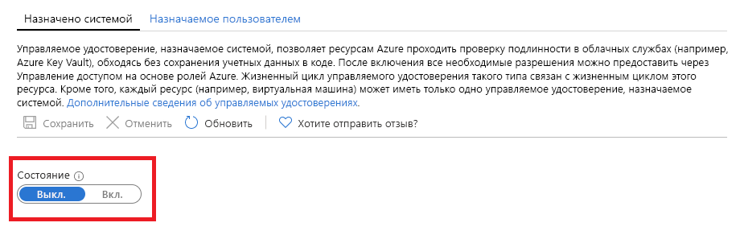

# Что такое управляемые удостоверения для ресурсов Azure?

[!INCLUDE [preview-notice](../../../includes/active-directory-msi-preview-notice.md)]

Как разработчик облачных решений, вы, вероятно, ищете самый простой и безопасный способ получения доступа к ресурсам Azure в коде. 

Вы можете использовать управляемые удостоверения для ресурсов Azure, так как они:

- **исключают** необходимость использовать учетные данные в коде;
- обеспечивают **автоматическую смену** учетных данных;
- **минимизируют затраты** на управление удостоверениями.

## Принцип работы 

Все ресурсы Azure, поддерживающие управляемые удостоверения, могут получать токены для обмена данными без использования учетных данных в коде. Эта процедура состоит из следующих шагов:

 
1.  **Включение** — создание управляемого удостоверения для ресурса.
2.  **Предоставление доступа** к ресурсам с помощью Azure RBAC.
3.  **Доступ** — выполнение разрешенных действий.
4.  **Отключение** — удаление управляемого удостоверения. 

## Типы управляемых удостоверений

Существует два типа управляемых удостоверений.

- Управляемое удостоверение, назначаемое системой

- Управляемое удостоверение, назначаемое пользователем

Для автономных ресурсов Azure можно включить **назначаемые системой** управляемые удостоверения. Назначаемые системой управляемые удостоверения обеспечивают оптимальную поддержку в контексте управления удостоверениями. Автоматическое управление жизненным циклом для ресурса можно включить с помощью одного щелчка мыши.   

   

Хотя назначаемые системой управляемые удостоверения являются наиболее удобным решением для автономных ресурсов, ситуация выглядит иначе, если нужно управлять группой ресурсов Azure для одной и той же задачи. В этом случае лучше создать удостоверение вручную и назначить это основное удостоверение всем ресурсам Azure, которые необходимо сгруппировать. Это — **назначаемое пользователем** управляемое удостоверение. 
  

## Поддерживаемые службы

Вы можете использовать управляемые удостоверения для ресурсов Azure для аутентификации служб с поддержкой аутентификации Azure AD. См. дополнительные сведения о [службах, которые поддерживают управляемые удостоверения для ресурсов Azure](services-support-msi.md).

## Дальнейшие действия

Чтобы использовать управляемые удостоверения для ресурсов Azure, ознакомьтесь со следующими краткими руководствами:

* [Использование назначаемого системой управляемого удостоверения на виртуальной машине Windows для доступа к Resource Manager](tutorial-windows-vm-access-arm.md)
* [Использование назначаемого системой управляемого удостоверения на виртуальной машине Linux для доступа к Resource Manager](tutorial-linux-vm-access-arm.md)
