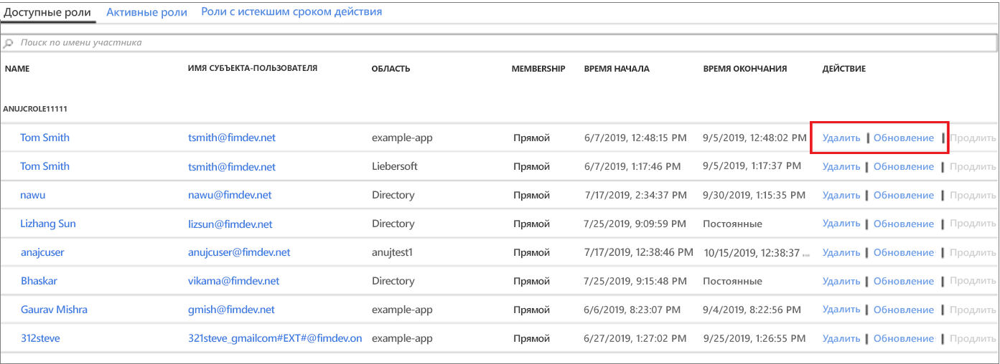

# Обновление или удаление назначенной настраиваемой роли Azure AD в Управление привилегированными пользователями

В этой статье объясняется, как использовать управление привилегированными пользователями (PIM) для обновления и удаления привязанного к задачам и ограниченного по времени назначения настраиваемых ролей, созданных для управления приложениями в Azure Active Directory (Azure AD). 

- Дополнительные сведения о создании настраиваемых ролей для делегирования управления приложениями в AAD см. в статье [о настраиваемых ролях администратора в Azure Active Directory (предварительная версия)](../users-groups-roles/roles-custom-overview.md). 
- Если вы еще не использовали управление привилегированными пользователями, получите дополнительные сведения в статье [Начало работы с управлением привилегированными пользователями](pim-getting-started.md).

> [!NOTE]
> Настраиваемые роли AAD в период предварительной версии не интегрируются со встроенными ролями каталога. Как только эта возможность станет общедоступной, управление всеми ролями будет выполняться в интерфейсе для встроенных ролей.

## Обновление или удаление назначения

Выполните следующие действия, чтобы обновить или удалить существующее назначение настраиваемой роли.

1. Войдите в раздел [Privileged Identity Management](https://portal.azure.com/?Microsoft_AAD_IAM_enableCustomRoleManagement=true&Microsoft_AAD_IAM_enableCustomRoleAssignment=true&feature.rbacv2roles=true&feature.rbacv2=true&Microsoft_AAD_RegisteredApps=demo#blade/Microsoft_Azure_PIMCommon/CommonMenuBlade/quickStart) на портале Azure с учетной записью пользователя, которому назначена роль "Администратор привилегированных ролей".
1. Щелкните **Настраиваемые роли Azure AD (предварительная версия)** .

    

1. Выберите **Роли**, чтобы просмотреть список **Назначения** настраиваемых ролей для приложений Azure AD.

    

1. Щелкните роль, которую нужно обновить или удалить.
1. Найдите назначение роли на вкладках **Доступные роли** или **Активные роли**.
1. Нажмите кнопку **Обновить** или **Удалить**, чтобы обновить или удалить назначение роли.

    

## Дополнительная информация

- [Активация настраиваемой роли Azure AD](azure-ad-custom-roles-assign.md)
- [Назначение настраиваемой роли Azure AD](azure-ad-custom-roles-assign.md)
- [Настройка назначения настраиваемой роли Azure AD](azure-ad-custom-roles-configure.md)
