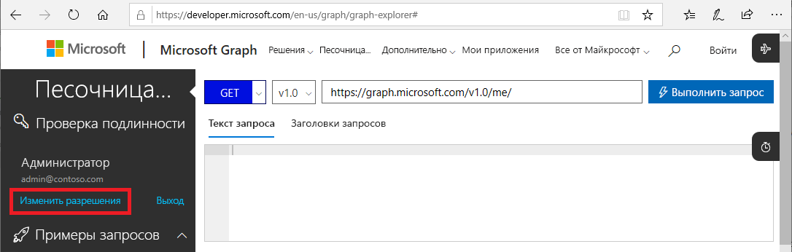
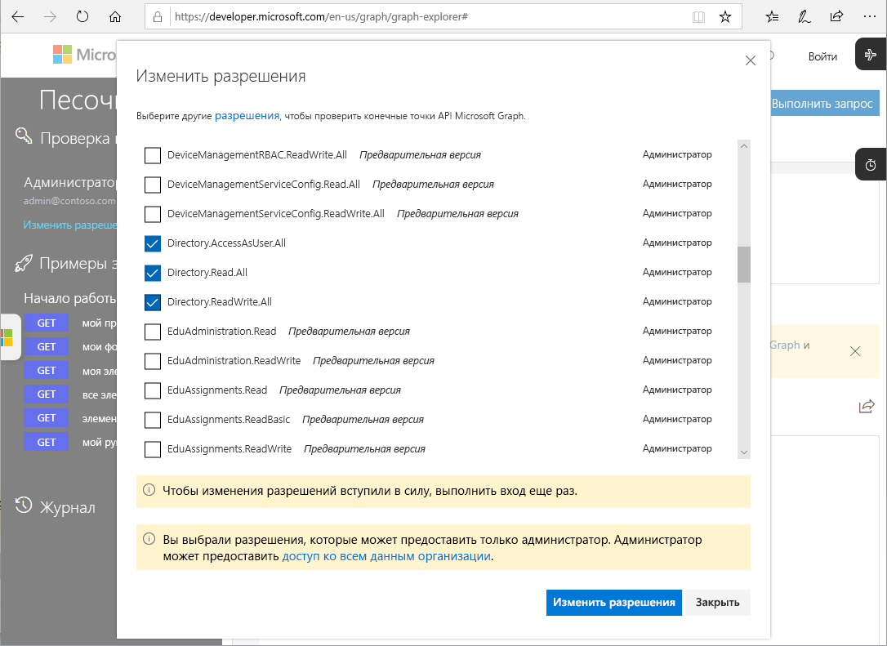

# API Microsoft Graph для PIM (предварительная версия)

Большинство задач, выполняемых в Azure AD Privileged Identity Management (PIM) на портале Azure, можно выполнять и с помощью [API-интерфейсов Microsoft Graph](https://developer.microsoft.com/graph/docs/concepts/overview). В этой статье описаны некоторые принципы, которые важно учесть при использовании API-интерфейсов Microsoft Graph для PIM. Дополнительные сведения об API-интерфейсах Microsoft Graph см. в [справочнике по Azure AD Privileged Identity Management API](https://developer.microsoft.com/graph/docs/api-reference/beta/resources/privilegedidentitymanagement_root).

> [!IMPORTANT]
> API-интерфейсы бета-версии в Microsoft Graph доступны в предварительной версии и могут быть изменены. Использование этих API для приложений в рабочей среде не поддерживается.

## Необходимые разрешения

Чтобы вызвать API-интерфейсы Microsoft Graph для PIM, необходимо иметь **одно или несколько** следующих разрешений:

- `Directory.AccessAsUser.All`
- `Directory.Read.All`
- `Directory.ReadWrite.All`
- `PrivilegedAccess.ReadWrite.AzureAD`

### Установка разрешений

Чтобы приложения могли вызывать API Microsoft Graph для PIM, они должны иметь необходимые разрешения. Самый простой способ указать необходимые разрешения — воспользоваться [платформой предоставления согласия Azure AD](../develop/consent-framework.md).

### Указание разрешений в песочнице Graph

Если вы используете песочницу Graph Explorer для тестирования вызовов, можно указать разрешения в ней.

1. Войдите в [песочницу Graph](https://developer.microsoft.com/graph/graph-explorer) как глобальный администратор.

1. Щелкните **Изменить разрешения**.

    

1. Установите флажки рядом с разрешениями, которые нужно указать. Песочница Graph еще не поддерживает `PrivilegedAccess.ReadWrite.AzureAD`.

    

1. Щелкните **Изменить разрешения**, чтобы применить изменения разрешений.

## Дополнительная информация

- [Справочник по API Azure AD Privileged Identity Management](https://developer.microsoft.com/graph/docs/api-reference/beta/resources/privilegedidentitymanagement_root)
