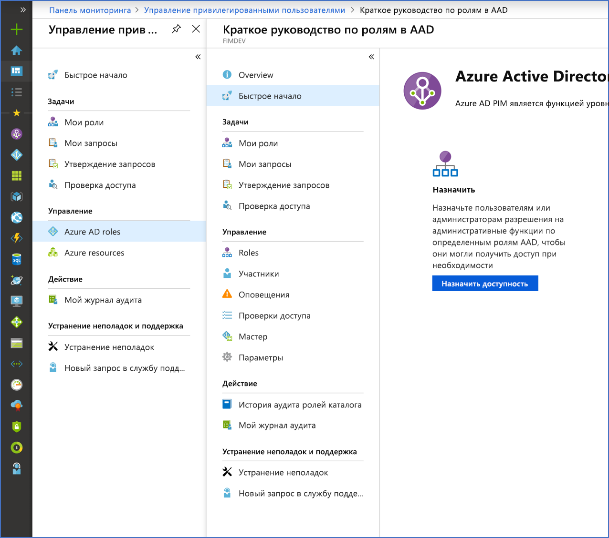

# Что такое Azure AD Privileged Identity Management?

Служба Azure Active Directory (Azure AD) Privileged Identity Management (PIM) позволяет контролировать и отслеживать доступ к важным ресурсам в пределах организации, а также управлять им. в том числе доступ к ресурсам в Azure AD, ресурсам Azure и остальным веб-службам Microsoft, таким как Office 365 или Microsoft Intune.

## Почему следует использовать PIM?

Организациям необходимо свести к минимуму число пользователей, имеющих доступ к защищенным сведениям или ресурсам. Это снижает вероятность того, что такой доступ получит вредоносный субъект или что авторизованный пользователь непреднамеренно повлияет на критический ресурс. Однако пользователям иногда требуется выполнять привилегированные операции в приложениях Azure AD, Azure, Office 365 или SaaS. Организации могут предоставлять пользователям привилегированный JIT-доступ к ресурсам Azure и Azure AD. Необходимо наблюдать за действиями пользователей с правами администратора. PIM помогает снизить риск чрезмерных, ненужных или неправильно используемых прав доступа.

## Что можно сделать с помощью PIM?

PIM по сути помогает управлять всеми операциями, связанными с ресурсами, которые вас интересуют. Ниже описаны некоторые ключевые возможности PIM:

- предоставление привилегированного **JIT**-доступа к ресурсам Azure и Azure AD;
- назначение доступа с **временным ограничением** к ресурсам с помощью даты начала и окончания;
- требование **утверждения** для активации привилегированных ролей;
- принудительное применение **многофакторной проверки подлинности** для активации любой роли;
- использование **обоснования**, чтобы понять причину активации;
- получение **уведомлений** при активации привилегированных ролей;
- проведение **проверки доступа**, чтобы убедиться в необходимости ролей для пользователей;
- скачивание **журнала аудита** для операций внутреннего и внешнего аудита.

## Предварительные требования

Чтобы использовать PIM, нужно наличие одной из следующих платных или пробных лицензий. Дополнительные сведения см. в статье [Что такое Microsoft Azure Active Directory](../fundamentals/active-directory-whatis.md).

- Azure AD Premium P2
- Enterprise Mobility + Security (EMS) E5.

Сведения о лицензиях для пользователей см. в статье [Требования к подписке для использования PIM](subscription-requirements.md).

## Терминология

Чтобы лучше понять PIM и сопутствующую документацию, изучите следующие термины.

| Термин или понятие | Категория назначения ролей | ОПИСАНИЕ |
| --- | --- | --- |
| допустимое | type | Назначение роли, в соответствии с которым пользователь должен выполнить одно или несколько действий для использования роли. Назначение роли пользователю означает, что он может активировать роль, когда ему необходимо выполнить привилегированные задачи. Доступы, предоставленные пользователю с постоянной ролью и пользователю с временной ролью, ничем не отличаются. Единственное различие состоит в том, что второму типу пользователей доступ не требуется постоянно. |
| активно | type | Назначение роли, которое не требует от пользователя выполнения каких-либо действий для ее использования. Пользователи, назначенные в качестве активных, имеют все полномочия, присвоенные роли. |
| активация |  | Процесс выполнения одного или нескольких действий для использования роли, на которую имеет право пользователь. Поддерживаются такие действия, как прохождение многофакторной проверки подлинности (MFA), предоставление коммерческого обоснования или запрос утверждения от назначенных утверждающих. |
| назначено | Состояние | Пользователь, который имеет назначение активной роли. |
| активировано | Состояние | Пользователь, который имеет назначение допустимой роли, выполнил действия по активации роли, и теперь она активна.  После активации пользователь может использовать роль в течение предварительно настроенного периода, пока ее не потребуется активировать повторно. |
| постоянное допустимое | Duration | Назначение роли, где пользователь всегда имеет право активировать роль. |
| постоянное активное | Duration | Назначение роли, где пользователь всегда может использовать роль, не выполняя каких-либо действий. |
| допустимый срок действия | Duration | Назначение роли, где пользователь имеет право активировать роль в течение указанной даты начала и окончания. |
| активный срок действия | Duration | Назначение роли, где пользователь может использовать роль в течение указанной даты начала и окончания, не выполняя каких-либо действий. |
| JIT-доступ |  | Это модель, в которой пользователи получают временные разрешения для выполнения привилегированных задач, что не позволяет злоумышленникам или неавторизованным пользователям получить доступ по истечении срока действия разрешения. Доступ предоставляется только в том случае, если он необходим пользователю. |
| Принцип доступа с минимальными привилегиями |  | Рекомендуемый метод обеспечения безопасности, при котором каждому пользователю предоставляются только минимальные привилегии, необходимые для выполнения задач, которые ему разрешено выполнять. Такой подход позволяет свести к минимуму количество глобальных администраторов. Вместо этого используются определенные роли администратора для конкретных сценариев. |

## Как выглядит PIM?

После настройки PIM в меню навигации слева вы увидите параметры **Задачи**, **Управление** и **Действие**. В качестве администратора вы выберете между управлением **ролями Azure AD** и ролями **службы ресурсов Azure**. При выборе типа ролей для управления вы увидите аналогичный набор параметров для этого типа роли.

## Какие существуют роли пользователей и доступные им действия в PIM?

Если вы первый пользователь, использующий PIM, вам автоматически назначаются роли [Администратор безопасности](../users-groups-roles/directory-assign-admin-roles.md#security-administrator) и [Администратор привилегированных ролей](../users-groups-roles/directory-assign-admin-roles.md#privileged-role-administrator) в каталоге.

Для ролей Azure AD только пользователь, которому назначена роль администратора привилегированных ролей, может управлять назначением других администраторов в PIM. Вы можете [предоставлять доступ к управлению PIM другим администраторам](pim-how-to-give-access-to-pim.md). Глобальные администраторы, администраторы безопасности и читатели сведений о безопасности могут просматривать назначения ролей Azure AD в PIM.

Для ролей ресурсов Azure только администратор подписки, владелец ресурса или администратор доступа пользователей к ресурсам могут управлять назначениями других администраторов в PIM. Администратор привилегированных ролей, администратор безопасности и читатель сведений о безопасности по умолчанию не могут просматривать назначения ролей ресурсов Azure в PIM.

## Сценарии

PIM поддерживает следующие сценарии:

**В качестве администратора привилегированных ролей вы можете выполнить следующие действия.**

- Включение утверждений для конкретных ролей
- Указание утверждающих лиц и (или) групп с правом утверждения запросов
- Просмотр истории запросов и утверждений для всех привилегированных ролей

**В качестве утверждающего вы можете выполнить следующие действия.**

- Просмотр запросов, ожидающих утверждения
- Утверждение или отклонение запросов на повышение роли (по одному и (или) массово)
- Указание обоснования для своего утверждения или отказа 

**В качестве пользователя с временной ролью вы можете выполнить следующие действия.**

- Запрос активации роли, для которой требуется утверждение
- Просмотр состояния запроса на активацию
- Выполнение задачи в Azure AD, если запрос на активацию утвержден

## Дополнительная информация

- [Требования к лицензиям для использования PIM](subscription-requirements.md)
- [Защита привилегированного доступа для гибридных и облачных развертываний в Azure AD](../users-groups-roles/directory-admin-roles-secure.md?toc=%2fazure%2factive-directory%2fprivileged-identity-management%2ftoc.json)
- [Развертывание PIM](pim-deployment-plan.md)
