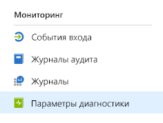
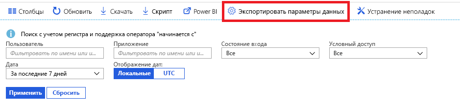

# Мониторинг в Azure Active Directory (предварительная версия)

Теперь функция мониторинга Azure Active Directory (Azure AD) позволяет направлять журналы действий в различные конечные точки. Эти журналы затем можно сохранить для долговременного использования или интегрировать со сторонними средствами для управления сведениями и событиями безопасности (SIEM), чтобы получать аналитические сведения о своей среде.

Сейчас журналы можно направить в следующие конечные точки:

- Учетная запись хранения Azure.
- Концентратор событий Azure для интеграции с экземплярами Splunk и Sumologic.
- Рабочая область Azure Log Analytics, где вы можете анализировать данные, а также создавать информационные панели и оповещения для определенных событий.

## Настройка параметров диагностики

Чтобы настроить параметры мониторинга для журналов действий Azure AD, сначала войдите на [портал Azure](https://portal.azure.com), а затем выберите **Azure Active Directory**. Отсюда вы можете получить доступ к странице параметров диагностики двумя способами:

* В разделе **Мониторинг** выберите **Параметры диагностики**.

    
    
* Выберите **Журналы аудита** или **События входа**, а затем — **Экспорт параметров**. 

    

## Передача журналов в учетную запись хранения

Направляя журналы в учетную запись хранения Azure, вы можете хранить их в дольше, чем определено в наших [политиках хранения](reference-reports-data-retention.md) по умолчанию. См. сведения о том, как [направлять данные в учетную запись хранения](quickstart-azure-monitor-route-logs-to-storage-account.md).

## Потоковая передача журналов в концентратор событий

Направляя журналы в концентратор событий Azure, вы можете выполнить интеграцию со сторонними средствами, например Sumologic и Splunk. Такая интеграция позволяет объединить данные из журнала действий Azure AD с другими данными, управляемыми средствами SIEM, что позволяет получать более подробные аналитические сведения о среде. См. сведения о том, как [осуществлять потоковую передачу журналов в концентратор событий](tutorial-azure-monitor-stream-logs-to-event-hub.md).

## Отправка журналов в Log Analytics

[Log Analytics](https://docs.microsoft.com/azure/log-analytics/log-analytics-overview) — это решение, которое консолидирует данные мониторинга из различных источников, а также предоставляет язык запросов и аналитическую систему для получения сведений о работе приложений и ресурсов. Отправляя журналы действий Azure AD в Log Analytics вы можете быстро извлекать и отслеживать собранные данные, а также создавать на их основе оповещения. См. сведения о том, как [отправлять данные в Log Analytics](howto-integrate-activity-logs-with-log-analytics.md).

Вы также можете установить готовые представления для журналов действий Azure AD, чтобы отслеживать распространенные сценарии, связанные со входом в систему и событиями аудита. См. сведения о том, как [установить и использовать предоставления Log Analytics для журналов действий Azure AD](howto-install-use-log-analytics-views.md).

## Дополнительная информация

* [Журналы действий в Azure Monitor](concept-activity-logs-azure-monitor.md)
* [Потоковая передача журналов в концентратор событий](tutorial-azure-monitor-stream-logs-to-event-hub.md)
* [Отправка журналов в Log Analytics](howto-integrate-activity-logs-with-log-analytics.md)