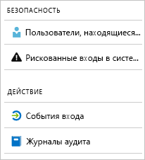

# Что такое отчеты в Azure Active Directory

Отчеты Azure Active Directory (Azure AD) обеспечивают полное представление о действиях в вашей среде. Полученные данные позволят вам выполнять следующее:

- определять, как приложения и службы используются пользователями;
- обнаружить потенциальные риски, которые могут повлиять на работоспособность среды;
- устранить неполадки, влияющие на работу пользователей.  

Архитектура отчета основана на двух главных компонентах:

- [Отчеты системы безопасности](#security-reports)
- [Отчеты о действиях](#activity-reports)

## Отчеты о безопасности

Отчеты системы безопасности помогают защитить удостоверения организации. Есть два типа отчетов системы безопасности:

- **Пользователи, находящиеся в группе риска.** [С помощью отчетов безопасности о пользователях, находящихся в группе риска](concept-user-at-risk.md) вы получите сведения об учетных записях пользователей, которые могли быть скомпрометированы.

- **Рискованные входы в систему.** [С помощью отчетов безопасности о рискованных входах в систему](concept-risky-sign-ins.md) вы получите сведения о попытках входа пользователями, которые не являются законными владельцами учетной записи пользователя. 

### Какая лицензия Azure AD требуется для доступа к отчету безопасности?  

Все выпуски Azure AD предоставляют оба типа отчетов безопасности. Однако уровень детализации отчета может для выпусков отличаться. 

- В **выпусках Azure Active Directory Free и Basic** отображается список пользователей, находящихся в группе риска, и рискованных входов в систему. 

- Выпуск **Azure Active Directory Premium 1** расширяет эту модель, также позволяя вам изучать некоторые базовые события риска, обнаруженные для каждого отчета. 

- Выпуск **Azure Active Directory Premium 2** предоставляет наиболее полные сведения о базовых событиях риска, а также позволяет настроить политики безопасности, автоматически реагирующие на настроенные уровни риска.

## Отчеты об активности

Отчеты о действиях помогут вам оценить поведение пользователей в вашей организации. В Azure AD есть два типа отчетов об активности:

- **Журналы аудита.** [Отчет об активности журналов аудита](concept-audit-logs.md) обеспечивает доступ к журналу каждой задачи, выполняемой в клиенте.

- **События входа.** [С помощью отчета об активности событий входа](concept-sign-ins.md) вы можете определить, кто выполнил задачи, отправленные отчетом о журналах аудита.

### Отчет о журналах аудита 

[Отчет о журналах аудита](concept-audit-logs.md) предоставляет записи системных операций для соответствия. Эти данные позволяют реализовать наиболее распространенные сценарии, примеры которых перечислены ниже.

- Кто-то в моем клиенте получил доступ к группе администраторов. Кто предоставил этот доступ? 

- Я хочу знать список пользователей, выполнивших вход в определенное приложение, так как оно подключено недавно и я хочу убедиться, что оно работает соответствующим образом.

- Я хочу знать число сбросов пароля в клиенте.

#### Какая требуется лицензия Azure AD, чтобы получить доступ к отчету о журналах аудита?  

Отчет о журналах аудита доступен для функций, на которые у вас есть лицензии. Если у вас есть лицензия для определенной функции, у вас также есть доступ к данным журнала аудита для этой функции. См. дополнительные сведения о [функциях и возможностях Azure Active Directory](https://www.microsoft.com/cloud-platform/azure-active-directory-features).   

### Отчет о входе

[Отчет о событиях входа](concept-sign-ins.md) позволяет ответить на следующие вопросы:

- Что такое шаблон входа пользователя?
- Сколько пользователей входили в течение недели?
- Каков статус их входа?

#### Какая требуется лицензия Azure AD, чтобы получить доступ к отчету об событиях входа?  

Чтобы получить доступ к отчету об активности событий входа, с клиентом должна быть связана лицензия Azure AD Premium.

## Программный доступ

Кроме пользовательского интерфейса Azure AD также предоставляет [программный доступ](concept-reporting-api.md) к данным отчетов с использованием набора API на основе REST. Эти интерфейсы API можно вызвать, используя различные языки и инструменты программирования. 

## Дополнительная информация

- [отчетом о входах, представляющих риск](concept-risky-sign-ins.md);
- [отчетом о журналах аудита](concept-audit-logs.md);
- [отчетом о журналах входа](concept-sign-ins.md).
