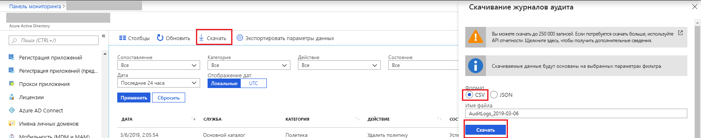

# Краткое руководство. Скачивание отчета об аудите с помощью портала Azure

Из этого краткого руководства вы узнаете, как загрузить журналы аудита своего клиента за последние 24 часа. С портала Azure можно скачать до 5000 записей. Записи отсортированы по убыванию даты и времени по умолчанию, и вы получите 5000 последних записей. 

## Предварительные требования

Вам необходимы:

* Клиент Azure Active Directory. 
* Пользователь с ролью **администратора безопасности**, **читателя безопасности** или **глобального администратора** для этого клиента. Любой пользователь клиента, который имеет доступ к своим собственным журналам аудита.

## Краткое руководство. Скачивание отчета об аудите

1. Перейдите на [портал Azure](https://portal.azure.com).
2. Выберите **Azure Active Directory** в области навигации слева и с помощью **переключателя** выберите свой каталог Active Directory.
3. На панели мониторинга выберите **Azure Active Directory**, а затем выберите **Журналы аудита**. 
4. Выберите **Последние 24 часа** в раскрывающемся списке фильтра **Дата**, затем нажмите кнопку **Применить**, чтобы просмотреть журналы аудита за последние 24 часа. 
5. Нажмите кнопку **Загрузить**, чтобы загрузить CSV-файл, содержащий отфильтрованные записи. 

## Дополнительная информация

* [Отчеты о действиях входа на портале Azure Active Directory](concept-sign-ins.md)
* [Хранение отчетов Azure Active Directory](reference-reports-data-retention.md)
* [Задержки в отчетах Azure Active Directory](reference-reports-latencies.md)
