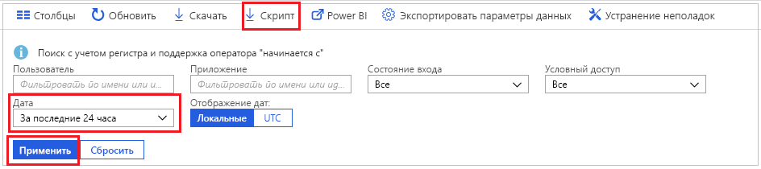
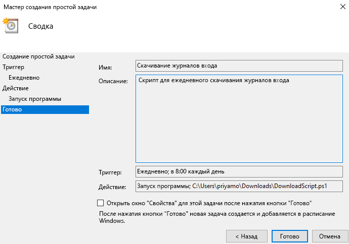

# Руководство по Скачивание и использование скрипта для доступа к журналам входа

Данные о действиях входа можно скачать, если вам нужно работать с ними за пределами портала Azure. Если нажать на портале Azure кнопку **Скачать**, будет создан CSV-файл, содержащий последние 5000 записей. Если вам требуется больше возможностей, например скачать более 5000 записей за раз или скачивать журналы по расписанию, можно использовать кнопку **Скрипт**. Она позволяет создать скрипт PowerShell для скачивания ваших данных.

В этом руководстве вы узнаете, как создать скрипт для скачивания всех журналов входа за последние 24 часа и спланировать его запуск каждый день. 

## Предварительные требования

Вам необходимы:

* Клиент Azure Active Directory с лицензией Premium (P1/P2). Обратите внимание, если до обновления данные о действиях отсутствовали, данные отобразятся в отчетах через несколько дней после обновления до лицензии Premium. 
* Пользователь в роли **глобального администратора**, **администратора безопасности**, **читателя безопасности** или **читателя отчетов** для клиента, а также любой пользователь, который может получить доступ к своим собственным событиям входов. 
* Если вы хотите запустить скачанный скрипт на компьютере под управлением Windows 10, [настройте модуль Azure PowerShell и установите политику выполнения](concept-sign-ins.md#running-the-script-on-a-windows-10-machine).

## Учебник

1. Перейдите на [портал Azure](https://portal.azure.com) и выберите свой каталог.
2. Выберите **Azure Active Directory** и в разделе **Мониторинг** щелкните **События входа**. 
3. В раскрывающемся списке фильтра **Диапазон дат** выберите **24 часа**, чтобы получить данные за последние 24 часа. 
4. Нажмите кнопку **Применить** и убедитесь, что фильтр применяется должным образом. 
5. Выберите **Скрипт** в верхнем меню, чтобы скачать скрипт PowerShell с примененными фильтрами.

     
     
6. Откройте приложение **Планировщик задач** на компьютере Windows и выберите **Создать простую задачу**.
7. Введите имя и описание задачи и нажмите кнопку **Далее**.
8. Выберите переключатель **Ежедневно**, чтобы задача выполнялась ежедневно, и введите дату и время начала.
9. В меню "Действие" выберите **Запуск программы**, выберите скачанный скрипт, а затем нажмите кнопку **Далее**. 
10. Просмотрите запланированную задачу и нажмите кнопку **Готово**, чтобы создать задачу.

     

Теперь ваша задача будет выполняться каждый день и сохранять записи входа за последние 24 часа в файл формата **AAD_SignInReport_ГГГГММДД_ЧЧММСС.csv**. Вы также можете отредактировать скачанный скрипт PowerShell, чтобы сохранить его под другим именем или изменить количество скачиваемых записей. 

## Дополнительная информация

* [Политики хранения отчетов Azure Active Directory](reference-reports-data-retention.md)
* [Getting started with the Azure Active Directory reporting API](concept-reporting-api.md) (Приступая к работе с API отчетов Azure Active Directory)
* [Руководство. Получение данных с помощью API отчетов Azure Active Directory с сертификатами](tutorial-access-api-with-certificates.md)
