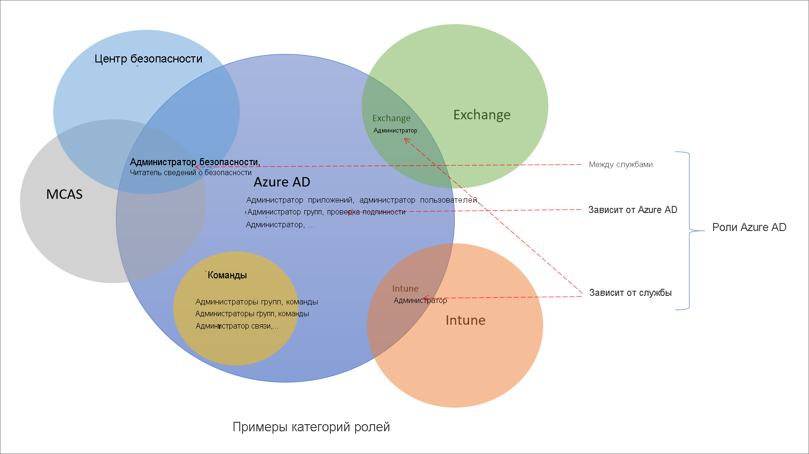

# Общие сведения о ролях в Azure Active Directory

В Azure Active Directory (Azure AD) существует около 60 встроенных ролей с фиксированным набором разрешений. В дополнение к таким встроенным ролям Azure AD поддерживает настраиваемые роли. Используйте настраиваемые роли, чтобы самостоятельно указать для них нужные разрешения. Например, можно создать роль для управления определенными ресурсами Azure AD, такими как приложения или субъекты-службы.

В этой статье описаны роли в Azure AD и то, как их использовать.

## Отличия ролей Azure AD от других ролей Microsoft 365

В Microsoft 365 доступно множество разных служб, таких как Azure AD и Intune. Некоторые из этих служб имеют собственные системы управления доступом на основе ролей, а именно:

- Azure AD
- Exchange
- Intune
- Центр безопасности
- Центр соответствия требованиям
- Microsoft Cloud App Security
- Коммерция

Другие службы, например Teams, SharePoint и управляемые компьютеры, не используют отдельных систем для управления доступом на основе ролей. В них для административного доступа используются роли Azure AD. Azure имеет собственную систему управления доступом на основе ролей для ресурсов Azure, таких как виртуальные машины, и эта система отличается от ролей Azure AD.

Когда мы говорим, что система управления доступом на основе ролей является отдельной, имеется в виду отдельное хранилище данных, в котором хранятся определения и назначения этих ролей. Кроме того, существует и другая точка принятия решения в политиках, в которой выполняются проверки доступа. Дополнительные сведения см. в статьях [Роли для служб Microsoft 365 в Azure Active Directory](m365-workload-docs.md) и [Роли классического администратора подписки, роли Azure и роли Azure AD](../../role-based-access-control/rbac-and-directory-admin-roles.md).

## Почему некоторые роли Azure AD предназначены для других служб

Microsoft 365 использует несколько систем управления доступом на основе ролей, которые были созданы независимо друг от друга и которые имеют собственные порталы. Чтобы вам было удобно управлять всеми удостоверениями Microsoft 365 с помощью единого портала Azure AD, мы добавили специальные встроенные роли, каждая из которых предоставляет административный доступ к определенной службе Microsoft 365. Например, так организована роль администратора Exchange в Azure AD. Эта роль эквивалентна [группе ролей "Управление организацией"](/exchange/organization-management-exchange-2013-help) в системе управления доступом на основе ролей для Exchange и позволяет управлять всеми аспектами Exchange. Мы также добавили роли администратора для Intune, Teams, SharePoint и т. д. Роли для конкретных серверов — это отдельная категория встроенных ролей Azure AD, которые мы рассмотрим в следующем разделе.

## Категории ролей Azure AD

Встроенные роли Azure AD различаются допустимыми областями использования, и по этому признаку они подразделяются на следующие три основные категории.

- **Роли для Azure AD.** Эти роли предоставляют разрешения только на управление ресурсами Azure AD. Например, администраторы пользователей, администраторы приложений и администраторы групп могут управлять ресурсами в Azure AD.
- **Роли для конкретных служб.** Для основных служб Microsoft 365 (кроме Azure AD) мы создали специальные роли, которые предоставляют разрешения на управление всеми компонентами в конкретной службе.  Например, роли администратора Exchange, администратора Intune, администратора SharePoint и администратора Teams позволяют управлять функциями соответствующих служб. Администраторы Exchange могут управлять почтовыми ящиками, администраторы Intune могут управлять политиками устройств, администраторы SharePoint могут управлять семействами веб-сайтов, администраторы Teams могут управлять свойствами вызовов и т. д.
- **Роли для нескольких служб.** Некоторые роли действуют сразу для нескольких служб. Две роли являются глобальными — это глобальный администратор и глобальный читатель. Они поддерживаются всеми службами Microsoft 365. Кроме того, существует несколько связанных с безопасностью ролей, таких как администратор безопасности и читатель безопасности, которые предоставляют доступ к нескольким службам безопасности в Microsoft 365. Например, роли администратора безопасности в Azure AD позволяют управлять Центром безопасности Microsoft 365, службой "Расширенная защита от угроз" в Microsoft Defender и Microsoft Cloud App Security. Также роль администратора соответствия позволяет управлять параметрами, связанными с соответствием, в Центре соответствия Microsoft 365, Exchange и т. д.

Следующая таблица поможет вам разобраться в перечисленных категориях ролей. Категории названы произвольным образом, и их имена не подразумевают каких-либо дополнительных возможностей, кроме [задокументированных разрешений роли](permissions-reference.md).

Категория | Роль
---- | ----
Роли для Azure AD | Администратор приложений Разработчик приложения Администратор проверки подлинности Администратор наборов ключей IEF B2C Администратор политик IEF B2C Администратор облачных приложений Администратор облачного устройства Администратор условного доступа Администраторы устройств Читатели каталогов Учетные записи синхронизации службы каталогов Создатели каталогов Администратор потоков пользователей с внешним идентификатором Администратор атрибутов потоков пользователей с внешним идентификатором Администратор внешних поставщиков удостоверений Администратор групп Приглашающий гостей Администратор службы технической поддержки Администратор гибридных удостоверений Администратор лицензий Служба поддержка партнеров уровня 1 Служба поддержка партнеров уровня 2 администратора паролей. Привилегированный администратор проверки подлинности Администратор привилегированных ролей Читатель отчетов Администратор учетных записей
Роли для нескольких служб | Администратор организации Администратор соответствия требованиям Администратор соответствия данных требованиям Глобальный читатель Администратор безопасности Оператор безопасности Читатель сведений о безопасности Администратор службы поддержки
Роли для конкретных служб | Администратор Azure DevOps Администратор Azure Information Protection администратора выставления счетов; Администратор службы CRM Лицо, утверждающее доступ клиентов к LockBox Администратор аналитики классических приложений Администратор службы Exchange Администратор Insights Руководитель предприятия Insights администратор службы Intune; Администратор Kaizala Администратор службы Lync Читатель конфиденциальности данных Центра сообщений Читатель Центра сообщений Пользователь современной коммерческой платформы Администратор сети Администратор приложений Office Администратор службы Power BI Администратор Power Platform Администратор принтеров Технический специалист по принтерам Администратор поиска Редактор поиска Администратор службы SharePoint Администратор связи Teams Инженер службы поддержки связи Teams Специалист службы поддержки связи Teams Администраторы устройств Teams Администратор службы Teams

## Дальнейшие действия

- [Общие сведения об управлении доступом на основе ролей в Azure AD](custom-overview.md)
- Назначения ролей можно создать с помощью [портала Azure, Azure AD PowerShell или API Graph](custom-create.md).
- [Сведения о назначениях для роли](custom-view-assignments.md)
