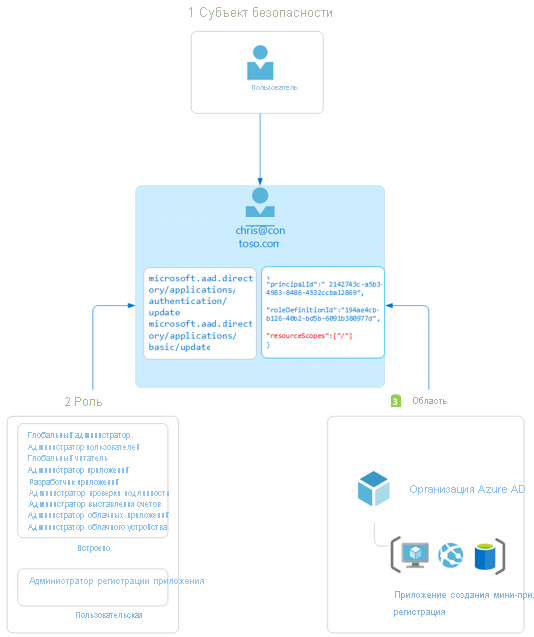

# Сведения об управлении доступом на основе ролей в Azure Active Directory

В этой статье приведены общие сведения об управлении доступом на основе ролей в Azure Active Directory (Azure AD). Роли Azure AD позволяют предоставлять администраторам детализированные разрешения, соблюдая принцип минимальных привилегий. В отношении встроенных и настраиваемых ролей Azure AD применяются те же концепции, что и для [системы управления доступом на основе ролей для ресурсов Azure](../../role-based-access-control/overview.md) (роли Azure). [Различие между этими двумя системами управления доступом на основе ролей](../../role-based-access-control/rbac-and-directory-admin-roles.md):

- Роли Azure AD контролируют доступ к ресурсам Azure AD, в том числе к пользователям, группам и приложениям, с помощью API Graph.
- Роли Azure контролируют доступ к ресурсам Azure, в том числе к виртуальным машинам и хранилищам, с помощью управления ресурсами Azure.

Для обеих систем используются схожие определения и назначения ролей. Однако разрешения ролей Azure AD нельзя использовать для пользовательских ролей Azure и наоборот.

## Общие сведения об управлении доступом на основе ролей в Azure AD
Azure AD поддерживает два типа определений ролей: 
* [Встроенные роли](https://docs.microsoft.com/azure/active-directory/roles/permissions-reference)
* [Пользовательские роли](https://docs.microsoft.com/azure/active-directory/roles/custom-create)

Встроенные роли — это готовые роли с фиксированным набором разрешений. Эти определения ролей нельзя изменить. Существует множество [встроенных ролей](https://docs.microsoft.com/azure/active-directory/roles/permissions-reference), которые поддерживает Azure AD, и их список постоянно пополняется. Чтобы сгладить острые углы и удовлетворить расширенные требования, Azure AD также поддерживает [пользовательские роли](https://docs.microsoft.com/azure/active-directory/roles/custom-create). Предоставление разрешений с помощью настраиваемых ролей Azure AD — это двухэтапный процесс, состоящий из создания определения настраиваемой роли и последующего ее назначения. Определение настраиваемой роли — это коллекция разрешений, добавляемых из предопределенного списка. Это те же разрешения, которые используются во встроенных ролях.  

После создания определения пользовательской роли (или используя встроенную роль) ее можно назначить пользователю, создав назначение роли. При назначении роли пользователю предоставляются разрешения, указанные в определении роли, в пределах заданной области. Этот двухэтапный процесс позволяет создать одно определение роли и назначить его несколько раз для разных областей. Область определяет набор ресурсов Azure AD, к которым у члена роли есть доступ. Наиболее распространенной областью является вся организация. Настраиваемая роль может быть назначена в масштабах всей организации. В этом случае у членов такой роли будут разрешения для всех ресурсов в этой организации. Областью назначения настраиваемой роли также может быть объект. Примером области в масштабах объекта может служить одно приложение. Одну и ту же роль можно назначить одному пользователю для всех приложений в организации, а затем другому пользователю, область которого охватывает только приложение "Отчеты о расходах Contoso".  

В отношении встроенных и настраиваемых ролей Azure AD применяются те же концепции, что и для [управления доступом Azure на основе ролей (Azure RBAC)](https://docs.microsoft.com/azure/active-directory/develop/access-tokens#payload-claims). [Эти две системы управления доступом на основе ролей отличаются тем](../../role-based-access-control/rbac-and-directory-admin-roles.md), что в случае управления доступом на основе ролей Azure для управления доступом к ресурсам Azure (например, виртуальным машинам или хранилищу) используется функция управления ресурсами Azure, а в случае настраиваемых ролей Azure AD для этого применяется API Graph. Для обеих систем используется концепция определений и назначений ролей. Разрешения Azure AD RBAC невозможно включить в роли Azure, и наоборот.

### Определение наличия у пользователя прав доступа к ресурсу в Azure AD

Ниже перечислены основные действия, выполняемые в Azure AD для определения наличия у вас доступа к ресурсу для управления. Используйте эти сведения для устранения неполадок, связанных с доступом.

1. Пользователь (или субъект-служба) получает маркер для Microsoft Graph или конечной точки Azure AD Graph.
1. Используя выданный маркер, пользователь выполняет вызов API в Azure Active Directory (Azure AD) через Microsoft Graph или Azure AD Graph.
1. В зависимости от ситуации Azure AD выполняет одно из следующих действий.
   - Оценивает членство пользователя в ролях на основе [утверждения wids](../../active-directory-b2c/access-tokens.md) в маркере доступа пользователя.
   - Извлекает все назначения ролей пользователя, применимые (напрямую или через членство в группе) к ресурсу, с которым выполняется действие.
1. Azure AD определяет, разрешено ли действие в вызове API для имеющихся у пользователя ролей для данного ресурса.
1. Если у пользователя нет роли с действием в запрашиваемой области, доступ не предоставляется. В противном случае доступ предоставляется.

## Назначение роли

Назначение роли — это ресурс Azure AD, который прикрепляет *определение роли* к *пользователю* в определенной *области* для предоставления доступа к ресурсам Azure AD. Доступ предоставляется путем создания назначения ролей, а отзывается путем его удаления. По сути, назначение ролей состоит из трех элементов.

- Пользователь Azure AD
- Определение роли
- Область ресурса

[Создавать назначения ролей](custom-create.md) можно с помощью портала Azure, Azure AD PowerShell или API Graph. Можно также [просмотреть назначения для настраиваемой роли](custom-view-assignments.md#view-the-assignments-of-a-role).

На приведенной ниже схеме показан пример назначения ролей. В этом примере Ивану Воронкову назначена настраиваемая роль администратора регистрации приложений в области регистрации приложения "Построитель мини-приложений Contoso". Назначение предоставляет Ивану разрешения роли администратора регистрации приложений только для данной конкретной регистрации приложения.

### Субъект безопасности

Субъект безопасности представляет пользователя, которому будет назначен доступ к ресурсам Azure AD. Пользователь — это человек, имеющий профиль пользователя в Azure Active Directory.

### Роль

Определение роли (или сама роль) представляет собой коллекцию разрешений. В определении роли перечисляются операции, которые можно выполнить с ресурсами Azure AD, например создание, чтение, обновление и удаление. В Azure AD существует два типа ролей:

- встроенные роли, созданные корпорацией Майкрософт, которые невозможно изменить;
- настраиваемые роли, созданные вашей организацией и находящиеся под ее управлением.

### Область

Область — это границы допустимости действий, разрешенных для конкретного ресурса Azure AD, в рамках назначения роли. При назначении роли можно указать область, которая разрешает доступ с правами администратора только для определенного ресурса. Например, если вы хотите предоставить разработчику настраиваемую роль, но только для управления регистрацией конкретного приложения, можно указать регистрацию конкретного приложения в качестве области в назначении роли.

## Требуемый план лицензирования

Использование встроенных ролей в Azure AD является бесплатным, а для пользовательских ролей требуется лицензия Azure AD Premium P1. Чтобы найти подходящую лицензию, ознакомьтесь с разделом [Сравнение общедоступных функций выпусков Free, Basic и Premium](https://azure.microsoft.com/pricing/details/active-directory).

## Дальнейшие действия

- [Основные сведения о ролях в Azure AD](concept-understand-roles.md)
- Создайте назначения настраиваемых ролей с помощью [портала Azure, Azure AD PowerShell или API Graph](custom-create.md).
- [Просмотрите назначения для настраиваемой роли](custom-view-assignments.md).
